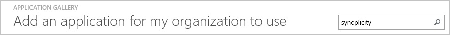
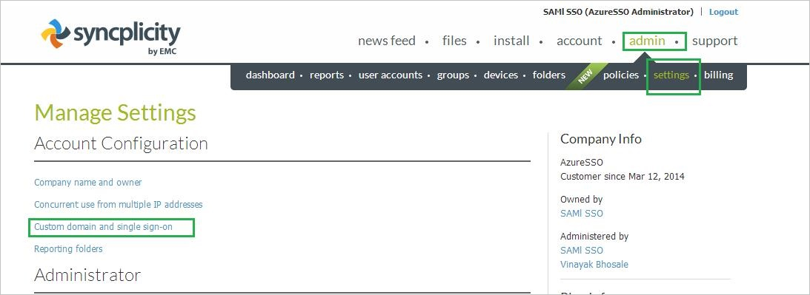
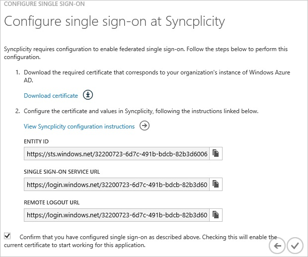
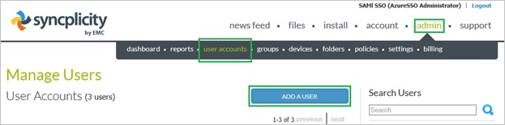
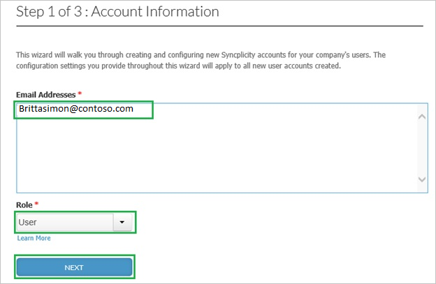
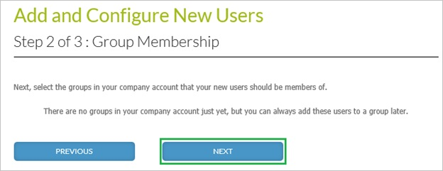
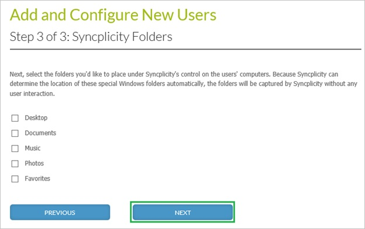

<properties 
    pageTitle="Tutorial: Azure Active Directory integration with Syncplicity | Microsoft Azure" 
    description="Learn how to use Syncplicity with Azure Active Directory to enable single sign-on, automated provisioning, and more!" 
    services="active-directory" 
    authors="jeevansd"  
    documentationCenter="na" 
    manager="femila"/>
<tags 
    ms.service="active-directory" 
    ms.devlang="na" 
    ms.topic="article" 
    ms.tgt_pltfrm="na" 
    ms.workload="identity" 
    ms.date="06/29/2016" 
    ms.author="jeedes" />

#Tutorial: Azure Active Directory integration with Syncplicity
  
The objective of this tutorial is to show how to set up single sign-on between Azure Active Directory (Azure AD) and Syncplicity.
  
The scenario outlined in this tutorial assumes that you already have the following items:

-   A valid Azure subscription
-   A Syncplicity tenant
  
After completing this tutorial, the Azure AD users to whom you have assign Syncplicity access will be able to single sign into the application at your Syncplicity company site (service provider initiated sign on), or using the Azure AD Access Panel.

1.  Enabling the application integration for Syncplicity
2.  Configuring Single Sign-On
3.  Configuring user provisioning
4.  Assigning users

##Enabling the application integration for Syncplicity
  
The objective of this section is to outline how to enable the application integration for Syncplicity.

###To enable the application integration for Syncplicity, perform the following steps:

1.  In the Azure classic portal, on the left navigation pane, click **Active Directory**.

    

2.  From the **Directory** list, select the directory for which you want to enable directory integration.

3.  To open the applications view, in the directory view, click **Applications** in the top menu.

    

4.  Click **Add** at the bottom of the page.

    

5.  On the **What do you want to do** dialog, click **Add an application from the gallery**.

    

6.  In the **search box**, type **Syncplicity**.

    

7.  In the results pane, select **Syncplicity**, and then click **Complete** to add the application.

    

##Configuring single sign-on
  
This section outlines how to enable users to authenticate to Syncplicity with their account in Azure Active Directory, using federation based on the SAML protocol.

###To configure single sign-on, perform the following steps:

1.  In the Azure classic portal, on the **Syncplicity** application integration page, click **Configure single sign-on** to open the **Configure Single Sign On ** dialog.

    

2.  On the **How would you like users to sign on to Syncplicity** page, select **Microsoft Azure AD Single Sign-On**, and then click **Next**.

    

3.  On the **Configure App URL** page, in the **Syncplicity Sign In URL** textbox, type the URL users are using to sign into your Syncplicity application click **Next**. 

    The app URL is your Syncplicity tenant URL (e.g.: *http://company.Syncplicity.com*):

    

4.  On the **Configure single sign-on at Syncplicity** page, to download your certificate, click **Download certificate**, and then save the certificate file locally to your computer.

    

5.  Sign in to your **Syncplicity** tenant.

6.  In the menu on the top, click **admin**, select **settings**, and then click **Custom domain and single sign-on**.

    

7.  On the **Single Sign-On (SSO)** dialog page, perform the following steps:

    ")

    1.  In the **Custom Domain** textbox, type the name of your domain.
    2.  Select **Enabled** as **Single Sign-On Status**.
    3.  In the Azure classic portal, on the **Configure single sign-on at Syncplicity** page, copy the **Entity ID** value, and then paste it into the **Entity Id** textbox.
    4.  In the Azure classic portal, on the **Configure single sign-on at Syncplicity** page, copy the **Single Sign-On Service URL** value, and then paste it into the **Sign-in page URL** textbox.
    5.  In the Azure classic portal, on the **Configure single sign-on at Syncplicity** page, copy the **Remote Logout URL** value, and then paste it into the **Logout page URL** textbox.
    6.  In **Identity Provider Certificate**, click **Choose file**, and then upload the certificate you have downloaded from the Azure classic portal.
    7.  Click **Save Changes**.

8.  On the Azure classic portal, select the single sign-on configuration confirmation, and then click **Complete** to close the **Configure Single Sign On** dialog.

    

##Configuring user provisioning
  
For AAD users to be able to sign in, they must be provisioned to Syncplicity application. This section describes how to create AAD user accounts in Syncplicity.

###To provision a user account to Syncplicity, perform the following steps:

1.  Log in to your **Syncplicity** tenant (e.g.: *https://company.Syncplicity.com*).

2.  Click **Admin** and select **user accounts**.

3.  Click **Add a user**.

    

4.  Type the **Email address** of an AAD account you want to provision, select **User** as **Role**, and then click **Next**.

    

    >[AZURE.NOTE] The AAD account holder will get an email including a link to confirm and activate the account.

5.  Select a group in your company that your new user should become a member of, and then click **Next**.

    

    >[AZURE.NOTE] If there are no groups listed, just click **Next**.

6.  Select the folders you would like to place under Syncplicity’s control on the user’s computer, and then click **Next**.

    

>[AZURE.NOTE] You can use any other Syncplicity user account creation tools or APIs provided by Syncplicity to provision AAD user accounts.

##Assigning users
  
To test your configuration, you need to grant the Azure AD users you want to allow using your application access to it by assigning them.

###To assign users to Syncplicity, perform the following steps:

1.  In the Azure classic portal, create a test account.

2.  On the **Syncplicity** application integration page, click **Assign users**.

    

3.  Select your test user, click **Assign**, and then click **Yes** to confirm your assignment.

    
  
If you want to test your single sign-on settings, open the Access Panel. For more details about the Access Panel, see [Introduction to the Access Panel](active-directory-saas-access-panel-introduction.md).

