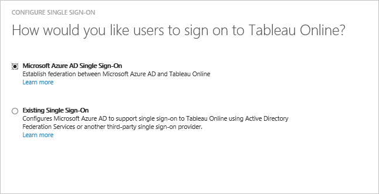
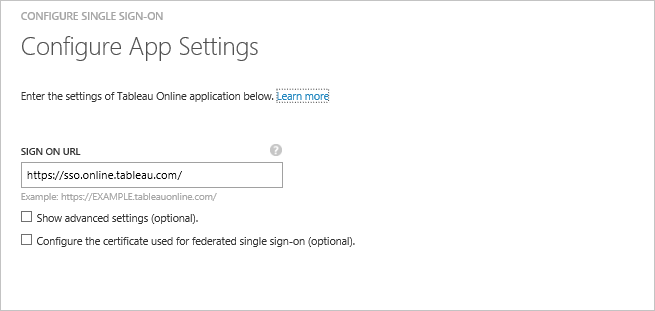
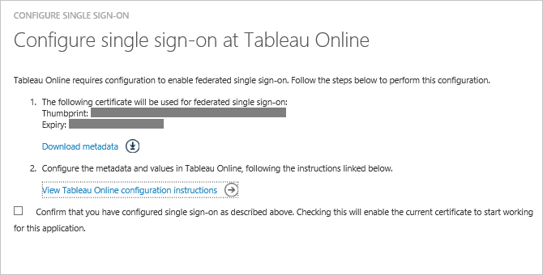
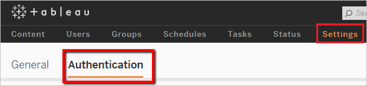
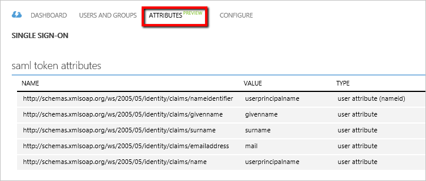

<properties
	pageTitle="Tutorial: Azure Active Directory integration with Tableau Online | Microsoft Azure"
	description="Learn how to configure single sign-on between Azure Active Directory and Jostle."
	services="active-directory"
	documentationCenter=""
	authors="jeevansd"
	manager="femila"
	editor=""/>

<tags
	ms.service="active-directory"
	ms.workload="identity"
	ms.tgt_pltfrm="na"
	ms.devlang="na"
	ms.topic="article"
	ms.date="07/27/2016"
	ms.author="jeedes"/>

# Tutorial: Azure Active Directory integration with Tableau Online

In this tutorial, you learn how to integrate Tableau Online with Azure Active Directory (Azure AD).

Integrating Tableau Online with Azure AD provides you with the following benefits:

- You can control in Azure AD who has access to Tableau Online
- You can enable your users to automatically get signed-on to Tableau Online (Single Sign-On) with their Azure AD accounts
- You can manage your accounts in one central location - the Azure classic portal

If you want to know more details about SaaS app integration with Azure AD, see [What is application access and single sign-on with Azure Active Directory](active-directory-appssoaccess-whatis.md).

## Prerequisites

To configure Azure AD integration with Tableau Online, you need the following items:

- An Azure AD subscription
- A **Tableau Online** single-sign on enabled subscription

> [AZURE.NOTE] To test the steps in this tutorial, we do not recommend using a production environment.

To test the steps in this tutorial, you should follow these recommendations:

- You should not use your production environment, unless this is necessary.
- If you don't have an Azure AD trial environment, you can get a one-month trial [here](https://azure.microsoft.com/pricing/free-trial/).

## Scenario Description
In this tutorial, you test Azure AD single sign-on in a test environment. 
The scenario outlined in this tutorial consists of two main building blocks:

1. Adding Tableau Online from the gallery
2. Configuring and testing Azure AD single sign-on

## Adding Tableau Online from the gallery
To configure the integration of Tableau Online into Azure AD, you need to add Tableau Online from the gallery to your list of managed SaaS apps.

**To add Tableau Online from the gallery, perform the following steps:**

1. In the **Azure classic portal**, on the left navigation pane, click **Active Directory**. 

	![Active Directory][1]

2. From the **Directory** list, select the directory for which you want to enable directory integration.

3. To open the applications view, in the directory view, click **Applications** in the top menu.

	![Applications][2]

4. Click **Add** at the bottom of the page.

	![Applications][3]

5. On the **What do you want to do** dialog, click **Add an application from the gallery**.

	![Applications][4]

6. In the search box, type **Tableau Online**.

	

7. In the results pane, select **Tableau Online**, and then click **Complete** to add the application.

	

##  Configuring and testing Azure AD single sign-on
In this section, you configure and test Azure AD single sign-on with Tableau Online based on a test user called "Britta Simon".

For single sign-on to work, Azure AD needs to know what the counterpart user in Tableau Online is to a user in Azure AD. In other words, a link relationship between an Azure AD user and the related user in Tableau Online needs to be established.
This link relationship is established by assigning the value of the **user name** in Azure AD as the value of the **Username** in Tableau Online.

To configure and test Azure AD single sign-on with Tableau Online, you need to complete the following building blocks:

1. **[Configuring Azure AD Single Sign-On](#configuring-azure-ad-single-single-sign-on)** - to enable your users to use this feature.
2. **[Creating an Azure AD test user](#creating-an-azure-ad-test-user)** - to test Azure AD single sign-on with Britta Simon.
4. **[Creating a Tableau Online test user](#creating-a-Tableau-Online-test-user)** - to have a counterpart of Britta Simon in Tableau Online that is linked to the Azure AD representation of her.
5. **[Assigning the Azure AD test user](#assigning-the-azure-ad-test-user)** - to enable Britta Simon to use Azure AD single sign-on.
5. **[Testing Single Sign-On](#testing-single-sign-on)** - to verify whether the configuration works.

### Configuring Azure AD Single Sign-On

The objective of this section is to enable Azure AD single sign-on in the Azure classic portal and to configure single sign-on in your Tableau Online application.

**To configure Azure AD single sign-on with Tableau Online, perform the following steps:**

1. In the menu on the top, click **Quick Start**.

	![Configure Single Sign-On][6]
2. In the classic portal, on the **Tableau Online** application integration page, click **Configure single sign-on** to open the **Configure Single Sign-On**  dialog.

	![Configure Single Sign-On][7] 

3. On the **How would you like users to sign on to Tableau Online** page, select **Azure AD Single Sign-On**, and then click **Next**.
 	
	

4. On the **Configure App Settings** dialog page, perform the following steps: 

	

    a. In the Sign On URL textbox, type a URL using the following pattern: `https://sso.online.tableau.com`

	c. Click **Next**.

5. On the **Configure single sign-on at Tableau Online** page, Click **Download metadata**, and then save the file on your computer.

	

6. Select the single sign-on configuration confirmation, and then click **Next**.
	
	![Azure AD Single Sign-On][10]

7. On the **Single sign-on confirmation** page, click **Complete**.  
  	
	![Azure AD Single Sign-On][11]
8. In a different browser window, sign-on to your Tableau Online application. Go to **Settings** and then **Authentication**

	

9. Under **Authentication Types** section. Check the **Single sign-on with SAML** checkbox to enable SAML.

10. Scroll down until **Import metadata file into Tableau Online** section.  Click Browse and import the metadata file you have downloaded from Azure AD. Then, click **Apply**.

11. In the **Match assertions** section, insert the corresponding Identity Provider assertion name for email address, first name and last name. To get this information from Azure AD:

	a. Go back to Azure AD. In the Azure classic portal, on the **Tableau Online** application integration page, in the menu on the top, click **Attributes**. Copy the name for the values: userprincipalname, givenname and surname.
     
    

	b. Switch to the Tableau Online application, then set the **Tableau Online Attributes** section as follow:
	
	-  Email: **mail** or **userprincipalname**
	-  First name: **givenname**
	-  Last name: **surname**

### Creating an Azure AD test user
In this section, you create a test user in the classic portal called Britta Simon.

![Create Azure AD User][20]

**To create a test user in Azure AD, perform the following steps:**

1. In the **Azure classic portal**, on the left navigation pane, click **Active Directory**.
	
	 

2. From the **Directory** list, select the directory for which you want to enable directory integration.

3. To display the list of users, in the menu on the top, click **Users**.
	
	 

4. To open the **Add User** dialog, in the toolbar on the bottom, click **Add User**.

	 

5. On the **Tell us about this user** dialog page, perform the following steps:
 
	 

    a. As Type Of User, select New user in your organization.

    b. In the User Name **textbox**, type **BrittaSimon**.

    c. Click **Next**.

6.  On the **User Profile** dialog page, perform the following steps:

	 

    a. In the **First Name** textbox, type **Britta**.  

    b. In the **Last Name** textbox, type, **Simon**.

    c. In the **Display Name** textbox, type **Britta Simon**.

    d. In the **Role** list, select **User**.

    e. Click **Next**.

7. On the **Get temporary password** dialog page, click **create**.

	 

8. On the **Get temporary password** dialog page, perform the following steps:

	 

    a. Write down the value of the **New Password**.

    b. Click **Complete**.   

### Creating a Tableau Online test user

In this section, you create a user called Britta Simon in Tableau Online.

1. On **Tableau Online**, click on **Settings** and then **Authentication** section. Scroll down to **Select Users** section. Click on **Add Users** and then **Enter Email Addresses**.
2. Select **Add users for single sign-on (SSO) authentication**. In the **Enter Email Addresses** textbox add britta.simon@contoso.com

	

3.  Click **Create**.

### Assigning the Azure AD test user

In this section, you enable Britta Simon to use Azure single sign-on by granting her access to Tableau Online.

![Assign User][200] 

**To assign Britta Simon to Tableau Online, perform the following steps:**

1. On the classic portal, to open the applications view, in the directory view, click **Applications** in the top menu.

	![Assign User][201] 

2. In the applications list, select **Tableau Online**.

	 

1. In the menu on the top, click **Users**.

	![Assign User][203] 

1. In the All Users list, select **Britta Simon**.

2. In the toolbar on the bottom, click **Assign**.

	![Assign User][205]

### Testing Single Sign-On

The objective of this section is to test your Azure AD single sign-on configuration using the Access Panel.

When you click the Tableau Online tile in the Access Panel, you should get automatically signed-on to your Tableau Online application.

## Additional Resources

* [List of Tutorials on How to Integrate SaaS Apps with Azure Active Directory](active-directory-saas-tutorial-list.md)
* [What is application access and single sign-on with Azure Active Directory?](active-directory-appssoaccess-whatis.md)

<!--Image references-->

[1]: ./media/active-directory-saas-tableauonline-tutorial/tutorial_general_01.png
[2]: ./media/active-directory-saas-tableauonline-tutorial/tutorial_general_02.png
[3]: ./media/active-directory-saas-tableauonline-tutorial/tutorial_general_03.png
[4]: ./media/active-directory-saas-tableauonline-tutorial/tutorial_general_04.png

[5]: ./media/active-directory-saas-tableauonline-tutorial/tutorial_general_05.png
[6]: ./media/active-directory-saas-tableauonline-tutorial/tutorial_general_06.png
[7]:  ./media/active-directory-saas-tableauonline-tutorial/tutorial_general_050.png
[10]: ./media/active-directory-saas-tableauonline-tutorial/tutorial_general_060.png
[11]: ./media/active-directory-saas-tableauonline-tutorial/tutorial_general_070.png
[20]: ./media/active-directory-saas-tableauonline-tutorial/tutorial_general_100.png

[200]: ./media/active-directory-saas-tableauonline-tutorial/tutorial_general_200.png
[201]: ./media/active-directory-saas-tableauonline-tutorial/tutorial_general_201.png
[203]: ./media/active-directory-saas-tableauonline-tutorial/tutorial_general_203.png
[204]: ./media/active-directory-saas-tableauonline-tutorial/tutorial_general_204.png
[205]: ./media/active-directory-saas-tableauonline-tutorial/tutorial_general_205.png
