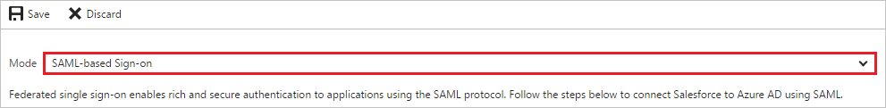
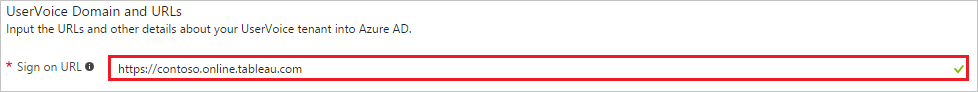
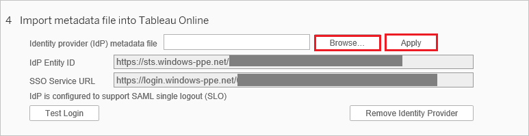

# Tutorial: Azure Active Directory integration with Tableau Online

In this tutorial, you learn how to integrate Tableau Online with Azure Active Directory (Azure AD).

Integrating Tableau Online with Azure AD provides you with the following benefits:

- You can control in Azure AD who has access to Tableau Online
- You can enable your users to automatically get signed-on to Tableau Online (Single Sign-On) with their Azure AD accounts
- You can manage your accounts in one central location - the Azure portal

If you want to know more details about SaaS app integration with Azure AD, see [what is application access and single sign-on with Azure Active Directory](active-directory-appssoaccess-whatis.md).

## Prerequisites

To configure Azure AD integration with Tableau Online, you need the following items:

- An Azure AD subscription
- A Tableau Online single sign-on enabled subscription

> [!NOTE]
> To test the steps in this tutorial, we do not recommend using a production environment.

To test the steps in this tutorial, you should follow these recommendations:

- Do not use your production environment, unless it is necessary.
- If you don't have an Azure AD trial environment, you can get a one-month trial [here](https://azure.microsoft.com/pricing/free-trial/).

## Scenario description
In this tutorial, you test Azure AD single sign-on in a test environment. 
The scenario outlined in this tutorial consists of two main building blocks:

1. Adding Tableau Online from the gallery
2. Configuring and testing Azure AD single sign-on

## Adding Tableau Online from the gallery
To configure the integration of Tableau Online into Azure AD, you need to add Tableau Online from the gallery to your list of managed SaaS apps.

**To add Tableau Online from the gallery, perform the following steps:**

1. In the **[Azure portal](https://portal.azure.com)**, on the left navigation panel, click **Azure Active Directory** icon. 

	![Active Directory][1]

2. Navigate to **Enterprise applications**. Then go to **All applications**.

	![Applications][2]
	
3. To add new application, click **New application** button on the top of dialog.

	![Applications][3]

4. In the search box, type **Tableau Online**.

	

5. In the results panel, select **Tableau Online**, and then click **Add** button to add the application.

	

##  Configuring and testing Azure AD single sign-on
In this section, you configure and test Azure AD single sign-on with Tableau Online based on a test user called "Britta Simon."

For single sign-on to work, Azure AD needs to know what the counterpart user in Tableau Online is to a user in Azure AD. In other words, a link relationship between an Azure AD user and the related user in Tableau Online needs to be established.

In Tableau Online, assign the value of the **user name** in Azure AD as the value of the **Username** to establish the link relationship.

To configure and test Azure AD single sign-on with Tableau Online, you need to complete the following building blocks:

1. **[Configuring Azure AD Single Sign-On](#configuring-azure-ad-single-sign-on)** - to enable your users to use this feature.
2. **[Creating an Azure AD test user](#creating-an-azure-ad-test-user)** - to test Azure AD single sign-on with Britta Simon.
3. **[Creating a Tableau Online test user](#creating-a-tableau-online-test-user)** - to have a counterpart of Britta Simon in Tableau Online that is linked to the Azure AD representation of user.
4. **[Assigning the Azure AD test user](#assigning-the-azure-ad-test-user)** - to enable Britta Simon to use Azure AD single sign-on.
5. **[Testing Single Sign-On](#testing-single-sign-on)** - to verify whether the configuration works.

### Configuring Azure AD single sign-on

In this section, you enable Azure AD single sign-on in the Azure portal and configure single sign-on in your Tableau Online application.

**To configure Azure AD single sign-on with Tableau Online, perform the following steps:**

1. In the Azure portal, on the **Tableau Online** application integration page, click **Single sign-on**.

	![Configure Single Sign-On][4]

2. On the **Single sign-on** dialog, select **Mode** as	**SAML-based Sign-on** to enable single sign-on.
 
	

3. On the **Tableau Online Domain and URLs** section, perform the following steps:

	
	
	a. In the **Sign-on URL** textbox, type the URL: `https://sso.online.tableau.com`

	b. In the **Identifier** textbox, type the URL: `https://sso.online.tableau.com/public/sp/<instancename>`

4. On the **SAML Signing Certificate** section, click **Metadata XML** and then save the metadata file on your computer.

	 

5. Click **Save** button.

	

6. In a different browser window, sign-on to your Tableau Online application. Go to **Settings** and then **Authentication**.
   
    
	
7. To enable SAML, Under **Authentication Types** section. Check the **Single sign-on with SAML** checkbox.
   
    

8. Scroll down until **Import metadata file into Tableau Online** section.  Click Browse and import the metadata file you have downloaded from Azure AD. Then, click **Apply**.
   
   

9. In the **Match assertions** section, insert the corresponding Identity Provider assertion name for **email address**, **first name**, and **last name**. To get this information from Azure AD: 
  
 	a. In the Azure portal, go on the **Tableau Online** application integration page.
  	
	b. In the attributes section, Select the **"view and edit all other user attributes"** checkbox. 
  	
   
	  
	c. Copy the namespace value for these attributes: givenname, email and surname by using the following steps:

   
	
	d. Click **user.givenname** value 
    
    e. Copy the value from the **namespace** textbox.

   

    f. To copy the namesapce values for the email and surname follow the preceding steps.

  	g. Switch to the Tableau Online application, then set the **Tableau Online Attributes** section as follows:
     * Email: **mail** or **userprincipalname**
     * First name: **givenname**
     * Last name: **surname**
   
   

> [!TIP]
> You can now read a concise version of these instructions inside the [Azure portal](https://portal.azure.com), while you are setting up the app!  After adding this app from the **Active Directory > Enterprise Applications** section, simply click the **Single Sign-On** tab and access the embedded documentation through the **Configuration** section at the bottom. You can read more about the embedded documentation feature here: [Azure AD embedded documentation]( https://go.microsoft.com/fwlink/?linkid=845985)
> 

### Creating an Azure AD test user
The objective of this section is to create a test user in the Azure portal called Britta Simon.

![Create Azure AD User][100]

**To create a test user in Azure AD, perform the following steps:**

1. In the **Azure portal**, on the left navigation pane, click **Azure Active Directory** icon.

	 

2. To display the list of users, go to **Users and groups** and click **All users**.
	
	 

3. To open the **User** dialog, click **Add** on the top of the dialog.
 
	 

4. On the **User** dialog page, perform the following steps:
 
	 

    a. In the **Name** textbox, type **BrittaSimon**.

    b. In the **User name** textbox, type the **email address** of BrittaSimon.

	c. Select **Show Password** and write down the value of the **Password**.

    d. Click **Create**.
 
### Creating a Tableau Online test user

In this section, you create a user called Britta Simon in Tableau Online.

1. On **Tableau Online**, click **Settings** and then **Authentication** section. Scroll down to **Select Users** section. Click **Add Users** and then **Enter Email Addresses**.
   
    
2. Select **Add users for single sign-on (SSO) authentication**. In the **Enter Email Addresses** textbox add britta.simon@contoso.com
   
    
3. Click **Create**.

### Assigning the Azure AD test user

In this section, you enable Britta Simon to use Azure single sign-on by granting access to Tableau Online.

![Assign User][200] 

**To assign Britta Simon to Tableau Online, perform the following steps:**

1. In the Azure portal, open the applications view, and then navigate to the directory view and go to **Enterprise applications** then click **All applications**.

	![Assign User][201] 

2. In the applications list, select **Tableau Online**.

	 

3. In the menu on the left, click **Users and groups**.

	![Assign User][202] 

4. Click **Add** button. Then select **Users and groups** on **Add Assignment** dialog.

	![Assign User][203]

5. On **Users and groups** dialog, select **Britta Simon** in the Users list.

6. Click **Select** button on **Users and groups** dialog.

7. Click **Assign** button on **Add Assignment** dialog.
	
### Testing single sign-on

The objective of this section is to test your Azure AD SSO configuration using the Access Panel.

When you click the Tableau Online tile in the Access Panel, you should get automatically signed-on to your Tableau Online application.

## Additional resources

* [List of Tutorials on How to Integrate SaaS Apps with Azure Active Directory](active-directory-saas-tutorial-list.md)
* [What is application access and single sign-on with Azure Active Directory?](active-directory-appssoaccess-whatis.md)

<!--Image references-->

[1]: ./media/active-directory-saas-tableauonline-tutorial/tutorial_general_01.png
[2]: ./media/active-directory-saas-tableauonline-tutorial/tutorial_general_02.png
[3]: ./media/active-directory-saas-tableauonline-tutorial/tutorial_general_03.png
[4]: ./media/active-directory-saas-tableauonline-tutorial/tutorial_general_04.png

[100]: ./media/active-directory-saas-tableauonline-tutorial/tutorial_general_100.png

[200]: ./media/active-directory-saas-tableauonline-tutorial/tutorial_general_200.png
[201]: ./media/active-directory-saas-tableauonline-tutorial/tutorial_general_201.png
[202]: ./media/active-directory-saas-tableauonline-tutorial/tutorial_general_202.png
[203]: ./media/active-directory-saas-tableauonline-tutorial/tutorial_general_203.png

