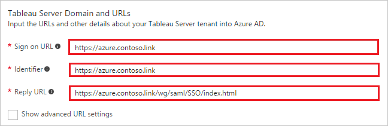
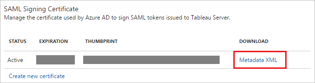

# Tutorial: Azure Active Directory integration with Tableau Server

In this tutorial, you learn how to integrate Tableau Server with Azure Active Directory (Azure AD).

Integrating Tableau Server with Azure AD provides you with the following benefits:

- You can control in Azure AD who has access to Tableau Server
- You can enable your users to automatically get signed-on to Tableau Server (Single Sign-On) with their Azure AD accounts
- You can manage your accounts in one central location - the Azure portal

If you want to know more details about SaaS app integration with Azure AD, see [what is application access and single sign-on with Azure Active Directory](active-directory-appssoaccess-whatis.md).

## Prerequisites

To configure Azure AD integration with Tableau Server, you need the following items:

- An Azure AD subscription
- A Tableau Server single sign-on enabled subscription

> [!NOTE]
> To test the steps in this tutorial, we do not recommend using a production environment.

To test the steps in this tutorial, you should follow these recommendations:

- Do not use your production environment, unless it is necessary.
- If you don't have an Azure AD trial environment, you can get a one-month trial [here](https://azure.microsoft.com/pricing/free-trial/).

## Scenario description
In this tutorial, you test Azure AD single sign-on in a test environment. 
The scenario outlined in this tutorial consists of two main building blocks:

1. Adding Tableau Server from the gallery
2. Configuring and testing Azure AD single sign-on

## Adding Tableau Server from the gallery
To configure the integration of Tableau Server into Azure AD, you need to add Tableau Server from the gallery to your list of managed SaaS apps.

**To add Tableau Server from the gallery, perform the following steps:**

1. In the **[Azure portal](https://portal.azure.com)**, on the left navigation panel, click **Azure Active Directory** icon. 

	![Active Directory][1]

2. Navigate to **Enterprise applications**. Then go to **All applications**.

	![Applications][2]
	
3. To add new application, click **New application** button on the top of dialog.

	![Applications][3]

4. In the search box, type **Tableau Server**.

	

5. In the results panel, select **Tableau Server**, and then click **Add** button to add the application.

	

##  Configuring and testing Azure AD single sign-on
In this section, you configure and test Azure AD single sign-on with Tableau Server based on a test user called "Britta Simon."

For single sign-on to work, Azure AD needs to know what the counterpart user in Tableau Server is to a user in Azure AD. In other words, a link relationship between an Azure AD user and the related user in Tableau Server needs to be established.

In Tableau Server, assign the value of the **user name** in Azure AD as the value of the **Username** to establish the link relationship.

To configure and test Azure AD single sign-on with Tableau Server, you need to complete the following building blocks:

1. **[Configuring Azure AD Single Sign-On](#configuring-azure-ad-single-sign-on)** - to enable your users to use this feature.
2. **[Creating an Azure AD test user](#creating-an-azure-ad-test-user)** - to test Azure AD single sign-on with Britta Simon.
3. **[Creating a Tableau Server test user](#creating-a-tableau-server-test-user)** - to have a counterpart of Britta Simon in Tableau Server that is linked to the Azure AD representation of user.
4. **[Assigning the Azure AD test user](#assigning-the-azure-ad-test-user)** - to enable Britta Simon to use Azure AD single sign-on.
5. **[Testing Single Sign-On](#testing-single-sign-on)** - to verify whether the configuration works.

### Configuring Azure AD single sign-on

In this section, you enable Azure AD single sign-on in the Azure portal and configure single sign-on in your Tableau Server application.

**To configure Azure AD single sign-on with Tableau Server, perform the following steps:**

1. In the Azure portal, on the **Tableau Server** application integration page, click **Single sign-on**.

	![Configure Single Sign-On][4]

2. On the **Single sign-on** dialog, select **Mode** as	**SAML-based Sign-on** to enable single sign-on.
 
	

3. On the **Tableau Server Domain and URLs** section, perform the following steps:

	

    a. In the **Sign-on URL** textbox, type a URL using the following pattern: `https://azure.<domain name>.link`
	
	b. In the **Identifier** textbox, type a URL using the following pattern: `https://azure.<domain name>.link`

	c. In the **Reply URL** textbox, type a URL using the following pattern: `https://azure.<domain name>.link/wg/saml/SSO/index.html`
	 
	> [!NOTE] 
	> The preceding values are not real values. Later, you update the values with the actual URL and identifier from the Tableau Server configuration page. 

4. Tableau Server application expects the SAML assertions in a specific format. Configure the following claims for this application. You can manage the values of these attributes from the **"User Attributes"** section on application integration page. The following screenshot shows an example for the same.
	
	
	
5. In the **User Attributes** section on the **Single sign-on** dialog, configure SAML token attribute as shown in the image above and perform the following steps:
    
	| Attribute Name | Attribute Value |
	| ---------------| --------------- |    
	| username | *user.displayname* |

	a. Click **Add attribute** to open the **Add Attribute** dialog.

	

	
	
	b. In the **Name** textbox, type the attribute name shown for that row.
	
	c. From the **Value** list, type the attribute value shown for that row.
	
	d. Click **Ok**

6. On the **SAML Signing Certificate** section, click **Metadata XML** and then save the metadata file on your computer.

	 

7. Click **Save** button.

	
<CS>
8. To get SSO configured for your application, you need to sign-on to your Tableau Server tenant as an administrator.
   
   a. In the Tableau Server configuration, click the **SAML** tab.
  
     
  
   b. Select the checkbox of **Use SAML for single sign-on**.
   
   c. Tableau Server return URL—The URL that Tableau Server users will be accessing, such as http://tableau_server. Using http://localhost is not recommended. Using a URL with a trailing slash (for example, http://tableau_server/) is not supported. Copy **Tableau Server return URL** and paste it to Azure AD **Sign On URL** textbox in **Tableau Server Domain and URLs** section.
   
   d. SAML entity ID—The entity ID uniquely identifies your Tableau Server installation to the IdP. You can enter your Tableau Server URL again here, if you like, but it does not have to be your Tableau Server URL. Copy **SAML entity ID** and paste it to Azure AD **Identifier** textbox in **Tableau Server Domain and URLs** section.
     
   e. Click the **Export Metadata File** and open it in the text editor application. Locate Assertion Consumer Service URL with Http Post and Index 0 and copy the URL. Now paste it to Azure AD **Reply URL** textbox in **Tableau Server Domain and URLs** section.
   
   f. Locate your Federation Metadata file downloaded from Azure portal, and then upload it in the **SAML Idp metadata file**.
   
   g. Click the **OK** button in the Tableau Server Configuration page.
   
    >[!NOTE] 
	>Customer have to upload any certificate in the Tableau Server SAML SSO configuration and it will get ignored in the SSO flow.
	>If you need help configuring SAML on Tableau Server then please refer to this article [Configure SAML](http://onlinehelp.tableau.com/current/server/en-us/config_saml.htm).
    >
<CE>

> [!TIP]
> You can now read a concise version of these instructions inside the [Azure portal](https://portal.azure.com), while you are setting up the app!  After adding this app from the **Active Directory > Enterprise Applications** section, simply click the **Single Sign-On** tab and access the embedded documentation through the **Configuration** section at the bottom. You can read more about the embedded documentation feature here: [Azure AD embedded documentation]( https://go.microsoft.com/fwlink/?linkid=845985)
> 

### Creating an Azure AD test user
The objective of this section is to create a test user in the Azure portal called Britta Simon.

![Create Azure AD User][100]

**To create a test user in Azure AD, perform the following steps:**

1. In the **Azure portal**, on the left navigation pane, click **Azure Active Directory** icon.

	 

2. To display the list of users, go to **Users and groups** and click **All users**.
	
	 

3. To open the **User** dialog, click **Add** on the top of the dialog.
 
	 

4. On the **User** dialog page, perform the following steps:
 
	 

    a. In the **Name** textbox, type **BrittaSimon**.

    b. In the **User name** textbox, type the **email address** of BrittaSimon.

	c. Select **Show Password** and write down the value of the **Password**.

    d. Click **Create**.
 
### Creating a Tableau Server test user

The objective of this section is to create a user called Britta Simon in Tableau Server. You need to provision all the users in the Tableau server. 

That username of the user should match the value which you have configured in the Azure AD custom attribute of **username**. With the correct mapping the integration should work [Configuring Azure AD Single Sign-On](#configuring-azure-ad-single-sign-on).

>[!NOTE]
>If you need to create a user manually, you need to contact the Tableau Server administrator in your organization.
> 
> 

### Assigning the Azure AD test user

In this section, you enable Britta Simon to use Azure single sign-on by granting access to Tableau Server.

![Assign User][200] 

**To assign Britta Simon to Tableau Server, perform the following steps:**

1. In the Azure portal, open the applications view, and then navigate to the directory view and go to **Enterprise applications** then click **All applications**.

	![Assign User][201] 

2. In the applications list, select **Tableau Server**.

	 

3. In the menu on the left, click **Users and groups**.

	![Assign User][202] 

4. Click **Add** button. Then select **Users and groups** on **Add Assignment** dialog.

	![Assign User][203]

5. On **Users and groups** dialog, select **Britta Simon** in the Users list.

6. Click **Select** button on **Users and groups** dialog.

7. Click **Assign** button on **Add Assignment** dialog.
	
### Testing single sign-on

In this section, you test your Azure AD single sign-on configuration using the Access Panel.

When you click the Tableau Server tile in the Access Panel, you should get automatically signed-on to your Tableau Server application.
For more information about the Access Panel, see [introduction to the Access Panel](https://msdn.microsoft.com/library/dn308586). 

## Additional resources

* [List of Tutorials on How to Integrate SaaS Apps with Azure Active Directory](active-directory-saas-tutorial-list.md)
* [What is application access and single sign-on with Azure Active Directory?](active-directory-appssoaccess-whatis.md)

<!--Image references-->

[1]: ./media/active-directory-saas-tableauserver-tutorial/tutorial_general_01.png
[2]: ./media/active-directory-saas-tableauserver-tutorial/tutorial_general_02.png
[3]: ./media/active-directory-saas-tableauserver-tutorial/tutorial_general_03.png
[4]: ./media/active-directory-saas-tableauserver-tutorial/tutorial_general_04.png

[100]: ./media/active-directory-saas-tableauserver-tutorial/tutorial_general_100.png

[200]: ./media/active-directory-saas-tableauserver-tutorial/tutorial_general_200.png
[201]: ./media/active-directory-saas-tableauserver-tutorial/tutorial_general_201.png
[202]: ./media/active-directory-saas-tableauserver-tutorial/tutorial_general_202.png
[203]: ./media/active-directory-saas-tableauserver-tutorial/tutorial_general_203.png

