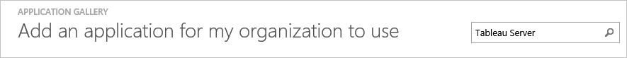
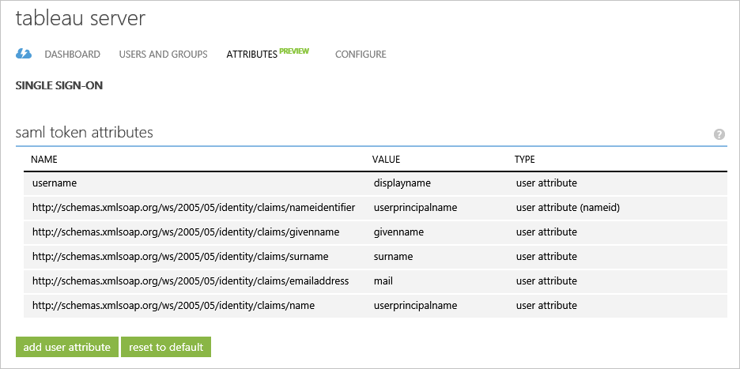
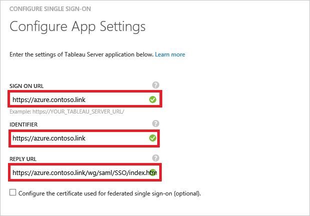
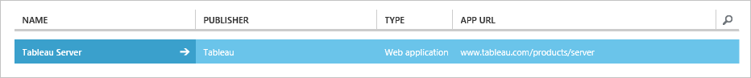

<properties
	pageTitle="Tutorial: Azure Active Directory integration with Tableau Server | Microsoft Azure"
	description="Learn how to configure single sign-on between Azure Active Directory and Tableau Server."
	services="active-directory"
	documentationCenter=""
	authors="jeevansd"
	manager="femila"
	editor=""/>

<tags
	ms.service="active-directory"
	ms.workload="identity"
	ms.tgt_pltfrm="na"
	ms.devlang="na"
	ms.topic="article"
	ms.date="07/11/2016"
	ms.author="jeedes"/>

# Tutorial: Azure Active Directory integration with Tableau Server

The objective of this tutorial is to show you how to integrate Tableau Server with Azure Active Directory (Azure AD).

Integrating Tableau Server with Azure AD provides you with the following benefits:

- You can control in Azure AD who has access to Tableau Server
- You can enable your users to automatically get signed-on to Tableau Server (Single Sign-On) with their Azure AD accounts
- You can manage your accounts in one central location - the Azure classic portal

If you want to know more details about SaaS app integration with Azure AD, see [What is application access and single sign-on with Azure Active Directory](active-directory-appssoaccess-whatis.md).

## Prerequisites

To configure Azure AD integration with Tableau Server, you need the following items:

- An Azure AD subscription
- A Tableau Server single-sign on enabled subscription

> [AZURE.NOTE] To test the steps in this tutorial, we do not recommend using a production environment.

To test the steps in this tutorial, you should follow these recommendations:

- You should not use your production environment, unless this is necessary.
- If you don't have an Azure AD trial environment, you can get a one-month trial [here](https://azure.microsoft.com/pricing/free-trial/).

## Scenario Description
The objective of this tutorial is to enable you to test Azure AD single sign-on in a test environment. 

The scenario outlined in this tutorial consists of two main building blocks:

1. Adding Tableau Server from the gallery
2. Configuring and testing Azure AD single sign-on

## Adding Tableau Server from the gallery
To configure the integration of Tableau Server into Azure AD, you need to add Tableau Server from the gallery to your list of managed SaaS apps.

**To add Tableau Server from the gallery, perform the following steps:**

1. In the **Azure classic portal**, on the left navigation pane, click **Active Directory**. 
 
	![Active Directory][1]

2. From the **Directory** list, select the directory for which you want to enable directory integration.

3. To open the applications view, in the directory view, click **Applications** in the top menu.

	![Applications][2]

4. Click **Add** at the bottom of the page.

	![Applications][3]

5. On the **What do you want to do** dialog, click **Add an application from the gallery**.

	![Applications][4]

6. In the search box, type **Tableau Server**.

	

7. In the results pane, select **Tableau Server**, and then click **Complete** to add the application.

	

##  Configuring and testing Azure AD single sign-on
The objective of this section is to show you how to configure and test Azure AD single sign-on with Tableau Server based on a test user called "Britta Simon".

For single sign-on to work, Azure AD needs to know what the counterpart user in Tableau Server to an user in Azure AD is. In other words, a link relationship between an Azure AD user and the related user in Tableau Server needs to be established.

This link relationship is established by assigning the value of the **user name** in Azure AD as the value of the **Username** in Tableau Server.

To configure and test Azure AD single sign-on with Tableau Server, you need to complete the following building blocks:

1. **[Configuring Azure AD Single Sign-On](#configuring-azure-ad-single-single-sign-on)** - to enable your users to use this feature.
2. **[Creating an Azure AD test user](#creating-an-azure-ad-test-user)** - to test Azure AD single sign-on with Britta Simon.
4. **[Creating a Tableau Server test user](#creating-a-tableauserver-test-user)** - to have a counterpart of Britta Simon in Tableau Server that is linked to the Azure AD representation of her.
5. **[Assigning the Azure AD test user](#assigning-the-azure-ad-test-user)** - to enable Britta Simon to use Azure AD single sign-on.
5. **[Testing Single Sign-On](#testing-single-sign-on)** - to verify whether the configuration works.

### Configuring Azure AD Single Sign-On

The objective of this section is to enable Azure AD single sign-on in the Azure classic portal and to configure single sign-on in your Tableau Server application.

Tableau Server application expects the SAML assertions in a specific format. The following screenshot shows an example for this. 

 

**To configure Azure AD single sign-on with Tableau Server, perform the following steps:**

1. In the Azure classic portal, on the **Tableau Server** application integration page, in the menu on the top, click **Attributes**.

	 

1. On the **SAML token attributes** dialog, perform the following steps:

	

	a. Click **add user attribute** to open the **Add User Attribure** dialog.

	 

	b. In the **Attrubute Name** textbox, type **username**.

    c. From the **Attribute Value** list, selsect **user.displayname**.

    d. Click **Complete**.	
	

1. In the menu on the top, click **Quick Start**.

	  

1. Click **Configure single sign-on** to open the **Configure Single Sign-On**  dialog.

	![Configure Single Sign-On][6] 

2. On the **How would you like users to sign on to Tableau Server** page, select **Azure AD Single Sign-On**, and then click **Next**.

	 

3. On the **Configure App Settings** dialog page, perform the following steps and click **Next**:

	 

    a. In the **Sign In URL** textbox, type the URL of your Tableau server. 

	b. In the Identifier box copy the 

	c. Click **Next**

4. On the **Configure single sign-on at Tableau Server** page, perform the following steps and click **Next**:

	 

    a. Click **Download metadata**, and then save the file on your computer.

    b. Click **Next**.

6. To get SSO configured for your application, you need to sign-on to your Tableau Server tenant as an administrator.

	a. In the Tableau Server configuration, click the **SAML** tab.

	 

	b. Select the checkbox of **Use SAML for single sign-on**.

	c. Locate your Federation Metadata file downloaded from Azure classic portal, and then upload it in the **SAML Idp metadata file**.

	d. Tableau Server return URL—The URL that Tableau Server users will be accessing, such as http://tableau_server. Using http://localhost is not recommended. Using a URL with a trailing slash (for example, http://tableau_server/) is not supported. Copy **Tableau Server return URL** and paste it to Azure AD **Sign On URL** textbox as shown in the step 3

	e. SAML entity ID—The entity ID uniquely identifies your Tableau Server installation to the IdP. You can enter your Tableau Server URL again here, if you like, but it does not have to be your Tableau Server URL. Copy **SAML entity ID** and paste it to Azure AD **IDENTIFER** textbox as shown in the step 3.

	f. Click on the **Export Metadata File** and open it in the text editor application. Locate Assertion Consumer Service URL with Http Post and Index 0 and copy the URL. Now paste it to Azure AD **Reply URL** textbox as shown in step 3. 

	g. Click **OK** button in the Tableau Server Configiuration page.

	> [AZURE.NOTE] If you need help configuring SAML on Tableau Server then please refer this article [Configure SAML](http://onlinehelp.tableau.com/current/server/en-us/config_saml.htm) 

6. In the Azure classic portal, select the single sign-on configuration confirmation, and then click **Next**.

	![Azure AD Single Sign-On][10]

7. On the **Single sign-on confirmation** page, click **Complete**. 
 
	![Azure AD Single Sign-On][11]

### Creating an Azure AD test user
The objective of this section is to create a test user in the Azure classic portal called Britta Simon.

In the Users list, select **Britta Simon**.

![Create Azure AD User][20]

**To create a test user in Azure AD, perform the following steps:**

1. In the **Azure classic portal**, on the left navigation pane, click **Active Directory**.

	 

2. From the **Directory** list, select the directory for which you want to enable directory integration.

3. To display the list of users, in the menu on the top, click **Users**.
 
	 

4. To open the **Add User** dialog, in the toolbar on the bottom, click **Add User**.

	

5. On the **Tell us about this user** dialog page, perform the following steps:

	 

    a. As **Type Of User**, select **New user in your organization**.

    b. In the **User Name** textbox, type **BrittaSimon**.

    c. Click **Next**.

6.  On the **User Profile** dialog page, perform the following steps:

	 

    a. In the **First Name** textbox, type **Britta**.  

    b. In the **Last Name** textbox, type, **Simon**.

    c. In the **Display Name** textbox, type **Britta Simon**.

    d. In the **Role** list, select **User**.

    e. Click **Next**.

7. On the **Get temporary password** dialog page, click **create**.

	 

8. On the **Get temporary password** dialog page, perform the following steps:
 
	 

    a. Write down the value of the **New Password**.

    b. Click **Complete**.   

### Creating a Tableau Server test user

The objective of this section is to create a user called Britta Simon in Tableau Server. You need to provision all the users in the Tableau server. Also note that username of the user should match the value which you have configured in the Azure AD custom attribute of **username**. With the correct mapping the integration should work [Configuring Azure AD Single Sign-On](#configuring-azure-ad-single-single-sign-on).

> [AZURE.NOTE] If you need to create an user manually, you need to contact the Tableau Server administrator in your organization.

### Assigning the Azure AD test user

The objective of this section is to enabling Britta Simon to use Azure single sign-on by granting her access to Tableau Server.

![Assign User][200] 

**To assign Britta Simon to Tableau Server, perform the following steps:**

1. On the Azure classic portal, to open the applications view, in the directory view, click **Applications** in the top menu.
 
	![Assign User][201] 

2. In the applications list, select **Tableau Server**.

	 

1. In the menu on the top, click **Users**.

	![Assign User][203]

1. In the Users list, select **Britta Simon**.

2. In the toolbar on the bottom, click **Assign**.

![Assign User][205]

### Testing Single Sign-On

The objective of this section is to test your Azure AD single sign-on configuration using the Access Panel.

When you click the Tableau Server tile in the Access Panel, you should get automatically signed-on to your Tableau Server application.

## Additional Resources

* [List of Tutorials on How to Integrate SaaS Apps with Azure Active Directory](active-directory-saas-tutorial-list.md)
* [What is application access and single sign-on with Azure Active Directory?](active-directory-appssoaccess-whatis.md)

<!--Image references-->

[1]: ./media/active-directory-saas-tableauserver-tutorial/tutorial_general_01.png
[2]: ./media/active-directory-saas-tableauserver-tutorial/tutorial_general_02.png
[3]: ./media/active-directory-saas-tableauserver-tutorial/tutorial_general_03.png
[4]: ./media/active-directory-saas-tableauserver-tutorial/tutorial_general_04.png

[6]: ./media/active-directory-saas-tableauserver-tutorial/tutorial_general_05.png
[10]: ./media/active-directory-saas-tableauserver-tutorial/tutorial_general_06.png
[11]: ./media/active-directory-saas-tableauserver-tutorial/tutorial_general_07.png
[20]: ./media/active-directory-saas-tableauserver-tutorial/tutorial_general_100.png

[200]: ./media/active-directory-saas-tableauserver-tutorial/tutorial_general_200.png
[201]: ./media/active-directory-saas-tableauserver-tutorial/tutorial_general_201.png
[203]: ./media/active-directory-saas-tableauserver-tutorial/tutorial_general_203.png
[204]: ./media/active-directory-saas-tableauserver-tutorial/tutorial_general_204.png
[205]: ./media/active-directory-saas-tableauserver-tutorial/tutorial_general_205.png
