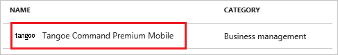
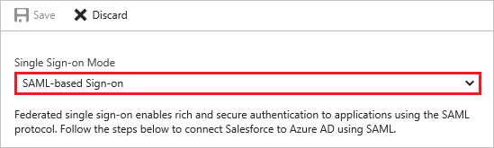
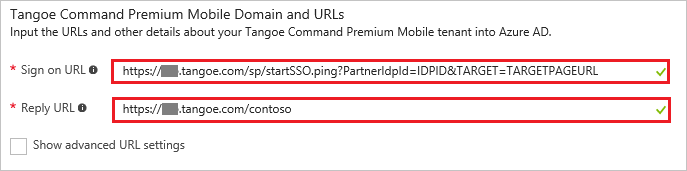
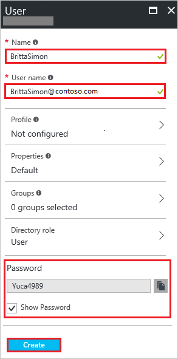

# Tutorial: Azure Active Directory integration with Tangoe Command Premium Mobile

In this tutorial, you learn how to integrate Tangoe Command Premium Mobile with Azure Active Directory (Azure AD).

Integrating Tangoe Command Premium Mobile with Azure AD provides you with the following benefits:

- You can control in Azure AD who has access to Tangoe Command Premium Mobile
- You can enable your users to automatically get signed-on to Tangoe Command Premium Mobile (Single Sign-On) with their Azure AD accounts
- You can manage your accounts in one central location - the Azure portal

If you want to know more details about SaaS app integration with Azure AD, see [what is application access and single sign-on with Azure Active Directory](active-directory-appssoaccess-whatis.md).

## Prerequisites

To configure Azure AD integration with Tangoe Command Premium Mobile, you need the following items:

- An Azure AD subscription
- A Tangoe Command Premium Mobile single sign-on enabled subscription

> [!NOTE]
> To test the steps in this tutorial, we do not recommend using a production environment.

To test the steps in this tutorial, you should follow these recommendations:

- Do not use your production environment, unless it is necessary.
- If you don't have an Azure AD trial environment, you can [get a one-month trial](https://azure.microsoft.com/pricing/free-trial/).

## Scenario description
In this tutorial, you test Azure AD single sign-on in a test environment. 
The scenario outlined in this tutorial consists of two main building blocks:

1. Add Tangoe Command Premium Mobile from the gallery
2. Configure and test Azure AD single sign-on

## Add Tangoe Command Premium Mobile from the gallery
To configure the integration of Tangoe Command Premium Mobile into Azure AD, you need to add Tangoe Command Premium Mobile from the gallery to your list of managed SaaS apps.

**To add Tangoe Command Premium Mobile from the gallery, perform the following steps:**

1. In the **[Azure portal](https://portal.azure.com)**, on the left navigation panel, click **Azure Active Directory** icon. 

	![Active Directory][1]

2. Navigate to **Enterprise applications**. Then go to **All applications**.

	![Applications][2]
	
3. To add new application, click **New application** button on the top of dialog.

	![Applications][3]

4. In the search box, type **Tangoe Command Premium Mobile**, select **Tangoe Command Premium Mobile** from result panel then click **Add** button to add the application.

	

##  Configure and test Azure AD single sign-on
In this section, you configure and test Azure AD single sign-on with Tangoe Command Premium Mobile based on a test user called "Britta Simon".

For single sign-on to work, Azure AD needs to know what the counterpart user in Tangoe Command Premium Mobile is to a user in Azure AD. In other words, a link relationship between an Azure AD user and the related user in Tangoe Command Premium Mobile needs to be established.

In Tangoe Command Premium Mobile, assign the value of the **user name** in Azure AD as the value of the **Username** to establish the link relationship.

To configure and test Azure AD single sign-on with Tangoe Command Premium Mobile, you need to complete the following building blocks:

1. **[Configure Azure AD Single Sign-On](#configure-azure-ad-single-sign-on)** - to enable your users to use this feature.
2. **[Create an Azure AD test user](#create-an-azure-ad-test-user)** - to test Azure AD single sign-on with Britta Simon.
3. **[Create a Tangoe Command Premium Mobile test user](#create-a-tangoe-command-premium-mobile-test-user)** - to have a counterpart of Britta Simon in Tangoe Command Premium Mobile that is linked to the Azure AD representation of user.
4. **[Assign the Azure AD test user](#assign-the-azure-ad-test-user)** - to enable Britta Simon to use Azure AD single sign-on.
5. **[Test Single Sign-On](#test-single-sign-on)** - to verify whether the configuration works.

### Configure Azure AD single sign-on

In this section, you enable Azure AD single sign-on in the Azure portal and configure single sign-on in your Tangoe Command Premium Mobile application.

**To configure Azure AD single sign-on with Tangoe Command Premium Mobile, perform the following steps:**

1. In the Azure portal, on the **Tangoe Command Premium Mobile** application integration page, click **Single sign-on**.

	![Configure Single Sign-On][4]

2. On the **Single sign-on** dialog, select **Mode** as	**SAML-based Sign-on** to enable single sign-on.
 
	

3. On the **Tangoe Command Premium Mobile Domain and URLs** section, perform the following steps:

	

    a. In the **Sign-on URL** textbox, type a URL using the following pattern: `https://sso.tangoe.com/sp/startSSO.ping?PartnerIdpId=<tenant issuer>&TARGET=<target page url>`

	b. In the **Reply URL** textbox, type a URL using the following pattern: `https://sso.tangoe.com/sp/ACS.saml2`

	> [!NOTE] 
	> These values are not real. Update these values with the actual  Reply URL and Sign-On URL. Contact [Tangoe Command Premium Mobile Client support team](https://www.tangoe.com/contact-2/) to get these values. 

4. On the **SAML Signing Certificate** section, click **Metadata XML** and then save the metadata file on your computer.

	 

5. Click **Save** button.

	
	
6. On the **Tangoe Command Premium Mobile Configuration** section, click **Configure Tangoe Command Premium Mobile** to open **Configure sign-on** window. Copy the **Sign-Out URL, SAML Entity ID, and SAML Single Sign-On Service URL** from the **Quick Reference section.**

	 

7. To get SSO configured for your application, contact your [Tangoe Command Premium Mobile Client support team](https://www.tangoe.com/contact-2/) and provide the following:

   - The downloaded metadata file
   - The **SAML Entity ID**
   - The **SAML Single Sign-On Service URL**
   - The **Sign-Out URL**

> [!TIP]
> You can now read a concise version of these instructions inside the [Azure portal](https://portal.azure.com), while you are setting up the app!  After adding this app from the **Active Directory > Enterprise Applications** section, simply click the **Single Sign-On** tab and access the embedded documentation through the **Configuration** section at the bottom. You can read more about the embedded documentation feature here: [Azure AD embedded documentation]( https://go.microsoft.com/fwlink/?linkid=845985)
> 

### Create an Azure AD test user
The objective of this section is to create a test user in the Azure portal called Britta Simon.

![Create Azure AD User][100]

**To create a test user in Azure AD, perform the following steps:**

1. In the **Azure portal**, on the left navigation pane, click **Azure Active Directory** icon.

	 

2. To display the list of users, go to **Users and groups** and click **All users**.
	
	 

3. To open the **User** dialog, click **Add** on the top of the dialog.
 
	 

4. On the **User** dialog page, perform the following steps:
 
	 

    a. In the **Name** textbox, type **BrittaSimon**.

    b. In the **User name** textbox, type the **email address** of BrittaSimon.

	c. Select **Show Password** and write down the value of the **Password**.

    d. Click **Create**.
 
### Create a Tangoe Command Premium Mobile test user

In this section, you create a user called Britta Simon in Tangoe Command Premium Mobile. 

Tangoe Command Premium Mobile application needs all the users to be provisioned in the application before doing Single Sign On. So please work with the [Tangoe Command Premium Mobile Client support team](https://www.tangoe.com/contact-2/) to provision all these users into the application. 

### Assign the Azure AD test user

In this section, you enable Britta Simon to use Azure single sign-on by granting access to Tangoe Command Premium Mobile.

![Assign User][200] 

**To assign Britta Simon to Tangoe Command Premium Mobile, perform the following steps:**

1. In the Azure portal, open the applications view, and then navigate to the directory view and go to **Enterprise applications** then click **All applications**.

	![Assign User][201] 

2. In the applications list, select **Tangoe Command Premium Mobile**.

	 

3. In the menu on the left, click **Users and groups**.

	![Assign User][202] 

4. Click **Add** button. Then select **Users and groups** on **Add Assignment** dialog.

	![Assign User][203]

5. On **Users and groups** dialog, select **Britta Simon** in the Users list.

6. Click **Select** button on **Users and groups** dialog.

7. Click **Assign** button on **Add Assignment** dialog.
	
### Test single sign-on

In this section, you test your Azure AD SSO configuration using the Access Panel.

When you click the Tangoe Command Premium Mobile tile in the Access Panel, you should get automatically signed-on to your Tangoe Command Premium Mobile application. For more information about the Access Panel, see [Introduction to the Access Panel](active-directory-saas-access-panel-introduction.md). 

## Additional resources

* [List of Tutorials on How to Integrate SaaS Apps with Azure Active Directory](active-directory-saas-tutorial-list.md)
* [What is application access and single sign-on with Azure Active Directory?](active-directory-appssoaccess-whatis.md)

<!--Image references-->

[1]: ./media/active-directory-saas-tangoe-tutorial/tutorial_general_01.png
[2]: ./media/active-directory-saas-tangoe-tutorial/tutorial_general_02.png
[3]: ./media/active-directory-saas-tangoe-tutorial/tutorial_general_03.png
[4]: ./media/active-directory-saas-tangoe-tutorial/tutorial_general_04.png

[100]: ./media/active-directory-saas-tangoe-tutorial/tutorial_general_100.png

[200]: ./media/active-directory-saas-tangoe-tutorial/tutorial_general_200.png
[201]: ./media/active-directory-saas-tangoe-tutorial/tutorial_general_201.png
[202]: ./media/active-directory-saas-tangoe-tutorial/tutorial_general_202.png
[203]: ./media/active-directory-saas-tangoe-tutorial/tutorial_general_203.png

