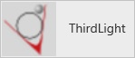
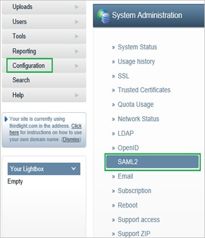
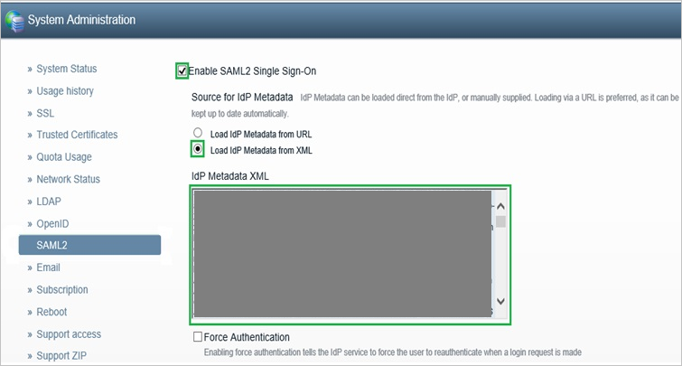
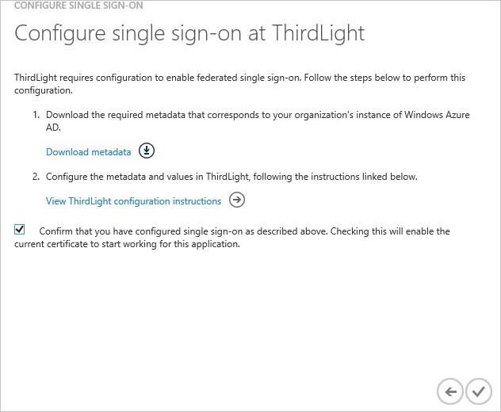

<properties 
    pageTitle="Tutorial: Azure Active Directory Integration with Thirdlight | Microsoft Azure" 
    description="Learn how to use Thirdlight with Azure Active Directory to enable single sign-on, automated provisioning, and more!" 
    services="active-directory" 
    authors="jeevansd"  
    documentationCenter="na" 
    manager="femila"/>
<tags 
    ms.service="active-directory" 
    ms.devlang="na" 
    ms.topic="article" 
    ms.tgt_pltfrm="na" 
    ms.workload="identity" 
    ms.date="06/21/2016" 
    ms.author="jeedes" />

#Tutorial: Azure Active Directory Integration with Thirdlight
  
The objective of this tutorial is to show the integration of Azure and Thirdlight.  
The scenario outlined in this tutorial assumes that you already have the following items:

-   A valid Azure subscription
-   A Thirdlight single sign-on enabled subscription
  
After completing this tutorial, the Azure AD users you have assigned to Thirdlight will be able to single sign into the application at your Thirdlight company site (service provider initiated sign on), or using the [Introduction to the Access Panel](active-directory-saas-access-panel-introduction.md).
  
The scenario outlined in this tutorial consists of the following building blocks:

1.  Enabling the application integration for Thirdlight
2.  Configuring single sign-on
3.  Configuring user provisioning
4.  Assigning users

##Enabling the application integration for Thirdlight
  
The objective of this section is to outline how to enable the application integration for Thirdlight.

###To enable the application integration for Thirdlight, perform the following steps:

1.  In the Azure classic portal, on the left navigation pane, click **Active Directory**.

    

2.  From the **Directory** list, select the directory for which you want to enable directory integration.

3.  To open the applications view, in the directory view, click **Applications** in the top menu.

    

4.  Click **Add** at the bottom of the page.

    

5.  On the **What do you want to do** dialog, click **Add an application from the gallery**.

    

6.  In the **search box**, type **Thirdlight**.

    

7.  In the results pane, select **Thirdlight**, and then click **Complete** to add the application.

    

##Configuring single sign-on
  
The objective of this section is to outline how to enable users to authenticate to Thirdlight with their account in Azure AD using federation based on the SAML protocol.  
Configuring single sign-on for Thirdlight requires you to retrieve a thumbprint value from a certificate.  
If you are not familiar with this procedure, see [How to retrieve a certificate's thumbprint value](http://youtu.be/YKQF266SAxI).

###To configure single sign-on, perform the following steps:

1.  In the Azure classic portal, on the **Thirdlight** application integration page, click **Configure single sign-on** to open the **Configure Single Sign On ** dialog.

    

2.  On the **How would you like users to sign on to Thirdlight** page, select **Microsoft Azure AD Single Sign-On**, and then click **Next**.

    

3.  On the **Configure App URL** page, in the **Thirdlight Sign In URL** textbox, type your URL used by your users to sign on to your Thirdlight application (e.g.: "*http://azuresso2.thirdlight.com/*"), and then click **Next**.

    

4.  On the **Configure single sign-on at Thirdlight** page, to download your metadata, click **Download metadata**, and then save the metadata file locally on your computer.

    

5.  In a different web browser window, log into your Thirdlight company site as an administrator.

6.  Go to **Configuration \> System Administration**, and then click **SAML2**.

    

7.  In the SAML2 configuration section, perform the following steps:

    

    1.  Select **Enable SAML2 Single Sign-On**.
    2.  As **Source for IdP Metadata**, select **Load IdP Metadata from XML**.
    3.  Open the downloaded metadata file, copy the content, and then paste it into the **IdP Metadata XML** textbox.
    4.  Click **Save SAML2 settings**.

8.  On the Azure classic portal, select the single sign-on configuration confirmation, and then click **Complete** to close the **Configure Single Sign On** dialog.

    

##Configuring user provisioning
  
In order to enable Azure AD users to log into Thirdlight, they must be provisioned into Thirdlight.  
In the case of Thirdlight, provisioning is a manual task.

###To configure user provisioning, perform the following steps:

1.  Log in to your **Thirdlight** company site as an administrator.

2.  Go to **Users** tab.

3.  Select **Users and Groups**.

4.  Click **Add new User** button.

5.  Enter **the Username, Name or Description, Email, Choose a Preset or Group of New Members** of a valid AAD account you want to provision.

6.  Click **Create**.

>[AZURE.NOTE] You can use any other Thirdlight user account creation tools or APIs provided by Thirdlight to provision AAD user accounts.

##Assigning users
  
To test your configuration, you need to grant the Azure AD users you want to allow using your application access to it by assigning them.

###To assign users to Thirdlight, perform the following steps:

1.  In the Azure classic portal, create a test account.

2.  On the **Thirdlight **application integration page, click **Assign users**.

    

3.  Select your test user, click **Assign**, and then click **Yes** to confirm your assignment.

    
  
If you want to test your single sign-on settings, open the Access Panel. For more details about the Access Panel, see [Introduction to the Access Panel](active-directory-saas-access-panel-introduction.md).