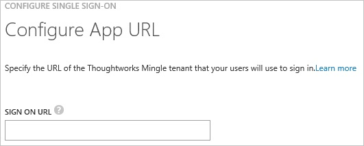
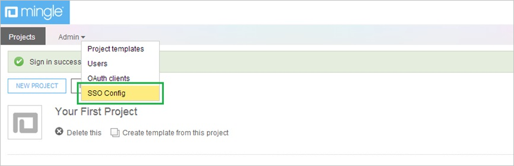
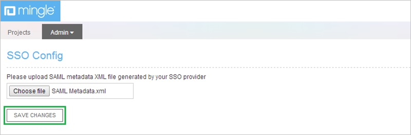
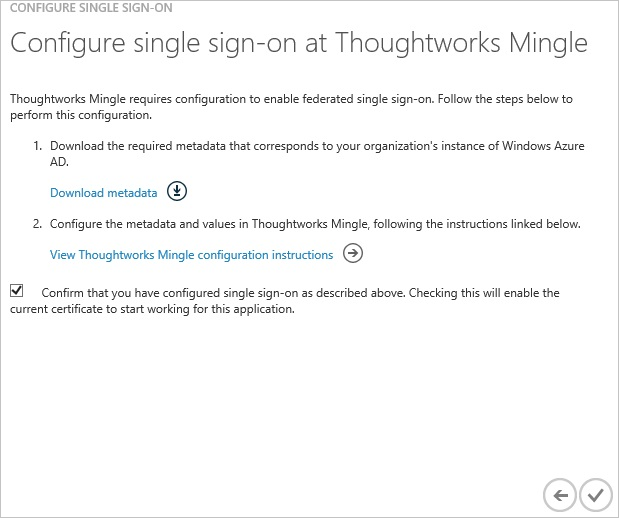
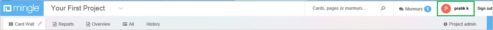
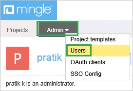
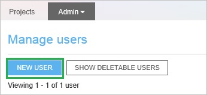
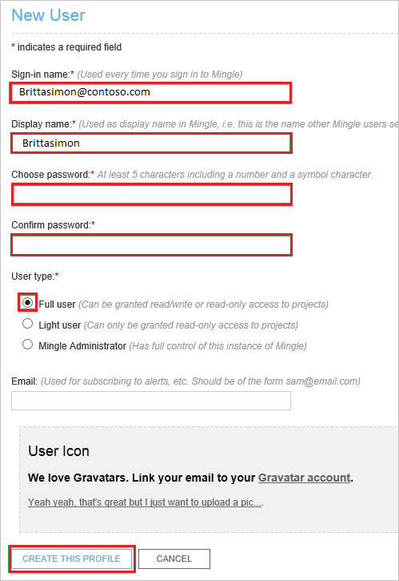
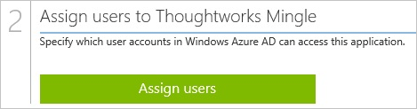

<properties 
    pageTitle="Tutorial: Azure Active Directory integration with Thoughtworks Mingle | Microsoft Azure" 
    description="Learn how to use Thoughtworks Mingle with Azure Active Directory to enable single sign-on, automated provisioning, and more!" 
    services="active-directory" 
    authors="jeevansd"  
    documentationCenter="na" 
     manager="femila"/>
<tags 
    ms.service="active-directory" 
    ms.devlang="na" 
    ms.topic="article" 
    ms.tgt_pltfrm="na" 
    ms.workload="identity" 
    ms.date="06/21/2016" 
    ms.author="jeedes" />

#Tutorial: Azure Active Directory integration with Thoughtworks Mingle
  
The objective of this tutorial is to show the integration of Azure and Thoughtworks Mingle.  
The scenario outlined in this tutorial assumes that you already have the following items:

-   A valid Azure subscription
-   A Thoughtworks Mingle tenant
  
The scenario outlined in this tutorial consists of the following building blocks:

1.  Enabling the application integration for Thoughtworks Mingle
2.  Configuring single sign-on
3.  Configuring user provisioning
4.  Assigning users

##Enabling the application integration for Thoughtworks Mingle
  
The objective of this section is to outline how to enable the application integration for Thoughtworks Mingle.

###To enable the application integration for Thoughtworks Mingle, perform the following steps:

1.  In the Azure classic portal, on the left navigation pane, click **Active Directory**.

    

2.  From the **Directory** list, select the directory for which you want to enable directory integration.

3.  To open the applications view, in the directory view, click **Applications** in the top menu.

    

4.  Click **Add** at the bottom of the page.

    

5.  On the **What do you want to do** dialog, click **Add an application from the gallery**.

    

6.  In the **search box**, type **thoughtworks mingle**.

    

7.  In the results pane, select **Thoughtworks Mingle**, and then click **Complete** to add the application.

    

##Configuring single sign-on
  
The objective of this section is to outline how to enable users to authenticate to Thoughtworks Mingle with their account in Azure AD using federation based on the SAML protocol.  
As part of this procedure, you are required to upload a certificate to Thoughtworks Mingle.

###To configure single sign-on, perform the following steps:

1.  In the Azure classic portal, on the **Thoughtworks Mingle **application integration page, click **Configure single sign-on** to open the **Configure Single Sign On ** dialog.

    

2.  On the **How would you like users to sign on to Thoughtworks Mingle** page, select **Microsoft Azure AD Single Sign-On**, and then click **Next**.

    

3.  On the **Configure App URL** page, in the **Thoughtworks Mingle Tenant URL** textbox, type your URL using the following pattern "*http://company.mingle.thoughtworks.com*", and then click **Next**.

    

4.  On the **Configure single sign-on at Thoughtworks Mingle** page, click Download metadata, and then save it on your computer.

    

5.  Log in to your **Thoughtworks Mingle** company site as administrator.

6.  Click the **Admin** tab, and then, click **SSO Config**.

    

7.  In the **SSO Config** section, perform the following steps:

    

    1.  To upload the metadata file, click **Choose file**.
    2.  Click **Save Changes**.

8.  On the Azure classic portal, select the single sign-on configuration confirmation, and then click **Complete** to close the **Configure Single Sign On** dialog.

    

##Configuring user provisioning
  
For AAD users to be able to sign in, they must be provisioned to the Thoughtworks Mingle application using their Azure Active Directory user names.  
In the case of Thoughtworks Mingle, provisioning is a manual task.

###To configure user provisioning, perform the following steps:

1.  Log in to your Thoughtworks Mingle company site as administrator.

2.  Click **Profile**.

    

3.  Click the **Admin** tab, and then click **Users**.

    

4.  Click **New User**.

    

5.  On the **New User** dialog page, perform the following steps:

    

    1.  Type the **Sign-in name**, **Display name**, **Choose password**, **Confirm password** of a valid AAD account you want to provision into the related textboxes.
    2.  As **User type**, select **Full user**.
    3.  Click **Create This Profile**.

>[AZURE.NOTE] You can use any other Thoughtworks Mingle user account creation tools or APIs provided by Thoughtworks Mingle to provision AAD user accounts.

##Assigning users
  
To test your configuration, you need to grant the Azure AD users you want to allow using your application access to it by assigning them.

###To assign users to Thoughtworks Mingle, perform the following steps:

1.  In the Azure classic portal, create a test account.

2.  On the **Thoughtworks Mingle** application integration page, click **Assign users**.

    

3.  Select your test user, click **Assign**, and then click **Yes** to confirm your assignment.

    
  
If you want to test your single sign-on settings, open the Access Panel. For more details about the Access Panel, see [Introduction to the Access Panel](active-directory-saas-access-panel-introduction.md).
