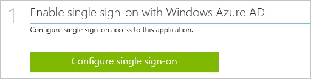
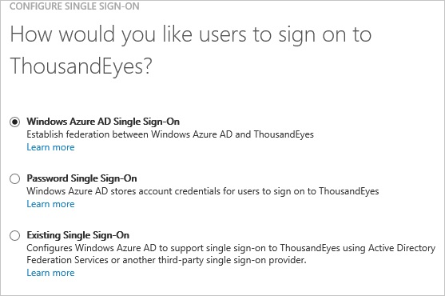
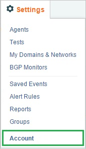
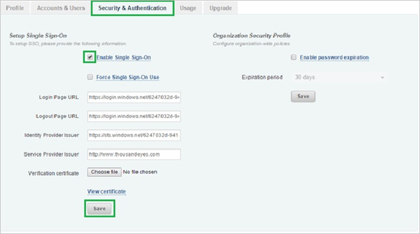
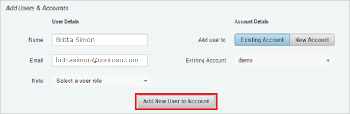

<properties 
    pageTitle="Tutorial: Azure Active Directory integration with ThousandEyes | Microsoft Azure" 
    description="Learn how to use ThousandEyes with Azure Active Directory to enable single sign-on, automated provisioning, and more!" 
    services="active-directory" 
    authors="jeevansd"  
    documentationCenter="na" 
    manager="femila"/>
<tags 
    ms.service="active-directory" 
    ms.devlang="na" 
    ms.topic="article" 
    ms.tgt_pltfrm="na" 
    ms.workload="identity" 
    ms.date="06/21/2016" 
    ms.author="jeedes" />

#Tutorial: Azure Active Directory integration with ThousandEyes
  
The objective of this tutorial is to show how to set up single sign-on between Azure Active Directory (Azure AD) and ThousandEyes.
  
The scenario outlined in this tutorial assumes that you already have the following items:

-   A valid Azure subscription
-   A ThousandEyes single sign on enabled subscription
  
After completing this tutorial, the AAD users to whom you have assign ThousandEyes access will be able to single sign into the application at your ThousandEyes company site (service provider initiated sign on), or using the AAD Access Panel .

1.  Enabling the application integration for ThousandEyes
2.  Configuring Single Sign-On
3.  Configuring user provisioning
4.  Assigning users

##Enabling the application integration for ThousandEyes
  
The objective of this section is to outline how to enable the application integration for ThousandEyes.

###To enable the application integration for ThousandEyes, perform the following steps:

1.  In the Azure classic portal, on the left navigation pane, click **Active Directory**.

    

2.  From the **Directory** list, select the directory for which you want to enable directory integration.

3.  To open the applications view, in the directory view, click **Applications** in the top menu.

    

4.  Click **Add** at the bottom of the page.

    

5.  On the **What do you want to do** dialog, click **Add an application from the gallery**.

    

6.  In the **search box**, type **ThousandEyes**.

    

7.  In the results pane, select **ThousandEyes**, and then click **Complete** to add the application.

    

##Configuring Single Sign-On
  
This section outlines how to enable users to authenticate to ThousandEyes with their account in Azure Active Directory, using federation based on the SAML protocol.

###To configure single sign-on, perform the following steps:

1.  In the Azure classic portal, on the **ThousandEyes** application integration page, click **Configure single sign-on** to open the **Configure Single Sign On ** dialog.

    

2.  On the **How would you like users to sign on to ThousandEyes** page, select **Microsoft Azure AD Single Sign-On**, and then click **Next**.

    

3.  On the **Configure App URL** page, in the **ThousandEyes Sign On URL** textbox, type the URL users are using to sign into your ThousandEyes application (e.g.: "*https://app.thousandeyes.com/login/sso*"), and then click **Next**. 

    

4.  On the **Configure single sign-on at ThousandEyes** page, to download your certificate, click **Download certificate**, and then save the certificate file locally to your computer.

    

5.  In a different web browser window, sign on to your **ThousandEyes** company site as an administrator.

6.  In the menu on the top, click **Settings**.

    

7.  Click **Account**

    

8.  Click the **Security & Authentication** tab.

    

9.  In the **Setup Single Sign-On** section, perform the following steps:

    

    1.  Select **Enable Single Sign-On**.
    2.  In the Microsoft Azure classic portal, on the **Configure single sign-on at ThousandEyes** page, copy the **Remote Login URL** value, and then paste it into the **Login Page URL** textbox.
    3.  In the Microsoft Azure classic portal, on the **Configure single sign-on at ThousandEyes** page, copy the **Remote Logout URL** value, and then paste it into the **Logout Page URL** textbox.
    4.  In the Microsoft Azure classic portal, on the **Configure single sign-on at ThousandEyes** page, copy the **Issuer URL** value, and then paste it into the **Identity Provider Issuer** textbox.
    5.  In **Identity Provider Certificate**, click **Choose file**, and then upload the certificate you have downloaded from the Microsoft Azure classic portal.
    6.  Click **Save**.

10. On the Azure classic portal, select the single sign-on configuration confirmation, and then click **Complete** to close the **Configure Single Sign On** dialog.

    

##Configuring user provisioning
  
In order to enable Azure AD users to log into ThousandEyes, they must be provisioned into ThousandEyes.  
In the case of ThousandEyes, provisioning is a manual task.

###To provision a user account to ThousandEyes, perform the following steps:

1.  Log into your ThousandEyes company site as an administrator.

2.  Click **Settings**.

    

3.  Click **Account**.

    

4.  Click the **Accounts & Users** tab.

    

5.  In the **Add Users & Accounts** section, perform the following steps:

    

    1.  Type the **Name**, **Email** and other details of a valid Azure Active Directory account you want to provision into the related textboxes.
    2.  Click **Add New User to Account**.

        >[AZURE.NOTE] The AAD account holder will get an email including a link to confirm and activate the account.

>[AZURE.NOTE] You can use any other ThousandEyes user account creation tools or APIs provided by ThousandEyes to provision AAD user accounts.

##Assigning users
  
To test your configuration, you need to grant the Azure AD users you want to allow using your application access to it by assigning them.

###To assign users to ThousandEyes, perform the following steps:

1.  In the Azure classic portal, create a test account.

2.  On the **ThousandEyes** application integration page, click **Assign users**.

    

3.  Select your test user, click **Assign**, and then click **Yes** to confirm your assignment.

    
  
If you want to test your single sign-on settings, open the Access Panel. For more details about the Access Panel, see [Introduction to the Access Panel](active-directory-saas-access-panel-introduction.md).
