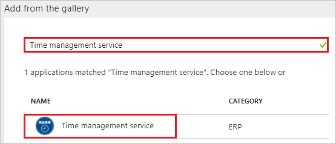
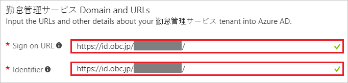
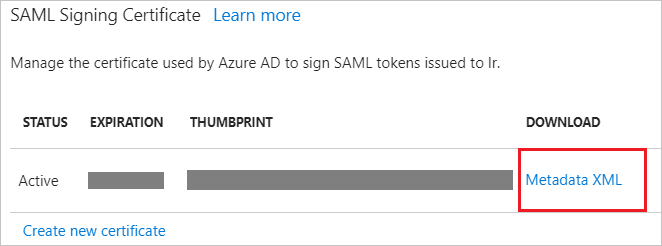
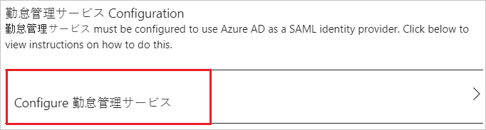
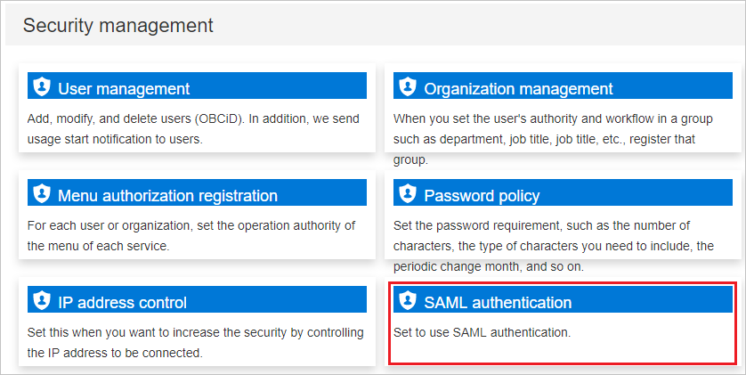
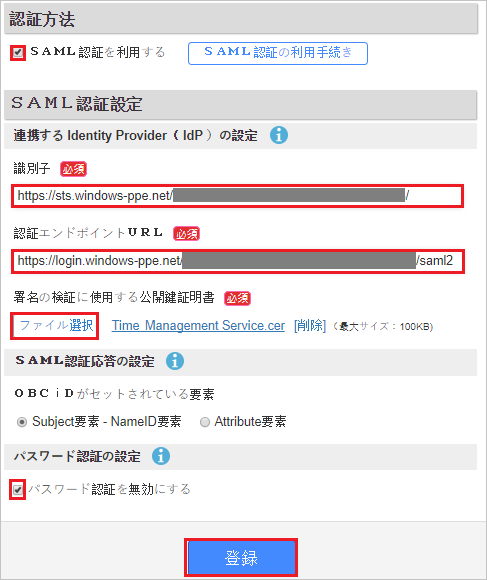
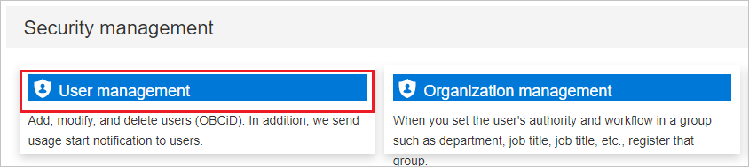
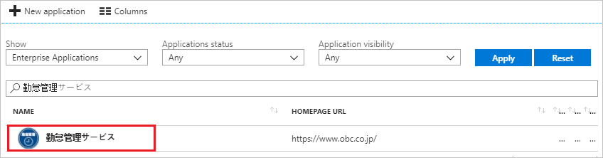

# Tutorial: Azure Active Directory integration with Time management service

In this tutorial, you learn how to integrate Time management service with Azure Active Directory (Azure AD).

Integrating Time management service with Azure AD provides you with the following benefits:

- You can control in Azure AD who has access to Time management service.
- You can enable your users to automatically get signed-on to Time management service (Single Sign-On) with their Azure AD accounts.
- You can manage your accounts in one central location - the Azure portal.

If you want to know more details about SaaS app integration with Azure AD, see [what is application access and single sign-on with Azure Active Directory](active-directory-appssoaccess-whatis.md).

## Prerequisites

To configure Azure AD integration with Time management service, you need the following items:

- An Azure AD subscription
- A Time management service single sign-on enabled subscription

> [!NOTE]
> To test the steps in this tutorial, we do not recommend using a production environment.

To test the steps in this tutorial, you should follow these recommendations:

- Do not use your production environment, unless it is necessary.
- If you don't have an Azure AD trial environment, you can [get a one-month trial](https://azure.microsoft.com/pricing/free-trial/).

## Scenario description
In this tutorial, you test Azure AD single sign-on in a test environment. 
The scenario outlined in this tutorial consists of two main building blocks:

1. Adding Time management service from the gallery
2. Configuring and testing Azure AD single sign-on

## Adding Time management service from the gallery
To configure the integration of Time management service into Azure AD, you need to add Time management service from the gallery to your list of managed SaaS apps.

**To add Time management service from the gallery, perform the following steps:**

1. In the **[Azure portal](https://portal.azure.com)**, on the left navigation panel, click **Azure Active Directory** icon. 

	![The Azure Active Directory button][1]

2. Navigate to **Enterprise applications**. Then go to **All applications**.

	![The Enterprise applications blade][2]
	
3. To add new application, click **New application** button on the top of dialog.

	![The New application button][3]

4. In the search box, type **Time management service**, select **Time management service** from result panel then click **Add** button to add the application.

	

## Configure and test Azure AD single sign-on

In this section, you configure and test Azure AD single sign-on with Time management service based on a test user called "Britta Simon".

For single sign-on to work, Azure AD needs to know what the counterpart user in Time management service is to a user in Azure AD. In other words, a link relationship between an Azure AD user and the related user in Time management service needs to be established.

To configure and test Azure AD single sign-on with Time management service, you need to complete the following building blocks:

1. **[Configure Azure AD Single Sign-On](#configure-azure-ad-single-sign-on)** - to enable your users to use this feature.
2. **[Create an Azure AD test user](#create-an-azure-ad-test-user)** - to test Azure AD single sign-on with Britta Simon.
3. **[Create a Time management service test user](#create-a-time-management-service-test-user)** - to have a counterpart of Britta Simon in Time management service that is linked to the Azure AD representation of user.
4. **[Assign the Azure AD test user](#assign-the-azure-ad-test-user)** - to enable Britta Simon to use Azure AD single sign-on.
5. **[Test single sign-on](#test-single-sign-on)** - to verify whether the configuration works.

### Configure Azure AD single sign-on

In this section, you enable Azure AD single sign-on in the Azure portal and configure single sign-on in your Time management service application.

**To configure Azure AD single sign-on with Time management service, perform the following steps:**

1. In the Azure portal, on the **Time management service** application integration page, click **Single sign-on**.

	![Configure single sign-on link][4]

2. On the **Single sign-on** dialog, select **Mode** as	**SAML-based Sign-on** to enable single sign-on.
 
	

3. On the **Time management service Domain and URLs** section, perform the following steps:

	

    a. In the **Sign-on URL** textbox, type the URL: `https://id-dev.obc.jp/abfkadsc5ym7/`

	b. In the **Identifier** textbox, type the URL: `https://id-dev.obc.jp/abfkadsc5ym7/`

4. On the **SAML Signing Certificate** section, click **Metadata XML** and then save the metadata file on your computer.

	 

5. Click **Save** button.

	

6. On the **Time management service Configuration** section, click **Configure Time management service** to open **Configure sign-on** window. Copy the **SAML Entity ID, and SAML Single Sign-On Service URL** from the **Quick Reference section.**

	 

7. In a different browser window, sign-on to your Time management service company site as administrator.

8. Click on **SAML authentication** under the **Security management section**.

	

9. Perform the following steps:

	

	a. Select **Use SAML authentication**.

	b. In the **Identifier** textbox, paste the value of **SAML Entity ID**, which you have copied from Azure portal. 

	c. In the **Authentication endpoint URL** textbox, paste the value of **SAML Single Sign-On Service URL**, which you have copied from Azure portal.

	d. Click **Select a file** to upload your downloaded Azure Active Directory certificate.

	e. Select **Disable password authentication**.

	f. Click **Registration**

> [!TIP]
> You can now read a concise version of these instructions inside the [Azure portal](https://portal.azure.com), while you are setting up the app!  After adding this app from the **Active Directory > Enterprise Applications** section, simply click the **Single Sign-On** tab and access the embedded documentation through the **Configuration** section at the bottom. You can read more about the embedded documentation feature here: [Azure AD embedded documentation]( https://go.microsoft.com/fwlink/?linkid=845985)
> 

### Create an Azure AD test user

The objective of this section is to create a test user in the Azure portal called Britta Simon.

   ![Create an Azure AD test user][100]

**To create a test user in Azure AD, perform the following steps:**

1. In the Azure portal, in the left pane, click the **Azure Active Directory** button.

    

2. To display the list of users, go to **Users and groups**, and then click **All users**.

    

3. To open the **User** dialog box, click **Add** at the top of the **All Users** dialog box.

    

4. In the **User** dialog box, perform the following steps:

    

    a. In the **Name** box, type **BrittaSimon**.

    b. In the **User name** box, type the email address of user Britta Simon.

    c. Select the **Show Password** check box, and then write down the value that's displayed in the **Password** box.

    d. Click **Create**.
 
### Create a Time management service test user

To enable Azure AD users to log in to Time management service, they must be provisioned into Time management service. In the case of Time management service, provisioning is a manual task.

**To provision a user account, perform the following steps:**

1. Log in to your Time management service company site as an administrator.

2. Click on **User management** under the **Security management section**.

	

3. Click **New rules login**.

    

4. In the **OBCiD information** section, perform the following steps:

	

	a. In the **OBCiD** textbox, type the email of user like **BrittaSimon@contoso.com**.

	b. In the **Password** textbox, type the password of user.

	c. Click **Registration**

### Assign the Azure AD test user

In this section, you enable Britta Simon to use Azure single sign-on by granting access to Time management service.

![Assign the user role][200] 

**To assign Britta Simon to Time management service, perform the following steps:**

1. In the Azure portal, open the applications view, and then navigate to the directory view and go to **Enterprise applications** then click **All applications**.

	![Assign User][201] 

2. In the applications list, select **Time management service**.

	  

3. In the menu on the left, click **Users and groups**.

	![The "Users and groups" link][202]

4. Click **Add** button. Then select **Users and groups** on **Add Assignment** dialog.

	![The Add Assignment pane][203]

5. On **Users and groups** dialog, select **Britta Simon** in the Users list.

6. Click **Select** button on **Users and groups** dialog.

7. Click **Assign** button on **Add Assignment** dialog.
	
### Test single sign-on

In this section, you test your Azure AD single sign-on configuration using the Access Panel.

When you click the Time management service tile in the Access Panel, you should get automatically signed-on to your Time management service application.
For more information about the Access Panel, see [Introduction to the Access Panel](active-directory-saas-access-panel-introduction.md). 

## Additional resources

* [List of Tutorials on How to Integrate SaaS Apps with Azure Active Directory](active-directory-saas-tutorial-list.md)
* [What is application access and single sign-on with Azure Active Directory?](active-directory-appssoaccess-whatis.md)

<!--Image references-->

[1]: ./media/active-directory-saas-timemanagementservice-tutorial/tutorial_general_01.png
[2]: ./media/active-directory-saas-timemanagementservice-tutorial/tutorial_general_02.png
[3]: ./media/active-directory-saas-timemanagementservice-tutorial/tutorial_general_03.png
[4]: ./media/active-directory-saas-timemanagementservice-tutorial/tutorial_general_04.png

[100]: ./media/active-directory-saas-timemanagementservice-tutorial/tutorial_general_100.png

[200]: ./media/active-directory-saas-timemanagementservice-tutorial/tutorial_general_200.png
[201]: ./media/active-directory-saas-timemanagementservice-tutorial/tutorial_general_201.png
[202]: ./media/active-directory-saas-timemanagementservice-tutorial/tutorial_general_202.png
[203]: ./media/active-directory-saas-timemanagementservice-tutorial/tutorial_general_203.png

