<properties 
    pageTitle="Tutorial: Azure Active Directory integration with TimeOffManager | Microsoft Azure" 
    description="Learn how to use TimeOffManager with Azure Active Directory to enable single sign-on, automated provisioning, and more!" 
    services="active-directory" 
    authors="jeevansd"  
    documentationCenter="na" 
    manager="femila"/>
<tags 
    ms.service="active-directory" 
    ms.devlang="na" 
    ms.topic="article" 
    ms.tgt_pltfrm="na" 
    ms.workload="identity" 
    ms.date="07/19/2016" 
    ms.author="jeedes" />

#Tutorial: Azure Active Directory integration with TimeOffManager
  
The objective of this tutorial is to show the integration of Azure and TimeOffManager.  
The scenario outlined in this tutorial assumes that you already have the following items:

-   A valid Azure subscription
-   A TimeOffManager single sign-on enabled subscription
  
After completing this tutorial, the Azure AD users you have assigned to TimeOffManager will be able to single sign into the application at your TimeOffManager company site (service provider initiated sign on), or using the [Introduction to the Access Panel](active-directory-saas-access-panel-introduction.md).
  
The scenario outlined in this tutorial consists of the following building blocks:

1.  Enabling the application integration for TimeOffManager
2.  Configuring single sign-on
3.  Configuring user provisioning
4.  Assigning users

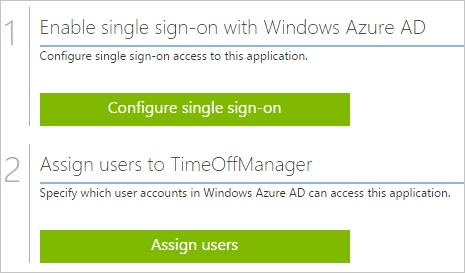

##Enabling the application integration for TimeOffManager
  
The objective of this section is to outline how to enable the application integration for TimeOffManager.

###To enable the application integration for TimeOffManager, perform the following steps:

1.  In the Azure classic portal, on the left navigation pane, click **Active Directory**.

    

2.  From the **Directory** list, select the directory for which you want to enable directory integration.

3.  To open the applications view, in the directory view, click **Applications** in the top menu.

    

4.  Click **Add** at the bottom of the page.

    

5.  On the **What do you want to do** dialog, click **Add an application from the gallery**.

    

6.  In the **search box**, type **TimeOffManager**.

    

7.  In the results pane, select **TimeOffManager**, and then click **Complete** to add the application.

    

##Configuring single sign-on
  
The objective of this section is to outline how to enable users to authenticate to TimeOffManager with their account in Azure AD using federation based on the SAML protocol.  
As part of this procedure, you are required to upload a base-64 encoded certificate to your TimeOffManager tenant.  
If you are not familiar with this procedure, see [How to convert a binary certificate into a text file](http://youtu.be/PlgrzUZ-Y1o)

###To configure single sign-on, perform the following steps:

1.  In the Azure classic portal, on the **TimeOffManager** application integration page, click **Configure single sign-on** to open the **Configure Single Sign On ** dialog.

    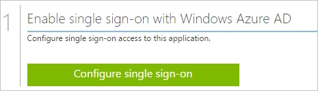

2.  On the **How would you like users to sign on to TimeOffManager** page, select **Microsoft Azure AD Single Sign-On**, and then click **Next**.

    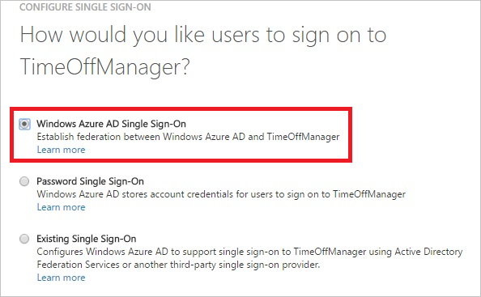

3.  On the **Configure App URL** page, in the **TimeOffManager Reply URL** textbox, type your TimeOffManager AssertionConsumerService URL (e.g.: "*Example: https://www.timeoffmanager.com/cpanel/sso/consume.aspx?company\_id=IC34216*", and then click **Next**.

    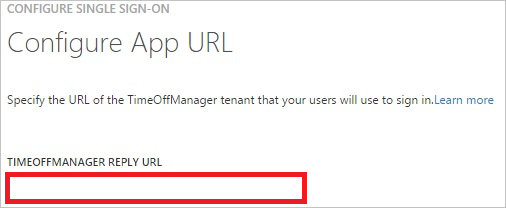

    You can get the reply URL from the TimeOffManager Single Sign on setting page.

    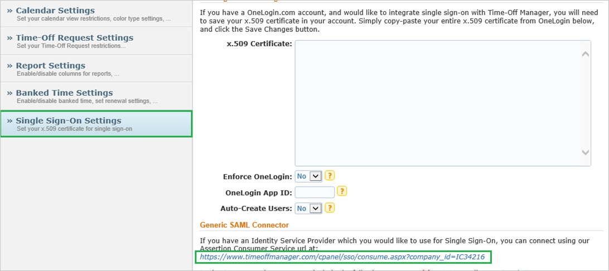

4.  On the **Configure single sign-on at TimeOffManager** page, to download your certificate, click **Download certificate**, and then save the certificate file on your computer.

    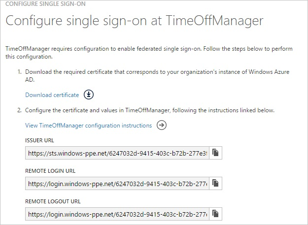

5.  In a different web browser window, log into your TimeOffManager company site as an administrator.

6.  Go to **Account \> Account Options \> Single Sign-On Settings**.

    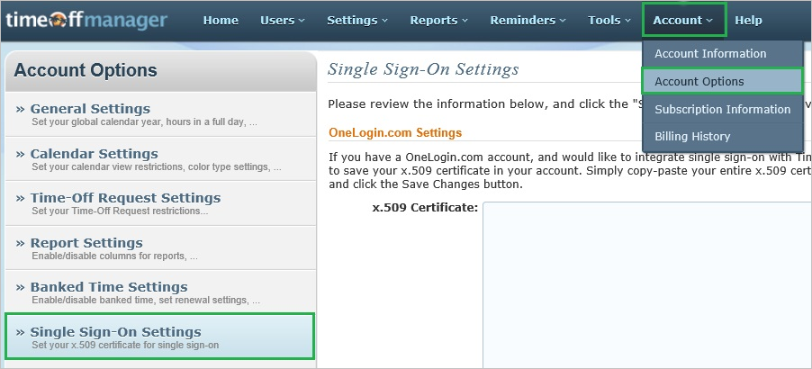

7.  In the **Single Sign-On Settings** section, perform the following steps:

    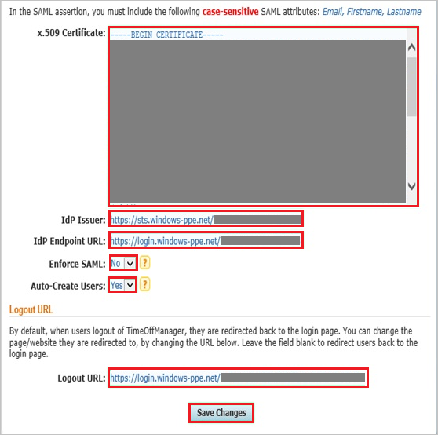

    a.  Create a **Base-64 encoded** file from your downloaded certificate.  

        >[AZURE.TIP] For more details, see [How to convert a binary certificate into a text file](http://youtu.be/PlgrzUZ-Y1o)

    b.  Open your base-64 encoded certificate in notepad, copy the content of it into your clipboard, and then paste the entire Certificate into **X.509 Certificate** textbox.
    
    c.  In the Azure classic portal, on the **Configure single sign-on at TimeOffManager** dialog page, copy the **Issuer URL** value, and then paste it into the **Idp Issuer** textbox.
    
    d.  In the Azure classic portal, on the **Configure single sign-on at TimeOffManager** dialog page, copy the **Remote Login URL** value, and then paste it into the **IdP Endpoint URL** textbox.
    
    e.  As **Enforce SAML**, select **No**.
    

    f.  As **Auto-Create Users**, select **Yes**.
    
    g.  In the Azure classic portal, on the **Configure single sign-on at TimeOffManager** dialog page, copy the **Remote Logout URL** value, and then paste it into the **Logout URL** textbox.
    
    h.  Click **Save Changes**.

8.  In the Azure classic portal, on the **Configure single sign-on at TimeOffManager** dialog page, select the single sign-on configuration confirmation, and then click **Complete**.

    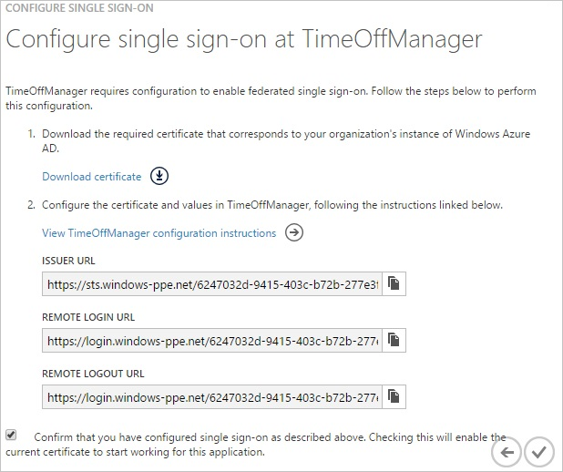

9.  In the menu on the top, click **Attributes** to open the **SAML Token Attributes** dialog.

    

10. To add the required attribute mappings, perform the following steps:

    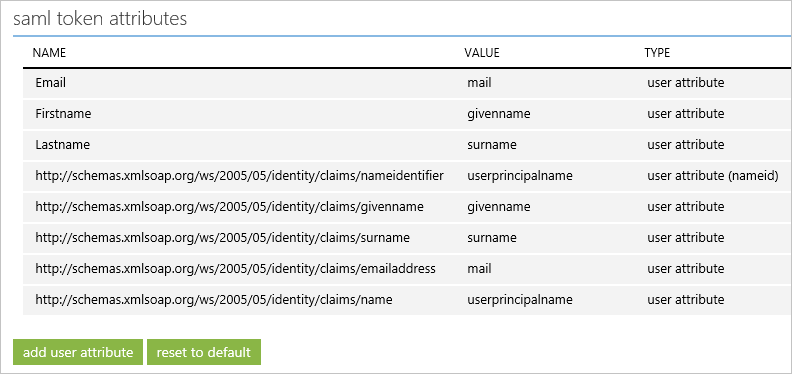

    |Attribute Name|Attribute Value|
	|---|---|
    |Email|User.mail|
    |Firstname|User.givenname|
	|Lastname|User.surname|

    a.  For each data row in the table above, click **add user attribute**.

    b.  In the **Attribute Name** textbox, type the attribute name shown for that row.

    c.  In the **Attribute Value** textbox, select the attribute value shown for that row.

    d.  Click **Complete**.

11. Click **Apply Changes**.

##Configuring user provisioning
  
In order to enable Azure AD users to log into TimeOffManager, they must be provisioned to TimeOffManager.  
TimeOffManager supports just in time user provisioning. There is no action item for you.  
The users are added automatically during the first login using single sign on.

>[AZURE.NOTE] You can use any other TimeOffManager user account creation tools or APIs provided by TimeOffManager to provision AAD user accounts.

##Assigning users
  
To test your configuration, you need to grant the Azure AD users you want to allow using your application access to it by assigning them.

###To assign users to TimeOffManager, perform the following steps:

1.  In the Azure classic portal, create a test account.

2.  On the **TimeOffManager** application integration page, click **Assign users**.

    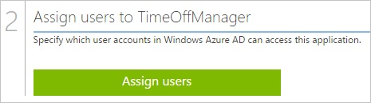

3.  Select your test user, click **Assign**, and then click **Yes** to confirm your assignment.

    
  
If you want to test your single sign-on settings, open the Access Panel. For more details about the Access Panel, see [Introduction to the Access Panel](active-directory-saas-access-panel-introduction.md).
