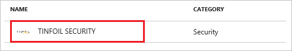
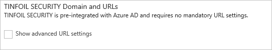
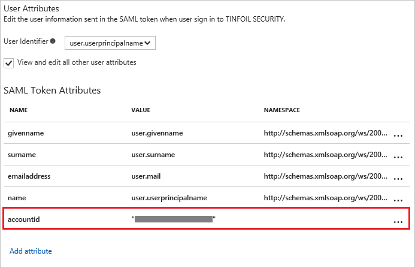
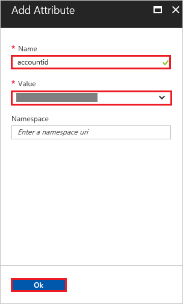
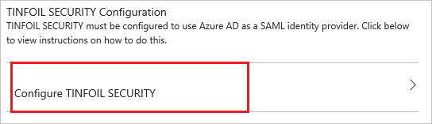
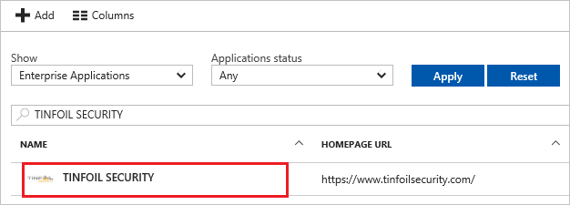

# Tutorial: Azure Active Directory integration with TINFOIL SECURITY

In this tutorial, you learn how to integrate TINFOIL SECURITY with Azure Active Directory (Azure AD).

Integrating TINFOIL SECURITY with Azure AD provides you with the following benefits:

- You can control in Azure AD who has access to TINFOIL SECURITY
- You can enable your users to automatically get signed-on to TINFOIL SECURITY (Single Sign-On) with their Azure AD accounts
- You can manage your accounts in one central location - the Azure portal

If you want to know more details about SaaS app integration with Azure AD, see [what is application access and single sign-on with Azure Active Directory](active-directory-appssoaccess-whatis.md).

## Prerequisites

To configure Azure AD integration with TINFOIL SECURITY, you need the following items:

- An Azure AD subscription
- A TINFOIL SECURITY single sign-on enabled subscription

> [!NOTE]
> To test the steps in this tutorial, we do not recommend using a production environment.

To test the steps in this tutorial, you should follow these recommendations:

- Do not use your production environment, unless it is necessary.
- If you don't have an Azure AD trial environment, you can [get a one-month trial](https://azure.microsoft.com/pricing/free-trial/).

## Scenario description
In this tutorial, you test Azure AD single sign-on in a test environment. 
The scenario outlined in this tutorial consists of two main building blocks:

1. Add TINFOIL SECURITY from the gallery
2. Configure and test Azure AD single sign-on

## Add TINFOIL SECURITY from the gallery
To configure the integration of TINFOIL SECURITY into Azure AD, you need to add TINFOIL SECURITY from the gallery to your list of managed SaaS apps.

**To add TINFOIL SECURITY from the gallery, perform the following steps:**

1. In the **[Azure portal](https://portal.azure.com)**, on the left navigation panel, click **Azure Active Directory** icon. 

	![Active Directory][1]

2. Navigate to **Enterprise applications**. Then go to **All applications**.

	![Applications][2]
	
3. To add new application, click **New application** button on the top of dialog.

	![Applications][3]

4. In the search box, type **TINFOIL SECURITY**, select  **TINFOIL SECURITY** from result panel then click **Add** button to add the application.

	

##  Configure and test Azure AD single sign-on
In this section, you configure and test Azure AD single sign-on with TINFOIL SECURITY based on a test user called "Britta Simon".

For single sign-on to work, Azure AD needs to know what the counterpart user in TINFOIL SECURITY is to a user in Azure AD. In other words, a link relationship between an Azure AD user and the related user in TINFOIL SECURITY needs to be established.

In TINFOIL SECURITY, assign the value of the **user name** in Azure AD as the value of the **Username** to establish the link relationship.

To configure and test Azure AD single sign-on with TINFOIL SECURITY, you need to complete the following building blocks:

1. **[Configure Azure AD Single Sign-On](#configure-azure-ad-single-sign-on)** - to enable your users to use this feature.
2. **[Create an Azure AD test user](#create-an-azure-ad-test-user)** - to test Azure AD single sign-on with Britta Simon.
3. **[Create a TINFOIL SECURITY test user](#create-a-tinfoil-security-test-user)** - to have a counterpart of Britta Simon in TINFOIL SECURITY that is linked to the Azure AD representation of user.
4. **[Assign the Azure AD test user](#assign-the-azure-ad-test-user)** - to enable Britta Simon to use Azure AD single sign-on.
5. **[Test Single Sign-On](#test-single-sign-on)** - to verify whether the configuration works.

### Configure Azure AD single sign-on

In this section, you enable Azure AD single sign-on in the Azure portal and configure single sign-on in your TINFOIL SECURITY application.

**To configure Azure AD single sign-on with TINFOIL SECURITY, perform the following steps:**

1. In the Azure portal, on the **TINFOIL SECURITY** application integration page, click **Single sign-on**.

	![Configure Single Sign-On][4]

2. On the **Single sign-on** dialog, select **Mode** as	**SAML-based Sign-on** to enable single sign-on.
 
	

3. On the **TINFOIL SECURITY Domain and URLs** section, the user does not have to perform any steps as the app is already pre-integrated with Azure.

	

4. On the **SAML Signing Certificate** section, copy the **THUMBPRINT** value.

	 

5. To add the required attribute mappings, perform the following steps:
    
    
	
	| Attribute Name    |   Attribute Value |
	| ------------------- | -------------------- |
	| accountid | UXXXXXXXXXXXXX |
	
	a. Click **add user attribute**.
	
	
	
	
	
	b. In the **Attribute Name** textbox, type **accountid**.
	
	c. In the **Attribute Value** textbox, paste the account ID value which you will get later on the tutorial.
	
	d. Click **Ok**.	

6. Click **Save** button.

	

7. On the **TINFOIL SECURITY Configuration** section, click **Configure TINFOIL SECURITY** to open **Configure sign-on** window. Copy the **SAML Single Sign-On Service URL** from the **Quick Reference section.**

	 

8. In a different web browser window, log into your TINFOIL SECURITY company site as an administrator.

9. In the toolbar on the top, click **My Account**.
   
    

10. Click **Security**.
   
    

11. On the **Single Sign-On** configuration page, perform the following steps:
   
    
   
    a. Select **Enable SAML**.
   
    b. Click **Manual Configuration**.
   
    c. In **SAML Post URL** textbox, paste the value of **SAML Single Sign-On Service URL** which you have copied from Azure portal
   
    d. In **SAML Certificate Fingerprint** textbox, paste the value of **Thumbprint** which you have copied from **SAML Signing Certificate** section.
  
    e. Copy **Your Account ID** value and paste the value in **Attribute Value** textbox under **Add Attribute** section in Azure portal.
   
    f. Click **Save**.

> [!TIP]
> You can now read a concise version of these instructions inside the [Azure portal](https://portal.azure.com), while you are setting up the app!  After adding this app from the **Active Directory > Enterprise Applications** section, simply click the **Single Sign-On** tab and access the embedded documentation through the **Configuration** section at the bottom. You can read more about the embedded documentation feature here: [Azure AD embedded documentation]( https://go.microsoft.com/fwlink/?linkid=845985)
> 

### Create an Azure AD test user
The objective of this section is to create a test user in the Azure portal called Britta Simon.

![Create Azure AD User][100]

**To create a test user in Azure AD, perform the following steps:**

1. In the **Azure portal**, on the left navigation pane, click **Azure Active Directory** icon.

	 

2. To display the list of users, go to **Users and groups** and click **All users**.
	
	 

3. To open the **User** dialog, click **Add** on the top of the dialog.
 
	 

4. On the **User** dialog page, perform the following steps:
 
	 

    a. In the **Name** textbox, type **BrittaSimon**.

    b. In the **User name** textbox, type the **email address** of BrittaSimon.

	c. Select **Show Password** and write down the value of the **Password**.

    d. Click **Create**.
 
### Create a TINFOIL SECURITY test user

In order to enable Azure AD users to log into TINFOIL SECURITY, they must be provisioned into TINFOIL SECURITY. In the case of TINFOIL SECURITY, provisioning is a manual task.

**To get a user provisioned, perform the following steps:**

1. If the user is a part of an Enterprise account, you need to [contact the TINFOIL SECURITY support team](https://www.tinfoilsecurity.com/contact) to get the user account created.

2. If the user is a regular TINFOIL SECURITY SaaS user, then the user can add a collaborator to any of the user’s sites. This triggers a process to send an invitation to the specified email to create a new TINFOIL SECURITY user account.

> [!NOTE]
> You can use any other TINFOIL SECURITY user account creation tools or APIs provided by TINFOIL SECURITY to provision Azure AD user accounts.
> 
> 

### Assign the Azure AD test user

In this section, you enable Britta Simon to use Azure single sign-on by granting access to TINFOIL SECURITY.

![Assign User][200] 

**To assign Britta Simon to TINFOIL SECURITY, perform the following steps:**

1. In the Azure portal, open the applications view, and then navigate to the directory view and go to **Enterprise applications** then click **All applications**.

	![Assign User][201] 

2. In the applications list, select **TINFOIL SECURITY**.

	 

3. In the menu on the left, click **Users and groups**.

	![Assign User][202] 

4. Click **Add** button. Then select **Users and groups** on **Add Assignment** dialog.

	![Assign User][203]

5. On **Users and groups** dialog, select **Britta Simon** in the Users list.

6. Click **Select** button on **Users and groups** dialog.

7. Click **Assign** button on **Add Assignment** dialog.
	
### Test single sign-on

In this section, you test your Azure AD single sign-on configuration using the Access Panel.

When you click the TINFOIL SECURITY tile in the Access Panel, you should get automatically signed-on to your TINFOIL SECURITY application. For more information about the Access Panel, see [Introduction to the Access Panel](active-directory-saas-access-panel-introduction.md).

## Additional resources

* [List of Tutorials on How to Integrate SaaS Apps with Azure Active Directory](active-directory-saas-tutorial-list.md)
* [What is application access and single sign-on with Azure Active Directory?](active-directory-appssoaccess-whatis.md)

<!--Image references-->

[1]: ./media/active-directory-saas-tinfoil-security-tutorial/tutorial_general_01.png
[2]: ./media/active-directory-saas-tinfoil-security-tutorial/tutorial_general_02.png
[3]: ./media/active-directory-saas-tinfoil-security-tutorial/tutorial_general_03.png
[4]: ./media/active-directory-saas-tinfoil-security-tutorial/tutorial_general_04.png

[100]: ./media/active-directory-saas-tinfoil-security-tutorial/tutorial_general_100.png

[200]: ./media/active-directory-saas-tinfoil-security-tutorial/tutorial_general_200.png
[201]: ./media/active-directory-saas-tinfoil-security-tutorial/tutorial_general_201.png
[202]: ./media/active-directory-saas-tinfoil-security-tutorial/tutorial_general_202.png
[203]: ./media/active-directory-saas-tinfoil-security-tutorial/tutorial_general_203.png

