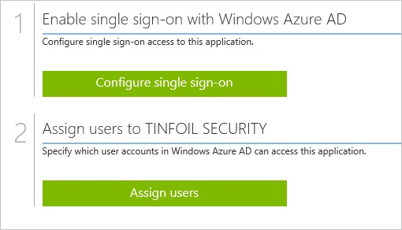
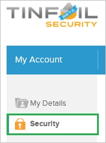
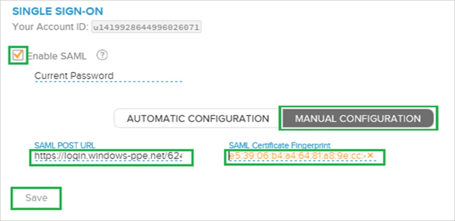

<properties 
    pageTitle="Tutorial: Azure Active Directory integration with Tinfoil Security | Microsoft Azure"
    description="Learn how to use Tinfoil Security with Azure Active Directory to enable single sign-on, automated provisioning, and more!." 
    services="active-directory" 
    authors="jeevansd"  
    documentationCenter="na" 
    manager="femila"/>
<tags 
    ms.service="active-directory" 
    ms.devlang="na" 
    ms.topic="article" 
    ms.tgt_pltfrm="na" 
    ms.workload="identity" 
    ms.date="06/21/2016" 
    ms.author="jeedes" />

#Tutorial: Azure Active Directory integration with Tinfoil Security
  
The objective of this tutorial is to show the integration of Azure and Tinfoil Security.  
The scenario outlined in this tutorial assumes that you already have the following items:

-   A valid Azure subscription
-   A Tinfoil Security single sign-on enabled subscription
  
After completing this tutorial, the Azure AD users you have assigned to Tinfoil Security will be able to single sign into the application at your Tinfoil Security company site (identity provider initiated sign on), or using the [Introduction to the Access Panel](active-directory-saas-access-panel-introduction.md).
  
The scenario outlined in this tutorial consists of the following building blocks:

1.  Enabling the application integration for Tinfoil Security
2.  Configuring single sign-on
3.  Configuring user provisioning
4.  Assigning users

##Enabling the application integration for Tinfoil Security
  
The objective of this section is to outline how to enable the application integration for Tinfoil Security.

###To enable the application integration for Tinfoil Security, perform the following steps:

1.  In the Azure classic portal, on the left navigation pane, click **Active Directory**.

    

2.  From the **Directory** list, select the directory for which you want to enable directory integration.

3.  To open the applications view, in the directory view, click **Applications** in the top menu.

    

4.  Click **Add** at the bottom of the page.

    

5.  On the **What do you want to do** dialog, click **Add an application from the gallery**.

    

6.  In the **search box**, type **Tinfoil Security**.

    

7.  In the results pane, select **Tinfoil Security**, and then click **Complete** to add the application.

    

##Configuring single sign-on
  
The objective of this section is to outline how to enable users to authenticate to Tinfoil Security with their account in Azure AD using federation based on the SAML protocol.  
Configuring single sign-on for Tinfoil Security requires you to retrieve a thumbprint value from a certificate.  
If you are not familiar with this procedure, see [How to retrieve a certificate's thumbprint value](http://youtu.be/YKQF266SAxI).

###To configure single sign-on, perform the following steps:

1.  In the Azure classic portal, on the **Tinfoil Security** application integration page, click **Configure single sign-on** to open the **Configure Single Sign On ** dialog.

    

2.  On the **How would you like users to sign on to Tinfoil Security** page, select **Microsoft Azure AD Single Sign-On**, and then click **Next**.

    

3.  On the **Configure App URL** page, in the **Tinfoil Security Reply URL** textbox, type your Tinfoil Security Assertion Consumer Service (ACS) URL (e.g.: "*https://www.tinfoilsecurity.com/saml/consume*", and then click **Next**.

    >[AZURE.NOTE] You should be able to get the ACS URL from Tinfoil Security Metadata (https://www.tinfoilsecurity.com/saml/metadata).

    

4.  On the **Configure single sign-on at Tinfoil Security** page, to download your certificate, click **Download certificate**, and then save the certificate file locally as **c:\\Tinfoil Security.cer**.

    

5.  In a different web browser window, log into your Tinfoil Security company site as an administrator.

6.  In the toolbar on the top, click **My Account**.

    

7.  Click **Security**.

    

8.  On the **Single Sign-On** configuration page, perform the following steps:

    

    1.  Select **Enable SAML**.
    2.  Click **Manual Configuration**.
    3.  In the Azure classic portal, on the **Configure single sign-on at Tinfoil Security** dialog page, copy the **SAML SSO URL** value, and then paste it into the **SAML Post URL** textbox.
    4.  Copy the **Thumbprint** value from the exported certificate, and then paste it into the **SAML Certificate Fingerprint** textbox.  

        >[AZURE.TIP] For more details, see [How to retrieve a certificate's thumbprint value](http://youtu.be/YKQF266SAxI)

    5.  Copy **Your Account ID**.
    6.  Click **Save**.

9.  On the Azure classic portal, select the single sign-on configuration confirmation, and then click **Complete** to close the **Configure Single Sign On** dialog.

    

10. In the menu on the top, click **Attributes** to open the **SAML Token Attributes** dialog.

    

11. To add the required attribute mappings, perform the following steps:

    

    1.  Click **add user attribute**.
    2.  In the **Attribute Name** textbox, type **accountid**.
    3.  In the **Attribute Value** textbox, paste the account ID value you have copied in the previous section.
    4.  Click **Complete**.

12. Click **Apply Changes**.

##Configuring user provisioning
  
In order to enable Azure AD users to log into Tinfoil Security, they must be provisioned into Tinfoil Security.  
In the case of Tinfoil Security, provisioning is a manual task.

###To get a user provisioned, perform the following steps:

1.  If the user is a part of an Enterprise account, you need to contact the Tinfoil Security support team to get the user account created.

2.  If the user is a regular Tinfoil Security SaaS user, then the user can add a collaborator to any of the user’s sites. This triggers a process to send an invitation to the specified email to create a new Tinfoil Security user account.

>[AZURE.NOTE] You can use any other Tinfoil Security user account creation tools or APIs provided by Tinfoil Security to provision AAD user accounts.

##Assigning users
  
To test your configuration, you need to grant the Azure AD users you want to allow using your application access to it by assigning them.

###To assign users to Tinfoil Security, perform the following steps:

1.  In the Azure classic portal, create a test account.

2.  On the **Tinfoil Security **application integration page, click **Assign users**.

    

3.  Select your test user, click **Assign**, and then click **Yes** to confirm your assignment.

    
  
If you want to test your single sign-on settings, open the Access Panel. For more details about the Access Panel, see [Introduction to the Access Panel](active-directory-saas-access-panel-introduction.md).