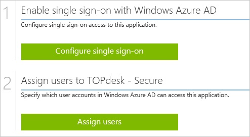
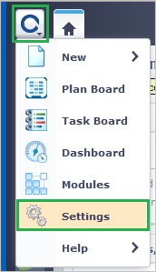
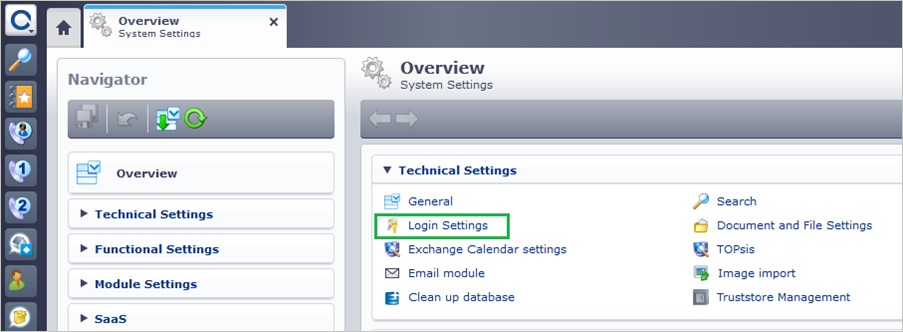
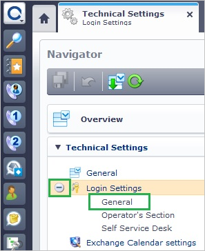
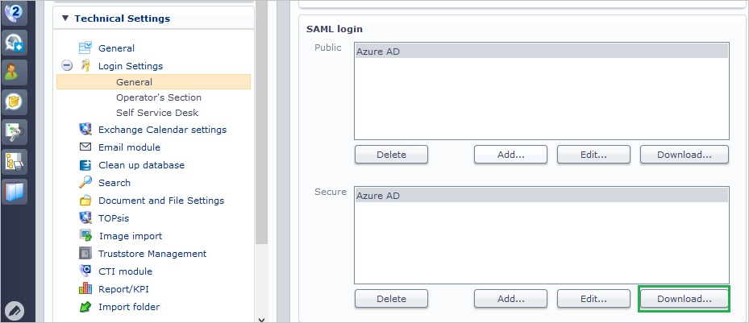
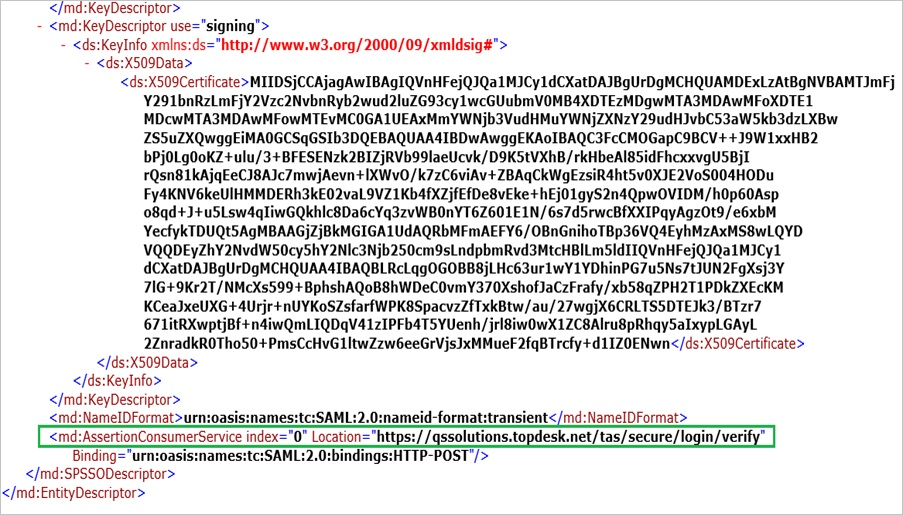
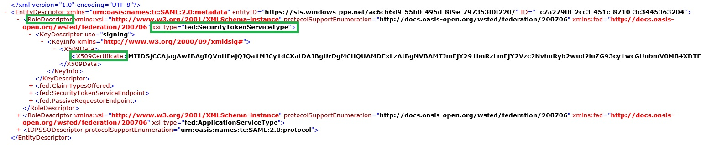
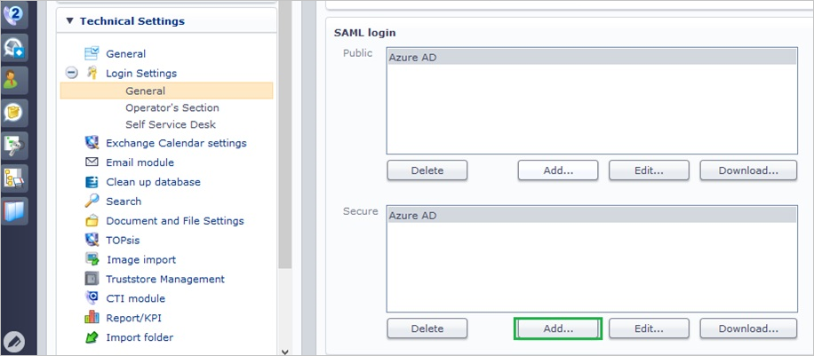
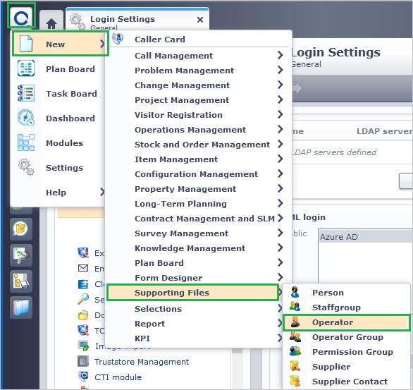
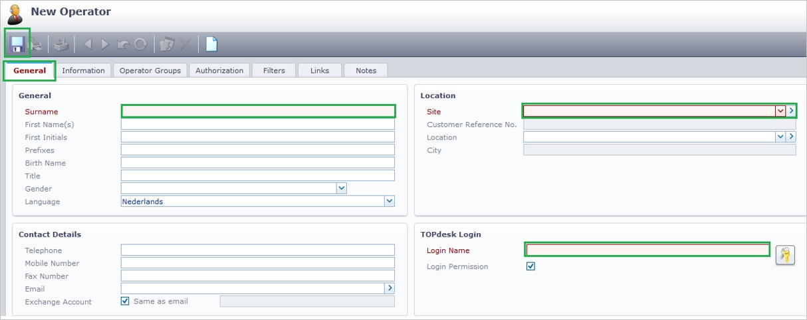

<properties 
    pageTitle="Tutorial: Azure Active Directory integration with TOPdesk - Secure | Microsoft Azure"
    description="Learn how to use TOPdesk - Secure with Azure Active Directory to enable single sign-on, automated provisioning, and more!." 
    services="active-directory" 
    authors="jeevansd"  
    documentationCenter="na" 
    manager="femila"/>
<tags 
    ms.service="active-directory" 
    ms.devlang="na" 
    ms.topic="article" 
    ms.tgt_pltfrm="na" 
    ms.workload="identity" 
    ms.date="06/21/2016" 
    ms.author="jeedes" />

#Tutorial: Azure Active Directory integration with TOPdesk - Secure
  
The objective of this tutorial is to show the integration of Azure and TOPdesk - Secure.  
The scenario outlined in this tutorial assumes that you already have the following items:

-   A valid Azure subscription
-   A TOPdesk - Secure single sign-on enabled subscription
  
After completing this tutorial, the Azure AD users you have assigned to TOPdesk - Secure will be able to single sign into the application at your TOPdesk - Secure company site (service provider initiated sign on), or using the [Introduction to the Access Panel](active-directory-saas-access-panel-introduction.md).
  
The scenario outlined in this tutorial consists of the following building blocks:

1.  Enabling the application integration for TOPdesk - Secure
2.  Configuring single sign-on
3.  Configuring user provisioning
4.  Assigning users

##Enabling the application integration for TOPdesk - Secure
  
The objective of this section is to outline how to enable the application integration for TOPdesk - Secure.

###To enable the application integration for TOPdesk - Secure, perform the following steps:

1.  In the Azure classic portal, on the left navigation pane, click **Active Directory**.

    

2.  From the **Directory** list, select the directory for which you want to enable directory integration.

3.  To open the applications view, in the directory view, click **Applications** in the top menu.

    

4.  Click **Add** at the bottom of the page.

    

5.  On the **What do you want to do** dialog, click **Add an application from the gallery**.

    

6.  In the **search box**, type **TOPdesk - Secure**.

    

7.  In the results pane, select **TOPdesk - Secure**, and then click **Complete** to add the application.

    

##Configuring single sign-on
  
The objective of this section is to outline how to enable users to authenticate to TOPdesk - Secure with their account in Azure AD using federation based on the SAML protocol.  
Configuring single sign-on for TOPdesk - Secure requires you to upload a logo icon file. To get the icon file, contact the TOPdesk support team.

###To configure single sign-on, perform the following steps:

1.  Sign on to your **TOPdesk - Secure** company site as an administrator.

2.  In the **TOPdesk** menu, click **Settings**.

    

3.  Click **Login Settings**.

    

4.  Expand the **Login Settings** menu, and then click **General**.

    

5.  In the **Secure** section of the **SAML login** configuration section, perform the following steps:

    

    1.  Click **Download** to download the public metadata file, and then save it locally on your computer.
    2.  Open the metadata file, and then locate the **AssertionConsumerService** node.
        
    3.  Copy the **AssertionConsumerService** value.  

        >[AZURE.NOTE] You will need the value in the **Configure App URL** section later in this tutorial.

6.  In a different web browser window, log into your **Azure classic portal** as an administrator.

7.  On the **TOPdesk - Secure** application integration page, click **Configure single sign-on** to open the **Configure Single Sign On ** dialog.

    

8.  On the **How would you like users to sign on to TOPdesk - Secure** page, select **Microsoft Azure AD Single Sign-On**, and then click **Next**.

    

9.  On the **Configure App URL** page, perform the following steps:

    

    1.  In the **TOPdesk - Secure Sign On URL** textbox, type the URL used by your users to sign into your TOPdesk - Secure application (e.g.: "*https://qssolutions.topdesk.net*").
    2.  In the **TOPdesk – Public Reply URL** textbox, paste the **TOPdesk - Secure AssertionConsumerService URL** (e.g.: "*https://qssolutions.topdesk.net/tas/public/login/saml*")
    3.  Click **Next**.

10. On the **Configure single sign-on at TOPdesk - Secure** page, to download your metadata file, click **Download metadata**, and then save the file locally on your computer.

    

11. To create a certificate file, perform the following steps:

    

    1.  Open the downloaded metadata file.
    2.  Expand the **RoleDescriptor** node that has a **xsi:type** of **fed:ApplicationServiceType**.
    3.  Copy the value of the **X509Certificate** node.
    4.  Save the copied **X509Certificate** value locally on your computer in a file.

12. On your TOPdesk - Secure company site, in the **TOPdesk** menu, click **Settings**.

    

13. Click **Login Settings**.

    

14. Expand the **Login Settings** menu, and then click **General**.

    

15. In the **Public** section, click **Add**.

    

16. On the **SAML configuration assistant** dialog page, perform the following steps:

    

    1.  To upload your downloaded metadata file, under **Federation Metadata**, click **Browse**.
    2.  To upload your certificate file, under **Certificate (RSA)**, click **Browse**.
    3.  To upload the logo file you got from the TOPdesk support team, under **Logo icon**, click **Browse**.
    4.  In the **User name attribute** textbox, type **http://schemas.xmlsoap.org/ws/2005/05/identity/claims/emailaddress**.
    5.  In the **Display name** textbox, type a name for your configuration.
    6.  Click **Save**.

17. On the Azure classic portal, select the single sign-on configuration confirmation, and then click **Complete** to close the **Configure Single Sign On** dialog.

    

##Configuring user provisioning
  
In order to enable Azure AD users to log into TOPdesk - Secure, they must be provisioned into TOPdesk - Secure.  
In the case of TOPdesk - Secure, provisioning is a manual task.

###To configure user provisioning, perform the following steps:

1.  Sign on to your **TOPdesk - Secure** company site as administrator.

2.  In the menu on the top, click **TOPdesk \> New \> Support Files \> Operator**.

    

3.  On the **New Operator** dialog, perform the following steps:

    

    1.  Click the General tab.
    2.  In the **Surname** textbox of the **General** section, type the last name of a valid Azure Active Directory account you want to provision.
    3.  Select a **Site** for the account in the **Location** section.
    4.  In the **Login Name** textbox of the **TOPdesk Login** section, type a login name for your user.
    5.  Click **Save**.

>[AZURE.NOTE] You can use any other TOPdesk - Secure user account creation tools or APIs provided by TOPdesk - Secure to provision AAD user accounts.

##Assigning users
  
To test your configuration, you need to grant the Azure AD users you want to allow using your application access to it by assigning them.

###To assign users to TOPdesk - Secure, perform the following steps:

1.  In the Azure classic portal, create a test account.

2.  On the **TOPdesk - Secure **application integration page, click **Assign users**.

    

3.  Select your test user, click **Assign**, and then click **Yes** to confirm your assignment.

    
  
If you want to test your single sign-on settings, open the Access Panel. For more details about the Access Panel, see [Introduction to the Access Panel](active-directory-saas-access-panel-introduction.md).