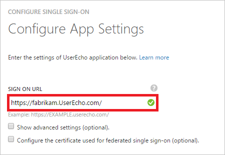
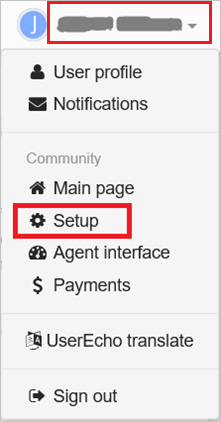
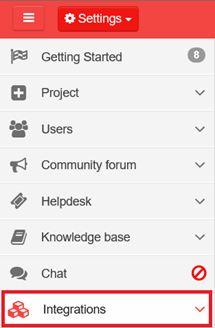
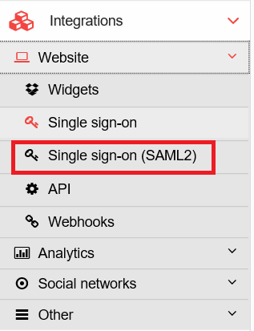
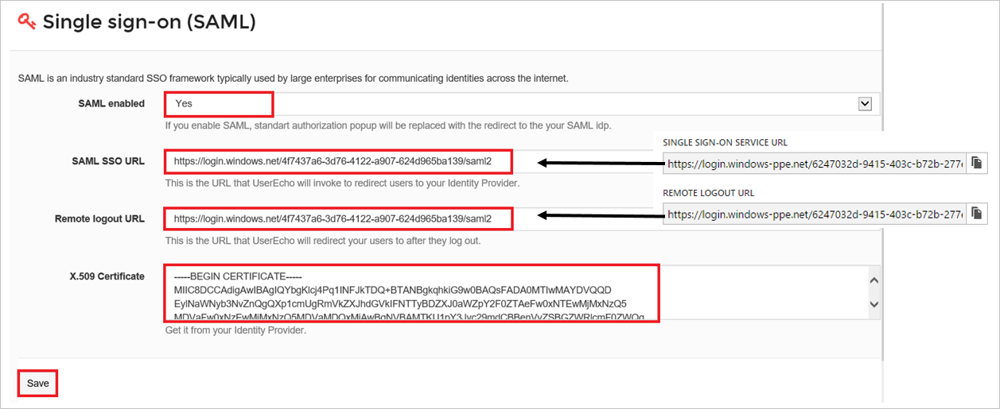
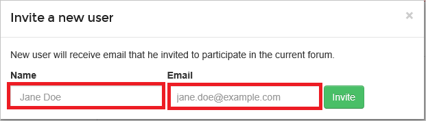
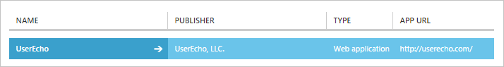

# Tutorial: Azure Active Directory integration with UserEcho
The objective of this tutorial is to show you how to integrate UserEcho with Azure Active Directory (Azure AD).

Integrating UserEcho with Azure AD provides you with the following benefits: 

* You can control in Azure AD who has access to UserEcho 
* You can enable your users to automatically get signed-on to UserEcho single sign-on (SSO) with their Azure AD accounts
* You can manage your accounts in one central location - the Azure classic portal

If you want to know more details about SaaS app integration with Azure AD, see [What is application access and single sign-on with Azure Active Directory](active-directory-appssoaccess-whatis.md).

## Prerequisites
To configure Azure AD integration with UserEcho, you need the following items:

* An Azure AD subscription
* A UserEcho SSO enabled subscription

>[!NOTE]
>To test the steps in this tutorial, we do not recommend using a production environment. 
> 

To test the steps in this tutorial, you should follow these recommendations:

* You should not use your production environment, unless this is necessary.
* If you don't have an Azure AD trial environment, you can get a [one-month trial](https://azure.microsoft.com/pricing/free-trial/). 

## Scenario Description
The objective of this tutorial is to enable you to test Azure AD SSO in a test environment.  

The scenario outlined in this tutorial consists of two main building blocks:

1. Adding UserEcho from the gallery 
2. Configuring and testing Azure AD SSO

## Add UserEcho from the gallery
To configure the integration of UserEcho into Azure AD, you need to add UserEcho from the gallery to your list of managed SaaS apps.

**To add UserEcho from the gallery, perform the following steps:**

1. In the **Azure classic portal**, on the left navigation pane, click **Active Directory**. 
   
    ![Active Directory][1]
2. From the **Directory** list, select the directory for which you want to enable directory integration.
3. To open the applications view, in the directory view, click **Applications** in the top menu.
   
    ![Applications][2]
4. Click **Add** at the bottom of the page.
   
    ![Applications][3]
5. On the **What do you want to do** dialog, click **Add an application from the gallery**.
   
    ![Applications][4]
6. In the search box, type **UserEcho**.
   
    
7. In the results pane, select **UserEcho**, and then click **Complete** to add the application.
   
    

## Configure and test Azure AD SSO
The objective of this section is to show you how to configure and test Azure AD SSO with UserEcho based on a test user called "Britta Simon".

For SSO to work, Azure AD needs to know what the counterpart user in UserEcho to an user in Azure AD is. In other words, a link relationship between an Azure AD user and the related user in UserEcho needs to be established.  

This link relationship is established by assigning the value of the **user name** in Azure AD as the value of the **Username** in UserEcho.

To configure and test Azure AD SSO with UserEcho, you need to complete the following building blocks:

1. **[Configuring Azure AD single sign-on](#configuring-azure-ad-single-single-sign-on)** - to enable your users to use this feature.
2. **[Creating an Azure AD test user](#creating-an-azure-ad-test-user)** - to test Azure AD single sign-on with Britta Simon.
3. **[Creating a UserEcho test user](#creating-a-userecho-test-user)** - to have a counterpart of Britta Simon in UserEcho that is linked to the Azure AD representation of her.
4. **[Assigning the Azure AD test user](#assigning-the-azure-ad-test-user)** - to enable Britta Simon to use Azure AD single sign-on.
5. **[Testing single sign-on](#testing-single-sign-on)** - to verify whether the configuration works.

### Configure Azure AD SSO
The objective of this section is to enable Azure AD SSO in the Azure classic portal and to configure SSO in your UserEcho application. 

**To configure Azure AD single sign-on with UserEcho, perform the following steps:**

1. In the Azure classic portal, on the **UserEcho** application integration page, click **Configure single sign-on** to open the **Configure Single Sign-On**  dialog.
   
    ![Configure Single Sign-On][6] 
2. On the **How would you like users to sign on to UserEcho** page, select **Azure AD Single Sign-On**, and then click **Next**.
   
     
3. On the **Configure App Settings** dialog page, perform the following steps:
   
     
  1. In the **Sign On URL** textbox, type the URL used by your users to sign on to your UserEcho application (e.g.: *https://fabrikam.UserEcho.com/*).
  2. Click **Next**.
4. On the **Configure single sign-on at UserEcho** page, perform the following steps:
   
     
  1. Click **Download certificate**, and then save the file on your computer.
  2. Click **Next**.
5. In another browser window, sign on to your UserEcho company site as an administrator.
6. In the toolbar on the top, click your user name to expand the menu, and then click **Setup**.
   
     
7. Click **Integrations**.
   
     
8. Click **Website**, and then click **Single sign-on (SAML2)**.
   
     
9. On the **Single sign-on (SAML)** page, perform the following steps:
   
     
  1. As **SAML-enabled**, select **Yes**. 
  2. In the Azure classic portal, on the Configure single sign-on at UserEcho dialog page, copy the **Single Sign-On Service URL** value, and then paste it in **SAML SSO URL** textbox.
  3. In the Azure classic portal, on the Configure single sign-on at UserEcho dialog page, copy the **Remote Logout URL** value, and then paste it into the **Remote logoout URL** textbox. 
  4. Open your downloaded certificate in Notepad, copy the content, and then paste it into the **X.509 Certificate** textbox.    
  5. Click **Save**.
10. In the Azure classic portal, select the single sign-on configuration confirmation, and then click **Next**. 
    
     ![Azure AD Single Sign-On][10]
11. On the **Single sign-on confirmation** page, click **Complete**.  
    
     ![Azure AD Single Sign-On][11]

### Create an Azure AD test user
The objective of this section is to create a test user in the Azure classic portal called Britta Simon.

![Create Azure AD User][20]

**To create a test user in Azure AD, perform the following steps:**

1. In the **Azure classic portal**, on the left navigation pane, click **Active Directory**.
   
      
2. From the **Directory** list, select the directory for which you want to enable directory integration.
3. To display the list of users, in the menu on the top, click **Users**.
   
     
4. To open the **Add User** dialog, in the toolbar on the bottom, click **Add User**. 
   
     
5. On the **Tell us about this user** dialog page, perform the following steps: 
   
      
  1. As Type Of User, select New user in your organization.
  2. In the User Name **textbox**, type **BrittaSimon**.
  3. Click **Next**.
6. On the **User Profile** dialog page, perform the following steps: 
   
    
  1. In the **First Name** textbox, type **Britta**.  
  2. In the **Last Name** textbox, type, **Simon**.
  3. In the **Display Name** textbox, type **Britta Simon**.
  4. In the **Role** list, select **User**.
  5. Click **Next**.
7. On the **Get temporary password** dialog page, click **create**.
   
     
8. On the **Get temporary password** dialog page, perform the following steps:
   
     
  1. Write down the value of the **New Password**.
  2. Click **Complete**.   

### Create a UserEcho test user
The objective of this section is to create a user called Britta Simon in UserEcho.

**To create a user called Britta Simon in UserEcho, perform the following steps:**

1. Sign-on to your UserEcho company site as an administrator.
2. In the toolbar on the top, click your user name to expand the menu, and then click **Setup**.
   
     
3. Click **Users**, to expand the **Users** section.
   
     
4. Click **Users**.
   
     
5. Click **Invite a new user**.
   
    
6. On the **Invite a new user** dialog, perform the following steps:
   
     
  1. In the **Name** textbox, type **Britta Simon**.
  2. In the **Email** textbox, type Britta's email address in the Azure classic portal.
  3. Click **Invite**.

An invitation is sent to Britta, which enables her to start using UserEcho. 

### Assign the Azure AD test user
The objective of this section is to enabling Britta Simon to use Azure SSO by granting her access to UserEcho.

![Assign User][200] 

**To assign Britta Simon to UserEcho, perform the following steps:**

1. On the Azure classic portal, to open the applications view, in the directory view, click **Applications** in the top menu.
   
    ![Assign User][201] 
2. In the applications list, select **UserEcho**.
   
     
3. In the menu on the top, click **Users**.
   
    ![Assign User][203] 
4. In the Users list, select **Britta Simon**.
5. In the toolbar on the bottom, click **Assign**.
   
    ![Assign User][205]

### Test single sign-on
The objective of this section is to test your Azure AD SSO configuration using the Access Panel.  

When you click the UserEcho tile in the Access Panel, you should get automatically signed-on to your UserEcho application.

## Additional Resources
* [List of Tutorials on How to Integrate SaaS Apps with Azure Active Directory](active-directory-saas-tutorial-list.md)
* [What is application access and single sign-on with Azure Active Directory?](active-directory-appssoaccess-whatis.md)

<!--Image references-->

[1]: ./media/active-directory-saas-userecho-tutorial/tutorial_general_01.png
[2]: ./media/active-directory-saas-userecho-tutorial/tutorial_general_02.png
[3]: ./media/active-directory-saas-userecho-tutorial/tutorial_general_03.png
[4]: ./media/active-directory-saas-userecho-tutorial/tutorial_general_04.png

[6]: ./media/active-directory-saas-userecho-tutorial/tutorial_general_05.png
[10]: ./media/active-directory-saas-userecho-tutorial/tutorial_general_06.png
[11]: ./media/active-directory-saas-userecho-tutorial/tutorial_general_07.png
[20]: ./media/active-directory-saas-userecho-tutorial/tutorial_general_100.png

[200]: ./media/active-directory-saas-userecho-tutorial/tutorial_general_200.png
[201]: ./media/active-directory-saas-userecho-tutorial/tutorial_general_201.png
[203]: ./media/active-directory-saas-userecho-tutorial/tutorial_general_203.png
[204]: ./media/active-directory-saas-userecho-tutorial/tutorial_general_204.png
[205]: ./media/active-directory-saas-userecho-tutorial/tutorial_general_205.png

