<properties 
    pageTitle="Tutorial: Azure Active Directory Integration with UserVoice | Microsoft Azure" 
    description="Learn how to use UserVoice with Azure Active Directory to enable single sign-on, automated provisioning, and more!." 
    services="active-directory" 
    authors="jeevansd"  
    documentationCenter="na" 
    manager="femila"/>
<tags 
    ms.service="active-directory" 
    ms.devlang="na" 
    ms.topic="article" 
    ms.tgt_pltfrm="na" 
    ms.workload="identity" 
    ms.date="06/21/2016" 
    ms.author="jeedes" />

#Tutorial: Azure Active Directory Integration with UserVoice
  
The objective of this tutorial is to show the integration of Azure and UserVoice.  
The scenario outlined in this tutorial assumes that you already have the following items:

-   A valid Azure subscription
-   A UserVoice tenant
  
After completing this tutorial, the Azure AD users you have assigned to UserVoice will be able to single sign into the application at your UserVoice company site (service provider initiated sign on), or using the [Introduction to the Access Panel](active-directory-saas-access-panel-introduction.md).
  
The scenario outlined in this tutorial consists of the following building blocks:

1.  Enabling the application integration for UserVoice
2.  Configuring single sign-on
3.  Configuring user provisioning
4.  Assigning users

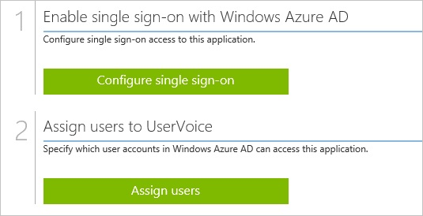

##Enabling the application integration for UserVoice
  
The objective of this section is to outline how to enable the application integration for UserVoice.

###To enable the application integration for UserVoice, perform the following steps:

1.  In the Azure classic portal, on the left navigation pane, click **Active Directory**.

    

2.  From the **Directory** list, select the directory for which you want to enable directory integration.

3.  To open the applications view, in the directory view, click **Applications** in the top menu.

    

4.  Click **Add** at the bottom of the page.

    

5.  On the **What do you want to do** dialog, click **Add an application from the gallery**.

    

6.  In the **search box**, type **UserVoice**.

    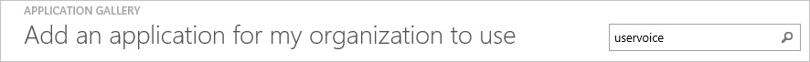

7.  In the results pane, select **UserVoice**, and then click **Complete** to add the application.

    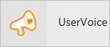

##Configuring single sign-on
  
The objective of this section is to outline how to enable users to authenticate to UserVoice with their account in Azure AD using federation based on the SAML protocol.  
Configuring single sign-on for UserVoice requires you to retrieve a thumbprint value from a certificate.  
If you are not familiar with this procedure, see [How to retrieve a certificate's thumbprint value](http://youtu.be/YKQF266SAxI).

###To configure single sign-on, perform the following steps:

1.  In the Azure classic portal, on the **UserVoice** application integration page, click **Configure single sign-on** to open the **Configure Single Sign On ** dialog.

    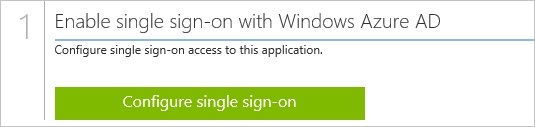

2.  On the **How would you like users to sign on to UserVoice** page, select **Microsoft Azure AD Single Sign-On**, and then click **Next**.

    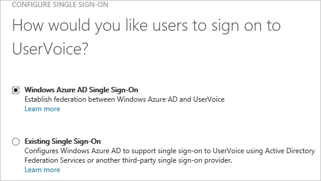

3.  On the **Configure App URL** page, in the **UserVoice Sign In URL** textbox, type your URL using the following pattern "*https://\<tenant-name\>.UserVoice.com*", and then click **Next**.

    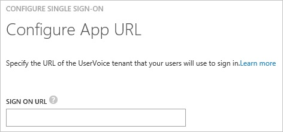

4.  On the **Configure single sign-on at UserVoice** page, to download your certificate, click **Download certificate**, and then save the certificate file locally as **c:\\UserVoice.cer**.

    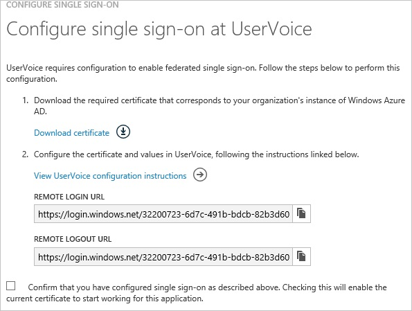

5.  In a different web browser window, log into your UserVoice company site as an administrator.

6.  In the toolbar on the top, click Settings, and then select Web portal from the menu.

    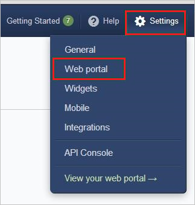

7.  On the **Web portal** tab, in the **User authentication** section, click **Edit** to open the **Edit User Authentication** dialog page

    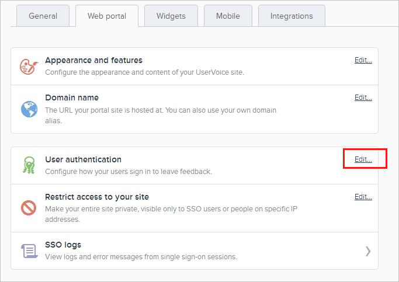

8.  On the **Edit User Authentication** dialog page, perform the following steps:

    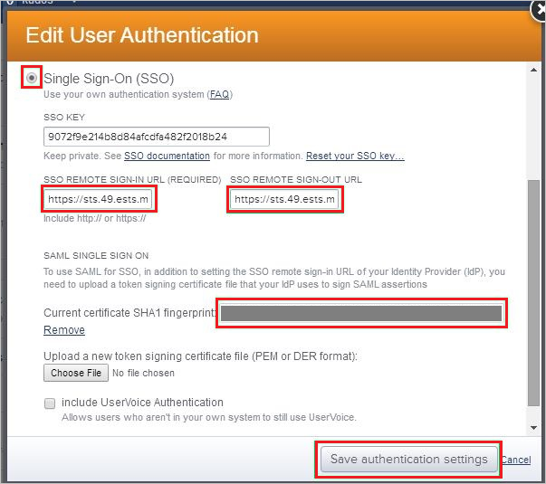

    1.  Click **Single Sign-On (SSO)**.
    2.  In the Azure classic portal, on the **Configure single sign-on at UserVoice** dialog page, copy the **Remote Login URL** value, and then paste it into the **SSO Remote Sign-In** textbox.
    3.  In the Azure classic portal, on the **Configure single sign-on at UserVoice** dialog page, copy the **Remote Logout URL** value, and then paste it into the **SSO Remote Sign-Out textbox**.
    4.  Copy the **Thumbprint** value from the exported certificate, and then paste it into the **Current certificate SHA1 fingerprint** textbox.  

        >[AZURE.TIP] For more details, see [How to retrieve a certificate's thumbprint value](http://youtu.be/YKQF266SAxI)

    5.  Click **Save authentication settings**.

9.  On the Azure classic portal, select the single sign-on configuration confirmation, and then click **Complete** to close the **Configure Single Sign On** dialog.

    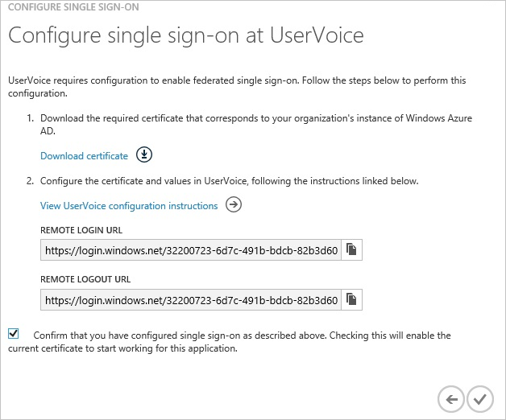

##Configuring user provisioning
  
In order to enable Azure AD users to log into UserVoice, they must be provisioned into UserVoice.  
In the case of UserVoice, provisioning is a manual task.

###To provision a user accounts, perform the following steps:

1.  Log in to your **UserVoice** tenant.

2.  Go to **Settings**.

    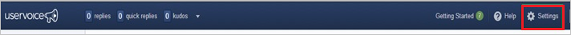

3.  Click **General**.

4.  Click **Agents and permissions**.

    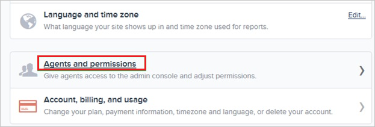

5.  Click **Add admins**.

    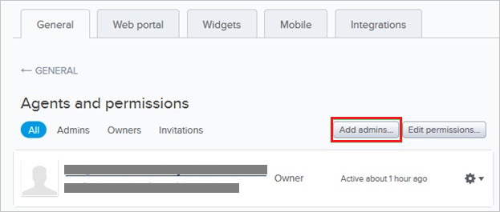

6.  On the **Invite admins** dialog, perform the following steps:

    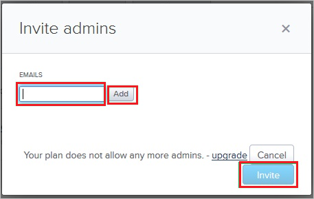

    1.  In the Emails texbox, type the email address of the account you want to provision, and then click **Add**.
    2.  Click **Invite**.

>[AZURE.NOTE] You can use any other UserVoice user account creation tools or APIs provided by UserVoice to provision AAD user accounts.

##Assigning users
  
To test your configuration, you need to grant the Azure AD users you want to allow using your application access to it by assigning them.

###To assign users to UserVoice, perform the following steps:

1.  In the Azure classic portal, create a test account.

2.  On the **UserVoice **application integration page, click **Assign users**.

    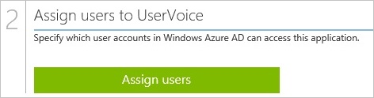

3.  Select your test user, click **Assign**, and then click **Yes** to confirm your assignment.

    
  
If you want to test your single sign-on settings, open the Access Panel. For more details about the Access Panel, see [Introduction to the Access Panel](active-directory-saas-access-panel-introduction.md).