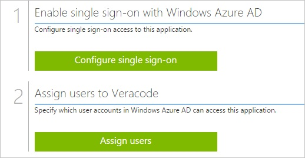
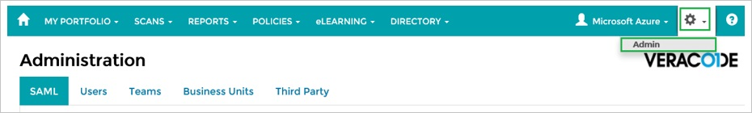
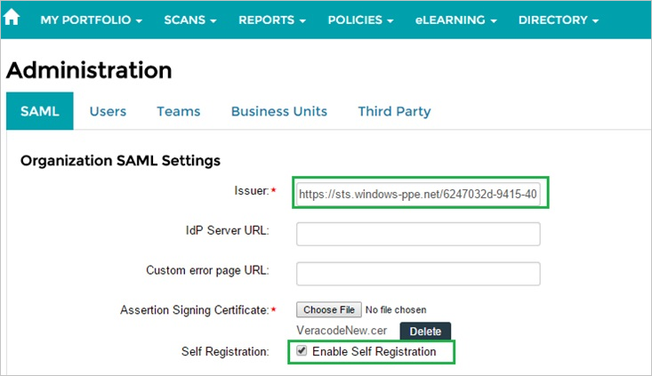
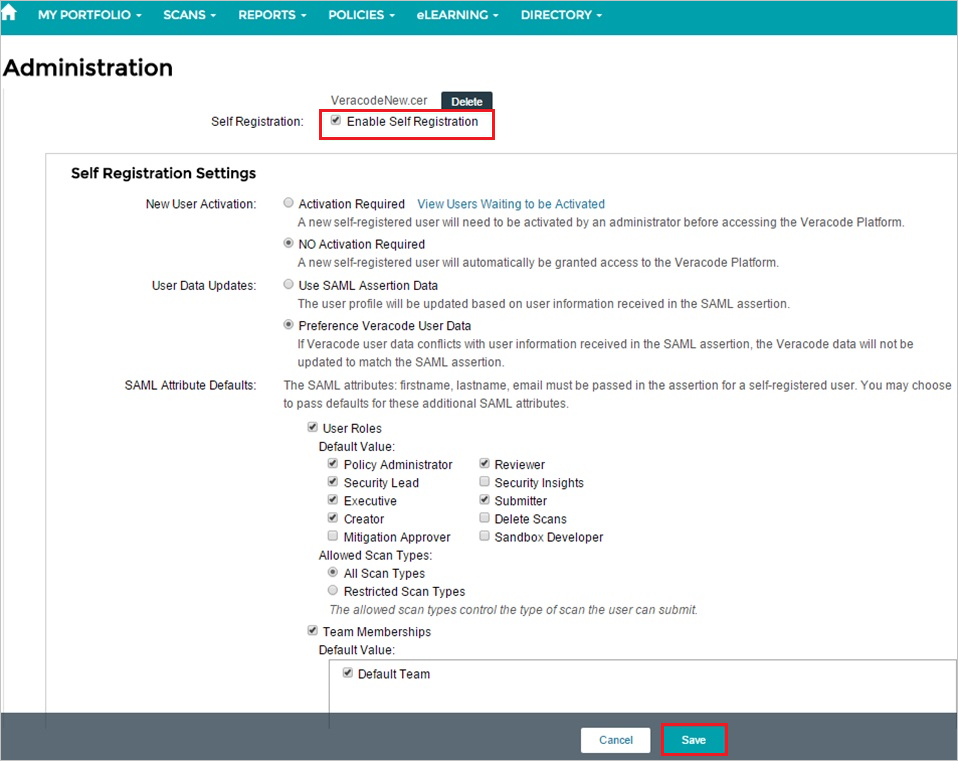
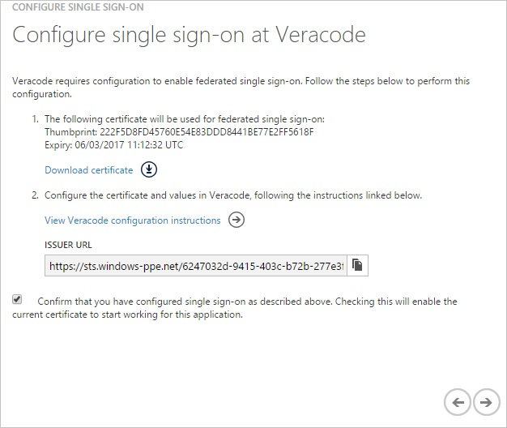

<properties 
    pageTitle="Tutorial: Azure Active Directory integration with Veracode | Microsoft Azure" 
    description="Learn how to use Veracode with Azure Active Directory to enable single sign-on, automated provisioning, and more!" 
    services="active-directory" 
    authors="jeevansd"  
    documentationCenter="na" 
    manager="femila"/>
<tags 
    ms.service="active-directory" 
    ms.devlang="na" 
    ms.topic="article" 
    ms.tgt_pltfrm="na" 
    ms.workload="identity" 
    ms.date="06/21/2016" 
    ms.author="jeedes" />

#Tutorial: Azure Active Directory integration with Veracode
  
The objective of this tutorial is to show the integration of Azure and Veracode. The scenario outlined in this tutorial assumes that you already have the following items:

-   A valid Azure subscription
-   A Veracode single sign-on enabled subscription
  
After completing this tutorial, the Azure AD users you have assigned to Veracode will be able to single sign into the application using the [Introduction to the Access Panel](active-directory-saas-access-panel-introduction.md).
  
The scenario outlined in this tutorial consists of the following building blocks:

1.  Enabling the application integration for Veracode
2.  Configuring single sign-on
3.  Configuring user provisioning
4.  Assigning users

##Enabling the application integration for Veracode
  
The objective of this section is to outline how to enable the application integration for Veracode.

###To enable the application integration for Veracode, perform the following steps:

1.  In the Azure classic portal, on the left navigation pane, click **Active Directory**.

    

2.  From the **Directory** list, select the directory for which you want to enable directory integration.

3.  To open the applications view, in the directory view, click **Applications** in the top menu.

    

4.  Click **Add** at the bottom of the page.

    

5.  On the **What do you want to do** dialog, click **Add an application from the gallery**.

    

6.  In the **search box**, type **Veracode**.

    

7.  In the results pane, select **Veracode**, and then click **Complete** to add the application.

    

##Configuring single sign-on
  
The objective of this section is to outline how to enable users to authenticate to Veracode with their account in Azure AD using federation based on the SAML protocol.  
Your Veracode application expects the SAML assertions in a specific format, which requires you to add custom attribute mappings to your **saml token attributes** configuration.  
The following screenshot shows an example for this.

###To configure single sign-on, perform the following steps:

1.  In the Azure classic portal, on the **Veracode** application integration page, click **Configure single sign-on** to open the **Configure Single Sign On ** dialog.

    

2.  On the **How would you like users to sign on to Veracode** page, select **Microsoft Azure AD Single Sign-On**, and then click **Next**.

    

3.  On the **Configure App Settings** page, click **Next**.

    

4.  On the **Configure single sign-on at Veracode** page, to download your certificate, click **Download certificate**, and then save the certificate file locally on your computer.

    

5.  In a different web browser window, log into your Veracode company site as an administrator.

6.  In the menu on the top, click **Settings**, and then click **Admin**.

    

7.  Click the **SAML** tab.

8.  In the **Organization SAML Settings** section, perform the following steps:

    

    1.  In the Azure classic portal, on the **Configure single sign-on at Veracode** dialog page, copy the **Issuer URL** value, and then paste it into the **Issuer** textbox
    2.  To upload your downloaded certificate, click **Choose File**.
    3.  Select **Enable Self Registration**.

9.  In the **Self Registration Settings** section, perform the following steps, and then click **Save**:

    

    1.  As **New User Activation**, select **No Activation Required**.
    2.  As **User Data Updates**, select **Preference Veracode User Data**.
    3.  For **SAML Attribute Details**, select the following:
        -   **User Roles**
        -   **Policy Administrator**
        -   **Reviewer**
        -   **Security Lead**
        -   **Executive**
        -   **Submitter**
        -   **Creator**
        -   **All Scan Types**
        -   **Team Memberships**
        -   **Default Team**

10. On the Azure classic portal, select the single sign-on configuration confirmation, and then click **Complete** to close the **Configure Single Sign On** dialog.

    

11. In the menu on the top, click **Attributes** to open the **SAML Token Attributes** dialog.

    

12. To add the required attribute mappings, perform the following steps:

    

	| Attribute Name | Attribute Value |
	|:---------------|:----------------|
	| firstname      | User.givenname  |
	| lastname       | User.surname    |
	| email          | User.mail       |

    1.  For each data row in the table above, click **add user attribute**.
    
	2.  In the **Attribute Name** textbox, type the attribute name shown for that row.

    3.  In the **Attribute Value** textbox, select the attribute value shown for that row.

    4.  Click **Complete**.

13. Click **Apply Changes**.

##Configuring user provisioning
  
In order to enable Azure AD users to log into Veracode, they must be provisioned into Veracode.  
In the case of Veracode, provisioning is an automated task.  
There is no action item for you..
  
Users are automatically created if necessary during the first single sign-on attempt.

>[AZURE.NOTE] You can use any other Veracode user account creation tools or APIs provided by Veracode to provision AAD user accounts.

##Assigning users
  
To test your configuration, you need to grant the Azure AD users you want to allow using your application access to it by assigning them.

###To assign users to Veracode, perform the following steps:

1.  In the Azure classic portal, create a test account.

2.  On the **Veracode **application integration page, click **Assign users**.

    

3.  Select your test user, click **Assign**, and then click **Yes** to confirm your assignment.

    
  
If you want to test your single sign-on settings, open the Access Panel. For more details about the Access Panel, see [Introduction to the Access Panel](active-directory-saas-access-panel-introduction.md).