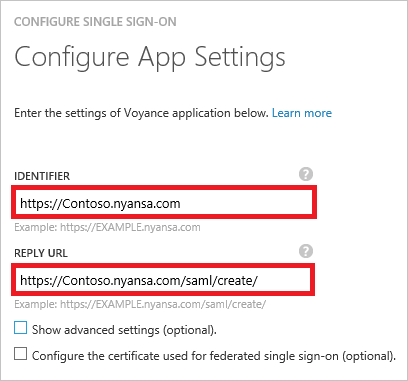
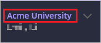
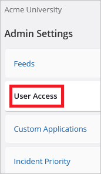
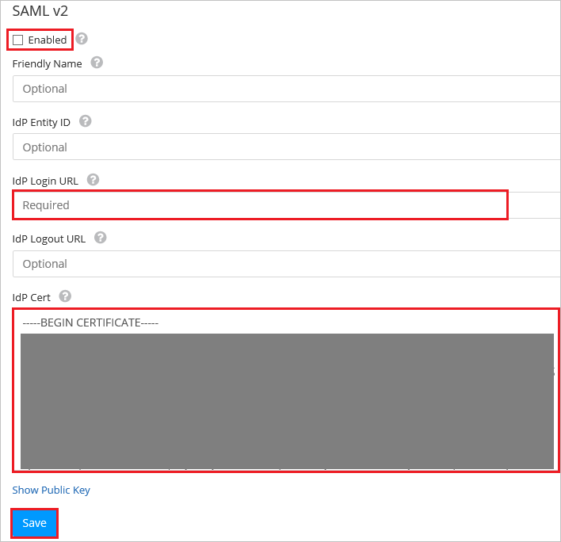
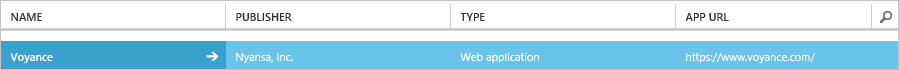

# Tutorial: Azure Active Directory integration with Voyance

In this tutorial, you learn how to integrate Voyance with Azure Active Directory (Azure AD).

Integrating Voyance with Azure AD provides you with the following benefits:

- You can control in Azure AD who has access to Voyance
- You can enable your users to automatically get signed-on to Voyance single sign-on (SSO) with their Azure AD accounts
- You can manage your accounts in one central location - the Azure classic portal

If you want to know more details about SaaS app integration with Azure AD, see [What is application access and single sign-on with Azure Active Directory](active-directory-appssoaccess-whatis.md).

## Prerequisites

To configure Azure AD integration with Voyance, you need the following items:

- An Azure AD subscription
- A Voyance SSO enabled subscription

>[!NOTE]
>To test the steps in this tutorial, we do not recommend using a production environment.
>

To test the steps in this tutorial, you should follow these recommendations:

- You should not use your production environment, unless this is necessary.
- If you don't have an Azure AD trial environment, you can get a [one-month trial](https://azure.microsoft.com/pricing/free-trial/).

## Scenario description
In this tutorial, you test Azure AD single sign-on in a test environment. 
The scenario outlined in this tutorial consists of two main building blocks:

1. Adding Voyance from the gallery
2. Configuring and testing Azure AD SSO

## Add Voyance from the gallery
To configure the integration of Voyance into Azure AD, you need to add Voyance from the gallery to your list of managed SaaS apps.

**To add Voyance from the gallery, perform the following steps:**

1. In the **Azure classic portal**, on the left navigation pane, click **Active Directory**. 

	![Active Directory][1]

2. From the **Directory** list, select the directory for which you want to enable directory integration.

3. To open the applications view, in the directory view, click **Applications** in the top menu.

	![Applications][2]

4. Click **Add** at the bottom of the page.

	![Applications][3]

5. On the **What do you want to do** dialog, click **Add an application from the gallery**.

	![Applications][4]

6. In the search box, type **Voyance**.

	

7. In the results pane, select **Voyance**, and then click **Complete** to add the application.

	

## Configure and test Azure AD single sign-on
In this section, you configure and test Azure AD SSO with Voyance based on a test user called "Britta Simon".

For SSO to work, Azure AD needs to know what the counterpart user in Voyance is to a user in Azure AD. In other words, a link relationship between an Azure AD user and the related user in Voyance needs to be established.

This link relationship is established by assigning the value of the **user name** in Azure AD as the value of the **Username** in Voyance.

To configure and test Azure AD single sign-on with Voyance, you need to complete the following building blocks:

1. **[Configuring Azure AD single sign-on](#configuring-azure-ad-single-sign-on)** - to enable your users to use this feature.
2. **[Creating an Azure AD test user](#creating-an-azure-ad-test-user)** - to test Azure AD single sign-on with Britta Simon.
3. **[Creating a Voyance test user](#creating-a-voyance-test-user)** - to have a counterpart of Britta Simon in Voyance that is linked to the Azure AD representation of her.
4. **[Assigning the Azure AD test user](#assigning-the-azure-ad-test-user)** - to enable Britta Simon to use Azure AD single sign-on.
5. **[Testing single sign-on](#testing-single-sign-on)** - to verify whether the configuration works.

### Configure Azure AD single sign-on

In this section, you enable Azure AD single sign-on in the classic portal and configure single sign-on in your Voyance application.

**To configure Azure AD single sign-on with Voyance, perform the following steps:**

1. In the classic portal, on the **Voyance** application integration page, click **Configure single sign-on** to open the **Configure Single Sign-On** dialog.

	![Configure Single Sign-On][6]

2. On the **How would you like users to sign on to Voyance** page, select **Azure AD Single Sign-On**, and then click **Next**.
 
	

3. On the **Configure App Settings** dialog page, If you wish to configure the application in **IDP initiated mode**, perform the following steps and click **Next**:

    
  1. In the **Identifier** textbox, type a URL using the following pattern: `https://<company name>.nyansa.com`.
  2. In the **Reply URL** textbox, type a URL using the following pattern: `https://<company name>.nyansa.com/saml/create/`.
  3. Click **Next**.

4. If you wish to configure the application in **SP initiated mode** on the **Configure App Settings** dialog page, then click on the **“Show advanced settings (optional)”** and then enter the **Sign On URL** and click **Next**.

	
  1. In the **Sign On URL** textbox, type a URL using the following pattern: `https://<company name>.nyansa.com/`.
  2. Click **Next**.

	  >[!NOTE]
	  >You have to update these values with the actual Sign On URL, Identifier and Reply URL. To get these values, contact [Voyance support team](emaiLto:support@nyansa.com).
	  >

5. On the **Configure single sign-on at Voyance** page, click **Download certificate** and then save the file on your computer:

	 

6. In a different web browser window, sign-on to your Voyance tenant as an administrator.

7. Go to the top right corner of the navigation bar and click on the drop down that says "**Acme University**".
	
	 

8. Click "**Admin Settings**".

	

9. Click "**User Access**" tab.

	

10. Click the "**SSO is disabled**" button to configure Azure AD as an IdP using SAML 2.0.

	

11. Go to **SAML v2** section and perform below steps:

	
 1. Select **Enabled**.
 2. In the **IdP Login URL** textbox put the value of **SAML SSO URL** from Azure AD application configuration wizard.
 3. Open your Base64 encoded certificate in notepad, copy the content of it into your clipboard, and then paste it to the **IdP Cert** textbox.
 4. Click **Save**.

12. In the classic portal, select the single sign-on configuration confirmation, and then click **Next**.

	![Azure AD Single Sign-On][10]

13. On the **Single sign-on confirmation** page, click **Complete**.  
  
	![Azure AD Single Sign-On][11]

### Create an Azure AD test user
The objective of this section is to create a test user in the classic portal called Britta Simon.

![Create Azure AD User][20]

**To create a test user in Azure AD, perform the following steps:**

1. In the **Azure classic portal**, on the left navigation pane, click **Active Directory**.

	 

2. From the **Directory** list, select the directory for which you want to enable directory integration.

3. To display the list of users, in the menu on the top, click **Users**.

	 

4. To open the **Add User** dialog, in the toolbar on the bottom, click **Add User**.
 
	 

5. On the **Tell us about this user** dialog page, perform the following steps:
 
	 
 1. As Type Of User, select New user in your organization.
 2. In the User Name **textbox**, type **BrittaSimon**.
 3. Click **Next**.

6.  On the **User Profile** dialog page, perform the following steps:

	 
 1. In the **First Name** textbox, type **Britta**.  
 2. In the **Last Name** textbox, type, **Simon**.
 3. In the **Display Name** textbox, type **Britta Simon**.
 4. In the **Role** list, select **User**.
 5. Click **Next**.

7. On the **Get temporary password** dialog page, click **create**.

	 

8. On the **Get temporary password** dialog page, perform the following steps:

	 
 1. Write down the value of the **New Password**.
 2. Click **Complete**.   

### Create a Voyance test user

The objective of this section is to create a user called Britta Simon in Voyance. Voyance supports just-in-time provisioning, which is by default enabled.

There is no action item for you in this section. A new user will be created during an attempt to access Voyance if it doesn't exist yet.

>[!NOTE]
>If you need to create an user manually, you need to contact [Voyance support team](emaiLto:support@nyansa.com).
>

### Assign the Azure AD test user

In this section, you enable Britta Simon to use Azure single sign-on by granting her access to Voyance.

![Assign User][200] 

**To assign Britta Simon to Voyance, perform the following steps:**

1. On the classic portal, to open the applications view, in the directory view, click **Applications** in the top menu.

	![Assign User][201] 

2. In the applications list, select **Voyance**.

	 

3. In the menu on the top, click **Users**.

	![Assign User][203] 

4. In the Users list, select **Britta Simon**.

5. In the toolbar on the bottom, click **Assign**.
	
	![Assign User][205]

### Test single sign-on

In this section, you test your Azure AD single sign-on configuration using the Access Panel.

When you click the Voyance tile in the Access Panel, you should get automatically signed-on to your Voyance application.

## Additional resources

* [List of Tutorials on How to Integrate SaaS Apps with Azure Active Directory](active-directory-saas-tutorial-list.md)
* [What is application access and single sign-on with Azure Active Directory?](active-directory-appssoaccess-whatis.md)

<!--Image references-->

[1]: ./media/active-directory-saas-voyance-tutorial/tutorial_general_01.png
[2]: ./media/active-directory-saas-voyance-tutorial/tutorial_general_02.png
[3]: ./media/active-directory-saas-voyance-tutorial/tutorial_general_03.png
[4]: ./media/active-directory-saas-voyance-tutorial/tutorial_general_04.png

[6]: ./media/active-directory-saas-voyance-tutorial/tutorial_general_05.png
[10]: ./media/active-directory-saas-voyance-tutorial/tutorial_general_06.png
[11]: ./media/active-directory-saas-voyance-tutorial/tutorial_general_07.png
[20]: ./media/active-directory-saas-voyance-tutorial/tutorial_general_100.png

[200]: ./media/active-directory-saas-voyance-tutorial/tutorial_general_200.png
[201]: ./media/active-directory-saas-voyance-tutorial/tutorial_general_201.png
[203]: ./media/active-directory-saas-voyance-tutorial/tutorial_general_203.png
[204]: ./media/active-directory-saas-voyance-tutorial/tutorial_general_204.png
[205]: ./media/active-directory-saas-voyance-tutorial/tutorial_general_205.png
