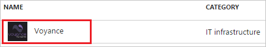
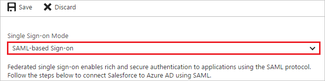
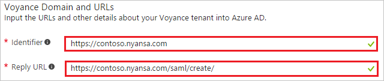
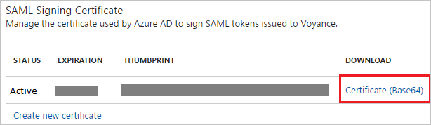

# Tutorial: Azure Active Directory integration with Voyance

In this tutorial, you learn how to integrate Voyance with Azure Active Directory (Azure AD).

Integrating Voyance with Azure AD provides you with the following benefits:

- You can control in Azure AD who has access to Voyance
- You can enable your users to automatically get signed-on to Voyance (Single Sign-On) with their Azure AD accounts
- You can manage your accounts in one central location - the Azure portal

If you want to know more details about SaaS app integration with Azure AD, see [what is application access and single sign-on with Azure Active Directory](active-directory-appssoaccess-whatis.md).

## Prerequisites

To configure Azure AD integration with Voyance, you need the following items:

- An Azure AD subscription
- A Voyance single sign-on enabled subscription

> [!NOTE]
> To test the steps in this tutorial, we do not recommend using a production environment.

To test the steps in this tutorial, you should follow these recommendations:

- Do not use your production environment, unless it is necessary.
- If you don't have an Azure AD trial environment, you can [get a one-month trial](https://azure.microsoft.com/pricing/free-trial/).

## Scenario description
In this tutorial, you test Azure AD single sign-on in a test environment. 
The scenario outlined in this tutorial consists of two main building blocks:

1. Adding Voyance from the gallery
2. Configuring and testing Azure AD single sign-on

## Adding Voyance from the gallery
To configure the integration of Voyance into Azure AD, you need to add Voyance from the gallery to your list of managed SaaS apps.

**To add Voyance from the gallery, perform the following steps:**

1. In the **[Azure portal](https://portal.azure.com)**, on the left navigation panel, click **Azure Active Directory** icon. 

	![The Azure Active Directory button][1]

2. Navigate to **Enterprise applications**. Then go to **All applications**.

	![The Enterprise applications blade][2]
	
3. To add new application, click **New application** button on the top of dialog.

	![The New application button][3]

4. In the search box, type **Voyance**, select  **Voyance**  from result panel then click **Add** button to add the application.

	

## Configure and test Azure AD single sign-on

In this section, you configure and test Azure AD single sign-on with Voyance based on a test user called "Britta Simon".

For single sign-on to work, Azure AD needs to know what the counterpart user in Voyance is to a user in Azure AD. In other words, a link relationship between an Azure AD user and the related user in Voyance needs to be established.

In Voyance, assign the value of the **user name** in Azure AD as the value of the **Username** to establish the link relationship.

To configure and test Azure AD single sign-on with Voyance, you need to complete the following building blocks:

1. **[Configure Azure AD Single Sign-On](#configure-azure-ad-single-sign-on)** - to enable your users to use this feature.
2. **[Create an Azure AD test user](#create-an-azure-ad-test-user)** - to test Azure AD single sign-on with Britta Simon.
3. **[Create a Voyance test user](#create-a-voyance-test-user)** - to have a counterpart of Britta Simon in Voyance that is linked to the Azure AD representation of user.
4. **[Assign the Azure AD test user](#assign-the-azure-ad-test-user)** - to enable Britta Simon to use Azure AD single sign-on.
5. **[Test Single Sign-On](#test-single-sign-on)** - to verify whether the configuration works.

### Configure Azure AD single sign-on

In this section, you enable Azure AD single sign-on in the Azure portal and configure single sign-on in your Voyance application.

**To configure Azure AD single sign-on with Voyance, perform the following steps:**

1. In the Azure portal, on the **Voyance** application integration page, click **Single sign-on**.

	![Configure single sign-on link][4]

2. On the **Single sign-on** dialog, select **Mode** as	**SAML-based Sign-on** to enable single sign-on.
 
	

3. On the **Voyance Domain and URLs** section, perform the following steps if you wish to configure the application in **IDP** initiated mode:

	

    a. In the **Identifier** textbox, type a URL using the following pattern: `https://<companyname>.nyansa.com`

	b. In the **Reply URL** textbox, type a URL using the following pattern: `https://<companyname>.nyansa.com/saml/create/`

4. Check **Show advanced URL settings** and perform the following step if you wish to configure the application in **SP** initiated mode:

	

    In the **Sign-on URL** textbox, type a URL using the following pattern: `https://<companyname>.nyansa.com/`
	 
	> [!NOTE] 
	> These values are not real. Update these values with the actual Identifier, Reply URL, and Sign-On URL. Contact [Voyance Client support team](mailto:support@nyansa.com) to get these values. 

5. On the **SAML Signing Certificate** section, click **Certificate(Base64)** and then save the certificate file on your computer.

	 

6. Click **Save** button.

	
	
7. On the **Voyance Configuration** section, click **Configure Voyance** to open **Configure sign-on** window. Copy the **SAML Single Sign-On Service URL** from the **Quick Reference section.**

	 

8. In a different web browser window, sign-on to your Voyance tenant as an administrator.

9. Go to the top right corner of the navigation bar and click on the drop-down that says "**Acme University**".
	
	 

10. Click "**Admin Settings**".

	

11. Click "**User Access**" tab.

	

12. Click the "**SSO is disabled**" button to configure Azure AD as an IdP using SAML 2.0.

	

13. Go to **SAML v2** section and perform below steps:

	
	
	a. Select **Enabled**.
	
	b. Paste **SAML Single Sign-On Service URL**, which you have copied from the Azure portal Into the **IdP Login URL** textbox.

	c. Open your downloaded Base64 encoded certificate in notepad, copy the content of it into your clipboard, and then paste it to the **IdP Cert** textbox.
	
	d. Click **Save**.

> [!TIP]
> You can now read a concise version of these instructions inside the [Azure portal](https://portal.azure.com), while you are setting up the app!  After adding this app from the **Active Directory > Enterprise Applications** section, simply click the **Single Sign-On** tab and access the embedded documentation through the **Configuration** section at the bottom. You can read more about the embedded documentation feature here: [Azure AD embedded documentation]( https://go.microsoft.com/fwlink/?linkid=845985)

### Create an Azure AD test user

The objective of this section is to create a test user in the Azure portal called Britta Simon.

![Create an Azure AD test user][100]

**To create a test user in Azure AD, perform the following steps:**

1. In the **Azure portal**, on the left navigation pane, click **Azure Active Directory** icon.

	 

2. To display the list of users, go to **Users and groups** and click **All users**.
	
	 

3. To open the **User** dialog, click **Add** on the top of the dialog.
 
	 

4. On the **User** dialog page, perform the following steps:
 
	 

    a. In the **Name** textbox, type **BrittaSimon**.

    b. In the **User name** textbox, type the **email address** of BrittaSimon.

	c. Select **Show Password** and write down the value of the **Password**.

    d. Click **Create**.
 
### Create a Voyance test user

The objective of this section is to create a user called Britta Simon in Voyance. Voyance supports just-in-time provisioning, which is by default enabled. There is no action item for you in this section. A new user is created during an attempt to access Voyance if it doesn't exist yet.

>[!NOTE]
>If you need to create a user manually, you need to contact [Voyance support team](maiLto:support@nyansa.com).

### Assign the Azure AD test user

In this section, you enable Britta Simon to use Azure single sign-on by granting access to Voyance.

![Assign the user role][200]

**To assign Britta Simon to Voyance, perform the following steps:**

1. In the Azure portal, open the applications view, and then navigate to the directory view and go to **Enterprise applications** then click **All applications**.

	![Assign User][201] 

2. In the applications list, select **Voyance**.

	 

3. In the menu on the left, click **Users and groups**.

	![The "Users and groups" link][202]

4. Click **Add** button. Then select **Users and groups** on **Add Assignment** dialog.

	![The Add Assignment pane][203]

5. On **Users and groups** dialog, select **Britta Simon** in the Users list.

6. Click **Select** button on **Users and groups** dialog.

7. Click **Assign** button on **Add Assignment** dialog.
	
### Test single sign-on

In this section, you test your Azure AD single sign-on configuration using the Access Panel.

When you click the Voyance tile in the Access Panel, you should get automatically signed-on to your Voyance application.

## Additional resources

* [List of Tutorials on How to Integrate SaaS Apps with Azure Active Directory](active-directory-saas-tutorial-list.md)
* [What is application access and single sign-on with Azure Active Directory?](active-directory-appssoaccess-whatis.md)

<!--Image references-->

[1]: ./media/active-directory-saas-voyance-tutorial/tutorial_general_01.png
[2]: ./media/active-directory-saas-voyance-tutorial/tutorial_general_02.png
[3]: ./media/active-directory-saas-voyance-tutorial/tutorial_general_03.png
[4]: ./media/active-directory-saas-voyance-tutorial/tutorial_general_04.png

[100]: ./media/active-directory-saas-voyance-tutorial/tutorial_general_100.png

[200]: ./media/active-directory-saas-voyance-tutorial/tutorial_general_200.png
[201]: ./media/active-directory-saas-voyance-tutorial/tutorial_general_201.png
[202]: ./media/active-directory-saas-voyance-tutorial/tutorial_general_202.png
[203]: ./media/active-directory-saas-voyance-tutorial/tutorial_general_203.png

