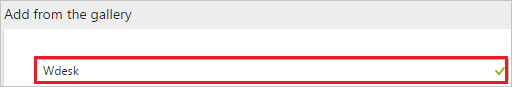
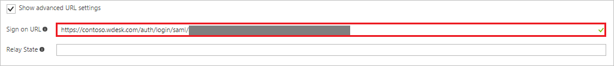

# Tutorial: Azure Active Directory integration with Wdesk

In this tutorial, you learn how to integrate Wdesk with Azure Active Directory (Azure AD).

Integrating Wdesk with Azure AD provides you with the following benefits:

- You can control in Azure AD who has access to Wdesk
- You can enable your users to automatically get signed-on to Wdesk (Single Sign-On) with their Azure AD accounts
- You can manage your accounts in one central location - the Azure portal

If you want to know more details about SaaS app integration with Azure AD, see. [What is application access and single sign-on with Azure Active Directory](active-directory-appssoaccess-whatis.md).

## Prerequisites

To configure Azure AD integration with Wdesk, you need the following items:

- An Azure AD subscription
- A Wdesk single-sign on enabled subscription

> [!NOTE]
> To test the steps in this tutorial, we do not recommend using a production environment.

To test the steps in this tutorial, you should follow these recommendations:

- Do not use your production environment, unless it is necessary.
- If you don't have an Azure AD trial environment, you can get a one-month trial [here](https://azure.microsoft.com/pricing/free-trial/).

## Scenario description
In this tutorial, you test Azure AD single sign-on in a test environment. 
The scenario outlined in this tutorial consists of two main building blocks:

1. Adding Wdesk from the gallery
2. Configuring and testing Azure AD single sign-on

## Adding Wdesk from the gallery
To configure the integration of Wdesk into Azure AD, you need to add Wdesk from the gallery to your list of managed SaaS apps.

**To add Wdesk from the gallery, perform the following steps:**

1. In the **[Azure portal](https://portal.azure.com)**, on the left navigation panel, click **Azure Active Directory** icon. 

	![Active Directory][1]

2. Navigate to **Enterprise applications**. Then go to **All applications**.

	![Applications][2]
	
3. To add new application, click **New application** button on the top of dialog.

	![Applications][3]

4. In the search box, type **Wdesk**.

	

5. In the results panel, select **Wdesk**, and then click **Add** button to add the application.

	

##  Configuring and testing Azure AD single sign-on
In this section, you configure and test Azure AD single sign-on with Wdesk based on a test user called "Britta Simon."

For single sign-on to work, Azure AD needs to know what the counterpart user in Wdesk is to a user in Azure AD. In other words, a link relationship between an Azure AD user and the related user in Wdesk needs to be established.

This link relationship is established by assigning the value of the **user name** in Azure AD as the value of the **Username** in Wdesk.

To configure and test Azure AD single sign-on with Wdesk, you need to complete the following building blocks:

1. **[Configuring Azure AD Single Sign-On](#configuring-azure-ad-single-sign-on)** - to enable your users to use this feature.
2. **[Creating an Azure AD test user](#creating-an-azure-ad-test-user)** - to test Azure AD single sign-on with Britta Simon.
3. **[Creating a Wdesk test user](#creating-a-wdesk-test-user)** - to have a counterpart of Britta Simon in Wdesk that is linked to the Azure AD representation of user.
4. **[Assigning the Azure AD test user](#assigning-the-azure-ad-test-user)** - to enable Britta Simon to use Azure AD single sign-on.
5. **[Testing Single Sign-On](#testing-single-sign-on)** - to verify whether the configuration works.

### Configuring Azure AD single sign-on

In this section, you enable Azure AD single sign-on in the Azure portal and configure single sign-on in your Wdesk application.

**To configure Azure AD single sign-on with Wdesk, perform the following steps:**

1. In the Azure portal, on the **Wdesk** application integration page, click **Single sign-on**.

	![Configure Single Sign-On][4]

2. On the **Single sign-on** dialog, select **Mode** as	**SAML-based Sign-on** to enable single sign-on.
 
	

3. On the **Wdesk Domain and URLs** section, If you wish to configure the application in **IDP** initiated mode perform the following steps:

	

    a. In the **Identifier** textbox, type a URL using the following pattern: `https://<subdomain>.wdesk.com/auth/saml/sp/metadata/<instancename>`

	b. In the **Reply URL** textbox, type a URL using the following pattern: `https://<subdomain>.wdesk.com/auth/saml/sp/consumer/<instancename>`

4. Check **Show advanced URL settings**. If you wish to configure the application in **SP** initiated mode, perform the following step:

    

    In the **Sign-on URL** textbox, type a URL using the following pattern: `https://<subdomain>.wdesk.com/auth/login/saml/<instancename>`
	 
    > [!NOTE] 
    > These values are not real. Update these values with the actual Identifier, Reply URL, and Sign-On URL. You get these values from WDesk portal when you configure the SSO. 
  
5. On the **SAML Signing Certificate** section, click **Metadata XML** and then save the metadata file on your computer.

	 

6. Click **Save** button.

	
	
7. In a different web browser window, login to Wdesk as a Security Administrator.

8. In the bottom left, click **Admin** and choose **Account Admin**:
 
     

9. In Wdesk Admin, navigate to **Security**, then **SAML** > **SAML Settings**:

    

10. Under **General Settings**, check the **Enable SAML Single Sign On**:

    

11. Under **Service Provider Details**, perform the following steps:

    

	  a. Copy the **Login URL** and paste it in **Sign-on Url** textbox on Azure portal.
   
	  b. Copy the **Metadata Url** and paste it in **Identifier** textbox on Azure portal.
	   
	  c. Copy the **Consumer url** and paste it in **Reply Url** textbox on Azure portal.
   
	  d. Click **Save** on Azure portal to save the changes.      

12. Click **Configure IdP Settings** to open **Edit IdP Settings** dialog. Click **Choose File** to locate the **Metadata.xml** file you saved from Azure portal, then upload it.
    
    
  
13. Click **Save changes**.

    

> [!TIP]
> You can now read a concise version of these instructions inside the [Azure 
> portal](https://portal.azure.com), while you are setting up the app!  After adding this app from the **Active Directory > Enterprise Applications** section, simply click the **Single Sign-On** tab and access the embedded documentation through the **Configuration** section at the bottom. You can read more about the embedded documentation feature here: [Azure AD embedded documentation]( https://go.microsoft.com/fwlink/?linkid=845985)

### Creating an Azure AD test user
The objective of this section is to create a test user in the Azure portal called Britta Simon.

![Create Azure AD User][100]

**To create a test user in Azure AD, perform the following steps:**

1. In the **Azure portal**, on the left navigation pane, click **Azure Active Directory** icon.

	 

2. To display the list of users, go to **Users and groups** and click **All users**.
	
	 

3. To open the **User** dialog, click **Add** on the top of the dialog.
 
	 

4. On the **User** dialog page, perform the following steps:
 
	 

    a. In the **Name** textbox, type **BrittaSimon**.

    b. In the **User name** textbox, type the **email address** of BrittaSimon.

	c. Select **Show Password** and write down the value of the **Password**.

    d. Click **Create**.
 
### Creating a Wdesk test user

To enable Azure AD users to log in to Wdesk, they must be provisioned into Wdesk. In Wdesk, provisioning is a manual task.

**To provision a user account, perform the following steps:**

1. Log in to Wdesk as a Security Administrator.
2. Navigate to **Admin** > **Account Admin**.

     

3. Click **Members** under **People**.

4. Now click **Add Member** to open **Add Member** dialog box. 
   
      

5. In **User** text box, enter the username of user like **brittasimon@contoso.com** and click **Continue** button.

    

6.  Enter the details as shown below:
  
    
 
    a. In **E-mail** text box, enter the email of user like **brittasimon@contoso.com**.

    b. In **First Name** text box, enter the first name of user like **Britta**.

    c. In **Last Name** text box, enter the last name of user like **Simon**.

7. Click **Save Member** button.  

    

### Assigning the Azure AD test user

In this section, you enable Britta Simon to use Azure single sign-on by granting access to Wdesk.

![Assign User][200] 

**To assign Britta Simon to Wdesk, perform the following steps:**

1. In the Azure portal, open the applications view, and then navigate to the directory view and go to **Enterprise applications** then click **All applications**.

	![Assign User][201] 

2. In the applications list, select **Wdesk**.

	 

3. In the menu on the left, click **Users and groups**.

	![Assign User][202] 

4. Click **Add** button. Then select **Users and groups** on **Add Assignment** dialog.

	![Assign User][203]

5. On **Users and groups** dialog, select **Britta Simon** in the Users list.

6. Click **Select** button on **Users and groups** dialog.

7. Click **Assign** button on **Add Assignment** dialog.
	
### Testing single sign-on

In this section, you test your Azure AD single sign-on configuration using the Access Panel.

When you click the Wdesk tile in the Access Panel, you should get automatically signed-on to your Wdesk application.
For more information about the Access Panel, see [introduction to the Access Panel](active-directory-saas-access-panel-introduction.md).

## Additional resources

* [List of Tutorials on How to Integrate SaaS Apps with Azure Active Directory](active-directory-saas-tutorial-list.md)
* [What is application access and single sign-on with Azure Active Directory?](active-directory-appssoaccess-whatis.md)

<!--Image references-->

[1]: ./media/active-directory-saas-wdesk-tutorial/tutorial_general_01.png
[2]: ./media/active-directory-saas-wdesk-tutorial/tutorial_general_02.png
[3]: ./media/active-directory-saas-wdesk-tutorial/tutorial_general_03.png
[4]: ./media/active-directory-saas-wdesk-tutorial/tutorial_general_04.png

[100]: ./media/active-directory-saas-wdesk-tutorial/tutorial_general_100.png

[200]: ./media/active-directory-saas-wdesk-tutorial/tutorial_general_200.png
[201]: ./media/active-directory-saas-wdesk-tutorial/tutorial_general_201.png
[202]: ./media/active-directory-saas-wdesk-tutorial/tutorial_general_202.png
[203]: ./media/active-directory-saas-wdesk-tutorial/tutorial_general_203.png

