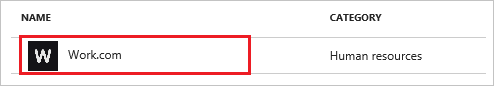
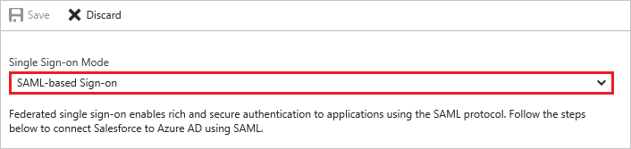
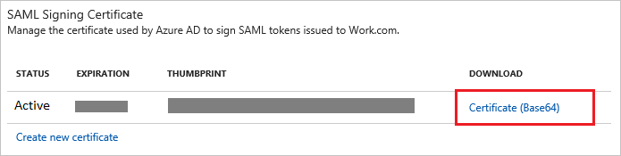
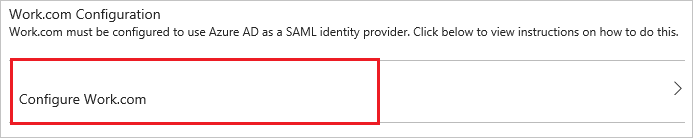
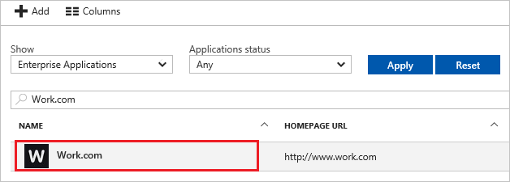

# Tutorial: Azure Active Directory integration with Work.com

In this tutorial, you learn how to integrate Work.com with Azure Active Directory (Azure AD).

Integrating Work.com with Azure AD provides you with the following benefits:

- You can control in Azure AD who has access to Work.com
- You can enable your users to automatically get signed-on to Work.com (Single Sign-On) with their Azure AD accounts
- You can manage your accounts in one central location - the Azure portal

If you want to know more details about SaaS app integration with Azure AD, see [what is application access and single sign-on with Azure Active Directory](active-directory-appssoaccess-whatis.md).

## Prerequisites

To configure Azure AD integration with Work.com, you need the following items:

- An Azure AD subscription
- A Work.com single sign-on enabled subscription

> [!NOTE]
> To test the steps in this tutorial, we do not recommend using a production environment.

To test the steps in this tutorial, you should follow these recommendations:

- Do not use your production environment, unless it is necessary.
- If you don't have an Azure AD trial environment, you can [get a one-month trial](https://azure.microsoft.com/pricing/free-trial/).

## Scenario description
In this tutorial, you test Azure AD single sign-on in a test environment. 
The scenario outlined in this tutorial consists of two main building blocks:

1. Add Work.com from the gallery
2. Configure and test Azure AD single sign-on

## Add Work.com from the gallery
To configure the integration of Work.com into Azure AD, you need to add Work.com from the gallery to your list of managed SaaS apps.

**To add Work.com from the gallery, perform the following steps:**

1. In the **[Azure portal](https://portal.azure.com)**, on the left navigation panel, click **Azure Active Directory** icon. 

	![Active Directory][1]

2. Navigate to **Enterprise applications**. Then go to **All applications**.

	![Applications][2]
	
3. To add new application, click **New application** button on the top of dialog.

	![Applications][3]

4. In the search box, type **Work.com**, select **Work.com** from results panel then click **Add** button to add the application.

	

##  Configure and test Azure AD single sign-on
In this section, you configure and test Azure AD single sign-on with Work.com based on a test user called "Britta Simon".

For single sign-on to work, Azure AD needs to know what the counterpart user in Work.com is to a user in Azure AD. In other words, a link relationship between an Azure AD user and the related user in Work.com needs to be established.

In Work.com, assign the value of the **user name** in Azure AD as the value of the **Username** to establish the link relationship.

To configure and test Azure AD single sign-on with Work.com, you need to complete the following building blocks:

1. **[Configure Azure AD Single Sign-On](#configure-azure-ad-single-sign-on)** - to enable your users to use this feature.
2. **[Create an Azure AD test user](#create-an-azure-ad-test-user)** - to test Azure AD single sign-on with Britta Simon.
3. **[Create a Work.com test user](#create-a-workcom-test-user)** - to have a counterpart of Britta Simon in Work.com that is linked to the Azure AD representation of user.
4. **[Assign the Azure AD test user](#assign-the-azure-ad-test-user)** - to enable Britta Simon to use Azure AD single sign-on.
5. **[Test Single Sign-On](#test-single-sign-on)** - to verify whether the configuration works.

### Configure Azure AD single sign-on

In this section, you enable Azure AD single sign-on in the Azure portal and configure single sign-on in your Work.com application.

>[!NOTE]
>To configure single sign-on, you need to setup a custom Work.com domain name yet. You need to define at least a domain name, test your domain name, and deploy it to your entire organization.

**To configure Azure AD single sign-on with Work.com, perform the following steps:**

1. In the Azure portal, on the **Work.com** application integration page, click **Single sign-on**.

	![Configure Single Sign-On][4]

2. On the **Single sign-on** dialog, select **Mode** as	**SAML-based Sign-on** to enable single sign-on.
 
	

3. On the **Work.com Domain and URLs** section, perform the following:

	

    In the **Sign-on URL** textbox, type a URL using the following pattern: `http://<companyname>.my.salesforce.com`

	> [!NOTE] 
	> This value is not real. Update this value with the actual Sign-On URL. Contact [Work.com Client support team](https://help.salesforce.com/articleView?id=000159855&type=3) to get this value. 

4. On the **SAML Signing Certificate** section, click **Certificate (Base64)** and then save the certificate file on your computer.

	 

5. Click **Save** button.

	

6. On the **Work.com Configuration** section, click **Configure Work.com** to open **Configure sign-on** window. Copy the **Sign-Out URL, SAML Entity ID, and SAML Single Sign-On Service URL** from the **Quick Reference section.**

	 
7. Log in to your Work.com tenant as administrator.

8. Go to **Setup**.
   
    

9. On the left navigation pane, in the **Administer** section, click **Domain Management** to expand the related section, and then click **My Domain** to open the **My Domain** page. 
   
    

10. To verify that your domain has been set up correctly, make sure that it is in “**Step 4 Deployed to Users**” and review your “**My Domain Settings**”.
   
    

11. Log in to your Work.com tenant.

12. Go to **Setup**.
    
    

13. Expand the **Security Controls** menu, and then click **Single Sign-On Settings**.
    
    

14. On the **Single Sign-On Settings** dialog page, perform the following steps:
    
    
    
    a. Select **SAML Enabled**.
    
    b. Click **New**.

15. In the **SAML Single Sign-On Settings** section, perform the following steps:
    
    
    
    a. In the **Name** textbox, type a name for your configuration.  
       
    > [!NOTE]
    > Providing a value for **Name** does automatically populate the **API Name** textbox.
    
    b. In **Issuer** textbox, paste the value of **SAML Entity ID** which you have copied from Azure portal.
    
    c. To upload the downloaded certificate from Azure portal, click **Browse**.
    
    d. In the **Entity Id** textbox, type `https://salesforce-work.com`.
    
    e. As **SAML Identity Type**, select **Assertion contains the Federation ID from the User object**.
    
    f. As **SAML Identity Location**, select **Identity is in the NameIdentfier element of the Subject statement**.
    
    g. In **Identity Provider Login URL** textbox, paste the value of **SAML Single Sign-On Service URL** which you have copied from Azure portal.

    h. In **Identity Provider Logout URL** textbox, paste the value of **Sign-Out URL** which you have copied from Azure portal.
    
    i. As **Service Provider Initiated Request Binding**, select **HTTP Post**.
    
    j. Click **Save**.

16. In your Work.com classic portal, on the left navigation pane, click **Domain Management** to expand the related section, and then click **My Domain** to open the **My Domain** page. 
    
    

17. On the **My Domain** page, in the **Login Page Branding** section, click **Edit**.
    
    

14. On the **Login Page Branding** page, in the **Authentication Service** section, the name of your **SAML SSO Settings** is displayed. Select it, and then click **Save**.
    
    

> [!TIP]
> You can now read a concise version of these instructions inside the [Azure portal](https://portal.azure.com), while you are setting up the app!  After adding this app from the **Active Directory > Enterprise Applications** section, simply click the **Single Sign-On** tab and access the embedded documentation through the **Configuration** section at the bottom. You can read more about the embedded documentation feature here: [Azure AD embedded documentation]( https://go.microsoft.com/fwlink/?linkid=845985)
> 

### Create an Azure AD test user
The objective of this section is to create a test user in the Azure portal called Britta Simon.

![Create Azure AD User][100]

**To create a test user in Azure AD, perform the following steps:**

1. In the **Azure portal**, on the left navigation pane, click **Azure Active Directory** icon.

	 

2. To display the list of users, go to **Users and groups** and click **All users**.
	
	 

3. To open the **User** dialog, click **Add** on the top of the dialog.
 
	 

4. On the **User** dialog page, perform the following steps:
 
	 

    a. In the **Name** textbox, type **BrittaSimon**.

    b. In the **User name** textbox, type the **email address** of BrittaSimon.

	c. Select **Show Password** and write down the value of the **Password**.

    d. Click **Create**.
 
### Create a Work.com test user
For Azure Active Directory users to be able to sign in, they must be provisioned to Work.com. In the case of Work.com, provisioning is a manual task.

### To configure user provisioning, perform the following steps:
1. Sign on to your Work.com company site as an administrator.

2. Go to **Setup**.
   
    
3. Go to **Manage Users \> Users**.
   
    

4. Click **New User**.
   
    

5. In the User Edit section, perform the following steps, in attributes of a valid Azure AD account you want to provision into the related textboxes:
   
    
   
    a. In the **First Name** textbox, type the **first name** of the user **Britta**.
	
	b. In the **Last Name** textbox, type the **last name** of the user **Simon**.
	
	c. In the **Alias** textbox, type the **name** of the user **BrittaS**.
    
    d. In the **Email** textbox, type the **email address** of user **Brittasimon@contoso.com**.
    
    e. In the **User Name** textbox, type a user name of user like **Brittasimon@contoso.com**.
    
    f. In the **Nick Name** textbox, type a **nick name** of user **Simon**.
    
    g. Select **Role**, **User License**, and **Profile**.
	
	h. Click **Save**.  
      
    > [!NOTE]
    > The Azure AD account holder will get an email including a link to confirm the account before it becomes active.
    > 
    > 

### Assign the Azure AD test user

In this section, you enable Britta Simon to use Azure single sign-on by granting access to Work.com.

![Assign User][200] 

**To assign Britta Simon to Work.com, perform the following steps:**

1. In the Azure portal, open the applications view, and then navigate to the directory view and go to **Enterprise applications** then click **All applications**.

	![Assign User][201] 

2. In the applications list, select **Work.com**.

	 

3. In the menu on the left, click **Users and groups**.

	![Assign User][202] 

4. Click **Add** button. Then select **Users and groups** on **Add Assignment** dialog.

	![Assign User][203]

5. On **Users and groups** dialog, select **Britta Simon** in the Users list.

6. Click **Select** button on **Users and groups** dialog.

7. Click **Assign** button on **Add Assignment** dialog.
	
### Test single sign-on

In this section, you test your Azure AD single sign-on configuration using the Access Panel.

When you click the Work.com tile in the Access Panel, you should get automatically signed-on to your Work.com application.
For more information about the Access Panel, see [Introduction to the Access Panel](active-directory-saas-access-panel-introduction.md).

## Additional resources

* [List of Tutorials on How to Integrate SaaS Apps with Azure Active Directory](active-directory-saas-tutorial-list.md)
* [What is application access and single sign-on with Azure Active Directory?](active-directory-appssoaccess-whatis.md)

<!--Image references-->

[1]: ./media/active-directory-saas-work-com-tutorial/tutorial_general_01.png
[2]: ./media/active-directory-saas-work-com-tutorial/tutorial_general_02.png
[3]: ./media/active-directory-saas-work-com-tutorial/tutorial_general_03.png
[4]: ./media/active-directory-saas-work-com-tutorial/tutorial_general_04.png

[100]: ./media/active-directory-saas-work-com-tutorial/tutorial_general_100.png

[200]: ./media/active-directory-saas-work-com-tutorial/tutorial_general_200.png
[201]: ./media/active-directory-saas-work-com-tutorial/tutorial_general_201.png
[202]: ./media/active-directory-saas-work-com-tutorial/tutorial_general_202.png
[203]: ./media/active-directory-saas-work-com-tutorial/tutorial_general_203.png

