<properties 
    pageTitle="Tutorial: Azure Active Directory integration with Work.com | Microsoft Azure" 
    description="Learn how to use Work.com with Azure Active Directory to enable single sign-on, automated provisioning, and more!." 
    services="active-directory" 
    authors="jeevansd"  
    documentationCenter="na" 
    manager="femila"/>
<tags 
    ms.service="active-directory" 
    ms.devlang="na" 
    ms.topic="article" 
    ms.tgt_pltfrm="na" 
    ms.workload="identity" 
    ms.date="06/21/2016" 
    ms.author="jeedes" />

#Tutorial: Azure Active Directory integration with Work.com
  
The objective of this tutorial is to show the integration of Azure and Work.com.  
The scenario outlined in this tutorial assumes that you already have the following items:

-   A valid Azure subscription
-   A Work.com single sign-on enabled subscription
  
After completing this tutorial, the AAD users to whom you have assign Work.com access will be able to single sign into the application at your Work.com company site (service provider initiated sign on), or using the [Introduction to the Access Panel](active-directory-saas-access-panel-introduction.md).
  
The scenario outlined in this tutorial consists of the following building blocks:

1.  Enabling the application integration for Work.com
2.  Configuring single sign-on
3.  Configuring user provisioning
4.  Assigning users

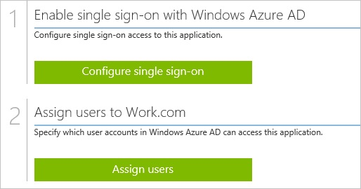

##Enabling the application integration for Work.com
  
The objective of this section is to outline how to enable the application integration for Work.com.

###To enable the application integration for Work.com, perform the following steps:

1.  In the Azure classic portal, on the left navigation pane, click **Active Directory**.

    

2.  From the **Directory** list, select the directory for which you want to enable directory integration.

3.  To open the applications view, in the directory view, click **Applications** in the top menu.

    

4.  Click **Add** at the bottom of the page.

    

5.  On the **What do you want to do** dialog, click **Add an application from the gallery**.

    

6.  In the **search box**, type **Work.com**.

    

7.  In the results pane, select **Work.com**, and then click **Complete** to add the application.

    

##Configuring single sign-on
  
The objective of this section is to outline how to enable users to authenticate to Work.com with their account in Azure AD using federation based on the SAML protocol.  
As part of this procedure, you are required to upload a certificate to Work.com.com.

>[AZURE.NOTE] To configure single sign-on, you need to setup a custom Work.com domain name yet. You need to define at least a domain name, test your domain name, and deploy it to your entire organization.

###To configure single sign-on, perform the following steps:

1.  Log in to your Work.com tenant as administrator.

2.  Go to **Setup**.

    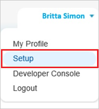

3.  On the left navigation pane, in the **Administer** section, click **Domain Management** to expand the related section, and then click **My Domain** to open the **My Domain** page. 

    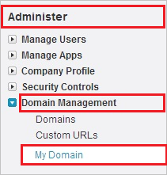

4.  To verify that your domain has been setup correctly, make sure that it is in “**Step 4 Deployed to Users**” and review your “**My Domain Settings**”.

    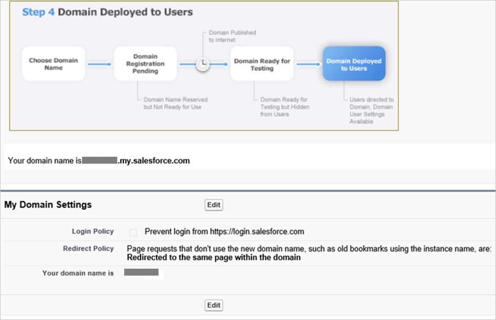

5.  In a different web browser window, log in to your Azure classic portal.

6.  On the **Work.com **application integration page, click **Configure single sign-on** to open the **Configure Single Sign On ** dialog.

    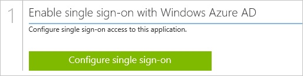

7.  On the **How would you like users to sign on to Work.com** page, select **Microsoft Azure AD Single Sign-On**, and then click **Next**.

    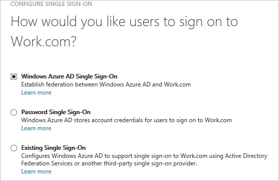

8.  On the **Configure App URL** page, in the **Work.com Sign On URL** textbox, type the URL used by your users to sign on to your Work.com application (e.g.:” *http://company.my.salesforce.com*”), and then click **Next**: 

    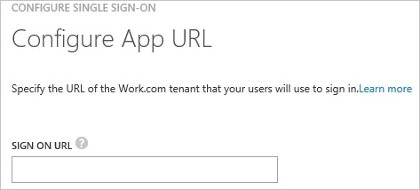

9.  On the **Configure single sign-on at Work.com** page, to download your certificate, click **Download certificate**, and then save the certificate file locally on your computer.

    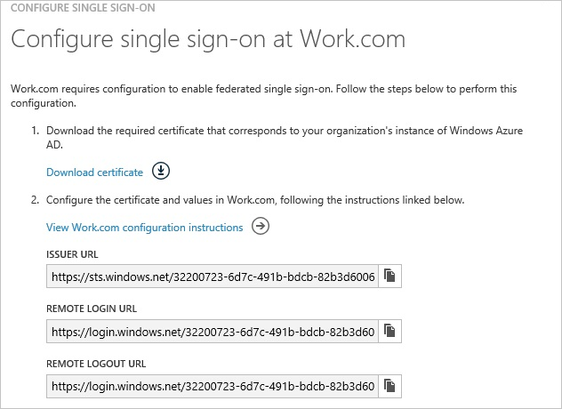

10. Log in to your Work.com tenant.

11. Go to **Setup**.

    

12. Expand the **Security Controls** menu, and then click **Single Sign-On Settings**.

    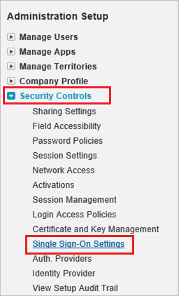

13. On the **Single Sign-On Settings** dialog page, perform the following steps:

    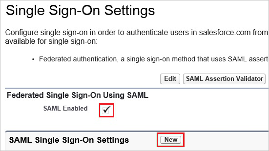

    1.  Select **SAML Enabled**.
    2.  Click **New**.

14. In the **SAML Single Sign-On Settings** section, perform the following steps:

    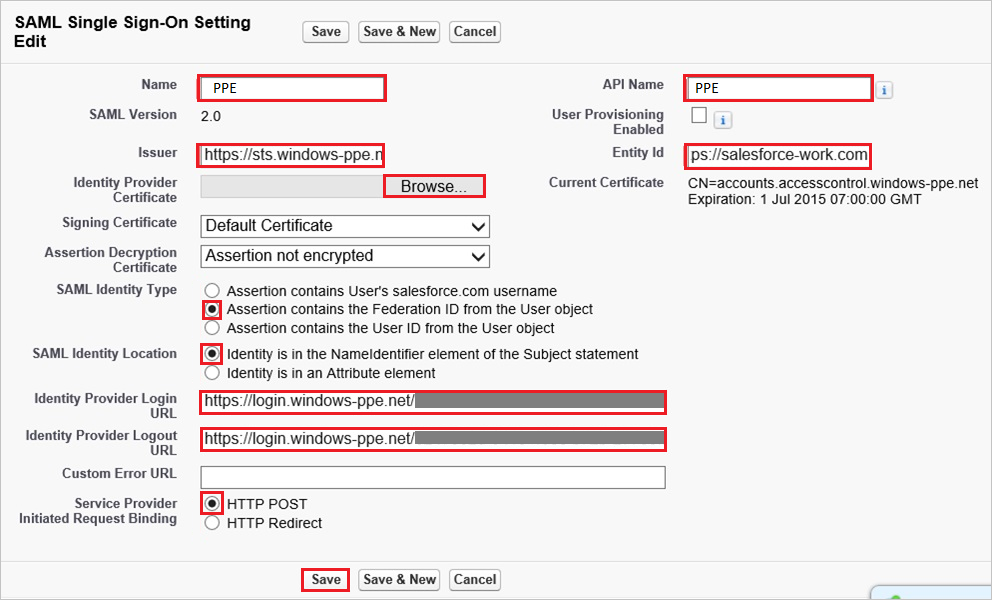

    1.  In the **Name** textbox, type a name for your configuration.  

        >[AZURE.NOTE] Providing a value for **Name** does automatically populate the **API Name** textbox.

    2.  In the Azure classic portal, on the **Configure single sign-on at Work.com** dialog page, copy the **Issuer URL** value, and then paste it into the **Issuer** textbox.
    3.  To upload the downloaded certificate, click **Browse**.
    4.  In the **Entity Id** textbox, type **https://salesforce-work.com**.
    5.  As **SAML Identity Type**, select **Assertion contains the Federation ID from the User object**.
    6.  As **SAML Identity Location**, select **Identity is in the NameIdentfier element of the Subject statement**.
    7.  In the Azure classic portal, on the **Configure single sign-on at Work.com** dialog page, copy the **Remote Login URL** value, and then paste it into the **Identity Provider Login URL** textbox.
    8.  In the Azure classic portal, on the **Configure single sign-on at Work.com** dialog page, copy the **Remote Logout URL** value, and then paste it into the **Identity Provider Logout URL** textbox.
    9.  As **Service Provider Initiated Request Binding**, select **HTTP Post**.
    10. Click **Save**.

15. In your Work.com classic portal, on the left navigation pane, click **Domain Management** to expand the related section, and then click **My Domain** to open the **My Domain** page. 

    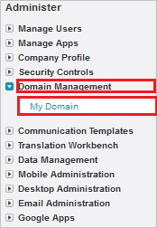

16. On the **My Domain** page, in the **Login Page Branding** section, click **Edit**.

    

17. On the **Login Page Branding** page, in the **Authentication Service** section, the name of your **SAML SSO Settings** is displayed. Select it, and then click **Save**.

    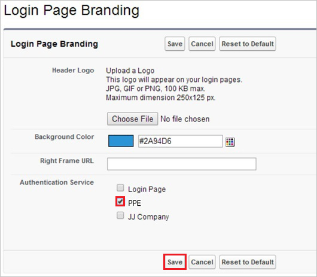

18. On the Azure classic portal, select the single sign-on configuration confirmation, and then click **Complete** to close the **Configure Single Sign On** dialog.

    

##Configuring user provisioning
  
For Azure Active Directory users to be able to sign in, they must be provisioned to Work.com.  
In the case of Work.com, provisioning is a manual task.

###To configure user provisioning, perform the following steps:

1.  Sign on to your Work.com company site as an administrator.

2.  Go to **Setup**.

    

3.  Go to **Manage Users \> Users**.

    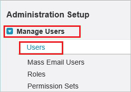

4.  Click **New User**.

    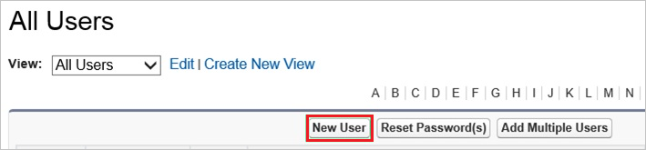

5.  In the User Edit section, perform the following steps:

    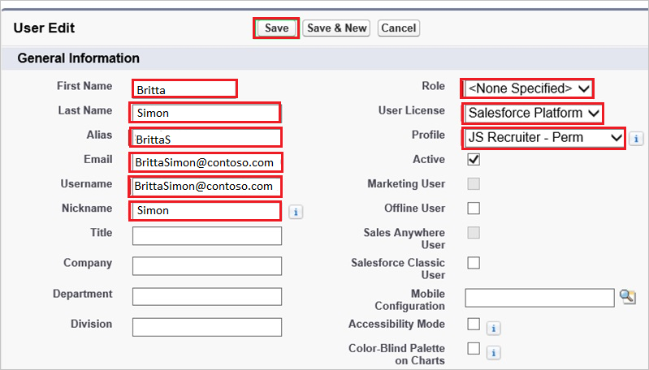

    1.  Type the **Last Name**, **Alias**, **Email**, **Username** and **Nickname** attributes of a valid Azure Active Directory account you want to provision into the related textboxes.
    2.  Select **Role**, **User License** and **Profile**.
    3.  Click **Save**.  

        >[AZURE.NOTE] The Azure Active Directory account holder will get an email including a link to confirm the account before it becomes active.

>[AZURE.NOTE] You can use any other Work.com user account creation tools or APIs provided by Work.com to provision AAD user accounts.

##Assigning users
  
To test your configuration, you need to grant the Azure AD users you want to allow using your application access to it by assigning them.

###To assign users to Work.com, perform the following steps:

1.  In the Azure classic portal, create a test account.

2.  On the Work.com application integration page, click **Assign users**.

    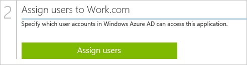

3.  Select your test user, click **Assign**, and then click **Yes** to confirm your assignment.

    
  
You should now wait for 10 minutes and verify that the account has been synchronized to Work.com.com.
  
If you want to test your single sign-on settings, open the Access Panel. For more details about the Access Panel, see [Introduction to the Access Panel](active-directory-saas-access-panel-introduction.md).