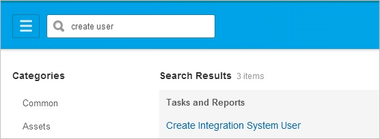
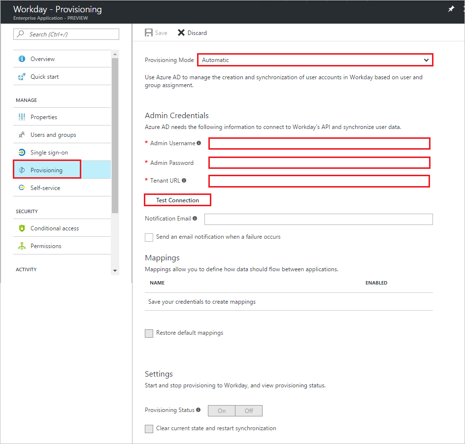

# Tutorial: Configuring Workday for Inbound Synchronization

The objective of this tutorial is to show you the steps you need to perform in Workday and Azure AD to import people from Workday to Azure AD. 

The scenario outlined in this tutorial assumes that you already have the following items:

* A valid Azure AD Premium subscription
* A tenant in Workday

The scenario outlined in this tutorial consists of the following building blocks:

1. Enabling the application integration for Workday 
2. Creating an integration system user 
3. Creating a security group 
4. Assigning the integration system user to the security group 
5. Configuring security group options 
6. Activating security policy changes 
7. Configuring user import in Azure AD 

## Enabling the application integration for Workday
The objective of this section is to outline how to enable the application integration for Workday.

### Steps:

1. In the **[Azure portal](https://portal.azure.com)**, on the left navigation panel, click **Azure Active Directory** icon. 

	![Active Directory][1]

2. Navigate to **Enterprise applications**. Then go to **All applications**.

	![Applications][2]
	
3. Click **Add** button on the top of the dialog.

	![Applications][3]

4. In the search box, type **Workday**.

	

5. In the results panel, select **Workday**, and then click **Add** button to add the application.

	

## Creating an integration system user
### Steps:
1. In the **Workday Workbench**, enter create user in the search box, and then click **Create Integration System User**. 
   
    

2. Complete the **Create Integration System User** task by supplying a user name and password for a new Integration System User.  Leave the Require New Password at Next Sign In option unchecked, because this user is logging on programmatically. Leave the Session Timeout Minutes with its default value of 0, which prevent the user’s sessions from timing out prematurely. 
   
    

## Creating a security group
For the scenario outlined in this tutorial, you need to create an unconstrained integration system security group and assign the user to it.

### Steps:
1. Enter create security group in the search box, and then click **Create Security Group**. 
   
    

2. Complete the Create Security Group task.  Select Integration System Security Group—Unconstrained from the Type of Tenanted Security Group dropdown, to create a security group to which members are explicitly added. 
   
    

## Assigning the integration system user to the security group
### Steps:
1. Enter edit security group in the search box, and then click **Edit Security Group**. 
   
    

2. Search for, and select the new integration security group by name. 
   
    

3. Add the new integration system user to the new security group. 
   
      

## Configuring security group options
In this step, you grant to the new security group permissions for **Get** and **Put** operations on the objects secured by the following domain security policies:

* External Account Provisioning
* Worker Data: Public Worker Reports
* Worker Data: All Positions
* Worker Data: Current Staffing Information
* Worker Data: Business Title on Worker Profile

### Steps:
1. Enter domain security policies in the search box, and then click the link, Domain Security Policies for Functional Area.  
   
     

2. Search for system and select the **System** functional area.  Click **OK**.  
   
    

3. In the list of security policies for the System functional area, expand Security Administration and select the domain security policy, External Account Provisioning.  
   
    

4. Click **Edit Permissions**, and then, on the **Edit Permissions** dialog page, add the new security group to the list of security groups with **Get** and **Put** integration permissions. 
   
    

5. Repeat step 1, above, to return to the screen for selecting functional areas, and this time, search for staffing, select the Staffing functional area, and click **OK**.
   
     

6. In the list of security policies for the Staffing functional area, expand Worker Data: Staffing, and repeat step 4 above for each of these remaining security policies:
   
   * Worker Data: Public Worker Reports
   * Worker Data: All Positions
   * Worker Data: Current Staffing Information
   * Worker Data: Business Title on Worker Profile

      

## Activating security policy changes
### Steps:
1. Enter activate in the search box, and then click the link, Activate Pending Security Policy Changes. 
   
     

2. Begin the Activate Pending Security Policy Changes task by entering a comment for auditing purposes, and then click **OK**. 
   
     

3. Complete the task on the next screen by checking the checkbox labeled Confirm, and then click **OK**. 
   
      

## Configuring user import in Azure AD
The objective of this section is to outline how to configure Azure AD to import people from Workday.

### Steps:

1. In the [Azure portal](https://portal.azure.com), browse to the **Azure Active Directory > Enterprise Apps > All applications** section.

2. If you have already configured Workday for single sign-on, search for your instance of Workday using the search field. Otherwise, select **Add** and search for **Workday** in the application gallery. Select Workday from the search results, and add it to your list of applications.

3. Select your instance of Workday, then select the **Provisioning** tab.

4. Set the **Provisioning Mode** to **Automatic**. 

    

5. Under the **Admin Credentials** section, enter the user name and the password of your Workday administrator and in the Workday tenant URL textbox, type the URL or your Workday tenant.

6. In the Azure portal, click **Test Connection** to ensure Azure AD can connect to your Workday app.

7. Enter the email address of a person or group who should receive provisioning error notifications in the **Notification Email** field, and check the checkbox.

8. Click **Save.**

9. Under the Mappings section, select **Synchronize Azure Active Directory Users to Workday.**

10. In the **Attribute Mappings** section, review the user attributes that are synchronized from Azure AD to Workday. The attributes selected as **Matching** properties are used to match the user accounts in Workday for update operations. Select the Save button to commit any changes.

11. To enable the Azure AD provisioning service for Workday, change the **Provisioning Status** to **On** in the Settings section

12. Click **Save.**

It starts the initial synchronization of any users and/or groups assigned to Workday in the Users and Groups section. The initial sync takes longer to perform than subsequent syncs, which occur approximately every 20 minutes as long as the service is running. You can use the **Synchronization Details** section to monitor progress and follow links to provisioning activity reports, which describe all actions performed by the provisioning service on your Workday app.

You can now go to the Users section and check whether your Workday user has been imported.

## Additional resources

* [Managing user account provisioning for Enterprise Apps](active-directory-saas-tutorial-list.md)
* [What is application access and single sign-on with Azure Active Directory?](active-directory-appssoaccess-whatis.md)
* [Configure Single Sign-on](active-directory-saas-workday-tutorial.md)

<!--Image references-->

[1]: ./media/active-directory-saas-workday-inbound-provisioning-tutorial/tutorial_general_01.png
[2]: ./media/active-directory-saas-workday-inbound-provisioning-tutorial/tutorial_general_02.png
[3]: ./media/active-directory-saas-workday-inbound-provisioning-tutorial/tutorial_general_03.png

