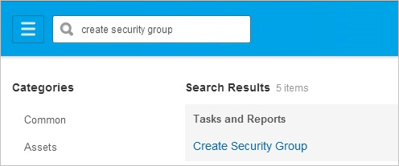
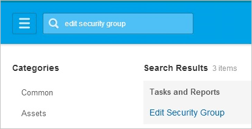
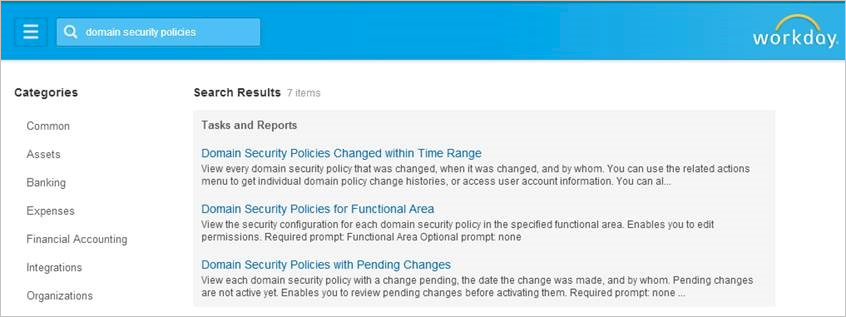
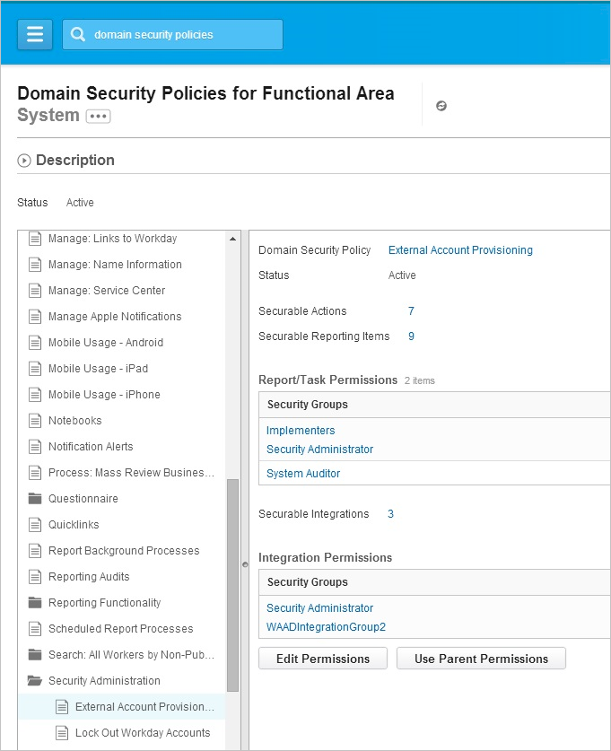
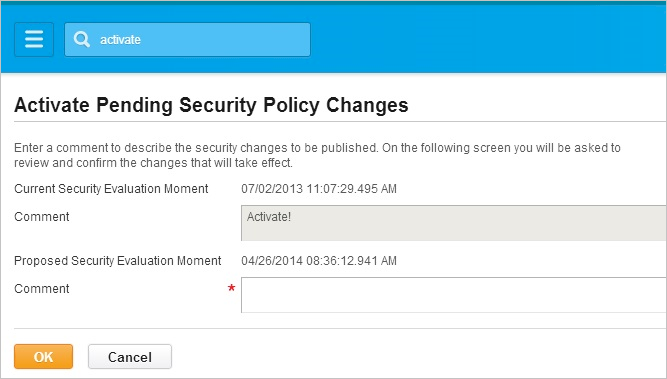
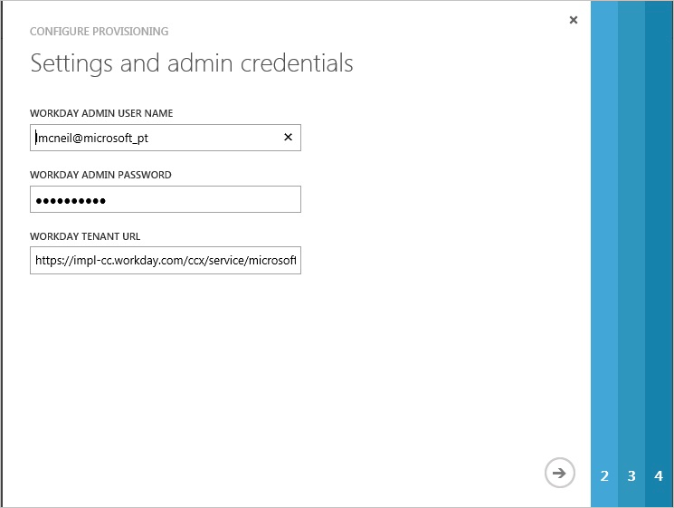
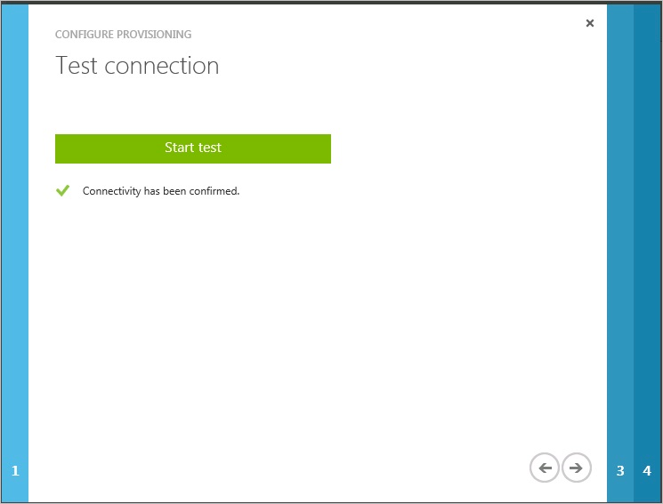
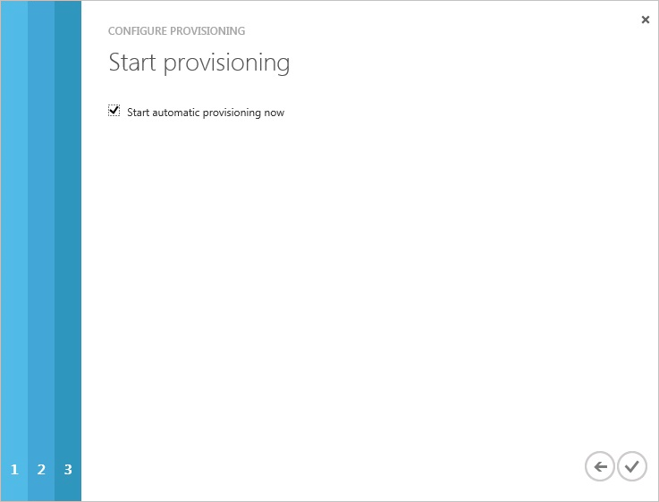

<properties 
    pageTitle="Tutorial: Configuring Workday for Inbound Synchronization | Microsoft Azure" 
    description="Learn how to use Workday as source of identity data for Azure Active Directory." 
    services="active-directory" 
    authors="MarkusVi"  
    documentationCenter="na" 
    manager="femila"/>
<tags 
    ms.service="active-directory" 
    ms.devlang="na" 
    ms.topic="article" 
    ms.tgt_pltfrm="na" 
    ms.workload="identity" 
    ms.date="07/13/2016" 
    ms.author="markvi" />

#Tutorial: Configuring Workday for Inbound Synchronization

The objective of this tutorial is to show you the steps you need to perform in Workday and Azure AD to import people from Workday to Azure AD. 

The scenario outlined in this tutorial assumes that you already have the following items:

-   A valid Azure AD Premium subscription
-   A tenant in Workday
  
The scenario outlined in this tutorial consists of the following building blocks:

1. Enabling the application integration for Workday 

2. Creating an integration system user 

3. Creating a security group 

4. Assigning the integration system user to the security group 

5. Configuring security group options 

6. Activating security policy changes 

7. Configuring user import in Azure AD 

##Enabling the application integration for Workday
  
The objective of this section is to outline how to enable the application integration for Workday.

### Steps:

1.  In the Azure classic portal, on the left navigation pane, click **Active Directory**.

    

2.  From the **Directory** list, select the directory for which you want to enable directory integration.

3.  To open the applications view, in the directory view, click **Applications** in the top menu.

    

4.  Click **Add** at the bottom of the page.

    

  
5. In the search box, type **Workday**.

    

6. In the results pane, select Workday, and then click Complete to add the application.

    

## Creating an integration system user

### Steps:

1. In the **Workday Workbench**, enter create user in the search box, and then click **Create Integration System User**. 

	

2. Complete the **Create Integration System User** task by supplying a user name and password for a new Integration System User.  Leave the Require New Password at Next Sign In option unchecked, because this user will be logging on programmatically. Leave the Session Timeout Minutes with its default value of 0, which will prevent the user’s sessions from timing out prematurely. 

	
 

## Creating a security group

For the scenario outlined in this tutorial, you need to create an unconstrained integration system security group and assign the user to it.

### Steps:

1. Enter create security group in the search box, and then click **Create Security Group**. 

	
 

2. Complete the Create Security Group task.  Select Integration System Security Group—Unconstrained from the Type of Tenanted Security Group dropdown, to create a security group to which members will be explicitly added. 

	
 

## Assigning the integration system user to the security group

### Steps:

1. Enter edit security group in the search box, and then click **Edit Security Group**. 

	
 
 

2. Search for, and select the new integration security group by name. 

	

 

3. Add the new integration system user to the new security group. 

	  

## Configuring security group options

In this step, you grant to the new security group permissions for **Get** and **Put** operations on the objects secured by the following domain security policies:

- External Account Provisioning

- Worker Data: Public Worker Reports

- Worker Data: All Positions

- Worker Data: Current Staffing Information

- Worker Data: Business Title on Worker Profile

 
### Steps:

1. Enter domain security policies in the search box, and then click on the link, Domain Security Policies for Functional Area.  

	  
 

2. Search for system and select the **System** functional area.  Click **OK**.  

	  

3. In the list of security policies for the System functional area, expand Security Administration and select the domain security policy, External Account Provisioning.  

	  

4. Click **Edit Permissions**, and then, on the **Edit Permissions**dialog page, add the new security group to the list of security groups with **Get** and **Put** integration permissions. 

	  

 

5. Repeat step 1, above, to return to the screen for selecting functional areas, and this time, search for staffing, select the Staffing functional area, and click **OK**.

	  
 

6. In the list of security policies for the Staffing functional area, expand Worker Data: Staffing, and repeat step 4 above for each of these remaining security policies:

     - Worker Data: Public Worker Reports

     - Worker Data: All Positions

     - Worker Data: Current Staffing Information

     - Worker Data: Business Title on Worker Profile

	  

## Activating security policy changes

### Steps:

1. Enter activate in the search box, and then click on the link,Activate Pending Security Policy Changes. 

	 
 

2. Begin the Activate Pending Security Policy Changes task by entering a comment for auditing purposes, and then click **OK**. 

	   
 

3. Complete the task on the next screen by checking the checkbox labelled Confirm, and then click **OK**. 

	  

## Configuring user import in Azure AD

The objective of this section is to outline how to configure Azure AD to import people from Workday.

### Steps:

1. On the **Workday** application integration page, click **Configure user import** to open the **Configure Provisioning** dialog.

2. On the **Settings and admin credentials** page, perform the following steps, and then click **Next**: 

	  
 
	a. In the Workday admin user name textbox, type the name of the user you have created in the Creating an integration system user section.

    b. In the Workday admin password textbox, type the password of the user you have created in the Creating an integration system user section.

    c. In the Workday tenant URL textbox, type the URL or your Workday tenant.

3. On the **Test connection** page, click **Start test** to confirm connectivity, and then click **Next**. 

	  
 

4. On the **Provisioning** options page, click **Next**. 

	

5. On the **Start provisioning** dialog, click **Complete**. 

	
 

You can now go to the **Users** section and check whether your Workday user has been imported.

## Additional Resources

* [List of Tutorials on How to Integrate SaaS Apps with Azure Active Directory](active-directory-saas-tutorial-list.md)
* [What is application access and single sign-on with Azure Active Directory?](active-directory-appssoaccess-whatis.md)
