<properties pageTitle="Tutorial: Azure Active Directory integration with Workday | Microsoft Azure" description="Learn how to use Workday with Azure Active Directory to enable single sign-on, automated provisioning, and more!." services="active-directory" authors="MarkusVi"  documentationCenter="na" manager="stevenpo"/>
<tags ms.service="active-directory" ms.devlang="na" ms.topic="article" ms.tgt_pltfrm="na" ms.workload="identity" ms.date="08/01/2015" ms.author="markvi" />
#Tutorial: Azure Active Directory integration with Workday
>[AZURE.TIP]For feedback, click [here](http://go.microsoft.com/fwlink/?LinkId=330042).
  
The objective of this tutorial is to show the integration of Azure and Workday. The scenario outlined in this tutorial assumes that you already have the following items:

-   A valid Azure subscription
-   A tenant in Workday
  
The scenario outlined in this tutorial consists of the following building blocks:

1.  Enabling the application integration for Workday
2.  Configuring single sign-on
3.  Configuring user provisioning
4.  Configuring user provisioning

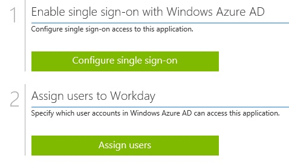

##Enabling the application integration for Workday
  
The objective of this section is to outline how to enable the application integration for Salesforce.

###To enable the application integration for Workday, perform the following steps:

1.  In the Azure Management Portal, on the left navigation pane, click **Active Directory**.

    

2.  From the **Directory** list, select the directory for which you want to enable directory integration.

3.  To open the applications view, in the directory view, click **Applications** in the top menu.

    

4.  To open the **Application Gallery**, click **Add An App**, and then click **Add an application for my organization to use**.

    

5.  In the **search box**, type **Workday**.

    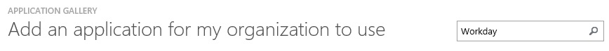

6.  In the results pane, select **Workday**, and then click **Complete** to add the application.

    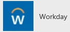

##Configuring single sign-on
  
The objective of this section is to outline how to enable users to authenticate to Workday with their account in Azure AD using federation based on the SAML protocol.  
As part of this procedure, you are required to create a base-64 encoded certificate.  
If you are not familiar with this procedure, see [How to convert a binary certificate into a text file](http://youtu.be/PlgrzUZ-Y1o).

###To configure single sign-on, perform the following steps:

1.  On the **Workday** application integration page, click **Configure single sign-on** to open the **Configure Single Sign On ** dialog.

    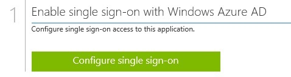

2.  On the **How would you like users to sign on to Workday** page, select **Windows Azure AD Single Sign-On**, and then click **Next**.

    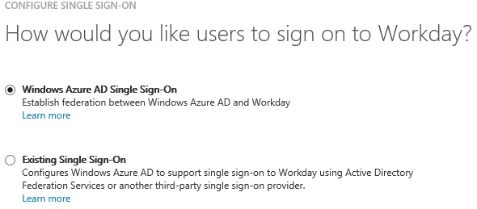

3.  On the **Configure App URL** page, perform the following steps, and then click **Next**.

    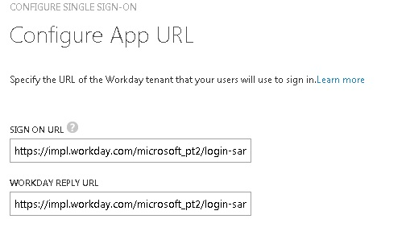

    1.  In the **Sign On URL** textbox, type the URL used by your users to sign in to Workday (e.g.: *https://impl.workday.com/\<tenant\>/login-saml2.htmld*)
    2.  In the **Workday Reply URL** textbox, type the Workday reply URL (e.g.: *https://impl.workday.com/\<tenant\>/login-saml.htmld*).

4.  On the **Configure single sign-on at Workday** page, to download your certificate, click **Download certificate**, and then save the certificate file on your computer.

    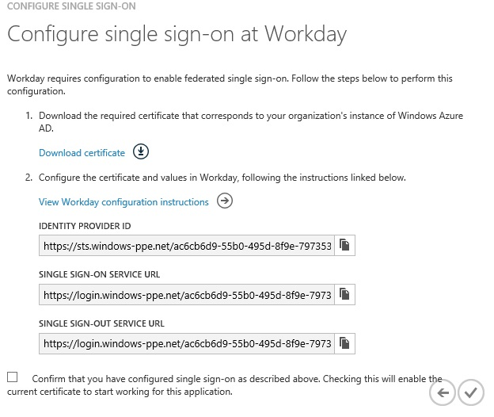

5.  In a different web browser window, log into your Workday company site as an administrator.

6.  Go to **Menu \> Workbench**.

    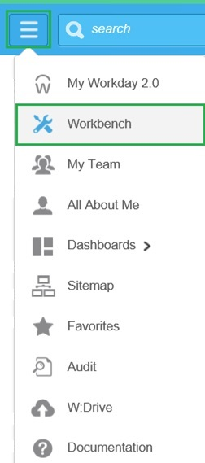

7.  Go to **Account Administration**.

    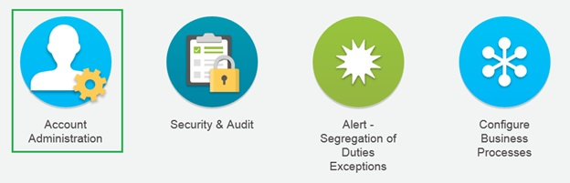

8.  Go to **Edit Tenant Setup – Security**.

    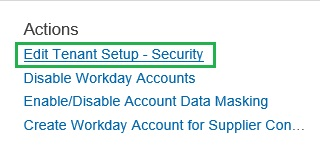

9.  In the **Redirection URLs** section, perform the following steps:

    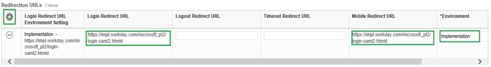

    1.  Click **Add Row**.
    2.  In the **Login Redirect URL** textbox and the **Mobile Redirect URL** textbox, type the **Workday Tenant URL** you have entered on the **Configure App URL** page of the Azure portal.
    3.  In **Environment** textbox, type the environment name.
        >[AZURE.NOTE] The value of the Environment attribute is tied to the value of the tenant URL:

        -   If the domain name of the Workday tenant URL starts with impl (e.g.: *https://impl.workday.com/\<tenant\>/login-saml2.htmld*), the **Environment** attribute must be set to Implementation.
        -   If the domain name starts with something else, you need to contact Workday to get the matching **Environment** value.

10. In the **SAML Setup** section, perform the following steps:

    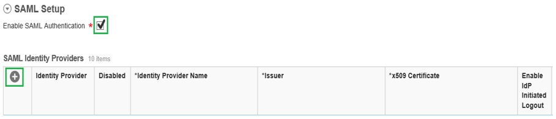

    1.  Select **Enable SAML Authentication**.
    2.  Click **Add Row**.

11. In the SAML Identity Providers section, perform the following steps:

    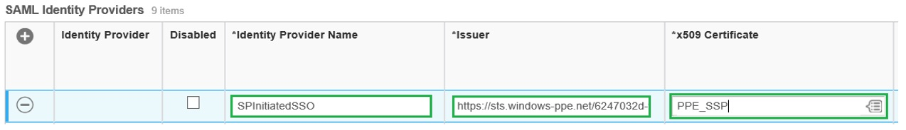

    1.  In the Identity Provider Name textbox, type a provider name (e.g.: *SPInitiatedSSO*).
    2.  In the Azure portal, on the **Configure single sign-on at Workday** dialog page, copy the **Identity Provider ID** value, and then paste it into the **Issuer** textbox.
    3.  Click **Identity Provider Public Key Certificate**, and then click **Create**.
        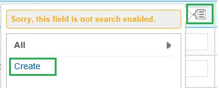
    4.  Click **Create x509 Public Key**.
        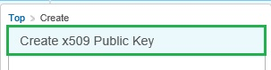
    5.  In the **View x509 Public Key** section, perform the following steps:
        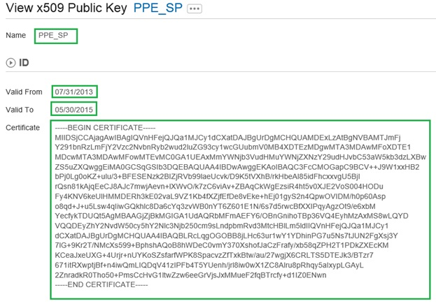
        1.  In the **Name** textbox, type a name for your certificate (e.g.: *PPE\_SP*).
        2.  In the **Valid From** textbox, type the valid from attribute value of your certificate.
        3.  In the **Valid To** textbox, type the valid to attribute value of your certificate.
            >[AZURE.NOTE] You can get the valid from date and the valid to date from the downloaded certificate by double-clicking it. The dates are listed under the **Details** tab.

        4.  Create a **Base-64 encoded** file from your downloaded certificate.
            >[AZURE.TIP] For more details, see [How to convert a binary certificate into a text file](http://youtu.be/PlgrzUZ-Y1o)

        5.  Open your base-64 encoded certificate in notepad, and then copy the content of it.
        6.  In the **Certificate** textbox, paste the content of your clipboard.
        7.  Click **OK**.

    6.  Perform the following steps:
        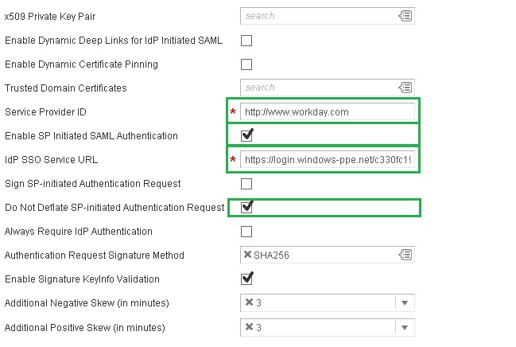
        1.  In the **Service Provider ID** textbox, type **http://www.workday.com**.
        2.  Select **Enable SP Initiated SAML Authentication**.
        3.  In the Azure portal, on the **Configure single sign-on at Workday** dialog page, copy the **Single Sign-On Service URL** value, and then paste it into the **IdP SSO Service URL** textbox.
        4.  Select **Do Not Deflate SP-initiated Authentication Request**.

    7.  Perform the following steps:
        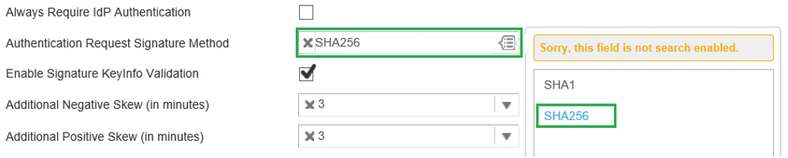
        1.  As **Authentication Request Signature Method**, select **SHA256**.

    8.  Click **OK**.
        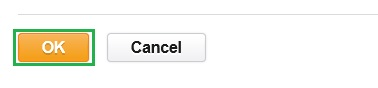

12. In the Azure AD portal, on the **Configure single sign-on at Workday** page, click **Complete** to close the dialog.

    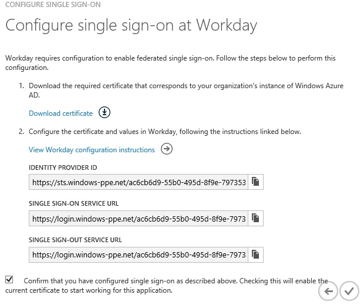

##Configuring user provisioning
  
To get a test user provisioned into Workday, you need to contact the Workday support team.  
The Workday support team will create the user for you.

##Assigning users
  
To test your configuration, you need to grant the Azure AD users you want to allow using your application access to it by assigning them.

###To assign users to Workday, perform the following steps:

1.  In the Azure AD portal, create a test account.

2.  On the **Workday **application integration page, click **Assign users**.

    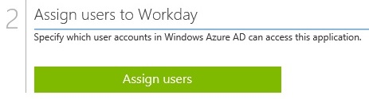

3.  Select your test user, click **Assign**, and then click **Yes** to confirm your assignment.

    
  
If you want to test your single sign-on settings, open the Access Panel. For more details about the Access Panel, see [Introduction to the Access Panel](https://msdn.microsoft.com/library/dn308586).