# Tutorial: Azure Active Directory integration with Workday

In this tutorial, you learn how to integrate Workday with Azure Active Directory (Azure AD).

Integrating Workday with Azure AD provides you with the following benefits:

- You can control in Azure AD who has access to Workday
- You can enable your users to automatically get signed-on to Workday (Single Sign-On) with their Azure AD accounts
- You can manage your accounts in one central location - the Azure portal

If you want to know more details about SaaS app integration with Azure AD, see [what is application access and single sign-on with Azure Active Directory](active-directory-appssoaccess-whatis.md).

## Prerequisites

To configure Azure AD integration with Workday, you need the following items:

- An Azure AD subscription
- A Workday single-sign on enabled subscription

> [!NOTE]
> To test the steps in this tutorial, we do not recommend using a production environment.

To test the steps in this tutorial, you should follow these recommendations:

- Do not use your production environment, unless it is necessary.
- If you don't have an Azure AD trial environment, you can get a one-month trial [here](https://azure.microsoft.com/pricing/free-trial/).

## Scenario description
In this tutorial, you test Azure AD single sign-on in a test environment. 
The scenario outlined in this tutorial consists of two main building blocks:

1. Adding Workday from the gallery
2. Configuring and testing Azure AD single sign-on

## Adding Workday from the gallery
To configure the integration of Workday into Azure AD, you need to add Workday from the gallery to your list of managed SaaS apps.

**To add Workday from the gallery, perform the following steps:**

1. In the **[Azure portal](https://portal.azure.com)**, on the left navigation panel, click **Azure Active Directory** icon. 

	![Active Directory][1]

2. Navigate to **Enterprise applications**. Then go to **All applications**.

	![Applications][2]
	
3. To add new application, click **New application** button on the top of dialog.

	![Applications][3]

4. In the search box, type **Workday**.

	

5. In the results panel, select **Workday**, and then click **Add** button to add the application.

	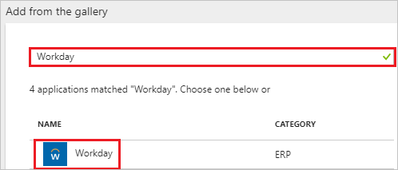

##  Configuring and testing Azure AD single sign-on
In this section, you configure and test Azure AD single sign-on with Workday based on a test user called "Britta Simon."

For single sign-on to work, Azure AD needs to know what the counterpart user in Workday is to a user in Azure AD. In other words, a link relationship between an Azure AD user and the related user in Workday needs to be established.

This link relationship is established by assigning the value of the **user name** in Azure AD as the value of the **Username** in Workday.

To configure and test Azure AD single sign-on with Workday, you need to complete the following building blocks:

1. **[Configuring Azure AD Single Sign-On](#configuring-azure-ad-single-sign-on)** - to enable your users to use this feature.
2. **[Creating an Azure AD test user](#creating-an-azure-ad-test-user)** - to test Azure AD single sign-on with Britta Simon.
3. **[Creating a Workday test user](#creating-a-workday-test-user)** - to have a counterpart of Britta Simon in Workday that is linked to the Azure AD representation of user.
4. **[Assigning the Azure AD test user](#assigning-the-azure-ad-test-user)** - to enable Britta Simon to use Azure AD single sign-on.
5. **[Testing Single Sign-On](#testing-single-sign-on)** - to verify whether the configuration works.

### Configuring Azure AD single sign-on

In this section, you enable Azure AD single sign-on in the Azure portal and configure single sign-on in your Workday application.

**To configure Azure AD single sign-on with Workday, perform the following steps:**

1. In the Azure portal, on the **Workday** application integration page, click **Single sign-on**.

	![Configure Single Sign-On][4]

2. On the **Single sign-on** dialog, select **Mode** as	**SAML-based Sign-on** to enable single sign-on.
 
	

3. On the **Workday Domain and URLs** section, perform the following steps:

	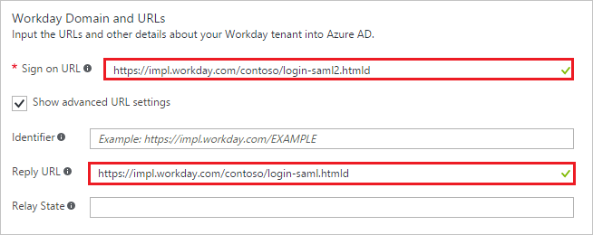

    a. In the **Sign-on URL** textbox, type the value as: `https://impl.workday.com/<tenant>/login-saml2.htmld`

	b. In the **Reply URL** textbox, type a URL using the following pattern: `https://impl.workday.com/<tenant>/login-saml.htmld`

	> [!NOTE] 
	> These values are not the real. Update these values with the actual Sign-on URL and Reply URL. Your reply URL must have a subdomain for example: www, wd2, wd3, wd3-impl, wd5, wd5-impl). 
    > Using something like "*http://www.myworkday.com*" works but "*http://myworkday.com*" does not. Contact [Workday Client support team](https://www.workday.com/en-us/partners-services/services/support.html) to get these values. 
 

4. On the **SAML Signing Certificate** section, click **Certificate (Base64)** and then save the certificate file on your computer.

	 

5. Click **Save** button.

	

6. On the **Workday Configuration** section, click **Configure Workday** to open **Configure sign-on** window. Copy the **Sign-Out URL, SAML Entity ID, and SAML Single Sign-On Service URL** from the **Quick Reference section.**

	 
<CS>
7. In a different web browser window, log in to your Workday company site as an administrator.

8. Go to **Menu \> Workbench**.
   
    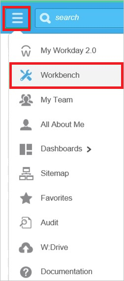

9. Go to **Account Administration**.
   
    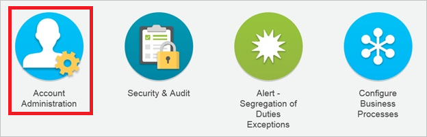

10. Go to **Edit Tenant Setup – Security**.
   
    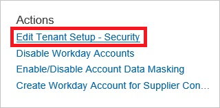

11. In the **Redirection URLs** section, perform the following steps:
   
    
   
    a. Click **Add Row**.
   
    b. In the **Login Redirect URL** textbox and the **Mobile Redirect URL** textbox, type the **Sign-on URL** you have entered on the **Workday Domain and URLs** section of the Azure portal.
   
    c. In the Azure portal, on the **Configure sign-on** window, copy the **Sign-Out URL**, and then paste it into the **Logout Redirect URL** textbox.
   
    d.  In **Environment** textbox, type the environment name.  

    >[!NOTE]
    > The value of the Environment attribute is tied to the value of the tenant URL:  
    >-If the domain name of the Workday tenant URL starts with impl for example: *https://impl.workday.com/\<tenant\>/login-saml2.htmld*), the **Environment** attribute must be set to Implementation.  
    >-If the domain name starts with something else, you need to contact [Workday Client support team](https://www.workday.com/en-us/partners-services/services/support.html) to get the matching **Environment** value.

12. In the **SAML Setup** section, perform the following steps:
   
    
   
    a.  Select **Enable SAML Authentication**.
   
    b.  Click **Add Row**.

13. In the SAML Identity Providers section, perform the following steps:
   
    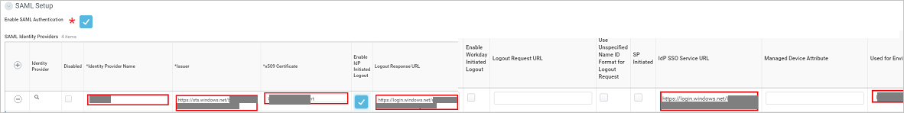
   
    a. In the Identity Provider Name textbox, type a provider name (for example: *SPInitiatedSSO*).
   
    b. In the Azure portal, on the **Configure sign-on** window, copy the **SAML Entity ID** value, and then paste it into the **Issuer** textbox.
   
    c. Select **Enable Workday Initiated Logout**.
   
    d. In the Azure portal, on the **Configure sign-on** window, copy the **Sign-Out URL** value, and then paste it into the **Logout Request URL** textbox.

    e. Click **Identity Provider Public Key Certificate**, and then click **Create**. 

    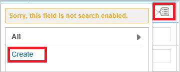

    f. Click **Create x509 Public Key**. 

    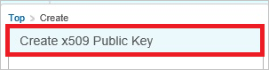

14. In the **View x509 Public Key** section, perform the following steps: 
   
    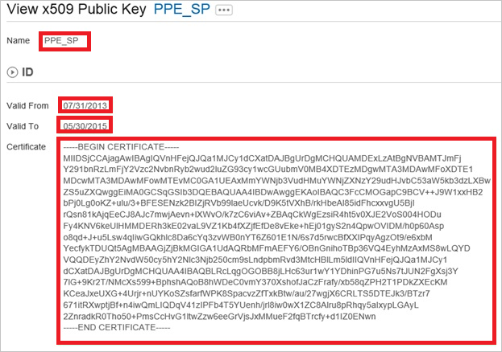 
   
    a. In the **Name** textbox, type a name for your certificate (for example: *PPE\_SP*).
   
    b. In the **Valid From** textbox, type the valid from attribute value of your certificate.
   
    c.  In the **Valid To** textbox, type the valid to attribute value of your certificate.
   
    > [!NOTE]
    > You can get the valid from date and the valid to date from the downloaded certificate by double-clicking it.  The dates are listed under the **Details** tab.
    > 
    >
   
    d.  Open your base-64 encoded certificate in notepad, and then copy the content of it.
   
    e.  In the **Certificate** textbox, paste the content of your clipboard.
   
    f.  Click **OK**.

15. Perform the following steps: 
   
    
   
    a.  Enable the **x509 Private Key Pair**.
   
    b.  In the **Service Provider ID** textbox, type **http://www.workday.com**.
   
    c.  Select **Enable SP Initiated SAML Authentication**.
   
    d.  In the Azure portal, on the **Configure sign-on** window, copy the **SAML Single Sign-On Service URL** value, and then paste it into the **IdP SSO Service URL** textbox.
   
    e. Select **Do Not Deflate SP-initiated Authentication Request**.
   
    f. As **Authentication Request Signature Method**, select **SHA256**. 
   
     
   
    g. Click **OK**. 
   
    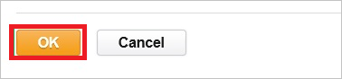
<CE>

> [!TIP]
> You can now read a concise version of these instructions inside the [Azure portal](https://portal.azure.com), while you are setting up the app!  After adding this app from the **Active Directory > Enterprise Applications** section, simply click the **Single Sign-On** tab and access the embedded documentation through the **Configuration** section at the bottom. You can read more about the embedded documentation feature here: [Azure AD embedded documentation]( https://go.microsoft.com/fwlink/?linkid=845985)
>

### Creating an Azure AD test user
The objective of this section is to create a test user in the Azure portal called Britta Simon.

![Create Azure AD User][100]

**To create a test user in Azure AD, perform the following steps:**

1. In the **Azure portal**, on the left navigation pane, click **Azure Active Directory** icon.

	 

2. To display the list of users, go to **Users and groups** and click **All users**.
	
	 

3. To open the **User** dialog, click **Add** on the top of the dialog.
 
	 

4. On the **User** dialog page, perform the following steps:
 
	 

    a. In the **Name** textbox, type **BrittaSimon**.

    b. In the **User name** textbox, type the **email address** of BrittaSimon.

	c. Select **Show Password** and write down the value of the **Password**.

    d. Click **Create**.
 
### Creating a Workday test user

To get a test user provisioned into Workday, you need to contact the [Workday Client support team](https://www.workday.com/en-us/partners-services/services/support.html).
The [Workday Client support team](https://www.workday.com/en-us/partners-services/services/support.html) creates the user for you.

### Assigning the Azure AD test user

In this section, you enable Britta Simon to use Azure single sign-on by granting access to Workday.

![Assign User][200] 

**To assign Britta Simon to Workday, perform the following steps:**

1. In the Azure portal, open the applications view, and then navigate to the directory view and go to **Enterprise applications** then click **All applications**.

	![Assign User][201] 

2. In the applications list, select **Workday**.

	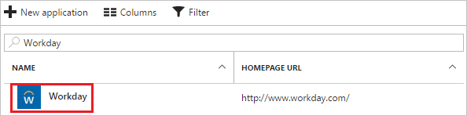 

3. In the menu on the left, click **Users and groups**.

	![Assign User][202] 

4. Click **Add** button. Then select **Users and groups** on **Add Assignment** dialog.

	![Assign User][203]

5. On **Users and groups** dialog, select **Britta Simon** in the Users list.

6. Click **Select** button on **Users and groups** dialog.

7. Click **Assign** button on **Add Assignment** dialog.
	
### Testing single sign-on

If you want to test your single sign-on settings, open the Access Panel. For more information about the Access Panel, see [Introduction to the Access Panel](active-directory-saas-access-panel-introduction.md).

## Additional resources

* [List of Tutorials on How to Integrate SaaS Apps with Azure Active Directory](active-directory-saas-tutorial-list.md)
* [What is application access and single sign-on with Azure Active Directory?](active-directory-appssoaccess-whatis.md)
* [Configure User Provisioning](active-directory-saas-workday-inbound-tutorial.md)

<!--Image references-->

[1]: ./media/active-directory-saas-workday-tutorial/tutorial_general_01.png
[2]: ./media/active-directory-saas-workday-tutorial/tutorial_general_02.png
[3]: ./media/active-directory-saas-workday-tutorial/tutorial_general_03.png
[4]: ./media/active-directory-saas-workday-tutorial/tutorial_general_04.png

[100]: ./media/active-directory-saas-workday-tutorial/tutorial_general_100.png

[200]: ./media/active-directory-saas-workday-tutorial/tutorial_general_200.png
[201]: ./media/active-directory-saas-workday-tutorial/tutorial_general_201.png
[202]: ./media/active-directory-saas-workday-tutorial/tutorial_general_202.png
[203]: ./media/active-directory-saas-workday-tutorial/tutorial_general_203.png

