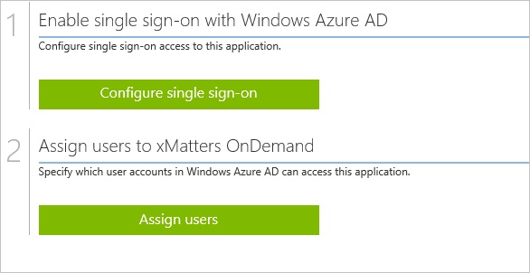
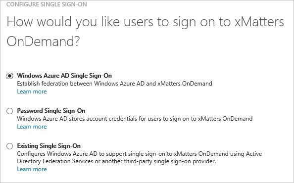
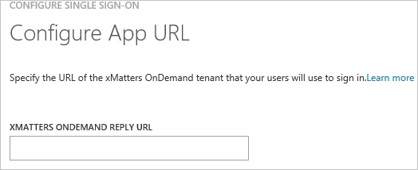
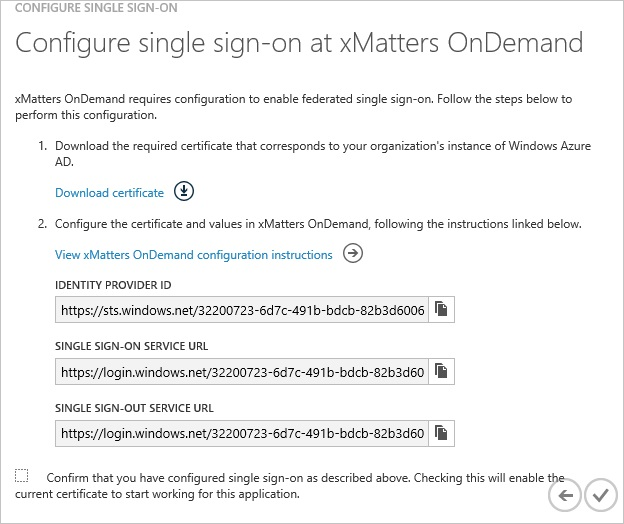
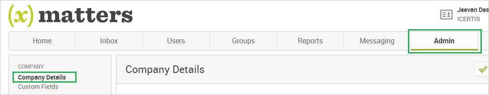
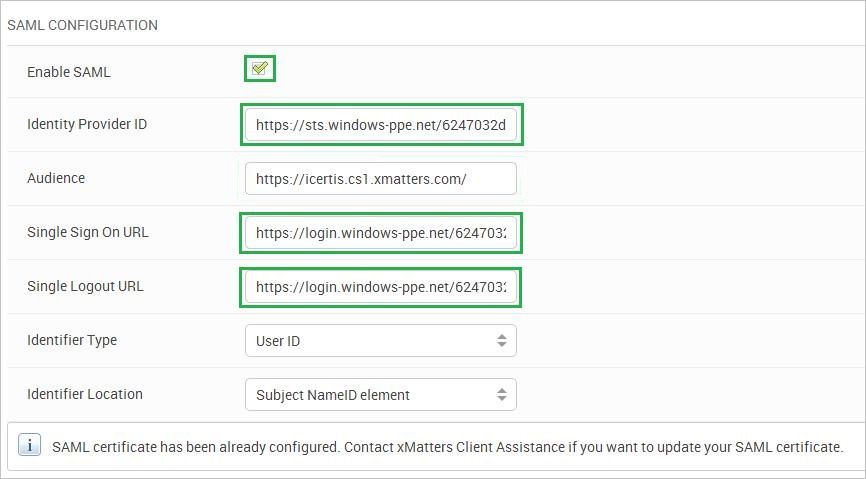
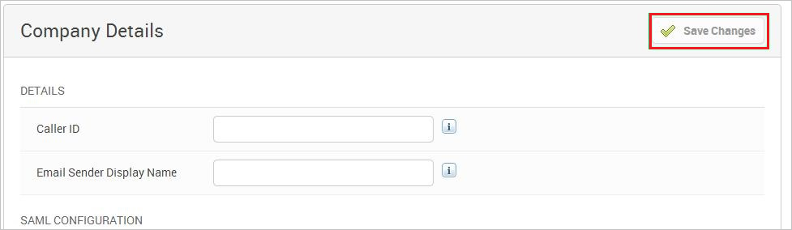
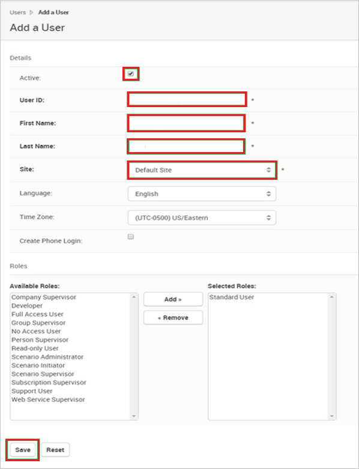

<properties 
    pageTitle="Tutorial: Azure Active Directory Integration with xMatters OnDemand | Microsoft Azure"
    description="Learn how to use xMatters OnDemand with Azure Active Directory to enable single sign-on, automated provisioning, and more!" 
    services="active-directory" 
    authors="jeevansd"  
    documentationCenter="na" 
    manager="femila"/>
<tags 
    ms.service="active-directory" 
    ms.devlang="na" 
    ms.topic="article" 
    ms.tgt_pltfrm="na" 
    ms.workload="identity" 
    ms.date="06/20/2016" 
    ms.author="jeedes" />

#Tutorial: Azure Active Directory Integration with xMatters OnDemand
  
The objective of this tutorial is to show the integration of Azure and xMatters OnDemand. The scenario outlined in this tutorial assumes that you already have the following items:

-   A valid Azure subscription
-   A xMatters OnDemand tenant
  
After completing this tutorial, the Azure AD users you have assigned to xMatters OnDemand will be able to single sign into the application at your xMatters OnDemand company site (service provider initiated sign on), or using the [Introduction to the Access Panel](active-directory-saas-access-panel-introduction.md).
  
The scenario outlined in this tutorial consists of the following building blocks:

1.  Enabling the application integration for xMatters OnDemand
2.  Configuring single sign-on
3.  Configuring user provisioning
4.  Assigning users

##Enabling the application integration for xMatters OnDemand
  
The objective of this section is to outline how to enable the application integration for xMatters OnDemand.

###To enable the application integration for xMatters OnDemand, perform the following steps:

1.  In the Azure classic portal, on the left navigation pane, click **Active Directory**.

    

2.  From the **Directory** list, select the directory for which you want to enable directory integration.

3.  To open the applications view, in the directory view, click **Applications** in the top menu.

    

4.  Click **Add** at the bottom of the page.

    

5.  On the **What do you want to do** dialog, click **Add an application from the gallery**.

    

6.  In the **search box**, type **xMatters OnDemand**.

    

7.  In the results pane, select **XMatters OnDemand**, and then click **Complete** to add the application.

    

##Configuring single sign-on
  
The objective of this section is to outline how to enable users to authenticate to XMatters OnDemand with their account in Azure AD using federation based on the SAML protocol.

###To configure single sign-on, perform the following steps:

1.  In the Azure classic portal, on the **XMatters OnDemand** application integration page, click **Configure single sign-on** to open the **Configure Single Sign On ** dialog.

    

2.  On the **How would you like users to sign on to XMatters OnDemand** page, select **Microsoft Azure AD Single Sign-On**, and then click **Next**.

    

3.  On the **Configure App URL** page, perform the following steps:

    

	a. In the **XMatters OnDemand Sign In URL** textbox, type your URL using the following pattern: `https://<tenant-name>.XMattersOnDemandapp.com`

	b. Click **Next**.

4.  On the **Configure single sign-on at XMatters OnDemand** page, to download your certificate, click **Download certificate**, and then save the certificate file locally as **c:\\XMatters OnDemand.cer**.

    >[AZURE.IMPORTANT] You need to forward the certificate to the xMatters support team. The certificate needs to be uploaded by the xMatters support team before you can finalize the single sign-on configuration.

    

5.  In a different web browser window, log into your XMatters OnDemand company site as an administrator.

6.  In the toolbar on the top, click **Admin**, and then click **Company Details** in the navigation bar on the left side.

    

7.  On the **SAML Configuration** page, perform the following steps:

    

    1.  Select **Enable SAML**.
    2.  In the Azure classic portal, on the **Configure single sign-on at XMatters OnDemand** dialog page, copy the **Identity Provider ID** value, and then paste it into the **Identity Provider ID** textbox.
    3.  In the Azure classic portal, on the **Configure single sign-on at XMatters OnDemand** dialog page, copy the **Single Sign-On Service URL** value, and then paste it into the **Single Sign On URL** textbox.
    4.  In the Azure classic portal, on the **Configure single sign-on at XMatters OnDemand** dialog page, copy the **Single Sign-Out Service URL** value, and then paste it into the **Single Logout URL** textbox.
    5.  On the Company Details page, at the top, click **Save Changes**.
        

8.  On the Azure classic portal, select the single sign-on configuration confirmation, and then click **Complete** to close the **Configure Single Sign On** dialog.

    

##Configuring user provisioning
  
In order to enable Azure AD users to log into XMatters OnDemand, they must be provisioned into XMatters OnDemand.  
In the case of XMatters OnDemand, provisioning is a manual task.

###To provision a user accounts, perform the following steps:

1.  Log in to your **XMatters OnDemand** tenant.

2.  Click the **Users** tab.

3.  Click **Add User**.

    

4.  Select **Active**.

5.  In the **Add a User** section, perform the following steps:

    

    1.  Enter the **UserID**, **First name**, **Last name**, **Site** of a valid AAD account you want to provision.
    2.  Click **Save**.

>[AZURE.NOTE] You can use any other XMatters OnDemand user account creation tools or APIs provided by XMatters OnDemand to provision AAD user accounts.

##Assigning users
  
To test your configuration, you need to grant the Azure AD users you want to allow using your application access to it by assigning them.

###To assign users to XMatters OnDemand, perform the following steps:

1.  In the Azure classic portal, create a test account.

2.  On the **XMatters OnDemand **application integration page, click **Assign users**.

    

3.  Select your test user, click **Assign**, and then click **Yes** to confirm your assignment.

    
  
If you want to test your single sign-on settings, open the Access Panel. For more details about the Access Panel, see [Introduction to the Access Panel](active-directory-saas-access-panel-introduction.md).