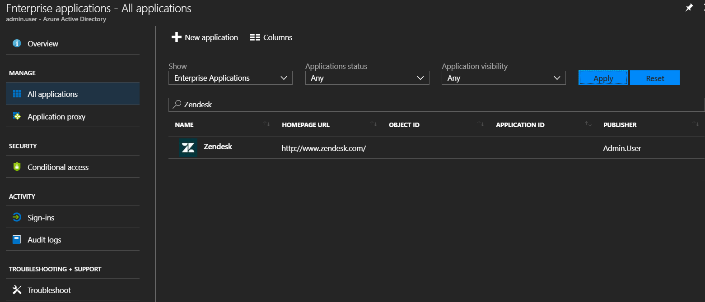
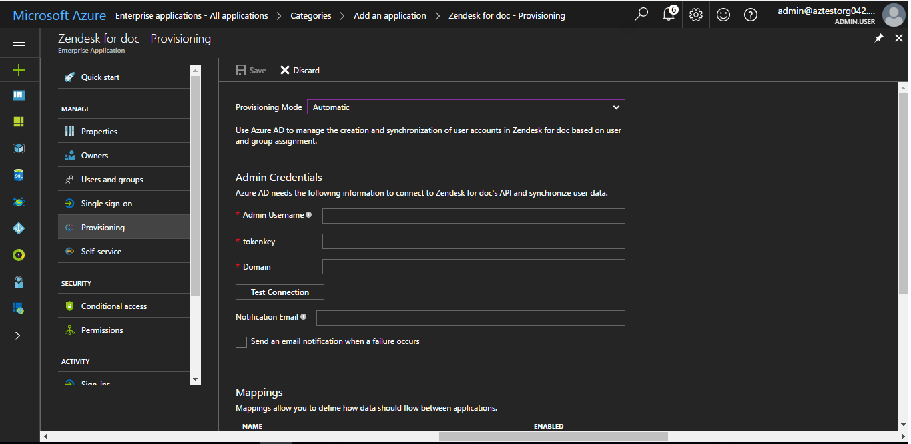
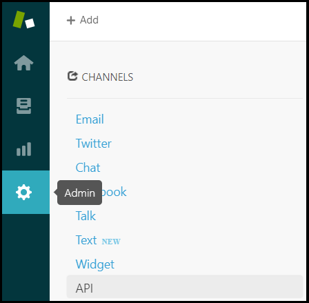
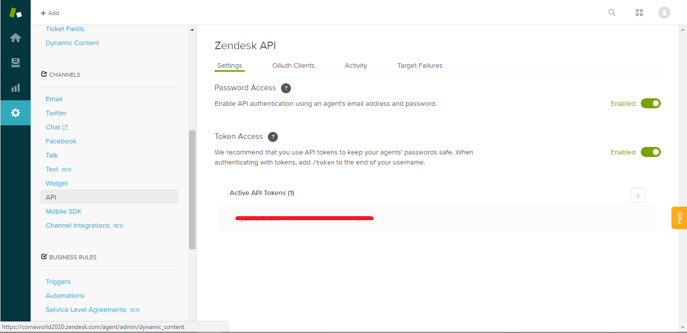

# Tutorial: Configure Zendesk for automatic user provisioning

The objective of this tutorial is to demonstrate the steps that are needed to be performed in Zendesk and Azure Active Directory (Azure AD) to configure the automatic provisioning and de-provisioning of users and/or groups from Azure AD to Zendesk. 

## Prerequisites

The scenario outlined in this tutorial assumes that you already have the following items:

*   An Azure AD tenant
*   A Zendesk tenant with the [Enterprise](https://www.zendesk.com/product/pricing/) plan or better enabled 
*   A user account in Zendesk with Admin permissions 

> [!NOTE]
> The Azure AD provisioning integration relies on the [Zendesk Rest API](https://developer.zendesk.com/rest_api/docs/core/introduction), which is available to Zendesk teams on the Enterprise plan or better.

## Assigning users to Zendesk

Azure Active Directory uses a concept called "assignments" to determine which users should receive access to selected apps. In the context of automatic user provisioning, only the users and/or groups that have been "assigned" to an application in Azure AD are synchronized. 

Before configuring and enabling automatic user provisioning, you should decide which users and/or groups in Azure AD will need access to Zendesk. Once decided, you can assign these users and/or groups to Zendesk by following the instructions here:

*   [Assign a user or group to an enterprise app](active-directory-coreapps-assign-user-azure-portal.md)

### Important tips for assigning users to Zendesk

*	It is recommended that a single Azure AD user is assigned to Zendesk to test the automatic user provisioning configuration. Additional users and/or groups may be assigned later.

*	When assigning a user to Zendesk, you must select either the **User** role or another valid application-specific role (if available) in the assignment dialog. Users with the **Default Access** role are excluded from provisioning.

## Configuring automatic user provisioning to Zendesk 

This section will guide you through connecting your Azure AD to Zendesk's user roster by configuring the Azure AD provisioning service, which will utilize Zendesk's user provisioning API to create, update and disable users and/or groups in Zendesk based on user and/or group assignments in Azure AD.

> [!TIP]
> You may also choose to enable SAML-based single sign-on for Zendesk, following the instructions provided in the [Zendesk single sign-on tutorial](active-directory-saas-zendesk-tutorial.md). Single sign-on can be configured independently of automatic user provisioning, though these two features compliment each other.

### To configure automatic user provisioning to Zendesk in Azure AD:

1. Sign in to the [Azure portal](https://portal.azure.com) and browse to **Azure Active Directory > Enterprise applications > All applications**.

2. If you have already configured Zendesk for single sign-on, proceed to the next step. Otherwise, select **New application** and search for Zendesk in the application gallery. Select Zendesk from the search results, and add it to your list of applications.
	
3. Select your instance of Zendesk, then select the **Provisioning** tab.
	
	

4. Set the **Provisioning Mode** to **Automatic**.

	

5. Under the **Admin Credentials** section, input the **Admin Username, Secret Token and Domain** of your Zendesk's account. Examples of these values are:

*   In the **Admin Username** field, 

*   In the **Secret Token** field,

*   In the **Domain** field,

6. You can find the **Secret Token** for your Zendesk account in **Admin > API > Settings**. 

	

	

7. Upon populating the fields shown above, click **Test Connection** to ensure Azure AD can connect to your Zendesk app. If the connection fails, ensure your Zendesk account has Admin permissions and try again.

8. In the **Notification Email** field, enter the email address of a person or group who should receive provisioning error notifications and check the checkbox **Send an email notification when a failure occurs**.

9. Click **Save**.

10. Under the **Mappings** section, select **Synchronize Azure Active Directory Users to Zendesk**.

11. Review the user attributes that are synchronized from Azure AD to Zendesk in the **Attribute Mappings** section. The attributes selected as **Matching** properties are used to match the user accounts in Zendesk for update operations. Select the **Save** button to commit any changes.

12. To configure scoping filters, refer to the following instructions provided in the [Scoping filter tutorial]().

13. Under the **Mappings** section, select **Synchronize Azure Active Directory Groups to ZenDesk**.

14. Review the group attributes that are synchronized from Azure AD to Zendesk. The attributes selected as **Matching** properties are used to match the groups in Zendesk for update operations. Select the **Save** button to commit any changes.

15. To configure scoping filters, refer to the following instructions provided in the [Scoping filter tutorial]().

16. To enable the Azure AD provisioning service for Zendesk, change the **Provisioning Status** to **On** in the **Settings** section.

17. Define the users and/or groups that you would like to provision to Zendesk by choosing the desired values in **Scope** in the **Settings** section.

18. When you are complete and ready to provision, click **Save**. 

This starts the initial synchronization of all users and/or groups defined in **Scope** in the **Settings** section. The initial sync takes longer to perform than subsequent syncs, which occur approximately every 20 minutes as long as the Azure AD provisioning service is running. You can use the **Synchronization Details** section to monitor progress and follow links to provisioning activity reports, which describes all actions performed by the Azure AD provisioning service on Zendesk.

For more information on how to read the Azure AD provisioning logs, see [Reporting on automatic user account provisioning](https://docs.microsoft.com/azure/active-directory/active-directory-saas-provisioning-reporting).

## Additional resources

* [Managing user account provisioning for Enterprise Apps](active-directory-enterprise-apps-manage-provisioning.md)
* [What is application access and single sign-on with Azure Active Directory?](active-directory-appssoaccess-whatis.md)

## Next steps

* [Learn how to review logs and get reports on provisioning activity](active-directory-saas-provisioning-reporting.md)
