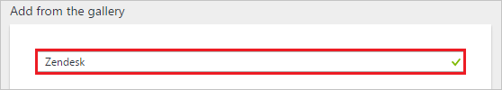
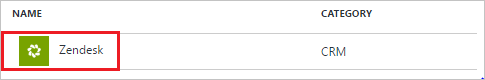
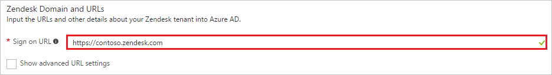
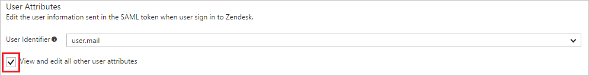
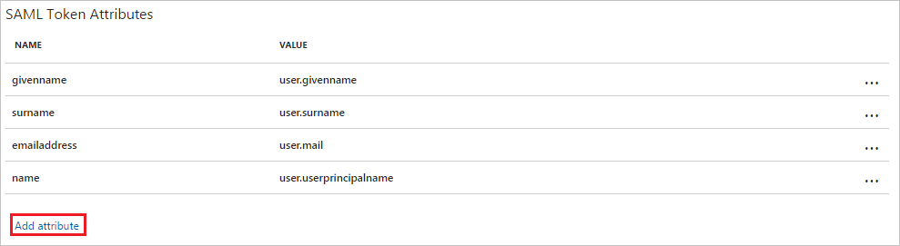
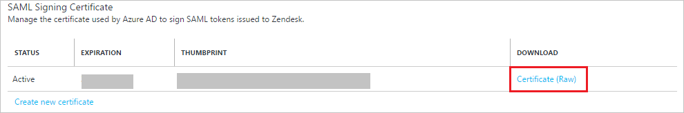
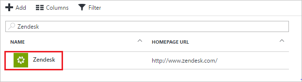

# Tutorial: Azure Active Directory integration with Zendesk

In this tutorial, you learn how to integrate Zendesk with Azure Active Directory (Azure AD).

Integrating Zendesk with Azure AD provides you with the following benefits:

- You can control in Azure AD who has access to Zendesk
- You can enable your users to automatically get signed-on to Zendesk (Single Sign-On) with their Azure AD accounts
- You can manage your accounts in one central location - the Azure portal

If you want to know more details about SaaS app integration with Azure AD, see [what is application access and single sign-on with Azure Active Directory](active-directory-appssoaccess-whatis.md).

## Prerequisites

To configure Azure AD integration with Zendesk, you need the following items:

- An Azure AD subscription
- A Zendesk single sign-on enabled subscription

> [!NOTE]
> To test the steps in this tutorial, we do not recommend using a production environment.

To test the steps in this tutorial, you should follow these recommendations:

- Do not use your production environment, unless it is necessary.
- If you don't have an Azure AD trial environment, you can get a one-month trial [here](https://azure.microsoft.com/pricing/free-trial/).

## Scenario description
In this tutorial, you test Azure AD single sign-on in a test environment. 
The scenario outlined in this tutorial consists of two main building blocks:

1. Adding Zendesk from the gallery
2. Configuring and testing Azure AD single sign-on

## Adding Zendesk from the gallery
To configure the integration of Zendesk into Azure AD, you need to add Zendesk from the gallery to your list of managed SaaS apps.

**To add Zendesk from the gallery, perform the following steps:**

1. In the **[Azure Portal](https://portal.azure.com)**, on the left navigation panel, click **Azure Active Directory** icon. 

	![Active Directory][1]

2. Navigate to **Enterprise applications**. Then go to **All applications**.

	![Applications][2]
	
3. Click **New application** button on the top of the dialog.

	![Applications][3]

4. In the search box, type **Zendesk**.

	

5. In the results panel, select **Zendesk**, and then click **Add** button to add the application.

	

##  Configuring and testing Azure AD single sign-on
In this section, you configure and test Azure AD single sign-on with Zendesk based on a test user called "Britta Simon".

For single sign-on to work, Azure AD needs to know what the counterpart user in Zendesk is to a user in Azure AD. In other words, a link relationship between an Azure AD user and the related user in Zendesk needs to be established.

This link relationship is established by assigning the value of the **user name** in Azure AD as the value of the **Username** in Zendesk.

To configure and test Azure AD single sign-on with Zendesk, you need to complete the following building blocks:

1. **[Configuring Azure AD Single Sign-On](#configuring-azure-ad-single-sign-on)** - to enable your users to use this feature.
2. **[Creating an Azure AD test user](#creating-an-azure-ad-test-user)** - to test Azure AD single sign-on with Britta Simon.
3. **[Creating a Zendesk test user](#creating-a-zendesk-test-user)** - to have a counterpart of Britta Simon in Zendesk that is linked to the Azure AD representation of user.
4. **[Assigning the Azure AD test user](#assigning-the-azure-ad-test-user)** - to enable Britta Simon to use Azure AD single sign-on.
5. **[Testing Single Sign-On](#testing-single-sign-on)** - to verify whether the configuration works.

### Configuring Azure AD single sign-on

In this section, you enable Azure AD single sign-on in the Azure portal and configure single sign-on in your Zendesk application.

**To configure Azure AD single sign-on with Zendesk, perform the following steps:**

1. In the Azure portal, on the **Zendesk** application integration page, click **Single sign-on**.

	![Configure Single Sign-On][4]

2. On the **Single sign-on** dialog, select **Mode** as	**SAML-based Sign-on** to enable single sign-on.
 
	

3. On the **Zendesk Domain and URLs** section, perform the following steps:

	

    a. In the **Sign-on URL** textbox, type the value using the following pattern: `https://<subdomain>.zendesk.com`

	b. In the **Identifier** textbox, type the value using the following pattern: `https://<subdomain>.zendesk.com`

	> [!NOTE] 
	> These values are not real. Update these values with the actual Sign-on URL and Identifier URL. Contact [Zendesk support team](https://support.zendesk.com/hc/articles/203663676-Using-SAML-for-single-sign-on-Professional-and-Enterprise) to get these values. 

4. Zendesk expects the SAML assertions in a specific format. There are no mandatory SAML attributes but optionally you can add an attribute from **User Attributes** section by following the below steps: 

     

	a. Click the **View and edit all the other attributes** check box.
     
    
   
    b. Click the **Add Attribute** to open **Add attribute** dialog.
    
    

    c. In the **Name** textbox, type the attribute name (for example **emailaddress**).
	
	d. From the **Value** list, select the attribute value (as **user.mail**).
	
	e. Click **Ok**
 
    > [!NOTE] 
    > You use extension attributes to add attributes that are not in Azure AD by default. Click [User attributes that can be set in SAML](https://support.zendesk.com/hc/en-us/articles/203663676-Using-SAML-for-single-sign-on-Professional-and-Enterprise-) to get the complete list of SAML attributes that **Zendesk** accepts. 

5. On the **SAML Signing Certificate** section, copy the **THUMBPRINT** value of certificate.

	 

6. On the **Zendesk Configuration** section, click **Configure Zendesk** to open **Configure sign-on** window. Copy the **Sign-Out URL and SAML Single Sign-On Service URL** from the **Quick Reference section.**

	 

7. In a different web browser window, log into your Zendesk company site as an administrator.

8. Click **Admin**.

9. In the left navigation pane, click **Settings**, and then click **Security**.

10. On the **Security** page, perform the following steps: 
   
     

    

     a. Click the **Admin & Agents** tab.

     b. Select **Single sign-on (SSO) and SAML**, and then select **SAML**.

     c. In **SAML SSO URL** textbox, paste the value of **SAML Single Sign-On Service URL** which you have copied from Azure portal. 

     d. In **Remote Logout URL** textbox, paste the value of **Sign-Out URL** which you have copied from Azure portal.
        
     e. In **Certificate Fingerprint** textbox, paste the **Thumbprint** value of certificate which you have copied from Azure portal.
     
     f. Click **Save**.

### Creating an Azure AD test user
The objective of this section is to create a test user in the Azure portal called Britta Simon.

![Create Azure AD User][100]

**To create a test user in Azure AD, perform the following steps:**

1. In the **Azure portal**, on the left navigation pane, click **Azure Active Directory** icon.

	 

2. To display the list of users go to **Users and groups** and click **All users**.
	
	 

3. At the top of the dialog, click **Add** to open the **User** dialog.
 
	 

4. On the **User** dialog page, perform the following steps:
 
	 

    a. In the **Name** textbox, type **BrittaSimon**.

    b. In the **User name** textbox, type the **email address** of BrittaSimon.

	c. Select **Show Password** and write down the value of the **Password**.

    d. Click **Create**. 

### Creating a Zendesk test user

To enable Azure AD users to log into **Zendesk**, they must be provisioned into **Zendesk**.  
Depending on the role assigned in the apps, it's the expected behavior:

 1. **End-user** accounts are automatically provisioned when signing in.
 2. **Agent** and **Admin** accounts need to be manually provisioned in **Zendesk** before signing in.
 
**To provision a user account, perform the following steps:**

1. Log in to your **Zendesk** tenant.

2. Select the **Customer List** tab.

3. Select the **User** tab, and click **Add**.
   
    
4. Type the email address of an existing Azure AD account you want to provision, and then click **Save**.
   
    

> [!NOTE]
> You can use any other Zendesk user account creation tools or APIs provided by Zendesk to provision AAD user accounts.

### Assigning the Azure AD test user

In this section, you enable Britta Simon to use Azure single sign-on by granting access to Zendesk.

![Assign User][200] 

**To assign Britta Simon to Zendesk, perform the following steps:**

1. In the Azure portal, open the applications view, and then navigate to the directory view and go to **Enterprise applications** then click **All applications**.

	![Assign User][201] 

2. In the applications list, select **Zendesk**.

	 

3. In the menu on the left, click **Users and groups**.

	![Assign User][202] 

4. Click **Add** button. Then select **Users and groups** on **Add Assignment** dialog.

	![Assign User][203]

5. On **Users and groups** dialog, select **Britta Simon** in the Users list.

6. Click **Select** button on **Users and groups** dialog.

7. Click **Assign** button on **Add Assignment** dialog.
	
### Testing single sign-on

In this section, you test your Azure AD single sign-on configuration using the Access Panel.

When you click the Zendesk tile in the Access Panel, you should get automatically signed-on to your Zendesk application.
For more information about the Access Panel, see [Introduction to the Access Panel](active-directory-saas-access-panel-introduction.md).

## Additional resources

* [List of Tutorials on How to Integrate SaaS Apps with Azure Active Directory](active-directory-saas-tutorial-list.md)
* [What is application access and single sign-on with Azure Active Directory?](active-directory-appssoaccess-whatis.md)

<!--Image references-->

[1]: ./media/active-directory-saas-zendesk-tutorial/tutorial_general_01.png
[2]: ./media/active-directory-saas-zendesk-tutorial/tutorial_general_02.png
[3]: ./media/active-directory-saas-zendesk-tutorial/tutorial_general_03.png
[4]: ./media/active-directory-saas-zendesk-tutorial/tutorial_general_04.png

[100]: ./media/active-directory-saas-zendesk-tutorial/tutorial_general_100.png

[200]: ./media/active-directory-saas-zendesk-tutorial/tutorial_general_200.png
[201]: ./media/active-directory-saas-zendesk-tutorial/tutorial_general_201.png
[202]: ./media/active-directory-saas-zendesk-tutorial/tutorial_general_202.png
[203]: ./media/active-directory-saas-zendesk-tutorial/tutorial_general_203.png
