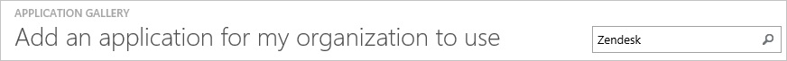
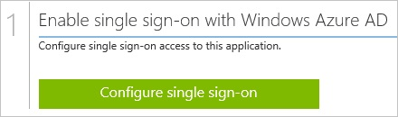
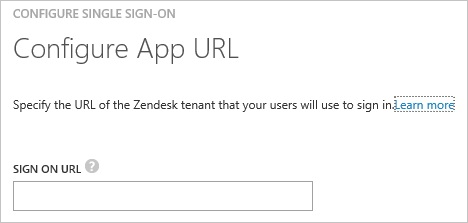
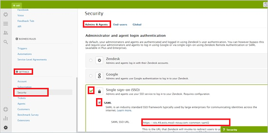
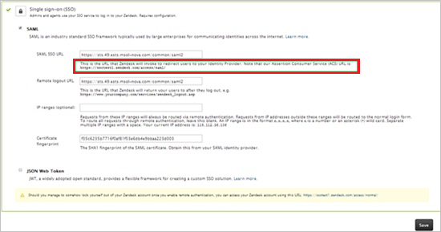
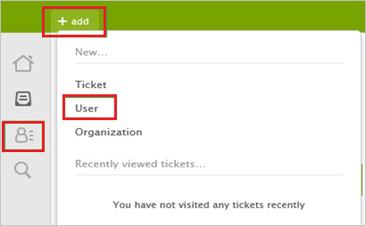
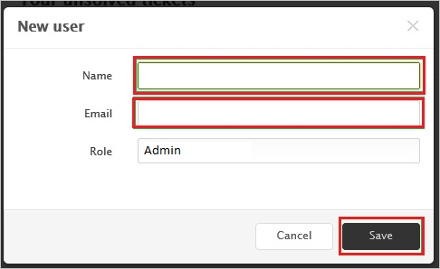

<properties 
    pageTitle="Tutorial: Azure Active Directory integration with Zendesk | Microsoft Azure" 
    description="Learn how to use Zendesk with Azure Active Directory to enable single sign-on, automated provisioning, and more!." 
    services="active-directory" 
    authors="jeevansd"  
    documentationCenter="na" 
    manager="stevenpo"/>
<tags 
    ms.service="active-directory" 
    ms.devlang="na" 
    ms.topic="article" 
    ms.tgt_pltfrm="na" 
    ms.workload="identity" 
    ms.date="06/20/2016" 
    ms.author="jeedes" />

#Tutorial: Azure Active Directory integration with Zendesk
  
The objective of this tutorial is to show the integration of Azure and Zendesk.  
The scenario outlined in this tutorial assumes that you already have the following items:

-   A valid Azure subscription
-   A Zendesk tenant
  
After completing this tutorial, the Azure AD users you have assigned to Zendesk will be able to single sign into the application at your Zendesk company site (service provider initiated sign on), or using the [Introduction to the Access Panel](active-directory-saas-access-panel-introduction.md).
  
The scenario outlined in this tutorial consists of the following building blocks:

1.  Enabling the application integration for Zendesk
2.  Configuring single sign-on
3.  Configuring user provisioning
4.  Assigning users

##Enabling the application integration for Zendesk
  
The objective of this section is to outline how to enable the application integration for Zendesk.

###To enable the application integration for Zendesk, perform the following steps:

1.  In the Azure Management Portal, on the left navigation pane, click **Active Directory**.

    

2.  From the **Directory** list, select the directory for which you want to enable directory integration.

3.  To open the applications view, in the directory view, click **Applications** in the top menu.

    

4.  Click **Add** at the bottom of the page.

    

5.  On the **What do you want to do** dialog, click **Add an application from the gallery**.

    

6.  In the **search box**, type **Zendesk**.

    

7.  In the results pane, select **Zendesk**, and then click **Complete** to add the application.

    

##Configuring single sign-on
  
The objective of this section is to outline how to enable users to authenticate to Zendesk with their account in Azure AD using federation based on the SAML protocol.  
Configuring single sign-on for Zendesk requires you to retrieve a thumbprint value from a certificate.  
If you are not familiar with this procedure, see [How to retrieve a certificate's thumbprint value](http://youtu.be/YKQF266SAxI).

###To configure single sign-on, perform the following steps:

1.  In the Azure AD portal, on the **Zendesk** application integration page, click **Configure single sign-on** to open the **Configure Single Sign On ** dialog.

    

2.  On the **How would you like users to sign on to Zendesk** page, select **Microsoft Azure AD Single Sign-On**, and then click **Next**.

    

3.  On the **Configure App URL** page, perform the following steps:

    
  
	a. In the **Zendesk Sign In URL** textbox, type your URL using the following pattern: `https://<tenant-name>.zendesk.com`

	b. Click **Next**.

4.  On the **Configure single sign-on at Zendesk** page, click **Download certificate**, and then save the certificate file locally on your compiter.

    

5.  In a different web browser window, log into your Zendesk company site as an administrator.

6.  Click **Admin**.

7.  In the left navigation pane, click **Settings**, and then click **Security**.

    

8.  On the **Security** page, click the **Admin & Agents** tab.

9.  Select **Single sign-on (SSO) and SAML**, and then select **SAML**.

10. In the Azure AD portal, on the **Configure single sign-on at Zendesk** page, copy the **SAML SSO URL** value, and then paste it into the **SAML SSO URL** textbox.

11. In the Azure AD portal, on the **Configure single sign-on at Zendesk** page, copy the **Remote Logout URL** value, and then paste it into the **Remote Logout URL** textbox.

    

12. Copy the **Thumbprint** value from the exported certificate, and then paste it into the **Certificate Fingerprint** textbox.

	>[AZURE.TIP] For more details, see [How to retrieve a certificate's thumbprint value](http://youtu.be/YKQF266SAxI)

13. Click **Save**.

14. On the Azure AD portal, select the single sign-on configuration confirmation, and then click **Complete** to close the **Configure Single Sign On** dialog.

    

##Configuring user provisioning
  
In order to enable Azure AD users to log into **Zendesk**, they must be provisioned into **Zendesk**.  
In the case of **Zendesk**, provisioning is a manual task.

###To provision a user account to Zendesk, perform the following steps:

1.  Log in to your **Zendesk** tenant.

2.  Select the **Customer List** tab.

3.  Select the **User** tab, and click **Add**.

    

4.  Type the email address of an existing Azure AD account you want to provision, and then click **Save**.

    

>[AZURE.NOTE] You can use any other Zendesk user account creation tools or APIs provided by Zendesk to provision AAD user accounts.

##Assigning users
  
To test your configuration, you need to grant the Azure AD users you want to allow using your application access to it by assigning them.

###To assign users to Zendesk, perform the following steps:

1.  In the Azure AD portal, create a test account.

2.  On the **Zendesk **application integration page, click **Assign users**.

    

3.  Select your test user, click **Assign**, and then click **Yes** to confirm your assignment.

    
  
If you want to test your single sign-on settings, open the Access Panel. For more details about the Access Panel, see [Introduction to the Access Panel](active-directory-saas-access-panel-introduction.md).