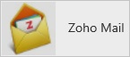
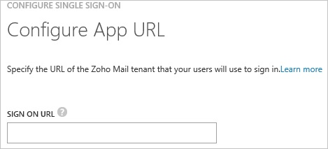
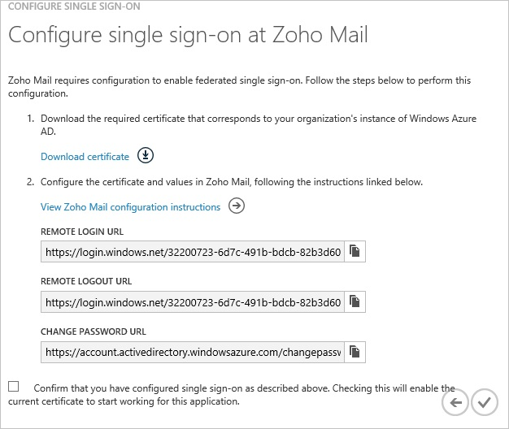
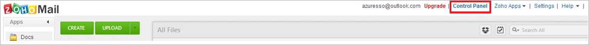
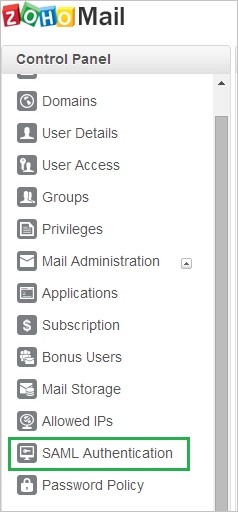
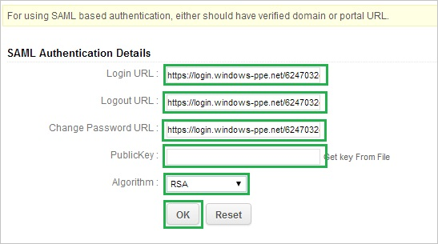
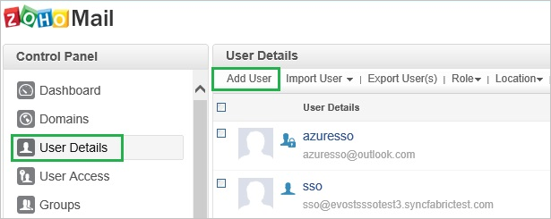
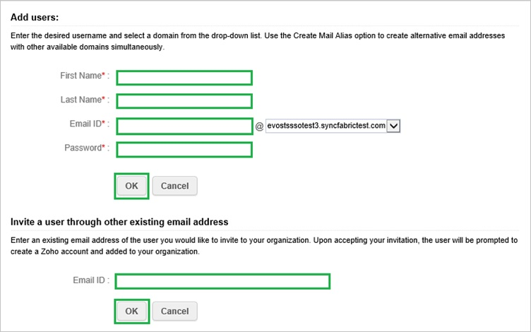

<properties 
    pageTitle="Tutorial: Azure Active Directory integration with Zoho Mail | Microsoft Azure" 
    description="Learn how to use Zoho Mail with Azure Active Directory to enable single sign-on, automated provisioning, and more!." 
    services="active-directory" 
    authors="jeevansd"  
    documentationCenter="na" 
    manager="femila"/>
<tags 
    ms.service="active-directory" 
    ms.devlang="na" 
    ms.topic="article" 
    ms.tgt_pltfrm="na" 
    ms.workload="identity" 
    ms.date="06/20/2016" 
    ms.author="markvi" />

#Tutorial: Azure Active Directory integration with Zoho Mail
  
The objective of this tutorial is to show the integration of Azure and Zoho Mail.  
The scenario outlined in this tutorial assumes that you already have the following items:

-   A valid Azure subscription
-   A Zoho Mail tenant
  
After completing this tutorial, the Azure AD users you have assigned to Zoho Mail will be able to single sign into the application at your Zoho Mail company site (service provider initiated sign on), or using the [Introduction to the Access Panel](active-directory-saas-access-panel-introduction.md).
  
The scenario outlined in this tutorial consists of the following building blocks:

1.  Enabling the application integration for Zoho Mail
2.  Configuring single sign-on
3.  Configuring user provisioning
4.  Assigning users

##Enabling the application integration for Zoho Mail
  
The objective of this section is to outline how to enable the application integration for Zoho Mail.

###To enable the application integration for Zoho Mail, perform the following steps:

1.  In the Azure classic portal, on the left navigation pane, click **Active Directory**.

    

2.  From the **Directory** list, select the directory for which you want to enable directory integration.

3.  To open the applications view, in the directory view, click **Applications** in the top menu.

    

4.  Click **Add** at the bottom of the page.

    

5.  On the **What do you want to do** dialog, click **Add an application from the gallery**.

    

6.  In the **search box**, type **Zoho Mail**.

    

7.  In the results pane, select **Zoho Mail**, and then click **Complete** to add the application.

    

##Configuring single sign-on
  
The objective of this section is to outline how to enable users to authenticate to Zoho Mail with their account in Azure AD using federation based on the SAML protocol.  
As part of this procedure, you are required to create a base-64 encoded certificate file.  
If you are not familiar with this procedure, see [How to convert a binary certificate into a text file](http://youtu.be/PlgrzUZ-Y1o).

###To configure single sign-on, perform the following steps:

1.  In the Azure classic portal, on the **Zoho Mail** application integration page, click **Configure single sign-on** to open the **Configure Single Sign On ** dialog.

    

2.  On the **How would you like users to sign on to Zoho Mail** page, select **Microsoft Azure AD Single Sign-On**, and then click **Next**.

    

3.  On the **Configure App URL** page, perform the following steps:

    

	a. In the **Zoho Mail Sign On URL** textbox, type your URL using the following pattern: `http://<company name>.ZohoMail.com`

	b. Click **Next**.

4.  On the **Configure single sign-on at Zoho Mail** page, click **Download certificate**, and then save the certificate file on your computer.

    

5.  In a different web browser window, log into your Zoho Mail company site as an administrator.

6.  Go to the **Control panel**.

    

7.  Click the **SAML Authentication** tab.

    

8.  In the **SAML Authentication Details** section, perform the following steps:

    

    1.  In the Azure classic portal, on the **Configure single sign-on at Zoho Mail** dialog page, copy the **Remote Login URL** value, and then paste it into the **Login URL** textbox.
    2.  In the Azure classic portal, on the **Configure single sign-on at Zoho Mail** dialog page, copy the **Remote Logout URL** value, and then paste it into the **Logout URL** textbox.
    3.  In the Azure classic portal, on the **Configure single sign-on at Zoho Mail** dialog page, copy the **Change Password URL** value, and then paste it into the **Change Password URL** textbox.
    4.  Create a **base-64 encoded** file from your downloaded certificate.  

        >[AZURE.TIP] For more details, see [How to convert a binary certificate into a text file](http://youtu.be/PlgrzUZ-Y1o)

    5.  Open your base-64 encoded certificate in notepad, copy the content of it into your clipboard, and then paste it to the **PublicKey** textbox.
    6.  As **Algorithm**, select **RSA**.
    7.  Click **OK**.

9.  On the Azure classic portal, select the single sign-on configuration confirmation, and then click **Complete** to close the **Configure Single Sign On** dialog.

    

##Configuring user provisioning
  
In order to enable Azure AD users to log into Zoho Mail, they must be provisioned into Zoho Mail.  
In the case of Zoho Mail, provisioning is a manual task.

###To provision a user accounts, perform the following steps:

1.  Log in to your **Zoho Mail** company site as an administrator.

2.  Go to **Control Panel \> Mail & Docs**.

3.  Go to **User Details \> Add User**.

    

4.  On the **Add users** dialog, perform the following steps:

    

    1.  Type the **First Name**, **Last Name**, **Email ID**, **Password** of a valid Azure Active Directory account you want to provision into the related textboxes.
    2.  Click **OK**.  

        >[AZURE.NOTE] The Azure Active Directory account holder will receive an email with a link to confirm the account before it becomes active.

>[AZURE.NOTE] You can use any other Zoho Mail user account creation tools or APIs provided by Zoho Mail to provision AAD user accounts.

##Assigning users
  
To test your configuration, you need to grant the Azure AD users you want to allow using your application access to it by assigning them.

###To assign users to Zoho Mail, perform the following steps:

1.  In the Azure classic portal, create a test account.

2.  On the **Zoho Mail **application integration page, click **Assign users**.

    

3.  Select your test user, click **Assign**, and then click **Yes** to confirm your assignment.

    
  
If you want to test your single sign-on settings, open the Access Panel. For more details about the Access Panel, see [Introduction to the Access Panel](active-directory-saas-access-panel-introduction.md).