<properties 
    pageTitle="Tutorial: Azure Active Directory integration with Zoom | Microsoft Azure" 
    description="Learn how to use Zoom with Azure Active Directory to enable single sign-on, automated provisioning, and more!." 
    services="active-directory" 
    authors="jeevansd"  
    documentationCenter="na" 
    manager="femila"/>
<tags 
    ms.service="active-directory" 
    ms.devlang="na" 
    ms.topic="article" 
    ms.tgt_pltfrm="na" 
    ms.workload="identity" 
    ms.date="05/25/2016" 
    ms.author="jeedes" />

#Tutorial: Azure Active Directory integration with Zoom
  
The objective of this tutorial is to show the integration of Azure and Zoom.  
The scenario outlined in this tutorial assumes that you already have the following items:

-   A valid Azure subscription
-   A Zoom tenant
  
After completing this tutorial, the Azure AD users you have assigned to Zoom will be able to single sign into the application at your Zoom company site (service provider initiated sign on), or using the [Introduction to the Access Panel](active-directory-saas-access-panel-introduction.md)
  
The scenario outlined in this tutorial consists of the following building blocks:

1.  Enabling the application integration for Zoom
2.  Configuring single sign-on
3.  Configuring user provisioning
4.  Assigning users

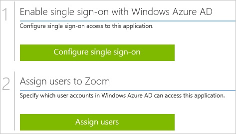

##Enabling the application integration for Zoom
  
The objective of this section is to outline how to enable the application integration for Zoom.

###To enable the application integration for Zoom, perform the following steps:

1.  In the Azure classic portal, on the left navigation pane, click **Active Directory**.

    

2.  From the **Directory** list, select the directory for which you want to enable directory integration.

3.  To open the applications view, in the directory view, click **Applications** in the top menu.

    

4.  Click **Add** at the bottom of the page.

    

5.  On the **What do you want to do** dialog, click **Add an application from the gallery**.

    

6.  In the **search box**, type **Zoom**.

    

7.  In the results pane, select **Zoom**, and then click **Complete** to add the application.

    

##Configuring single sign-on
  
The objective of this section is to outline how to enable users to authenticate to Zoom with their account in Azure AD using federation based on the SAML protocol.  
As part of this procedure, you are required to create a base-64 encoded certificate file.  
If you are not familiar with this procedure, see [How to convert a binary certificate into a text file](http://youtu.be/PlgrzUZ-Y1o).

###To configure single sign-on, perform the following steps:

1.  In the Azure classic portal, on the **Zoom** application integration page, click **Configure single sign-on** to open the **Configure Single Sign On ** dialog.

    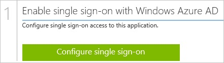

2.  On the **How would you like users to sign on to Zoom** page, select **Microsoft Azure AD Single Sign-On**, and then click **Next**.

    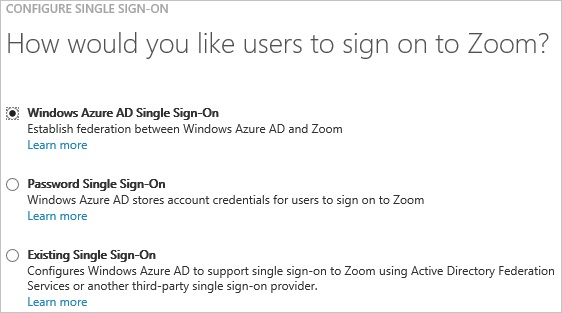

3.  On the **Configure App URL** page, in the **Zoom Sign In URL** textbox, type your URL using the following pattern "*http://company.zoom.us*", and then click **Next**.

    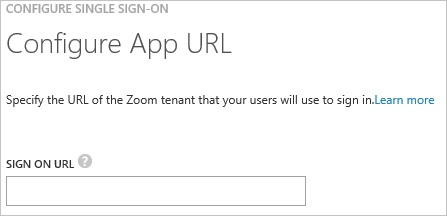

4.  On the **Configure single sign-on at Zoom** page, click **Download certificate**, and then save the certificate file on your computer.

    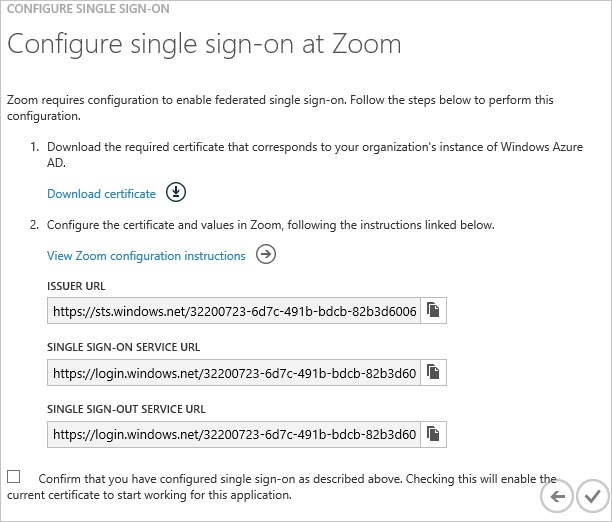

5.  In a different web browser window, log into your Zoom company site as an administrator.

6.  Click the **Single Sign-On** tab.

    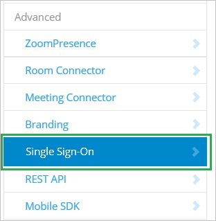

7.  Click the **Security Control** tab, and then go to the **Single Sign-On** settings.

8.  In the Single Sign-On section, perform the following steps:

    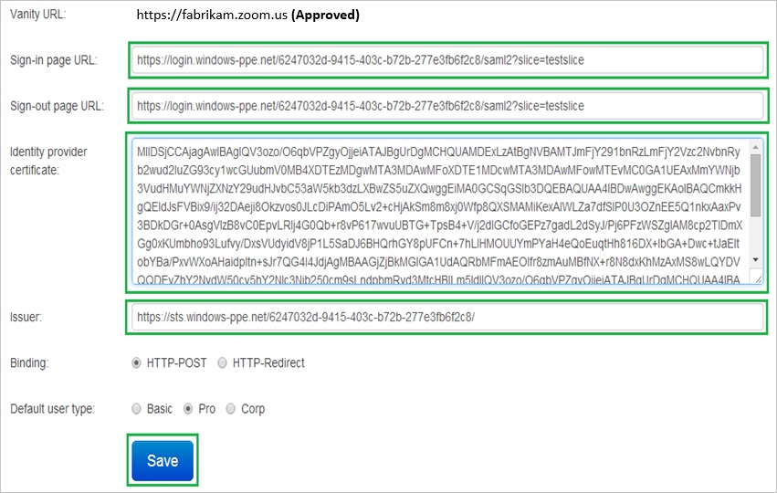

    1.  In the Azure classic portal, on the **Configure single sign-on at Zoom** dialog page, copy the **Single Sign-On Service URL** value, and then paste it into the **Sign-in page URL** textbox.
    2.  In the Azure classic portal, on the **Configure single sign-on at Zoom** dialog page, copy the **Single Sign-Out Service URL** value, and then paste it into the **Sign-out page URL** textbox.
    3.  Create a **base-64 encoded** file from your downloaded certificate.  

        >[AZURE.TIP] For more details, see [How to convert a binary certificate into a text file](http://youtu.be/PlgrzUZ-Y1o)

    4.  Open your base-64 encoded certificate in notepad, copy the content of it into your clipboard, and then paste it to the **Identity provider certificate** textbox
    5.  In the Azure classic portal, on the **Configure single sign-on at Zoom** dialog page, copy the **Issuer URL** value, and then paste it into the **Issuer** textbox.
    6.  Click **Save**.

9.  On the Azure classic portal, select the single sign-on configuration confirmation, and then click **Complete** to close the **Configure Single Sign On** dialog.

    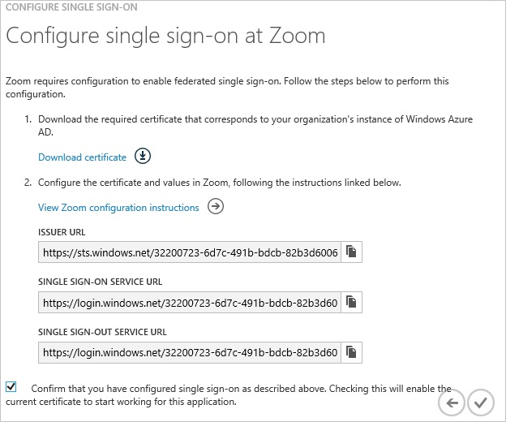

##Configuring user provisioning
  
In order to enable Azure AD users to log into Zoom, they must be provisioned into Zoom.  
In the case of Zoom, provisioning is a manual task.

###To provision a user accounts, perform the following steps:

1.  Log in to your **Zoom** company site as an administrator.

2.  Click the **Account Management** tab, and then click **User Management**.

3.  In the User Management section, click **Add users**.

    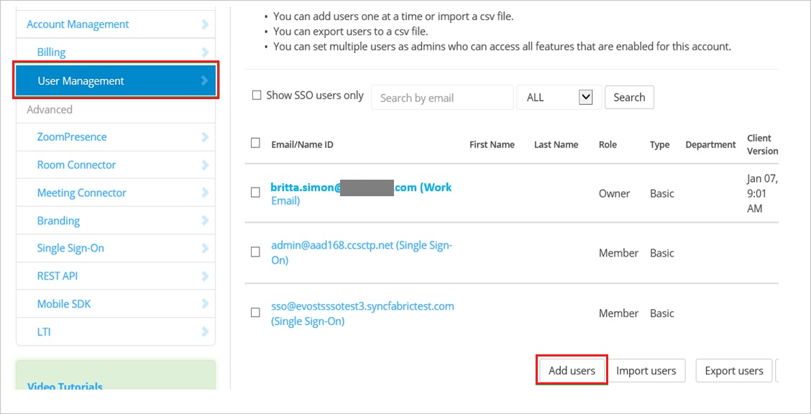

4.  On the **Add users** page, perform the following steps:

    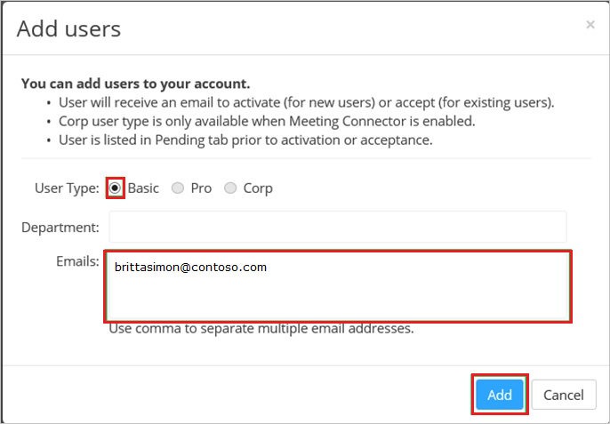

    1.  As **User Type**, select **Basic**.
    2.  In the **Emails** textbox, type the email address of a valid AAD account you want to provision.
    3.  Click **Add**.

>[AZURE.NOTE] You can use any other Zoom user account creation tools or APIs provided by Zoom to provision AAD user accounts.

##Assigning users
  
To test your configuration, you need to grant the Azure AD users you want to allow using your application access to it by assigning them.

###To assign users to Zoom, perform the following steps:

1.  In the Azure classic portal, create a test account.

2.  On the **Zoom **application integration page, click **Assign users**.

    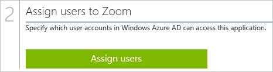

3.  Select your test user, click **Assign**, and then click **Yes** to confirm your assignment.

    
  
If you want to test your single sign-on settings, open the Access Panel. For more details about the Access Panel, see [Introduction to the Access Panel](active-directory-saas-access-panel-introduction.md).