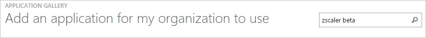
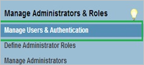
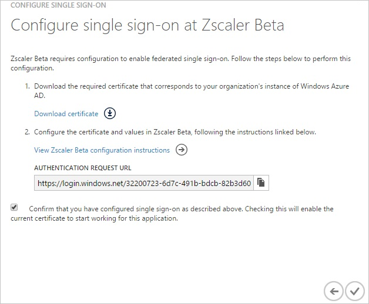
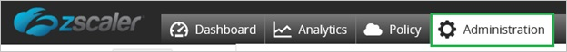
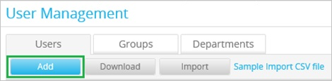
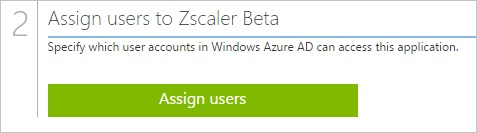

<properties 
    pageTitle="Tutorial: Azure Active Directory Integration with Zscaler Beta | Microsoft Azure" 
    description="Learn how to use Zscaler Beta with Azure Active Directory to enable single sign-on, automated provisioning, and more!." 
    services="active-directory" 
    authors="jeevansd"  
    documentationCenter="na" 
    manager="stevenpo"/>
<tags 
    ms.service="active-directory" 
    ms.devlang="na" 
    ms.topic="article" 
    ms.tgt_pltfrm="na" 
    ms.workload="identity" 
    ms.date="05/25/2016" 
    ms.author="jeedes" />

#Tutorial: Azure Active Directory Integration with Zscaler Beta
  
The objective of this tutorial is to show the integration of Azure and ZScaler Beta.  
The scenario outlined in this tutorial assumes that you already have the following items:

-   A valid Azure subscription
-   A ZScaler Beta single sign-on enabled subscription
  
After completing this tutorial, the Azure AD users you have assigned to ZScaler Beta will be able to single sign into the application at your ZScaler Beta company site (service provider initiated sign on), or using the [Introduction to the Access Panel](active-directory-saas-access-panel-introduction.md).
  
The scenario outlined in this tutorial consists of the following building blocks:

1.  Enabling the application integration for ZScaler Beta
2.  Configuring single sign-on
3.  Configuring proxy settings
4.  Configuring user provisioning
5.  Assigning users

##Enabling the application integration for ZScaler Beta
  
The objective of this section is to outline how to enable the application integration for ZScaler Beta.

###To enable the application integration for ZScaler Beta, perform the following steps:

1.  In the Azure classic portal, on the left navigation pane, click **Active Directory**.

    

2.  From the **Directory** list, select the directory for which you want to enable directory integration.

3.  To open the applications view, in the directory view, click **Applications** in the top menu.

    

4.  Click **Add** at the bottom of the page.

    

5.  On the **What do you want to do** dialog, click **Add an application from the gallery**.

    

6.  In the **search box**, type **ZScaler Beta**.

    

7.  In the results pane, select **ZScaler Beta**, and then click **Complete** to add the application.

    

##Configuring single sign-on
  
The objective of this section is to outline how to enable users to authenticate to ZScaler Beta with their account in Azure AD using federation based on the SAML protocol.  
As part of this procedure, you are required to upload a base-64 encoded certificate to your ZScaler Beta tenant.  
If you are not familiar with this procedure, see [How to convert a binary certificate into a text file](http://youtu.be/PlgrzUZ-Y1o)

###To configure single sign-on, perform the following steps:

1.  In the Azure classic portal, on the **ZScaler Beta** application integration page, click **Configure single sign-on** to open the **Configure Single Sign On ** dialog.

    

2.  On the **How would you like users to sign on to ZScaler Beta** page, select **Microsoft Azure AD Single Sign-On**, and then click **Next**.

    

3.  On the **Configure App URL** page, in the **ZScaler Beta Sign On URL** textbox, type the URL used by your users to sign-on to your ZScaler Beta application, and then click **Next**.

    

    >[AZURE.NOTE] You can get the actual value for your environment from your ZScaler Beta support team if you need it.

4.  On the **Configure single sign-on at ZScaler Beta** page, to download your certificate, click **Download certificate**, and then save the certificate file on your computer.

    

5.  In a different web browser window, log into your ZScaler Beta company site as an administrator.

6.  In the menu on the top, click **Administration**.

    

7.  Under **Manage Administrators & Roles**, click **Manage Users & Authentication**.

    

8.  In the **Choose Authentication Options for your Organization** section, perform the following steps:

    

    1.  Select **Authenticate using SAML Single Sign-On**.
    2.  Click **Configure SAML Single Sign-On Parameters**.

9.  On the **Configure SAML Single Sign-On Parameters** dialog page, perform the following steps, and then click **Done**:

    

    1.  In the Azure classic portal, on the **Configure single sign-on at ZScaler Beta** dialog page, copy the **Authentication Request URL** value, and then paste it into the **URL of the SAML Portal to which users are sent for authentication** textbox.
    2.  In the **Attribute containing Login Name** textbox, type **NameID**.
    3.  To upload your downloaded certificate, click **Zscaler pem**.
    4.  Select **Enable SAML Auto-Provisioning**.

10. On the **Configure User Authentication** dialog page, perform the following steps:

    

    1.  Click **Save**.
    2.  Click **Activate Now**.

11. In the Azure classic portal, on the **Configure single sign-on at ZScaler Beta** dialog page, select the single sign-on configuration confirmation, and then click **Complete**.

    

##Configuring proxy settings

###To configure the proxy settings in Internet Explorer

1.  Start **Internet Explorer**.

2.  Select **Internet options** from the **Tools** menu to open the **Internet Options** dialog.

    

3.  Click the **Connections** tab.

    

4.  Click **LAN settings** to open the **LAN Settings** dialog.

5.  In the Proxy server section, perform the following steps:

    

    1.  Select Use a proxy server for your LAN.
    2.  In the Address textbox, type **gateway.zscalerBeta.net**.
    3.  In the Port textbox, type **80**.
    4.  Select **Bypass proxy server for local addresses**.
    5.  Click **OK** to close the **Local Area Network (LAN) Settings** dialog.

6.  Click **OK** to close the **Internet Options** dialog.

##Configuring user provisioning
  
In order to enable Azure AD users to log into ZScaler Beta, they must be provisioned to ZScaler Beta.  
In the case of ZScaler Beta, provisioning is a manual task.

###To configure user provisioning, perform the following steps:

1.  Log in to your **Zscaler** tenant.

2.  Click **Administration**.

    

3.  Click **User Management**.

    

4.  In the **Users** tab, click **Add**.

    

5.  In the Add User section, perform the following steps:

    

    1.  Type the **UserID**, **User Display Name**, **Password**, **Confirm Password**, and then select **Groups** and the **Department** of a valid AAD account you want to provision.
    2.  Click **Save**.

>[AZURE.NOTE] You can use any other ZScaler Beta user account creation tools or APIs provided by ZScaler Beta to provision AAD user accounts.

##Assigning users
  
To test your configuration, you need to grant the Azure AD users you want to allow using your application access to it by assigning them.

###To assign users to ZScaler Beta, perform the following steps:

1.  In the Azure classic portal, create a test account.

2.  On the **ZScaler Beta** application integration page, click **Assign users**.

    

3.  Select your test user, click **Assign**, and then click **Yes** to confirm your assignment.

    
  
If you want to test your single sign-on settings, open the Access Panel. For more details about the Access Panel, see [Introduction to the Access Panel](active-directory-saas-access-panel-introduction.md).