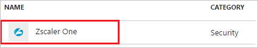

# Tutorial: Azure Active Directory integration with Zscaler One

In this tutorial, you learn how to integrate Zscaler One with Azure Active Directory (Azure AD).

Integrating Zscaler One with Azure AD provides you with the following benefits:

- You can control in Azure AD who has access to Zscaler One
- You can enable your users to automatically get signed-on to Zscaler One (Single Sign-On) with their Azure AD accounts
- You can manage your accounts in one central location - the Azure portal

If you want to know more details about SaaS app integration with Azure AD, see [what is application access and single sign-on with Azure Active Directory](active-directory-appssoaccess-whatis.md).

## Prerequisites

To configure Azure AD integration with Zscaler One, you need the following items:

- An Azure AD subscription
- A Zscaler One single sign-on enabled subscription

> [!NOTE]
> To test the steps in this tutorial, we do not recommend using a production environment.

To test the steps in this tutorial, you should follow these recommendations:

- Do not use your production environment, unless it is necessary.
- If you don't have an Azure AD trial environment, you can get a one-month trial here: [Trial offer](https://azure.microsoft.com/pricing/free-trial/).

## Scenario description
In this tutorial, you test Azure AD single sign-on in a test environment. 
The scenario outlined in this tutorial consists of two main building blocks:

1. Adding Zscaler One from the gallery
2. Configuring and testing Azure AD single sign-on

## Adding Zscaler One from the gallery
To configure the integration of Zscaler One into Azure AD, you need to add Zscaler One from the gallery to your list of managed SaaS apps.

**To add Zscaler One from the gallery, perform the following steps:**

1. In the **[Azure portal](https://portal.azure.com)**, on the left navigation panel, click **Azure Active Directory** icon. 

	![Active Directory][1]

2. Navigate to **Enterprise applications**. Then go to **All applications**.

	![Applications][2]
	
3. To add new application, click **New application** button on the top of dialog.

	![Applications][3]

4. In the search box, type **Zscaler One**.

	

5. In the results panel, select **Zscaler One**, and then click **Add** button to add the application.

	

##  Configuring and testing Azure AD single sign-on
In this section, you configure and test Azure AD single sign-on with Zscaler One based on a test user called "Britta Simon".

For single sign-on to work, Azure AD needs to know what the counterpart user in Zscaler One is to a user in Azure AD. In other words, a link relationship between an Azure AD user and the related user in Zscaler One needs to be established.

In Zscaler One, assign the value of the **user name** in Azure AD as the value of the **Username** to establish the link relationship.

To configure and test Azure AD single sign-on with Zscaler One, you need to complete the following building blocks:

1. **[Configuring Azure AD Single Sign-On](#configuring-azure-ad-single-sign-on)** - to enable your users to use this feature.
2. **[Configuring proxy settings](#configuring-proxy-settings)** - to configure the proxy settings in Internet Explorer
3. **[Creating an Azure AD test user](#creating-an-azure-ad-test-user)** - to test Azure AD single sign-on with Britta Simon.
4. **[Creating a Zscaler One test user](#creating-a-zscaler-one-test-user)** - to have a counterpart of Britta Simon in Zscaler One that is linked to the Azure AD representation of user.
5. **[Assigning the Azure AD test user](#assigning-the-azure-ad-test-user)** - to enable Britta Simon to use Azure AD single sign-on.
6. **[Testing Single Sign-On](#testing-single-sign-on)** - to verify whether the configuration works.

### Configuring Azure AD single sign-on

In this section, you enable Azure AD single sign-on in the Azure portal and configure single sign-on in your Zscaler One application.

**To configure Azure AD single sign-on with Zscaler One, perform the following steps:**

1. In the Azure portal, on the **Zscaler One** application integration page, click **Single sign-on**.

	![Configure Single Sign-On][4]

2. On the **Single sign-on** dialog, select **Mode** as	**SAML-based Sign-on** to enable single sign-on.
 
	

3. On the **Zscaler One Domain and URLs** section, perform the following steps:

	

    In the Sign-on URL textbox, type the URL used by your users to sign-on to your Zscaler One application.

	> [!NOTE] 
	> You have to update this value with the actual Sign-On URL. Contact [Zscaler One Client support team](https://www.zscaler.com/company/contact) to get these values.

4. On the **SAML Signing Certificate** section, click **Certificate(Base64)** and then save the certificate file on your computer.

	 

5. Click **Save** button.

	

6. On the **Zscaler One Configuration** section, click **Configure Zscaler One** to open **Configure sign-on** window. Copy the **SAML Single Sign-On Service URL** from the **Quick Reference section.**

	 

7. In a different web browser window, log in to your Zscaler One company site as an administrator.

8. In the menu on the top, click **Administration**.
   
	

9. Under **Manage Administrators & Roles**, click **Manage Users & Authentication**.   
   			
	

10. In the **Choose Authentication Options for your Organization** section, perform the following steps:   
   				
	
   
    a. Select **Authenticate using SAML Single Sign-On**.

    b. Click **Configure SAML Single Sign-On Parameters**.

11. On the **Configure SAML Single Sign-On Parameters** dialog page, perform the following steps, and then click **Done**

	
	
	a. Paste the **SAML Single Sign-On Service URL** value, which you have copied from the Azure portal into the **URL of the SAML Portal to which users are sent for authentication** textbox.
	
	b. In the **Attribute containing Login Name** textbox, type **NameID**.
	
	c. To upload your downloaded certificate, click **Zscaler pem**.
	
	d. Select **Enable SAML Auto-Provisioning**.

12. On the **Configure User Authentication** dialog page, perform the following steps:

    
    
    a. Click **Save**.

    b. Click **Activate Now**.

## Configuring proxy settings
### To configure the proxy settings in Internet Explorer

1. Start **Internet Explorer**.

2. Select **Internet options** from the **Tools** menu for open the **Internet Options** dialog.   
  	
	 

3. Click the **Connections** tab.   
  
	 

4. Click **LAN settings** to open the **LAN Settings** dialog.

5. In the Proxy server section, perform the following steps:   
   
	

    a. Select **Use a proxy server for your LAN**.

    b. In the Address textbox, type **gateway.zscalerone.net**.

    c. In the Port textbox, type **80**.

    d. Select **Bypass proxy server for local addresses**.

    e. Click **OK** to close the **Local Area Network (LAN) Settings** dialog.

6. Click **OK** to close the **Internet Options** dialog.

> [!TIP]
> You can now read a concise version of these instructions inside the [Azure portal](https://portal.azure.com), while you are setting up the app!  After adding this app from the **Active Directory > Enterprise Applications** section, simply click the **Single Sign-On** tab and access the embedded documentation through the **Configuration** section at the bottom. You can read more about the embedded documentation feature here: [Azure AD embedded documentation]( https://go.microsoft.com/fwlink/?linkid=845985)
> 

### Creating an Azure AD test user
The objective of this section is to create a test user in the Azure portal called Britta Simon.

![Create Azure AD User][100]

**To create a test user in Azure AD, perform the following steps:**

1. In the **Azure portal**, on the left navigation pane, click **Azure Active Directory** icon.

	 

2. To display the list of users, go to **Users and groups** and click **All users**.
	
	 

3. To open the **User** dialog, click **Add** on the top of the dialog.
 
	 

4. On the **User** dialog page, perform the following steps:
 
	 

    a. In the **Name** textbox, type **BrittaSimon**.

    b. In the **User name** textbox, type the **email address** of BrittaSimon.

	c. Select **Show Password** and write down the value of the **Password**.

    d. Click **Create**.
 
### Creating a Zscaler One test user

To enable Azure AD users to log in to Zscaler One, they must be provisioned to Zscaler One. In the case of Zscaler One, provisioning is a manual task.

### To configure user provisioning, perform the following steps:

1. Log in to your **Zscaler One** tenant.

2. Click **Administration**.   
   
	

3. Click **User Management**.   
  		
	 

4. In the **Users** tab, click **Add**.
      
	

5. In the Add User section, perform the following steps:
   	   	
	
   
    a. Type the **UserID**, **User Display Name**, **Password**, **Confirm Password**, and then select **Groups** and the **Department** of a valid Azure AD account you want to provision.

    b. Click **Save**.

> [!NOTE]
> You can use any other Zscaler One user account creation tools or APIs provided by Zscaler One to provision Azure AD user accounts.

### Assigning the Azure AD test user

In this section, you enable Britta Simon to use Azure single sign-on by granting access to Zscaler One.

![Assign User][200] 

**To assign Britta Simon to Zscaler One, perform the following steps:**

1. In the Azure portal, open the applications view, and then navigate to the directory view and go to **Enterprise applications** then click **All applications**.

	![Assign User][201] 

2. In the applications list, select **Zscaler One**.

	 

3. In the menu on the left, click **Users and groups**.

	![Assign User][202] 

4. Click **Add** button. Then select **Users and groups** on **Add Assignment** dialog.

	![Assign User][203]

5. On **Users and groups** dialog, select **Britta Simon** in the Users list.

6. Click **Select** button on **Users and groups** dialog.

7. Click **Assign** button on **Add Assignment** dialog.
	
### Testing single sign-on

In this section, you test your Azure AD single sign-on configuration using the Access Panel.

When you click the Zscaler One tile in the Access Panel, you should get automatically signed-on to your Zscaler One application.
For more information about the Access Panel, see [Introduction to the Access Panel](active-directory-saas-access-panel-introduction.md).

## Additional resources

* [List of Tutorials on How to Integrate SaaS Apps with Azure Active Directory](active-directory-saas-tutorial-list.md)
* [What is application access and single sign-on with Azure Active Directory?](active-directory-appssoaccess-whatis.md)

<!--Image references-->

[1]: ./media/active-directory-saas-zscaler-one-tutorial/tutorial_general_01.png
[2]: ./media/active-directory-saas-zscaler-one-tutorial/tutorial_general_02.png
[3]: ./media/active-directory-saas-zscaler-one-tutorial/tutorial_general_03.png
[4]: ./media/active-directory-saas-zscaler-one-tutorial/tutorial_general_04.png

[100]: ./media/active-directory-saas-zscaler-one-tutorial/tutorial_general_100.png

[200]: ./media/active-directory-saas-zscaler-one-tutorial/tutorial_general_200.png
[201]: ./media/active-directory-saas-zscaler-one-tutorial/tutorial_general_201.png
[202]: ./media/active-directory-saas-zscaler-one-tutorial/tutorial_general_202.png
[203]: ./media/active-directory-saas-zscaler-one-tutorial/tutorial_general_203.png

