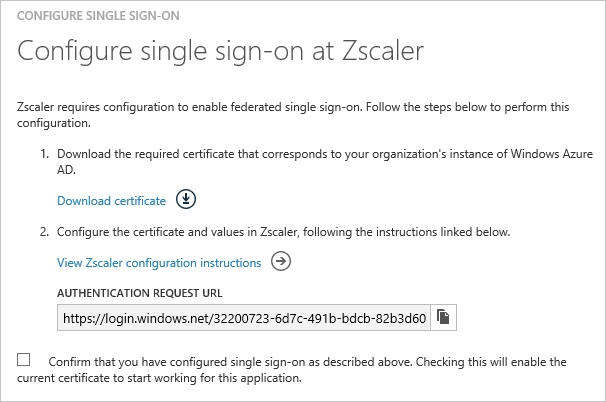
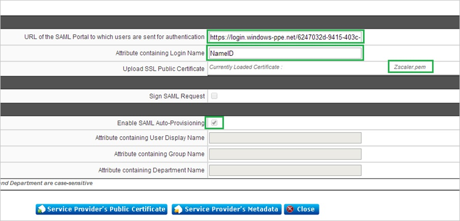
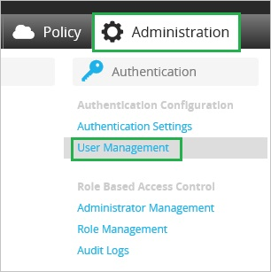
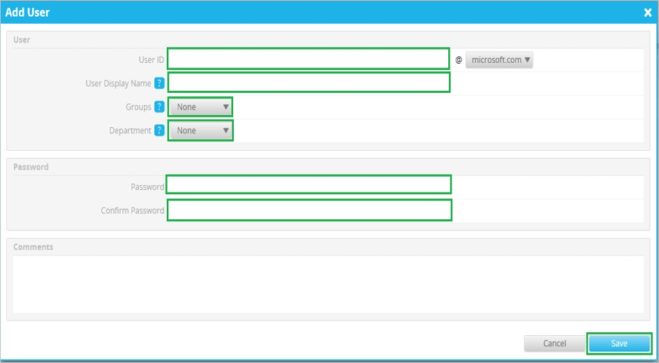

<properties 
    pageTitle="Tutorial: Azure Active Directory integration with Zscaler | Microsoft Azure" 
    description="Learn how to use Zscaler with Azure Active Directory to enable single sign-on, automated provisioning, and more!." 
    services="active-directory" 
    authors="jeevansd"  
    documentationCenter="na" 
    manager="stevenpo"/>
<tags 
    ms.service="active-directory" 
    ms.devlang="na" 
    ms.topic="article" 
    ms.tgt_pltfrm="na" 
    ms.workload="identity" 
    ms.date="05/25/2016" 
    ms.author="jeedes" />

#Tutorial: Azure Active Directory integration with Zscaler
  
The objective of this tutorial is to show the integration of Azure and Zscaler. The scenario outlined in this tutorial assumes that you already have the following items:

-   A valid Azure subscription
-   A tenant in Zscaler
  
The scenario outlined in this tutorial consists of the following building blocks:

1.  Enabling the application integration for Zscaler
2.  Configuring single sign-on
3.  Configuring proxy settings
4.  Configuring user provisioning
5.  Assigning users

##Enabling the application integration for Zscaler
  
The objective of this section is to outline how to enable the application integration for Zscaler.

###To enable the application integration for Zscaler, perform the following steps:

1.  In the Azure classic portal, on the left navigation pane, click **Active Directory**.

    

2.  From the **Directory** list, select the directory for which you want to enable directory integration.

3.  To open the applications view, in the directory view, click **Applications** in the top menu.

    

4.  Click **Add** at the bottom of the page.

    

5.  On the **What do you want to do** dialog, click **Add an application from the gallery**.

    

6.  In the **search box**, type **Zscaler**.

    

7.  In the results pane, select **Zscaler**, and then click **Complete** to add the application.

    

##Configuring single sign-on
  
The objective of this section is to outline how to enable users to authenticate to Zscaler with their account in Azure AD using federation based on the SAML protocol.  
As part of this procedure, you are required to upload a certificate to Zscaler.

###To configure single sign-on, perform the following steps:

1.  In the Azure classic portal, on the **Zscaler** application integration page, click **Configure single sign-on** to open the **Configure Single Sign On ** dialog.

    

2.  On the **How would you like users to sign on to Zscaler** page, select **Microsoft Azure AD Single Sign-On**, and then click **Next**.

    

3.  On the **Configure App URL** page, in the **Zscaler Sign In URL** textbox, type your sign in URL you got from Zscaler, and then click **Next**: 

    >[AZURE.NOTE] Please contact the Zscaler support team if you don’t know what your sign in URL is.

    

4.  On the **Configure single sign-on at Zscaler** page, perform the following steps:

    

    1.  Click **Download certificate**, and then save the certificate file locally as **c:\\Zscaler.cer**.
    2.  Copy the **Authentication request URL** into your clipboard.

5.  Login to your Zscaler tenant.

6.  In the menu on the top, click **Administration**.

    

7.  Under **Manage Administrators & Roles**, click **Mange Users & Authentication**.

    

8.  In the **Choose Authentication Option for your Organization** section, perform the following steps:

    

    1.  Select **Authenticate using SAML Single Sign-on**.
    2.  Click **Configure SAML Single Sign-On Parameters**.

9.  On the **Configure SAML Single Sign-On Parameters** dialog page, perform the following steps, and then click **Done**:

    

    1.  In the **URL of the SAML Portal to which users are sent for authentication** textbox, paste the value of the **Authentication request URL** field from the Azure classic portal.
    2.  In the **Attribute containing Login Name** textbox, type **NameID**.
    3.  In the **Upload SSL Public Certificate** field, upload the certificate you have downloaded from the Azure classic portal.
    4.  Select **Enable SAML Auto-Provisioning**.

10. On the **Configure User Authentication** dialog page, perform the following steps:

    

    1.  Click **Save**.
    2.  Click **Activate Now**.

11. On the Azure classic portal, select the single sign-on configuration confirmation, and then click **Complete** to close the **Configure Single Sign On** dialog.

    

##Configuring proxy settings

###To configure the proxy settings in Internet Explorer

1.  Start **Internet Explorer**.

2.  Select **Internet options** from the **Tools** menu to open the **Internet Options** dialog.

    

3.  Click the **Connections** tab.

    

4.  Click **LAN settings** to open the **LAN Settings** dialog.

5.  In the Proxy server section, perform the following steps:

    

    1.  Select Use a proxy server for your LAN.
    2.  In the Address textbox, type **gateway.zscalertwo.net**.
    3.  In the Port textbox, type **80**.
    4.  Select **Bypass proxy server for local addresses**.
    5.  Click **OK** to close the **Local Area Network (LAN) Settings** dialog.

6.  Click **OK** to close the **Internet Options** dialog.

##Configuring user provisioning
  
In order to enable Azure AD users to log into Zscaler, they must be provisioned into Zscaler.  
In the case of Zscaler, provisioning is a manual task.

###To configure user provisioning, perform the following steps:

1.  Log in to your **Zscaler** tenant.

2.  Click **Administration**.

    

3.  Click **User Management**.

    

4.  In the **Users** tab, click **Add**.

    

5.  In the Add User section, perform the following steps:

    

    1.  Type the **UserID**, **User Display Name**, **Password**, **Confirm Password**, and then select **Groups** and the **Department** of a valid AAD account you want to provision.
    2.  Click **Save**.

>[AZURE.NOTE] You can use any other Zscaler user account creation tool or APIs provided by Zscaler to provision AAD user accounts.

##Assigning users
  
To test your configuration, you need to grant the Azure AD users you want to allow using your application access to it by assigning them.

###To assign users to Zscaler, perform the following steps:

1.  In the Azure classic portal, create a test account.

2.  On the **Zscaler** application integration page, click **Assign users**.

    

3.  Select your test user, click **Assign**, and then click **Yes** to confirm your assignment.

    
  
If you want to test your single sign-on settings, open the Access Panel. For more details about the Access Panel, see [Introduction to the Access Panel](active-directory-saas-access-panel-introduction.md).
