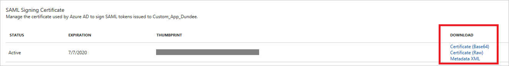
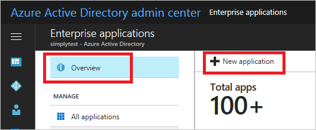

# Managing Certificates for Federated Single sign-On in Azure Active Directory
This article covers common questions and information related to the certificates that Azure Active Directory creates to establish federated single sign-on (SSO) to your SaaS applications. These applications can be added from Azure AD app gallery or using Non-gallery application template. Application must be configured using federated Single sign-on option.

This article is only relevant to apps that are configured to use **Azure AD Single Sign-On** using **SAML Federation**, as shown in the example below:

## Auto generated certificate for Gallery and Non-gallery applications
When you add a new application from the gallery and configure SAML-based Sign-on then Azure AD generates 3-year valid certificate for the application. You can download this certificate from the **SAML Signing Certificate** section. For gallery applications, this section may show the option to download the **Certificate** or **Federation Metadata** depends on the requirement of the application.

## How to Customize the Expiration Date for your Federation Certificate and roll over the new Certificate
By default, certificates are set to expire after three years. You can choose a different expiration date for your certificate by following the steps below:
The included screenshots use Salesforce for the sake of example, but these steps can apply to any federated SaaS app.

1. In [Azure Active Directory](https://aad.portal.azure.com) Management Portal, click on the **Enterprise application** navigation and then click on **New application** from **Overview** page as shown below:

   

2. Search for the gallery application and select the application, which you want to add. If you cannot find the required application, then add the application using the **Non-gallery application** option. This feature is only available in the **Azure AD Premium (P1 and P2)** SKU.

    

3. Click on the **Single sign-on** link in the left navigation and change the **Single Sign-on Mode** to **SAML-based Sign-on**. This generates the three years’ valid certificate for your application.

4. To create a new certificate, click on the **Create new certificate** link in the **SAML Signing Certificate** section.

    

5. Create a new certificate link opens the calendar control and now set any date and time up to three years. The selected date and time be the expiry date and time of your new certificate. Click on the **Save** button to save your certificate.

    

6. Now the new certificate is available to download. Click on the **Certificate** link in order to download it. At this point, your certificate is not active. When, you want to roll over this certificate at that time click on the **Make new certificate** active check box and click save. From that point onwards Azure AD starts using the new certificate for singing the response.

7.	To learn how to upload the certificate to your particular SaaS application, click View application configuration tutorial link on the page.

## How to Renew a Certificate that will Soon Expire
The renewal steps shown below should ideally result in no significant downtime for your users. The screenshots used in this section feature Salesforce as an example, but these steps can apply to any federated SaaS app.

1. In **Azure Active Directory** application **Single sign-on** page, generate the new certificate for your application. You can do this by clicking on the **Create new certificate** link in the **SAML Signing Certificate** section

    

2. Select the desired expiry date and time for your new certificate and click on **Save** button.

3. Download the certificate in the SAML Signing certificate option. Upload the new certificate to the SaaS app's single sign-on configuration screen. To learn how to do this for your particular SaaS application, click **View application configuration tutorial** link on the page.
   
4. To activate the new certificate on Azure AD select the Make new certificate active check box and click on **Save** button at the top of the page. This rolls over the new certificate on Azure AD side. The status of the certificate changes from **New** to **Active**. From that point onwards Azure AD starts using the new certificate for signing the response. 
   
    

## Related Articles
* [List of Tutorials on How to Integrate SaaS Apps with Azure Active Directory](active-directory-saas-tutorial-list.md)
* [Article Index for Application Management in Azure Active Directory](active-directory-apps-index.md)
* [Application access and single sign-on with Azure Active Directory](active-directory-appssoaccess-whatis.md)
* [Troubleshooting SAML-Based Single Sign-On](active-directory-saml-debugging.md)