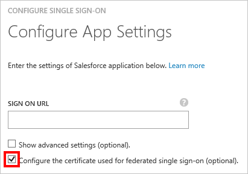

<properties
	pageTitle="How to Manage Federation Certificates in Azure AD | Microsoft Azure"
	description="TODO"
	services="active-directory"
	documentationCenter=""
	authors="liviodlc"
	manager="terrylan"
	editor=""/>

<tags
	ms.service="active-directory"
	ms.workload="identity"
	ms.tgt_pltfrm="na"
	ms.devlang="na"
	ms.topic="article"
	ms.date="07/01/2015"
	ms.author="liviodlc"/>

#Managing Certificates for Federated Single Sign-On in Azure Active Directory

This article covers common questions related to the certificates that Azure Active Directory creates in order to establish federated single sign-on (SSO) to your SaaS applications.

This article is only relevant to apps that are configured to use **Azure AD Single Sign-On**, as shown in the example below:

##How to Customize the Expiry Date for your Federation Certificate

By default, certificates are set to expire after two years. You can choose a different expiry date for your certificate through the following steps: 

1. In Azure Active Directory, on the Quick Start page for your application, click on **Configure single sign-on**.

	

2. Select **Azure AD Single Sign-On**, and then click **Next**.

3. Type in the **Sign-On URL** of your application, and select the checkbox for **Configure the certificate used for federated single sign-on**.

	

3. Type in the **Sign-On URL** of your application, and select the checkbox for **Configure the certificate used for federated single sign-on**.

	

##How to Renew a Certificate that will Soon Expire