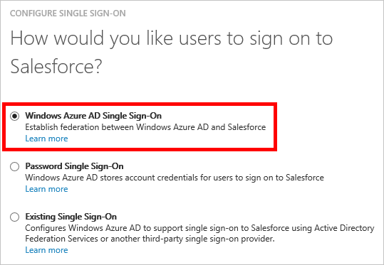

<properties
	pageTitle="How to Manage Federation Certificates in Azure AD | Microsoft Azure"
	description="TODO"
	services="active-directory"
	documentationCenter=""
	authors="liviodlc"
	manager="terrylan"
	editor=""/>

<tags
	ms.service="active-directory"
	ms.workload="identity"
	ms.tgt_pltfrm="na"
	ms.devlang="na"
	ms.topic="article"
	ms.date="07/01/2015"
	ms.author="liviodlc"/>

#Managing Certificates for Federated Single Sign-On in Azure Active Directory

This article covers two common questions related to the certificates that Azure Active Directory creates in order to establish federated single sign-on (SSO) to your SaaS applications.

This article is only relevant to apps that are set to use **Azure AD Single Sign-On**, as shown in the example below:

 

The process of configuring federated SSO often requires admins to upload a certificate to the SaaS app. By default, each certificate expires after two years.

##How to Set the Expiry Date for your Federation Certificate

##How to Renew a Certificate that will Soon Expire