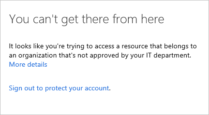
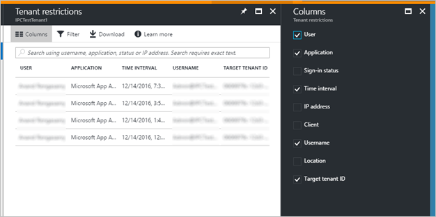

# Use Tenant Restrictions to manage access to SaaS cloud applications

Large organizations that emphasize security want to move to cloud services like Office 365, but need to know that their users only can access approved resources. Traditionally, companies restrict domain names or IP addresses when they want to manage access. This approach fails in a world where SaaS apps are hosted in a public cloud, running on shared domain names like outlook.office.com and login.microsoftonline.com. Blocking these addresses would keep users from accessing Outlook on the web entirely, instead of merely restricting them to approved identities and resources.

Azure Active Directory's solution to this challenge is a feature called Tenant Restrictions. Tenant Restrictions enables organizations to control access to SaaS cloud applications, based on the Azure AD tenant the applications use for single sign-on. For example, you may want to allow access to your organization’s Office 365 applications, while preventing access to other organizations’ instances of these same applications.  

Tenant Restrictions gives organizations the ability to specify the list of tenants that their users are permitted to access. Azure AD then only grants access to these permitted tenants.

This article focuses on Tenant Restrictions for Office 365, but the feature should work with any SaaS cloud app that uses modern authentication protocols with Azure AD for single sign-on. If you use SaaS apps with a different Azure AD tenant from the tenant used by Office 365, make sure that all required tenants are permitted. For more information about SaaS cloud apps, see the [Active Directory Marketplace](https://azure.microsoft.com/en-us/marketplace/active-directory/).

## How it works

The overall solution comprises the following components: 

1. **Azure AD** – If the `Restrict-Access-To-Tenants: <permitted tenant list>` is present, Azure AD only issues security tokens for the permitted tenants. 

2. **On-premises proxy server infrastructure** – a proxy device capable of SSL inspection, configured to insert the header containing the list of permitted tenants into traffic destined for Azure AD. 

3. **Client software** – to support Tenant Restrictions, client software must request tokens directly from Azure AD, so that traffic can be intercepted by the proxy infrastructure. Tenant Restrictions is currently supported by browser-based Office 365 applications and by Office clients when modern authentication (like OAuth 2.0) is used. 

4. **Modern Authentication** – cloud services must use modern authentication to use Tenant Restrictions and block access to all non-permitted tenants. Office 365 cloud services must be configured to use modern authentication protocols by default. For the latest information on Office 365 support for modern authentication, read [Updated Office 365 modern authentication](https://blogs.office.com/2015/11/19/updated-office-365-modern-authentication-public-preview/).

The following diagram illustrates the high-level traffic flow. SSL inspection is only required on traffic to Azure AD, not to the Office 365 cloud services. This distinction is important because the traffic volume for authentication to Azure AD is typically much lower than traffic volume to SaaS applications like Exchange Online and SharePoint Online.


## Set up Tenant Restrictions

There are two steps to get started with Tenant Restrictions. The first step is to make sure that your clients can connect to the right addresses. The second is to configure your proxy infrastructure.

### URLs and IP addresses

To use Tenant Restrictions, your clients must be able to connect to the following Azure AD URLs to authenticate: login.microsoftonline.com, login.microsoft.com, and login.windows.net. Additionally, to access Office 365, your clients must also be able to connect to the FQDNs/URLs and IP addresses defined in [Office 365 URLs and IP address ranges](https://support.office.com/article/Office-365-URLs-and-IP-address-ranges-8548a211-3fe7-47cb-abb1-355ea5aa88a2). 

### Proxy configuration and requirements

The following configuration is required to enable Tenant Restrictions through your proxy infrastructure. This guidance is generic, so you should refer to your proxy vendor’s documentation for specific implementation steps.

#### Prerequisites

- The proxy must be able to perform SSL interception, HTTP header insertion, and filter destinations using FQDNs/URLs. 

- Clients must trust the certificate chain presented by the proxy for SSL communications. For example, if certificates from an internal PKI are used, the internal issuing root certificate authority certificate must be trusted.

- This feature is included in Office 365 subscriptions, but if you want to use Tenant Restrictions to control access to other SaaS apps then Azure AD Premium 1 licenses are required.

#### Configuration

For each incoming request to login.microsoftonline.com, login.microsoft.com, and login.windows.net, insert two HTTP headers: *Restrict-Access-To-Tenants* and *Restrict-Access-Context*.

The headers should include the following elements: 
- For *Restrict-Access-To-Tenants*, a value of \<permitted tenant list\>, which is a comma-separated list of tenants you want to allow users to access. Any domain that is registered with a tenant can be used to identify the tenant in this list. For example, to permit access to both Contoso and Fabrikam tenants, the name/value pair looks like:  `Restrict-Access-To-Tenants: contoso.onmicrosoft.com,fabrikam.onmicrosoft.com` 
- For *Restrict-Access-Context*, a value of a single directory ID, declaring which tenant is setting the Tenant Restrictions. For example, to declare Contoso as the tenant that set the Tenant Restrictions policy, the name/value pair looks like: `Restrict-Access-Context: 456ff232-35l2-5h23-b3b3-3236w0826f3d`  

> [!TIP]
> You can find your directory ID in the [Azure portal](https://portal.azure.com). Sign in as an administrator, select **Azure Active Directory**, then select **Properties**.

To prevent users from inserting their own HTTP header with non-approved tenants, the proxy needs to replace the Restrict-Access-To-Tenants header if it is already present in the incoming request. 

Clients must be forced to use the proxy for all requests to login.microsoftonline.com, login.microsoft.com, and login.windows.net. For example, if PAC files are used to direct clients to use the proxy, end users should not be able to edit or disable the PAC files.

## The user experience

This section shows the experience for both end users and admins.

### End-user experience

An example user is on the Contoso network, but is trying to access the Fabrikam instance of a shared SaaS application like Outlook online. If Contoso is a non-permitted tenant for that instance, the user sees the following page:



### Admin experience

While configuration of Tenant Restrictions is done on the corporate proxy infrastructure, admins can access the Tenant Restrictions reports in the Azure portal directly. To view the reports, go to the Azure Active Directory Overview page, then look under ‘Other capabilities’.

The admin for the tenant specified as the Restricted-Access-Context tenant can use this report to see all sign-ins blocked because of the Tenant Restrictions policy, including the identity used and the target directory ID.



Like other reports in the Azure portal, you can use filters to specify the scope of your report. You can filter on a specific user, application, client, or time interval.

## Office 365 support

Office 365 applications must meet two criteria to fully support Tenant Restrictions:

1. The client used supports modern authentication
2. Modern authentication is enabled as the default authentication protocol for the cloud service.

Refer to [Updated Office 365 modern authentication](https://blogs.office.com/2015/11/19/updated-office-365-modern-authentication-public-preview/) for the latest information on which Office clients currently support modern authentication. That page also includes links to instructions for enabling modern authentication on specific Exchange Online and Skype for Business Online tenants. Modern authentication is already enabled by default in SharePoint Online.

Tenant Restrictions is currently supported by Office 365 browser-based applications (the Office Portal, Yammer, SharePoint sites, Outlook on the Web, etc.). For thick clients (Outlook, Skype for Business, Word, Excel, PowerPoint, etc.) Tenant Restrictions can only be enforced when modern authentication is used.  

Outlook and Skype for Business clients that support modern authentication are still able to use legacy protocols against tenants where modern authentication is not enabled, effectively bypassing Tenant Restrictions. For Outlook on Windows, customers may choose to implement restrictions preventing end users from adding non-approved mail accounts to their profiles. For example, see the [Prevent adding non-default Exchange accounts](http://gpsearch.azurewebsites.net/default.aspx?ref=1) group policy setting. For Outlook on non-Windows platforms, and for Skype for Business on all platforms, full support for Tenant Restrictions is not currently available.

## Testing

If you want to try out Tenant Restrictions before implementing it for your whole organization, there are two options: a host-based approach using a tool like Fiddler, or a staged rollout of proxy settings.

### Fiddler for a host-based approach

Fiddler is a free web debugging proxy that can be used to capture and modify HTTP/HTTPS traffic, including inserting HTTP headers. To configure Fiddler to test Tenant Restrictions, perform the following steps:

1.	[Download and install Fiddler](http://www.telerik.com/fiddler).
2.	Configure Fiddler to decrypt HTTPS traffic, per [Fiddler’s help documentation](http://docs.telerik.com/fiddler/Configure-Fiddler/Tasks/DecryptHTTPS).
3.	Configure Fiddler to insert the *Restrict-Access-To-Tenants* and *Restrict-Access-Context* headers using custom rules:
  1. In the Fiddler Web Debugger tool, select the **Rules** menu and select **Customize Rules…** to open the CustomRules file.
  2. Add the following lines at the beginning of the *OnBeforeRequest* function. Replace \<tenant domain\> with a domain registered with your tenant, for example, contoso.onmicrosoft.com. Replace \<directory ID\> with your tenant's Azure AD GUID identifier.

  ```
  if (oSession.HostnameIs("login.microsoftonline.com") || oSession.HostnameIs("login.microsoft.com") || oSession.HostnameIs("login.windows.net")){      oSession.oRequest["Restrict-Access-To-Tenants"] = "<tenant domain>";      oSession.oRequest["Restrict-Access-Context"] = "<directory ID>";}
  ```

  If you need to allow multiple tenants, use a comma to separate the tenant names. For example:

  ```
  oSession.oRequest["Restrict-Access-To-Tenants"] = "contoso.onmicrosoft.com,fabrikam.onmicrosoft.com";
  ```

4. Save and close the CustomRules file.

After you configure Fiddler, you can capture traffic by going to the **File** menu and selecting **Capture Traffic**.

### Staged rollout of proxy settings

Depending on the capabilities of your proxy infrastructure, you may be able to stage the rollout of settings to your users. Here are a couple high-level options for consideration:

1.	Use PAC files to point test users to a test proxy infrastructure, while normal users continue to use the production proxy infrastructure.
2.	Some proxy servers may support different configurations using groups.

Refer to your proxy server documentation for specific details.

## Next steps

- Read about [Updated Office 365 modern authentication](https://blogs.office.com/2015/11/19/updated-office-365-modern-authentication-public-preview/)

- Review the [Office 365 URLs and IP address ranges](https://support.office.com/article/Office-365-URLs-and-IP-address-ranges-8548a211-3fe7-47cb-abb1-355ea5aa88a2)
