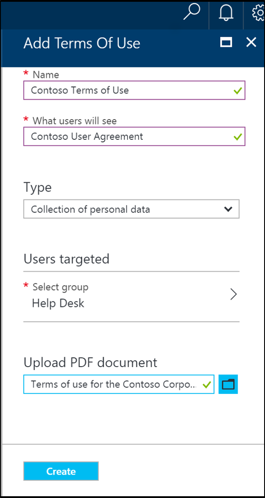
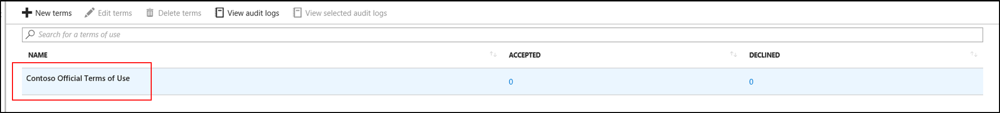
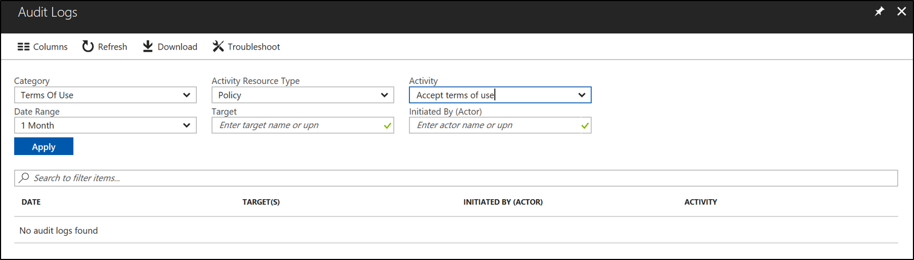
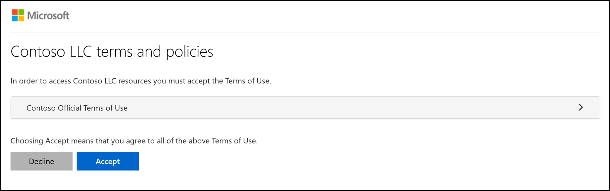
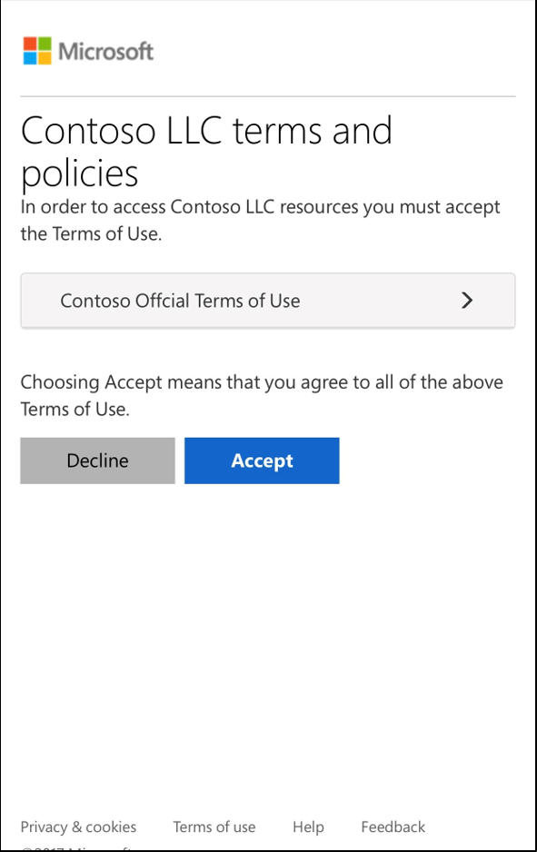

# Azure Active Directory Terms of Use (Preview)
Azure AD Terms of Use provides a simple method organizations can use to present information to end users.  This ensures that they see relevant disclaimers for legal or compliance requirements.

Azure AD Terms of Use uses the pdf format to present content.   This pdf can be any content, such as existing contract documents, allowing you to collect end user agreements during user sign-in.  You can use the terms of use for applications, groups of users, or if you have multiple terms of use for different purposes.

This remainder of this document describes how to get going with Azure AD Terms of Use.  

## Why use Azure AD Terms of Use
Finding it difficult to get employee’s or guests to agree to your terms of use before getting access? Need help figuring out who has or hasn’t agreed to your company terms of use?  With Azure AD Terms of use you now have a simple method that your organization can use to ensure that end users see relevant disclaimers or other information needed for legal or compliance requirements prior to getting access. 

Azure AD Terms of Use can be used in the following scenarios:
-	General terms of use for all users in your organization
-	Specific terms of use based on a user attributes (ex. doctors vs nurses or domestic vs international employees) (using dynamic groups)
-	Specific terms of use based on accessing high business impact apps, like Salesforce

## Azure AD Terms of Use Prerequisites
Use the following steps to configure Azure AD Terms of Use:

1. Sign in to Azure AD using a global administrator, security administrator, or a conditional access administrator for the directory you want to setup Azure AD Terms of Use.
2. Ensure that the directory has an Azure AD Premium P1, P2, EMS E3, or EMS E5 subscription.  If you do not [Get Azure AD Premium](active-directory-get-started-premium.md) or [start a trial](https://azure.microsoft.com/trial/get-started-active-directory/).
3. View the Azure AD Terms of User dashboard at [https://aka.ms/catou](https://aka.ms/catou).

## Adding a Terms of Use
Once you have finalized your Terms of Use and you are ready to use it with Azure services you can use the following procedure to add it

### To add a terms of use
1. Navigate to the dashboard at [https://aka.ms/catou](https://aka.ms/catou)
2. Click Add. 

3. Enter the **Name** for the Terms of Use
4. Enter **Display Name**.  This is the header that users see when they sign in.
5. **Browse** to your finalized terms of use pdf and select it.
6. You can **Enforce** the terms of use using one of the either a template or custom conditional access policy
7. Click **Create**.
8. If you selected a custom conditional access template, then a new screen appears which allows you to customize the CA policy.
7. You should now see your new Terms of Use. 

## Deleting a Terms of Use
You can remove or delete old terms of use using the following procedure:

### To delete a terms of use
1. Navigate to the dashboard at [https://aka.ms/catou](https://aka.ms/catou)
2. Select the terms of use you want to remove.
3. Click **Delete**.
4. You should no longer see your new terms of use.

## Auditing a Terms of Use
Azure AD Terms of Use provides easy to use auditing so that you can see who has accepted and when they accepted your terms of use.  To get started with auditing use the following procedure:

### To audit terms of use
1. Navigate to the dashboard at [https://aka.ms/catou](https://aka.ms/catou)
2. Click Audit Event. 

3.  On the Azure AD audit logs screen, you can filter the information using the provided drops downs to target specific audit log information.

4.  You can also download the information in a .csv file for use locally.

## End user Preview
Once a terms of use is created and enforced this is what an end user will see if they are in scope.
-	Best practice is to have the font within the PDF at size 24.

-	Will be shown on mobiles as well

## Additional Information
The following is some general information that you need to be aware of and can assist with using terms of use.

-	Global administrator, security administrator, or conditional access administrator need read/write access.
-	After creating a Terms of Use using the “access to cloud apps” template the admin starts to see “sad clouds” when access other areas of the portal. If they refresh the browser, they will start to see Azure AD token issues
    - This behavior is expected and the reason for this is that the user created a new conditional access policy that they are in scope of. The new policy is not satisfied so they are unable to access any cloud apps until that policy in satisfied.
    - Resolution: in order to resolve the user must sign out and sign back in. This allows them to satisfy any remaining controls that they may now fall in scope of.
-	If a tenant already has a conditional access policy enforced with a Terms of Use, the next time a Terms of Use is created the admin (and all active sessions) starts to see “sad clouds” when access other areas of the portal. If they refresh the browser, they will start to see Azure AD token issues.
    - This behavior is expected and due to limitation in the conditional access extensibility framework.
    - Resolution: in order to resolve the user must sign out and sign back in. This allows them to get a fresh token. 
-	If a Terms of Use is enforced using a custom conditional access policy, and the admin wants to delete a Terms of Use, they need to make sure that Terms of Use is not enforced with any policies.