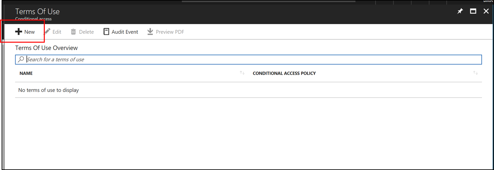
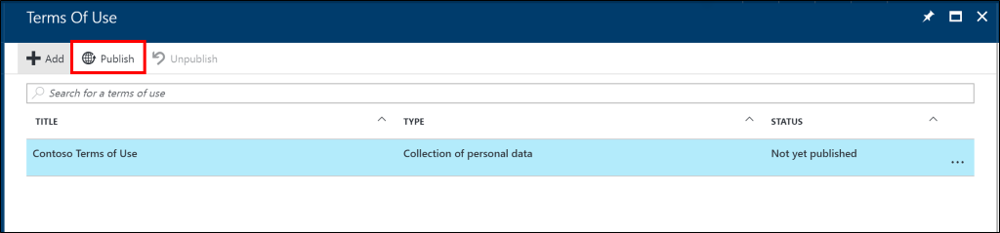
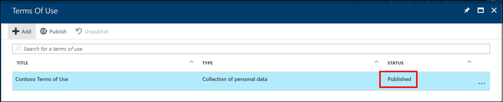
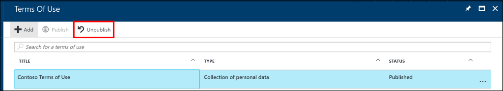
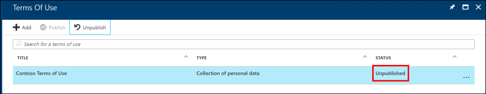

# Azure Active Directory Terms of Use (Preview)
Azure AD Terms of Use provides a simple method for an organization to ensure that end users see relevant disclaimers or other information needed for legal or compliance requirements. 

Azure AD Terms of Use uses the pdf format to allow organizations to present content to end-users.   This can be any content, such as existing contract documents, allowing you to collect end-user agreements during user sign-in.  Futhermore, they can use the terms of use for applications, groups of users, or if you have multiple terms of use for different purposes.

Azure AD Terms of Use uses the pdf format to present this to your end-users.  

This remainder of this document describes how to get going with Azure AD Terms of Use.  

## Azure AD Terms of Use Prerequisites
Use the following steps to configure Azure AD Terms of Use:

1. Sign in to Azure AD as a global administrator in the directory where you want to setup Azure AD Terms of Use.
2. Ensure that the directory has an Azure AD Premium P1, P2, EMS E3 or EMS E5 subscription.  If you do not [Get Azure AD Premium](active-directory-get-started-premium.md) or [start a trial](https://azure.microsoft.com/trial/get-started-active-directory/).
3. View the Azure AD Terms of User dashboard at [https://aka.ms/aadconnecthealth](https://aka.ms/aadtou).

## About Azure AD Terms of Use
When you setup Azure AD Terms of Use you start in the Azure AD Terms of user blade.  

On the blade you will notice buttons for Adding, Publishing and Unpublishing terms of use. Azure Terms of Use have 3 distinct states.  These states describe the status of the individual Terms of Use that you are using.  

You can have multipe terms of use that target different user groups.  Currently Azure AD Terms of Use supports X number of individual terms of use.  The following table describes the states in more detail.

|Status|Description|
| ----- | ----- |	
|Published|A terms of use that is currently live and users need to actively accept it.|
|Not yet Published|A terms of use that has never been published.|
|Unpublished|A terms of use that was once published but is no longer published.|

## Adding a Terms of Use
Once you have finalized your Terms of Use and you are ready to use it with Azure services you can use the following procedure to add it

### To add a terms of use
1. Navigate to the dashboard at [https://aka.ms/aadtou](https://aka.ms/aadtou)
2. Click Add.  This will open another blade. 

3. Enter the **Name** for the Terms of Use
4. Enter **What users will see**.  This is the header that users will see when they sign in.
5. Select the **Type**.  This is the type of terms of use.  Currently only Collection of personal data is available.
6. Click on **Users targeted** and select the group that this Terms of Use targets.
7. **Browse** to your finalized terms of use pdf and select it.
8. Click **Create**.
9. You should now see your new Terms of Use. 

## Publishing a Terms of Use
When you are ready to publish the terms of use so that your users will start seeing it and accepting it use the following procedure.

1. Select your terms of use and click publish. 

2. Click **Yes** to confirm.
3. You should now see the status set to publish.

## Unpublishing a Terms of Use
When you are ready to unpublish the terms of use so that update it or change it, use the following procedure.

1. Select your terms of use and click unpublish. 

2. Click **Yes** to confirm.
3. You should now see the status set to unpublish. 
