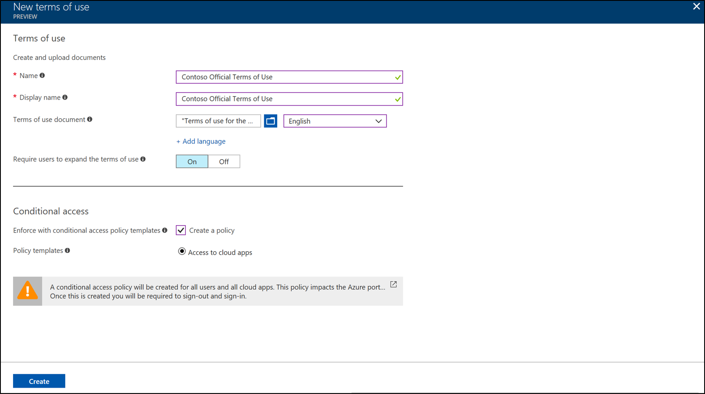
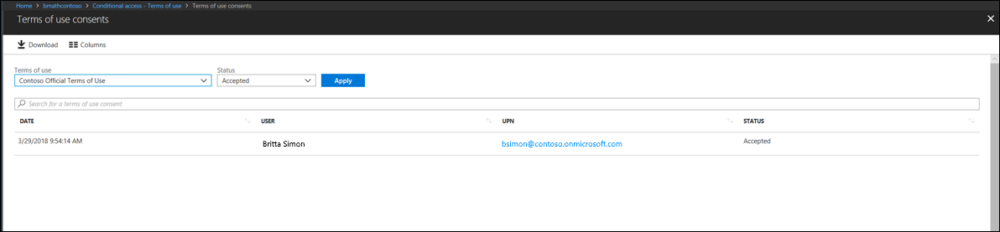

# Azure Active Directory Terms of Use feature
Azure AD Terms of Use provides a simple method organizations can use to present information to end users.  This presentation, ensures users see relevant disclaimers for legal or compliance requirements.

Azure AD Terms of Use uses the pdf format to present content.   The pdf can be any content, such as existing contract documents, allowing you to collect end user agreements during user sign-in.  You can use the terms of use for applications, groups of users, or if you have multiple terms of use for different purposes.

The remainder of this document describes how to get going with Azure AD Terms of Use.  

## Why use Azure AD Terms of Use
Finding it difficult to get employee’s or guests to agree to your terms of use before getting access? Need help figuring out who has or hasn’t agreed to your company terms of use?  Azure AD Terms of Use provides a simple method organizations can use to present information to end users.  This presentation, ensures that they see relevant disclaimers for legal or compliance requirements.

Azure AD Terms of Use can be used in the following scenarios:
-	General terms of use for all users in your organization.
-	Specific terms of use based on a user attributes (ex. doctors vs nurses or domestic vs international employees, done by [dynamic groups](https://azure.microsoft.com/updates/azure-active-directory-dynamic-membership-for-groups)).
-	Specific terms of use based on accessing high business impact apps, like Salesforce.

## Prerequisites
Use the following steps to configure Azure AD Terms of Use:

1. Sign in to Azure AD using a global administrator, security administrator, or a conditional access administrator for the directory you want to configure Azure AD Terms of Use.
2. Ensure that the directory has an Azure AD Premium P1, P2, EMS E3, or EMS E5 subscription.  If you do not [Get Azure AD Premium](active-directory-get-started-premium.md) or [start a trial](https://azure.microsoft.com/trial/get-started-active-directory/).
3. View the Azure AD Terms of User dashboard at [https://aka.ms/catou](https://aka.ms/catou).

>[!IMPORTANT]
>Conditional access policy controls (including terms of use) do not support enforcement on service accounts.  We recommend excluding all service accounts from the conditional access policy.

## Add Company Terms of Use
Once you have finalized your Terms of Use, use the following procedure to add it.

### To add Terms of Use
1. Navigate to the dashboard at [https://aka.ms/catou](https://aka.ms/catou)
2. Click Add. 

3. Enter the **Name** for the Terms of Use
4. Enter **Display Name**.  The header is what users see when they sign in.
5. **Browse** to your finalized terms of use pdf and select it.  The recommended font size is 24.
6. **Select** a language for the terms of use.  The language option allows you to upload multiple terms of use, each with a different language.  The version of the terms of use that an end user will see will be based on their browser preferences.
7. Select  either on or off for **Require users to expand the terms of use**.  If this is set to on, end users will be required to view the terms of use prior to accepting them.
8. Under the **Conditional Access**, you can **Enforce** the uploaded terms of use by selecting a template from the drop-down or a custom conditional access policy.  Custom conditional access policies enables granular terms of use, down to a specific cloud application or group of users.  For more information, see [configuring conditional access policies](active-directory-conditional-access-best-practices.md)
9. Click **Create**.
10. If you selected a custom conditional access template, then a new screen appears which allows you to customize the CA policy.
11. You should now see your new Terms of Use. 

## Delete Terms of Use
You can remove or delete old terms of use using the following procedure:

### To delete Terms of Use
1. Navigate to the dashboard at [https://aka.ms/catou](https://aka.ms/catou)
2. Select the terms of use you want to remove.
3. Click **Delete**.
4. You should no longer see your new terms of use.

## Viewing current user status
You will notice that your terms of use shows a count for users who have accepted and declined.

You can click on the numbers under **accepted** or **declined** to view the current state of users.

## Audit Terms of Use
If you want to view historical acceptances and declines and not just the current status, Azure AD Terms of Use provides easy to use auditing.  This auditing allows you to see who has accepted and when they accepted your terms of use.  

There are two ways in which you can use auditing depending on what you are currently trying to do.  

To get started with auditing use the following procedure:

### To audit Terms of Use
1. Navigate to the dashboard at [https://aka.ms/catou](https://aka.ms/catou)
2. Click View audit logs. 

3.  On the Azure AD audit logs screen, you can filter the information using the provided drops downs to target specific audit log information.
[Audit Event](media/active-directory-tou/tou9.png)
4.  You can also download the information in a .csv file for use locally.

## 

## What users see
Users, who are in scope, will see the following once a terms of use is created and enforced.  They will see these screens during sign in.
-	Best practice is to have the font within the PDF at size 24.

-	This screen is how it appears on mobiles  

### Review terms of use
Users can review and see the terms of use that they have accepted.  To review terms of use, use the following procedure:

1. Navigate and sign-in to [https://myapps.microsoft.com](https://myapps.microsoft.com).
2. In upper right corner, click your name and select **Profile** from the drop-down.

3. On your Profile, click **Review terms of use**.

4.  From there, you can review the terms of use you have accepted. 

## Additional information
The following information is something to be aware of and can assist with using terms of use.

>[!IMPORTANT]
> Users in scope will need to sign-out and sign-in in order to satisfy a new policy if:
> - a conditional access policy is enabled on a terms of use
> - or a second terms of use is created
>
>Conditional access policies take effect immediately. When this happens the admin will start to see “sad clouds” or "Azure AD token issues". The admin must sign-out and sign-in again in order to satisfy the new policy.

## Frequently asked questions

**Q: How do I see when/if a user has accepted a terms of use?** 
A: You can simply click on the number under accepted next to your terms of use.  For more information, see [Viewing current user status](#viewing-current-user-status).  Also, a user accepting the terms of use is written to the audit log. You can search the Azure AD audit log to see the results.  

**Q: If you change the terms of use terms does it require users to accept again?** 
A: Yes, an administrator can change the terms of use terms and it requires reaccepting the new terms.

**Q: Can a terms of use support multiple languages?** 
A: Yes.  Currently there are 18 different languages an administrator can configure for a single terms of use. 

**Q: When is the terms of use triggered?** 
A: The terms of use is triggered during the sign-in experience.

**Q: What applications can I target a terms of use to?** 
A: You can create a conditional access policy on the enterprise applications using modern authentication.  For more information, see [enterprise applications](https://docs.microsoft.com/azure/active-directory/active-directory-coreapps-view-azure-portal).

**Q: Can I add multiple terms of use to a given user or app?** 
A: Yes, by creating multiple conditional access policies targeting those groups or apps. If a user falls in scope of multiple terms of use they agree to one terms of use at a time.
 
**Q: What happens if a user declines the terms of use?** 
A: The user is blocked from getting access to the application. The user would have to sign-in again and agree to the terms in order to get access.
