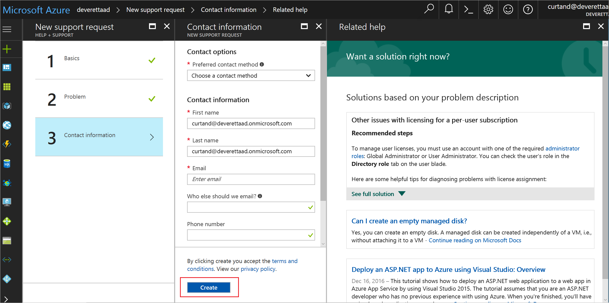

# How to get support for Azure Active Directory

Azure Active Directory (Azure AD) customer support is included in Microsoft Azure trial or paid subscriptions.

## Find help without opening a support ticket

Before creating a support ticket, check out the following resources for answers and information. 

* For content such as how-to info or code samples for IT professionals and developers, see the [technical documentation at docs.microsoft.com](https://docs.microsoft.com/azure/active-directory/)

* The [Microsoft Tech Community](https://techcommunity.microsoft.com/) is the place for our IT pro partners and customers to collaborate, share, and learn. The [Microsoft Tech Community Info Center](https://techcommunity.microsoft.com/t5/Community-Info-Center/ct-p/Community-Info-Center) is used for announcements, blog posts, ask-me-anything (AMA) interactions with experts, and more. You can also [join the community to submit your ideas](https://techcommunity.microsoft.com/t5/Communities/ct-p/communities).

## Open a support ticket

If you are unable to find answers by using self-help resources, you can open an online support ticket. Please limit each support ticket to a single issue so that we can connect you to support engineers who are the subject matter experts for your issue. Also, Azure Active Directory engineering teams prioritize their work based on incidents that are generated, so you're often contributing to service improvements.

### How to open a support ticket

1. Sign in to [the Azure portal](https://portal.azure.com) and open **Azure Active Directory**.
2. Scroll down to **Troubleshooting + Support** and select **New support request**
3. On the **Basics** blade, for **Issue type**, select **Technical**.
4. For **Service**, select **Azure Active Directory**, and then select **Next**.
5. On the **Problem** blade, select a Severity (linked to [Support scope and responsiveness](https://azure.microsoft.com/support/plans/response/)).
6. Select a **Problem type**, and then select a **Category** for that type. At this point, you'll also be offered self-help information for your problem category.
7. Add the rest of your problem information and click **Next**.
8. Provide your contact information and select **Create**.
  

##  Next steps

* [Microsoft Tech Community](https://techcommunity.microsoft.com/)

* [Technical documentation at docs.microsoft.com](https://docs.microsoft.com/azure/active-directory/)
