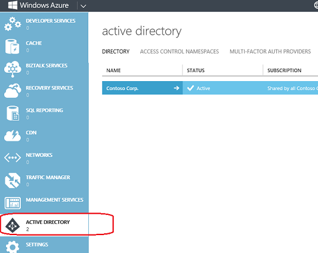
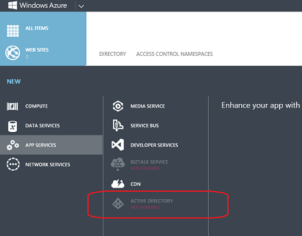

<properties
   pageTitle="Troubleshooting: 'Active Directory' item is missing or not available | Microsoft Azure "
   description="What to do when Active Directory menu item doesn't appear in the Azure Management Portal."
   services="active-directory"
   documentationCenter="na"
   authors="msmbaldwin"
   manager="mbaldwin"
   editor=""/>

<tags
   ms.service="active-directory"
   ms.devlang="na"
   ms.topic="article"
   ms.tgt_pltfrm="na"
   ms.workload="identity"
   ms.date="05/31/2016"
   ms.author="mbaldwin"/>

# Troubleshooting: 'Active Directory' item is missing or not available

Many of the instructions for using Azure Active Directory features and services begin with "Go to the Azure Management Portal and click **Active Directory**." But what do you do if the Active Directory extension or menu item does not appear or if it is marked **Not Available**? This topic is designed to help. It describes the conditions under which **Active Directory** does not appear or is unavailable and explains how to proceed.

## Active Directory is missing

Typically, an **Active Directory** item appears in the left navigation menu. The instructions in Azure Active Directory procedures assume that this item is in your view.

The Active Directory item appears in the left navigation menu when any of the following conditions is true. Otherwise, the item does not appear.

* The current user signed on with a Microsoft account (formerly known as a Windows Live ID).

    OR

* The Azure tenant has a directory and the current account is a directory administrator.

    OR

* The Azure tenant has at least one Azure AD Access Control (ACS) namespace. For more information, see [Access Control Namespace](https://msdn.microsoft.com/library/azure/gg185908.aspx).

    OR

* The Azure tenant has at least one Azure Multi-Factor Authentication provider. For more information, see [Administering Azure Multi-Factor Authentication Providers](../multi-factor-authentication/multi-factor-authentication-get-started-cloud.md).

To create an Access Control namespace or a Multi-Factor Authentication provider, click **+New** > **App Services** > **Active Directory**.

To get administrative rights to a directory, have an administrator assign an administrator role to your account. For details, see [Assigning administrator roles](active-directory-assign-admin-roles.md).

## Active Directory is not available

When you click **+New** > **App Services**, an **Active Directory** item appears. Specifically, the Active Directory item appears when any of the Active Directory features, such as Directory, Access Control, or Multi-Factor Auth Provider, are available to the current user.

However, while the page is loading, the item is dimmed and is marked **Not Available**. This is a temporary state. If you wait a few seconds, the item becomes available. If the delay is prolonged, refreshing the web page often resolves the problem.

