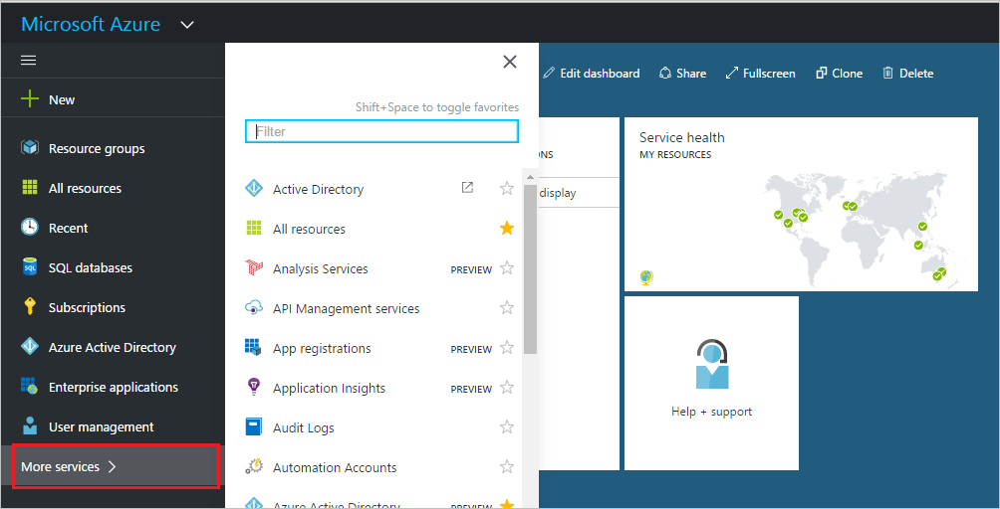
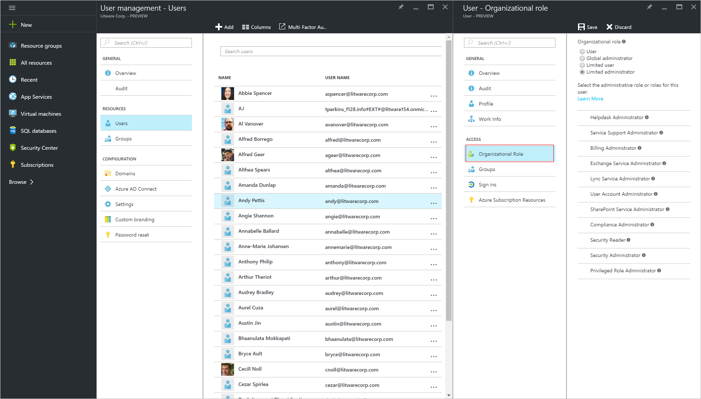

---

title: Assign a user to administrator roles in Azure Active Directory  | Microsoft Docs
description: Explains how to change user administrative information in Azure Active Directory
services: active-directory
documentationcenter: ''
author: curtand
manager: femila
editor: ''

ms.assetid: a1ca1a53-50d8-4bf0-ae8f-73fa1253e2d9
ms.service: active-directory
ms.workload: identity
ms.tgt_pltfrm: na
ms.devlang: na
ms.topic: article
ms.date: 05/04/2017
ms.author: curtand

---
# Assign a user to administrator roles in Azure Active Directory
This article explains how to assign an administrative role to a user in Azure Active Directory (Azure AD). For information about adding new users in your organization, see [Add new users to Azure Active Directory](active-directory-users-create-azure-portal.md). Added users don't have administrator permissions by default, but you can assign roles to them at any time.

## Assign a role to a user
1. Sign in to the [Azure portal](https://portal.azure.com) with an account that's a global admin for the directory.
2. Select **More services**, enter **Users and groups** in the text box, and then select **Enter**.

   
3. On the **Users and groups** blade, select **All users**.

   
4. On the **Users and groups - All users** blade, select a user from the list.
5. On the blade for the selected user, select **Directory role**, and then assign the user to a role from the **Directory role** list. For more information about user and administrator roles, see [Assigning administrator roles in Azure AD](active-directory-assign-admin-roles.md).

      
6. Select **Save**.

## Next steps
* [Add a user](active-directory-users-create-azure-portal.md)
* [Reset a user's password in the new Azure portal](active-directory-users-reset-password-azure-portal.md)
* [Change a user's work information](active-directory-users-work-info-azure-portal.md)
* [Manage user profiles](active-directory-users-profile-azure-portal.md)
* [Delete a user in your Azure AD](active-directory-users-delete-user-azure-portal.md)
