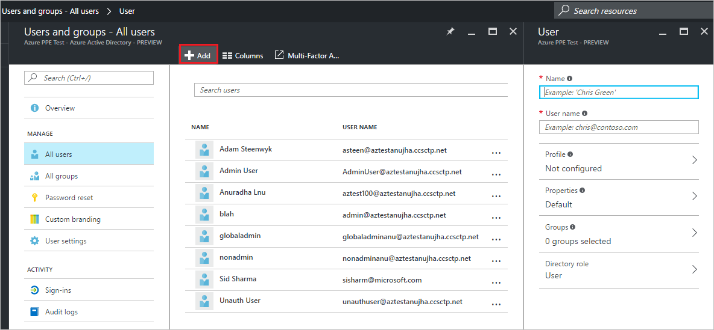

---

title: Add new users to Azure Active Directory | Microsoft Docs
description: Explains how to add new users or change user information in Azure Active Directory.
services: active-directory
documentationcenter: ''
author: curtand
manager: femila
editor: ''

ms.assetid: 0a90c3c5-4e0e-43bd-a606-6ee00f163038
ms.service: active-directory
ms.workload: identity
ms.tgt_pltfrm: na
ms.devlang: na
ms.topic: article
ms.date: 05/04/2017
ms.author: curtand;jeffsta

---
# Add new users to Azure Active Directory
> [!div class="op_single_selector"]
> * [Azure portal](active-directory-users-create-azure-portal.md)
> * [Azure classic portal](active-directory-create-users.md)
>
>

This article explains how to add new users in your organization in the Azure Active Directory (Azure AD). 

1. Sign in to the [Azure portal](https://portal.azure.com) with an account that's a global admin for the directory.
2. Select **More services**, enter **Users and groups** in the text box, and then select **Enter**.

   
3. On the **Users and groups** blade, select **All users**, and then select **Add**.

   
4. Enter details for the user, such as **Name** and **User name**. The domain name portion of the user name must either be the initial default domain name "foo.onmicrosoft.com" domain name, or a verified, non-federated domain name such as "contoso.com."
5. Copy or otherwise note the generated user password so that you can provide it to the user after this process is complete.
6. Optionally, you can open and fill out the information in the **Profile** blade, the **Groups** blade, or the **Directory role** blade for the user. For more information about user and administrator roles, see [Assigning administrator roles in Azure AD](active-directory-assign-admin-roles.md).
7. On the **User** blade, select **Create**.
8. Securely distribute the generated password to the new user so that the user can sign in.

### Next steps
* [Add an external user](active-directory-users-create-external-azure-portal.md)
* [Reset a user's password in the new Azure portal](active-directory-users-reset-password-azure-portal.md)
* [Change a user's work information](active-directory-users-work-info-azure-portal.md)
* [Manage user profiles](active-directory-users-profile-azure-portal.md)
* [Delete a user in your Azure AD](active-directory-users-delete-user-azure-portal.md)
* [Assign a user to a role in your Azure AD](active-directory-users-assign-role-azure-portal.md)
