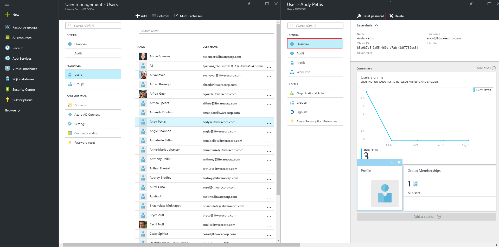

---

title: Delete a user from a directory in Azure Active Directory | Microsoft Docs
description: Explains how to delete a user and all of its information from Azure Active Directory
services: active-directory
documentationcenter: ''
author: curtand
manager: femila
editor: ''

ms.assetid: bd1c9ccc-2d80-42bf-82cc-db37bb1a1d67
ms.service: active-directory
ms.workload: identity
ms.tgt_pltfrm: na
ms.devlang: na
ms.topic: article
ms.date: 05/26/2017
ms.author: curtand;jeffsta
ms.reviewer: jeffsta

---

# Delete a user from a directory in Azure Active Directory
This article explains how to delete a user from a directory in Azure Active Directory (Azure AD). For information about adding new users to your organization, see [Add new users to Azure Active Directory](active-directory-users-create-azure-portal.md).

## To delete a user
1. Sign in to [the Azure portal](https://portal.azure.com) with an account that's a global admin for the directory.
2. Select **More services**, enter **Users and groups** in the text box, and then select **Enter**.

   
3. On the **Users and groups** blade, select **Users**.

   
4. On the **Users and groups - Users** blade, select a user from the list.
5. On the blade for the selected user, select **Overview**, and then in the command bar, select **Delete**.

    

## Next steps
* [Add new users to Azure Active Directory](active-directory-users-create-azure-portal.md)
* [Reset the password for a user in Azure Active Directory](active-directory-users-reset-password-azure-portal.md)
* [Assign a user to administrator roles in Azure Active Directory](active-directory-users-assign-role-azure-portal.md)
* [Add or change profile information for a user in Azure Active Directory](active-directory-users-work-info-azure-portal.md)
* [Delete a user from a directory in Azure Active Directory](active-directory-users-profile-azure-portal.md)
