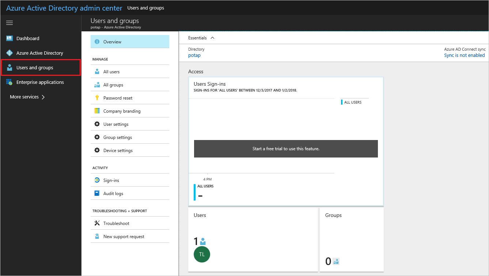
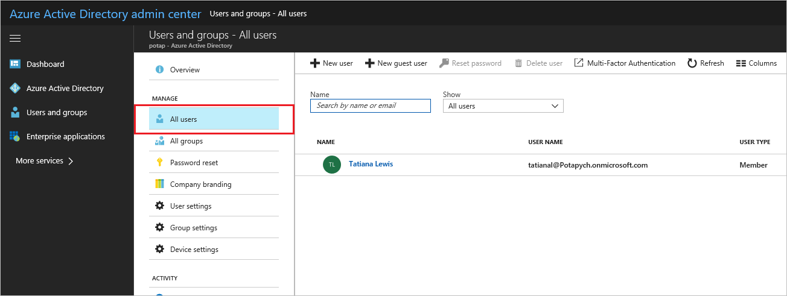
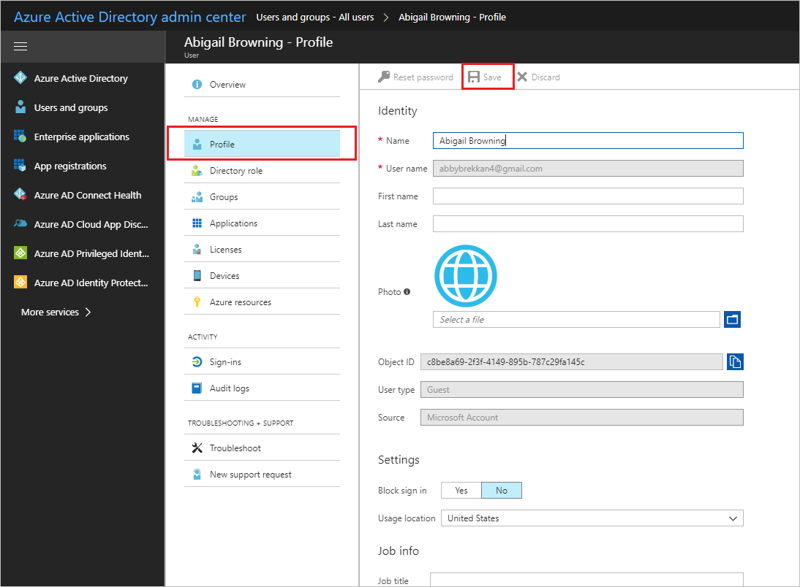

---

title: Add or change profile information for a user in Azure Active Directory | Microsoft Docs
description: Explains how to add the user profile, including profile picture, in Azure Active Directory
services: active-directory
documentationcenter: ''
author: curtand
manager: femila
editor: ''

ms.assetid: aa38ab92-a867-45d7-9dc1-7f1c628f7ed3
ms.service: active-directory
ms.workload: identity
ms.tgt_pltfrm: na
ms.devlang: na
ms.topic: article
ms.date: 10/10/2017
ms.author: curtand
ms.reviewer: jeffsta

---
# Add or change profile information for a user in Azure Active Directory
This article explains how to add user profile information, such as a profile picture or phone and email authentication information, in Azure Active Directory (Azure AD). For information about adding new users in your organization, see [Add new users to Azure Active Directory](active-directory-users-create-azure-portal.md).

## To change profile information
1. Sign in to the [Azure AD Admin Center](https://aad.portal.azure.com) with an account that's a global admin for the directory.
2. Select **Users and groups**.

   
3. Select **All users**.

   
1. Select a user from the list.
2. For the selected user, select **Profile**.

    
6. Add or change the profile information. Then, in the command bar, select **Save**.

## Next steps
* [Add new users to Azure Active Directory](active-directory-users-create-azure-portal.md)
* [Reset the password for a user in Azure Active Directory](active-directory-users-reset-password-azure-portal.md)
* [Assign a user to administrator roles in Azure Active Directory](active-directory-users-assign-role-azure-portal.md)
* [Add or change profile information for a user in Azure Active Directory](active-directory-users-work-info-azure-portal.md)
* [Delete a user from a directory in Azure Active Directory](active-directory-users-delete-user-azure-portal.md)
