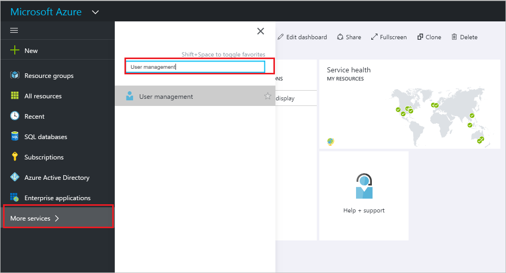
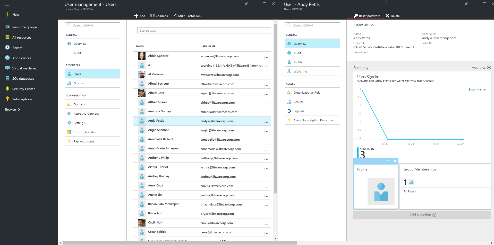

---

title: Password reset in Azure Active Directory | Microsoft Docs
description: Explains how to reset the password for a user in Azure Active Directory
services: active-directory
documentationcenter: ''
author: curtand
manager: femila
editor: ''

ms.assetid: fad5624b-2f13-4abc-b3d4-b347903a8f16
ms.service: active-directory
ms.workload: identity
ms.tgt_pltfrm: na
ms.devlang: na
ms.topic: article
ms.date: 05/26/2017
ms.author: curtand
ms.reviewer: jeffsta

ms.custom: H1Hack27Feb2017

---
# Reset the password for a user in Azure Active Directory
> [!div class="op_single_selector"]
> * [Azure portal](active-directory-users-reset-password-azure-portal.md)
> * [Azure classic portal](active-directory-create-users-reset-password.md)
>
>

## How to reset the password for a user
1. Sign in to the [Azure portal](https://portal.azure.com) with an account that's a global admin for the directory.
2. Select **More services**, enter **Users and groups** in the text box, and then select **Enter**.

   
3. On the **Users and groups** blade, select **Users**.

   
4. On the **Users and groups - Users** blade, select a user from the list.
5. On the blade for the selected user, select **Overview**, and then in the command bar, select **Reset password**.

    
6. On the **Reset password** blade, select **Reset password**.

## Next steps
* [Add a user](active-directory-users-create-azure-portal.md)
* [Assign a user to a role in your Azure AD](active-directory-users-assign-role-azure-portal.md)
* [Change a user's work information](active-directory-users-work-info-azure-portal.md)
* [Manage user profiles](active-directory-users-profile-azure-portal.md)
* [Delete a user in your Azure AD](active-directory-users-delete-user-azure-portal.md)
