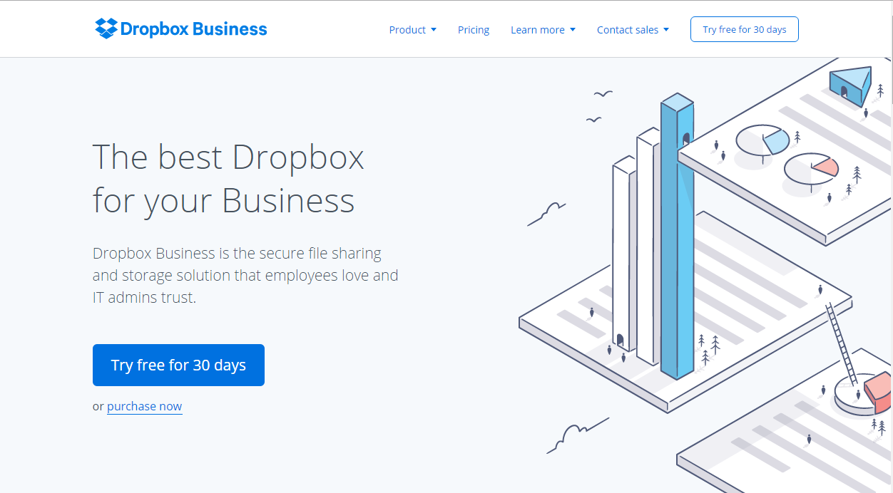

> 
*Azure AD has a feature known as "admin_consent" which is used in provisioning flows for multi-tenant applications.  The admin consent feature is used for a few different scenarios today*:

	- *pre-granting consent for all users in a tenant*
	- *apps that require "admin-only" delegated permissions*
	- *daemon apps that require direct application permissions for the client credentials OAuth flow.*

*As part of the inital set of features for 3rd party --> 1st party auth, we will need to incorporate admin_consent in the MS STS.  We have decided to change how this feature works in app model v2, because the v1 admin_consent feature had a few important drawbacks*:

- *Several things happen at the click of a button: a servicePrincipal is created, delegations are created for all users, and roles are assigned to apps.  It is not clear to directory admins that all of this occurs at the time of consent.*
- *All of the above actions are 'management' tasks that the admin should do in the context of other management tasks.  I.e., in the Azure Portal*
- *Conflating these management tasks with an OAuth/OIDC request is confusing to developers (from anecdotal experience)*
- *The admin_consent UI is far too similar to the user consent UI, and one can be mistaken for the other*
- *The admin_consent UI is overly simple and could be used to provide richer functionalities in the future*

*This document describes how the admin_consent feature should work in app model v2.  It is written as a documentation article intended for customers.  Comments for engineering are provided in italicized chunks, like this one.*

# MS STS - Admin Consent

SaaS applications that support business customers will typically have a "sign-up your business" flow.  Dropbox is one good example of such an app:

During this sign-up flow (or at later point in time), your app can provide a way for users to connect the app to their company's Azure AD directory, [if they have one](determining-if-a-user-has-aad.md).  In most applications, any employee of a company will be able to connect your app to their Azure AD directory simply by signing into the app with their work account and [consenting to the permissions the app requires.](consent-overview.md)

However, there are a few scenarios in which connecting the application will require administrative privileges:

## Admin-only delegated permissions

- If your app requires ["admin-only" delegated permissions](#admin-only-delegated-permissions)

## Direct application permissions

- If your app requires [direct permissions](#direct-application-permissions), not delegated by any user.

## Pre-granting permissions for all users

- If you want the admin to [pre-grant consent for all users](#pre-granting-consent-for-all-users) in the company.

For each of these scenarios, you can use the [Azure AD app gallery]() to allow the admin to grant your application the permissions that it needs.

## 1. Declare permissions your app needs

In your app regsitration on [apps.dev.microsoft.com](https://apps.dev.microsoft.com), declare the set of permissions that your app will need, including delegated and direct application permissions.  

> 
- *Details forthcoming on work required for app reg portal*
- *The app portal will write the RequiredResourceAccess property on the application object*

## 2. Determine if the user is an admin (Optional)

When you redirect the user to the app gallery, the app gallery will enforce that the user must have the necessary privileges to grant your application the permissions you requested in the app registration portal.  However, you might only want to give the user the option to connect their directory if you know they are indeed an admin ahead of time.

To do this, you can first configure your application to receive [group claims]() in the app registration portal.  You can then [sign the user into the app with their work account](), requesting only the "Sign you in & read your profile" permission.  When your application receives a sign-in token from the MS STS, you can inspect these group claims to determine if the user has administrative privileges.  If the user is a member of [these well-known] groups, you can safely assume that they will be able to grant your application the permissions it needs. 

> 
- *This is an optimization.  Group claims are not supported on MS STS at this time*
- *The WIDs claim might be more appropriate here if the feature existed for all 3rd parties.*
- *App would need the abiilty to call the Graph API in the case of a group claim overage*

## 3. Send the user to the app gallery

When you want to request permissions from the admin, your app must send the user to the Azure AD app gallery by redirecting to this URL:

`https://login.microsoftonline.com/admin_consent`

> 
- *This URL will be hosted by the MS STS for the immediate future.  We will then migrate it to portal.azure.com or some other app gallery location, where administrative app management can take place*

The admin_consent endpoint also supports a few query string parameters:

| Parameter |  | Description |
| ----------------------- | ------------------------------- | ------------------- |
| client_id | required | The unique id of your app, like `3cd6e33d-71bd-4cd4-90a6-cf7f5a41e429`. |
| tenant | optional | The name or id of the tenant in which permissions are being requested. If you do not know ahead of time which tenant the admin belongs to, omit this parameter.  However, if you have previously signed in the user, you can use the tenant id here, as in `3cd6e33d-71bd-4cd4-90a6-cf7f5a41e429`.  Using the tenant id in the path will ensure that the admin assigns permissions to your application in that specific tenant. |
| state | optional | A string that can take any form as long as it is URL-safe.  The string will be included in the response, unchanged.  It will not be interpreted by the gallery.  Typically the state is used to encode data about an ongoing sign-up/registration process, which can be consumed by the application again once the admin has completed granting permissions to the app. |
| redirect_uri | optional | A location to return after the admin has completed granting permissions to the app.  If ommitted, the app's registered [sign-up URL]() will be used.  If the app has not declared a sign-up URL, the app's registered sign-on URL will be used. |
 
## 4. The admin grants permissions to your app 

When you direct the user to the admin_consent endpoint, they will be asked to provision the app for their company by granting the permissions that your app requested in the app registration portal.

> 
- *At this point, the MS STS shows the admin the consent UI.  In the immediate term, this can remain the same UI as exists on Evo today.*
- *In the short term we will want to change this UI to be differentiated from the user consent UI.*  
- *The permissions shown in the request UI will be read from the applications requiredResourceAccess property.  Graph API v2 will have to expose this property for read and write.*
- *the requiredResourceAccess can maintain the same schema as exists in AAD v1 today.  We may add additional properties to the schema to support new features, but no changes are necessary to support the existing capabilities in MS STS*  

If you have also [published your app into the Azure AD app gallery](), the admin will be able to reach this page by browsing to your app in the gallery.  Publishing your app allows Microsoft to drive adoption of your application by recommending to it to companies that are likely to be interested.

At this point in time, the admin may also be able to configure additional settings for your application, including security policies in their directory and the assignment of users to the application.

 > 
 - *When this UI is moved to a proper gallery, the UI can evolve to include richer functionality, like role assignments and policy config.*
 - *When the admin consents, the MS STS will call consentToApp on the Graph API, which will add the servicePrincipal to the tenant, write an allPrincipals delegation in the tenant, and assign role assignments to the servicePrincipal*  

## 5. Handle response from the app gallery

When the admin is finished granting permissions to your application, they will be redirected to your application to continue which ever experience your app had begun.  The result from the admin_consent endpoint will be a 302 redirect to your app with the following query string parameters:

| Parameter |  | Description |
| ----------------------- | ------------------------------- | ------------------- |
| tenant | guaranteed | The id of the tenant to which your app has been added, like `3cd6e33d-71bd-4cd4-90a6-cf7f5a41e429`. |
| state | optional | The same value provided in the request.  If not provided in the request, it will not be included in the response. |

The location in your app that the request is sent to will be determined as follows:

- If a `redirect_uri` was provided in the request, it will be used for returning the result.
- If no `redirect_uri` was provided, the app's registered `sign_up_uri` will be used. The `sign_up_uri` can be added to your application in the app registration portal.  This location will also be used as a redirect location when the admin adds your application from the Azure AD app gallery.
- If no `sign_up_url` is registered for the application, the app's `sign_on_url` will be used instead.
- If no `sign_on_url` is registered, one of the app's registered `redirect_uri`s will be used.

 > 
- *The sign_up_url will be a new property defined on the application object, with the same semantics as the homepage/sign-on-url property*
- *For native apps, instead of a sign_up_url we can redirect to the appropriate app store for app download*

## 6. Register for graph notifications (Optional)

When an admin adds your application to their directory by visiting the app gallery directly, they will not always visit your application immediately.  They might continue performing their other directory management duties and choose to visit your app at a later time.  The Azure AD app gallery will, however, warn the admin that they may need to visit your app to complete sign up and enable their employees to sign in.

 > 
- *Should we have a way for the developer to indicate that sign up is complete?  Either by a flag on the app like 'additionalSignUpRequired' or a ping to AAD that indicates the servicePrincipal is 'active/enabled'?*

If you would like to become aware whenever your app is added to a directory, you can [register your app to receive a graph notification]().  The graph notification will inform your application of a newly activated customer so you can take appropriate action - maybe you want to send a thank you email?

 > 
- *Graph notifications are out of scope for MS STS Office scenarios GA*

## 7. Check your app's permissions

After the company has connected your application, your applicaiton will have all the permissions that it requested in the app registration portal.  However, the admin may remove these permissions for your application at any point in time, so your application must be written to handle such cases gracefully. There are two strategies you can take in doing so.

The first strategy is to handle errors received during token acquisition.  Each time your application attempts to get a token from the MS STS, you can capture failures and provide a remediation flow for the user to re-grant permissions to your app.  This [code recipe]() shows how you might handle such a case using our MSAL authentication library.

The other strategy is to explicity query Azure AD for your app's permissions.  You can do so by [sending a request to the Microsoft Graph](), using the endpoint

`[https://graph.microsoft.com/applications/{my-app-id}/permissions]()`

Details of the permissions API on the Microsoft Graph are available [here]().

 > 
- *A permissions API is out of scope for the MS STS Office scenarios GA*

# In Summary

When your app needs permissions from a directory administrator, you need to send the user to the `admin_consent`endpoint, following this general flow:

